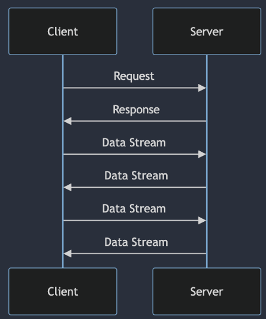
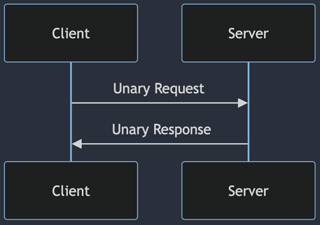
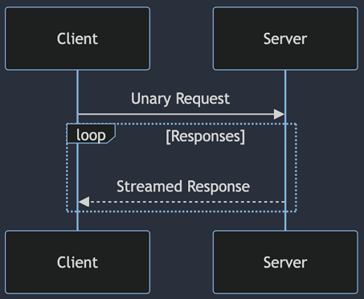
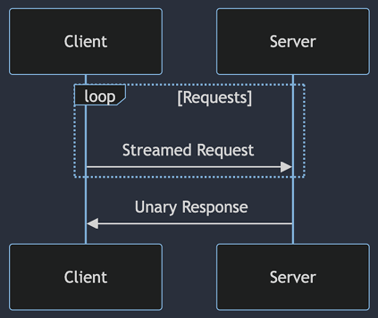
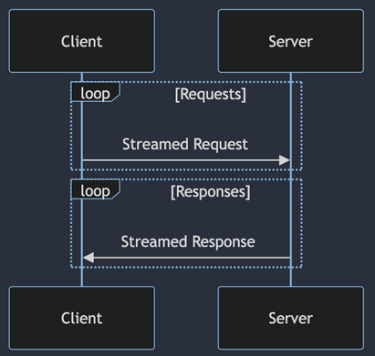

# gRPC 스트리밍

## 1. gRPC 스트리밍 이해

 - `gRPC 스트리밍`
    - gRPC 프로토콜을 사용하여 클라이언트와 서버 간에 지속적인 데이터 스트림을 주고받는 방법
<div align="center">
    
</div>
<br/>

 - `단일 요청/단일 응답(Unary RPC)`
    - 가장 기본적인 gRPC 통신 방식
    - 클라이언트가 서버에 단일 요청
    - 서버가 단일 응답 반환
<div align="center">
    
</div>
<br/>

 - `서버 스트리밍 RPC`
    - 클라이언트가 서버에 단일 요청
    - 서버가 스트림 응답 반환
<div align="center">
    
</div>
<br/>

 - `클라이언트 스트리밍 RPC`
    - 클라이언트가 서버에 스트림 전송
    - 서버가 단일 응답 반환
<div align="center">
    
</div>
<br/>

 - `양방향 스트리밍 RPC`
    - 클라이언트-서버가 데이터 스트림을 양방향으로 전송
    - 실시간으로 상호작용 해야 할 때 유용
<div align="center">
    
</div>
<br/>

### 스트리밍 예제

 - `protobuf`
```proto
syntax = "proto3";

option java_multiple_files = true;
option java_package = "com.example.grpc";
option java_outer_classname = "StreamingProto";

service StreamingService {
    rpc ServerStreaming(Request) returns (stream Response);
    rpc ClientStreaming(stream Request) returns (Response);
    rpc BidirectionalStreaming(stream Request) returns (stream Response);
}

message Request {
    // 요청 관련 필드 정의
}

message Response {
    // 응답 관련 필드 정의
}
```
<br/>

 - `서버 스트리밍 구현`
```java
import io.grpc.stub.StreamObserver;

public class StreamingServiceImpl extends StreamingServiceGrpc.StreamingServiceImplBase {

    @Override
    public void serverStreaming(Request request, StreamObserver<Response> responseObserver) {
        // 서버 스트리밍 로직 구현
        // 예를 들어, dataSource에서 데이터를 가져와서 스트림으로 응답을 보냄
        for (Data data : dataSources) {
            Response response = Response.newBuilder()
                                        .setData(data)
                                        .build();
            responseObserver.onNext(response);
        }
        responseObserver.onCompleted();
    }
}
```
<br/>

 - `클라이언트 스트리밍 구현`
```java
import io.grpc.stub.StreamObserver;

public class ClientStreamingClient {

    public void clientStreaming(StreamingServiceStub stub) {
        StreamObserver<Response> responseObserver = new StreamObserver<>() {
            @Override
            public void onNext(Response response) {
                // 서버로부터의 응답 처리
            }

            @Override
            public void onError(Throwable t) {
                // 에러 처리
            }

            @Override
            public void onCompleted() {
                // 완료 처리
            }
        };

        StreamObserver<Request> requestObserver = stub.clientStreaming(responseObserver);
        
        for (Request request : requests) {
            requestObserver.onNext(request); // 클라이언트 스트리밍 요청
        }
        
        // 클라이언트 스트리밍 완료 알림 보내기
        requestObserver.onCompleted();
    }
}
```
<br/>

 - `양방향 스트리밍 구현(클라이언트)`
```java
import io.grpc.stub.StreamObserver;

public class BidirectionalStreamingClient {

    public void bidirectionalStreaming(StreamingServiceStub stub) {
        StreamObserver<Response> responseObserver = new StreamObserver<>() {
            @Override
            public void onNext(Response response) {
                // 서버로부터의 응답 처리
            }

            @Override
            public void onError(Throwable t) {
                // 에러 처리
            }

            @Override
            public void onCompleted() {
                // 완료 처리
            }
        };

        StreamObserver<Request> requestObserver = stub.bidirectionalStreaming(responseObserver);
        
        for (Request request : requests) {
            requestObserver.onNext(request); // 클라이언트 스트리밍 요청
        }
        
        // 클라이언트 스트리밍 완료 알림 보내기
        requestObserver.onCompleted();
    }
}
```
<br/>

### gRPC 스트리밍 특징

 - 장점
    - 효율성: 대용량 데이터 처리, 실시간 통신
    - 유연성: 다양한 통신 패턴 지원, 복잡한 상호작용 가능
 - 주의사항
    - 리소스 관리에 유의
    - 다양한 오류 처리 필요성
    - Backpressure 관리의 필요성
 - 모범 사례
    - 스트림 관리 전략 수집: 타임아웃, 하트비트 또는 기타 커넥션 관리 구현 필요
    - 메시지 크기 최적화: 메시지 정의를 최적화하여 필드를 효율적으로 사용
    - 스트림 처리 로직 분리: 스트림 처리를 위한 별도의 서비스 또는 모듈 구성
    - 동시성과 병렬 처리 활용: 양방향 스트리밍에서는 서버가 동시에 여러 클라이언트로부터 스트림을 처리 해야함
    - 오류 및 상태 모니터링: 스트리밍 서비스의 상태와 성능을 지속적으로 모니터링하고, 오류 발생시 알림을 받을 수 있는 로깅 및 모니터링 시스템 구축

<br/>

## 2. gRPC 스트리밍 예제

 - `protobuf`
```proto
syntax = "proto3";

package stock;

service StockService {
    rpc StreamStockData (StreamRequest) returns (stream StockData);
}

message StreamRequest {
    string clientId = 1;
}

message StockData {
    string symbol = 1;
    double price = 2;
}
```
<br/>

 - `서버 로직`
```java
import io.grpc.stub.StreamObserver;

public static class StockServiceImpl extends StockServiceGrpc.StockServiceImplBase {
    @Override
    public void streamStockData(DataStreamRequest request, StreamObserver<StockData> responseObserver) {
        try {
            while (true) {
                StockData stockData = StockData.newBuilder()
                                               .setSymbol("AAPL")
                                               .setPrice(160.50)
                                               .build();
                responseObserver.onNext(stockData);
                Thread.sleep(1000); // 1초에 한 개 전송
            }
        } catch (InterruptedException e) {
            e.printStackTrace();
        } finally {
            responseObserver.onCompleted();
        }
    }
}
```
<br/>

 - `클라이언트 로직`
```java
import io.grpc.ManagedChannel;
import io.grpc.ManagedChannelBuilder;
import io.grpc.stub.StreamObserver;

public class StockClient {

    public static void main(String[] args) {
        ManagedChannel channel = ManagedChannelBuilder.forAddress("localhost", 9090)
                                                     .usePlaintext()
                                                     .build();
        StockServiceGrpc.StockServiceStub stub = StockServiceGrpc.newStub(channel);

        StreamRequest request = StreamRequest.newBuilder().build();

        stub.streamStockData(request, new StreamObserver<StockData>() {
            @Override
            public void onNext(StockData value) {
                System.out.println("Received StockData: " + value.getSymbol());
            }

            @Override
            public void onError(Throwable t) {
                System.err.println("Error: " + t.getMessage());
            }

            @Override
            public void onCompleted() {
                System.out.println("Stream completed.");
            }
        });

        // Optional: Shutdown the channel when done
        // channel.shutdown();
    }
}
```
<br/>

### Backpressure

 - 부하 관리, 자원 소비 제어, 네트워크 대역폭 관리, 서버 부하 방지

<br/>

#### Backpressure 구현: CountDownLatch

```java
import io.grpc.stub.StreamObserver;
import java.util.concurrent.CountDownLatch;

public class StockClient {

    public static void main(String[] args) {
        CountDownLatch latch = new CountDownLatch(10); // 버퍼의 용량을 10으로 설정

        stub.streamStockData(request, new StreamObserver<StockData>() {
            @Override
            public void onNext(StockData value) {
                // 데이터를 받을 때마다 CountDownLatch를 감소
                latch.countDown();
                // 데이터를 처리
                System.out.println("Received StockData: " + value.getSymbol());
            }

            @Override
            public void onError(Throwable t) {
                // 에러 처리
                System.err.println("Error: " + t.getMessage());
            }

            @Override
            public void onCompleted() {
                // 스트림이 완료됨
                System.out.println("Stream completed.");
            }
        });

        try {
            // 버퍼의 용량이 0이 될 때까지 기다림
            latch.await();
            // 다시 데이터를 요청
            requestStream.request(1);
        } catch (InterruptedException e) {
            e.printStackTrace();
        }
        
        // value.getPrice(); // 이 부분은 기존 코드에서 주석처리되어 있으므로 필요에 따라서 추가적으로 처리해야 합니다.
    }
}
```

<br/>

#### Backpressure 구현: FlowControlWindow

```java
import io.grpc.stub.ClientResponseObserver;
import io.grpc.stub.StreamObserver;
import java.util.concurrent.CountDownLatch;

public class StockClient {

    private StreamObserver<StockData> requestStream;
    private int bufferSize = 10; // 버퍼의 크기 설정
    private int receivedCount = 0; // 받은 데이터 개수
    private CountDownLatch latch = new CountDownLatch(bufferSize); // CountDownLatch 초기화

    public void streamStockData(StreamRequest request, StockServiceGrpc.StockServiceStub stub) {
        stub.streamStockData(request, new ClientResponseObserver<StreamRequest, StockData>() {
            @Override
            public void beforeStart(ClientCallStreamObserver<StreamRequest> requestStream) {
                StockClient.this.requestStream = requestStream;
                requestStream.disableAutoInboundFlowControl();
                requestStream.setOnReadyHandler(() -> {
                    while (requestStream.isReady() && receivedCount < bufferSize) {
                        // 버퍼의 크기만큼 데이터 요청
                        requestStream.request(1);
                        receivedCount++;
                    }
                });
            }

            @Override
            public void onNext(StockData value) {
                System.out.println("Received StockData: " + value.getSymbol());
                latch.countDown(); // 데이터를 받을 때마다 CountDownLatch 감소

                // 받은 데이터가 버퍼 크기에 도달하면 다시 요청
                if (receivedCount % bufferSize == 0) {
                    requestStream.pause(); // 버퍼가 가득 찼을 때 일시 중지
                    // value.getPrice(); // 기존 코드에서 주석 처리된 부분
                }
            }

            @Override
            public void onError(Throwable t) {
                System.err.println("Error: " + t.getMessage());
            }

            @Override
            public void onCompleted() {
                System.out.println("Stream completed.");
            }
        });
    }

    public static void main(String[] args) {
        StockClient client = new StockClient();
        StreamRequest request = StreamRequest.newBuilder().build();
        StockServiceGrpc.StockServiceStub stub = StockServiceGrpc.newStub(channel);

        client.streamStockData(request, stub);

        try {
            client.latch.await(); // CountDownLatch를 사용하여 데이터를 모두 받을 때까지 대기
        } catch (InterruptedException e) {
            e.printStackTrace();
        }
    }
}
```

