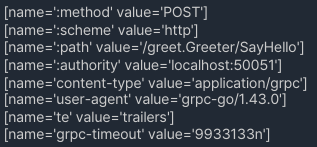

# gRPC 에러 처리와 상태 코드

## 1. gRPC 상태 코드 소개

 - `gRPC 상태 코드`
    - gRPC에서 발생하는 통신 결과를 나타내는 코드
    - OK: 요청이 성공적으로 처리되었음
    - CANCELED: 요청이 취소되었거나 타임아웃 되었음
    - UNKNOWN: 요청 처리 중 예상치 못한 오류가 발생했음
    - INVALID_ARGUMENT: 요청이 잘못된 인수를 포함하고 있음
    - DEADLINE_EXCEEDED: 요청이 주어진 타임아웃을 초과하여 처리되지 않았음
    - UNIMPLEMENTED: 요청이 서버에서 지원되지 않는 메서드를 호출했음
    - UNAVAILABLE: 서버가 현재 요청을 처리할 수 없는 상태
 - `gRPC 상태 코드와 HTTP 상태 코드`
    - 프로토콜 차이: HTTP/2를 기반으로 동작하지만, gRPC = HTTP 프로토콜은 아님
    - 상태 코드의 범위: gRPC 상태 코드는 7개의 카테고리, HTTP 상태 코드는 1xx ~ 5xx
    - 의미의 구체성: gRPC는 특정한 상황을 좀 더 구체적으로 설명하기 위해 설계
    - 진화 및 확장성: gRPC는 구조화된 데이터를 사용 하기 때문에 좀 더 진화와 확장에 유리한 구조

<br/>

### gRPC Metadata

 - `Metadata` 
    - gRPC Metadata는 데이터에 대한 데이터
    - 통신에서 메시지 자체와는 별개로 전송되는 정보
    - 클라이언트-서버 간의 통신에 필요한 추가적인 정보를 담고 있음
    - 헤더-트레일러 두 부분으로 구성
 - `Header Metadata`
    - HTTP/2 헤더 프레임에 전송
    - gRPC 통신 세션을 시작할 때
    - 클라이언트가 서버에 요청을 보낼 때, 초기 설정 정보를 포함
    - 인증 토큰, 요청의 언어, 클라이언트의 시스템 정보 등과 같은 데이터가 포함될 수 있음
<div align="center">
    
</div>
<br/>

 - `Trailer Metadata`
    - 통신의 마지막 부분에서 HTTP/2 헤더 프레임으로 전송
    - 헤더 메타데이터와 달리, 응답 메시지의 끝에 위치
    - 주로 상태 코드와 에러 메시지 등을 포함
    - 이는 요청의 성공 여부, 오류 여부를 확인
    - 요청 처리 중 발생한 오류에 대한 상세한 설명과 함께 grpc-status와 grpc-message 트레일러가 포함
<div align="center">
    
</div>
<br/>

## 2. gRPC 예외 처리 및 에러 핸들링

### 서버 에러 핸들링

 - StatusRuntimeException을 사용하여 에러 생성하여 클라이언트 전송
```java
import io.grpc.Status;
import io.grpc.StatusRuntimeException;
import io.grpc.stub.StreamObserver;

public void someRpcMethod(Request request, StreamObserver<Response> responseObserver) {
    if (permissionDenied) {
        // 에러 코드와 사용자 정의 메시지 설정
        StatusRuntimeException exception = Status.PERMISSION_DENIED
                .withDescription("Access to this resource is denied.")
                .asRuntimeException();
        // 에러 클라이언트에 전송
        responseObserver.onError(exception);
        return;
    }
    // 정상적인 처리 로직
}
```
<br/>

 - 명확하고 유용한 에러 메시지 제공
```java
import io.grpc.Status;

// 잘못된 입력값에 대한 에러 처리
public void validateUserInput(String userInput, StreamObserver<?> responseObserver) {
    if (userInput == null || userInput.isEmpty()) {
        String errorMessage = "User input is null or empty. Please provide valid input.";
        responseObserver.onError(Status.INVALID_ARGUMENT.withDescription(errorMessage).asRuntimeException());
    }
}
```
<br/>

 - 적절한 에러 코드 사용
```java
import io.grpc.Status;

// 리소스 접근 권한이 없을 때의 에러 처리
public void checkAccessPermissions(User user, StreamObserver<?> responseObserver) {
    if (!user.hasAccess()) {
        responseObserver.onError(Status.PERMISSION_DENIED
                .withDescription("User does not have access to the requested resource.")
                .asRuntimeException());
    }
}
```
<br/>

 - 추가 정보 제공
```java
import io.grpc.Status;
import io.grpc.protobuf.StatusProto;
import com.google.rpc.Status.Builder;
import com.google.rpc.ErrorInfo;

// 상세 에러 정보를 포함한 에러 처리
public void processRequest(Request request, StreamObserver<?> responseObserver) {
    try {
        // 요청 처리 로직
    } catch (InvalidRequestException e) {
        Builder statusBuilder = Status.INVALID_ARGUMENT.withDescription(e.getMessage()).toBuilder();
        ErrorInfo errorInfo = ErrorInfo.newBuilder()
                .putMetadata("InvalidField", "username")
                .putMetadata("InvalidValue", request.getUsername())
                .build();
        com.google.rpc.Status status = statusBuilder.addDetailsAny(StatusProto.toAny(errorInfo)).build();
        responseObserver.onError(StatusProto.toStatusRuntimeException(status));
    }
}
```
<br/>

 - 표현하고자 하는 에러가 커스텀한 에러인 경우
 - 메타데이터를 사용한 추가 정보 제공
```java
import io.grpc.Metadata;
import io.grpc.Status;
import io.grpc.StatusRuntimeException;

public void sendCustomError(StreamObserver<?> responseObserver) {
    Metadata metadata = new Metadata();
    Metadata.Key<String> customErrorCode = Metadata.Key.of("customerrorcode", Metadata.ASCII_STRING_MARSHALLER);
    metadata.put(customErrorCode, "SPECIFICERRORREASON");
    StatusRuntimeException exception = Status.FAILED_PRECONDITION
            .withDescription("Detailed error description")
            .asRuntimeException(metadata);
    responseObserver.onError(exception);
}
```
<br/>

 - 표현하고자 하는 에러가 커스텀한 에러인 경우2
 - 상태 세부 정보를 사용한 복잡한 에러 메시지
```java
import com.google.rpc.Status;
import com.google.protobuf.Any;
import io.grpc.protobuf.StatusProto;
import io.grpc.StatusRuntimeException;

public StatusRuntimeException createComplexStatusException() {
    Status status = Status.newBuilder()
            .setCode(io.grpc.Status.INVALID_ARGUMENT.getCode().value())
            .setMessage("Invalid argument provided")
            .addDetails(Any.pack(MyCustomErrorDetail.newBuilder()
                    .setDetail("This is a custom error detail")
                    .build()))
            .build();
    return StatusProto.toStatusRuntimeException(status);
}
```
<br/>

### 클라이언트 에러 핸들링

 - gRPC 호출 결과로 반환된 상태 코드를 검사하여 에러 감지
```java
import io.grpc.StatusRuntimeException;
import io.grpc.Status;

public void callService() {
    try {
        // gRPC 서비스 호출
        MyResponse response = myBlockingStub.myMethod(MyRequest.newBuilder().build());
        // 성공적인 호출 처리
    } catch (StatusRuntimeException e) {
        if (e.getStatus().getCode() == Status.Code.PERMISSION_DENIED) {
            // 권한이 거부된 경우의 처리
            System.out.println("Access denied. Please check your credentials.");
        } else if (e.getStatus().getCode() == Status.Code.UNAVAILABLE) {
            // 서비스가 사용 불가능한 경우의 처리
            System.out.println("Service is unavailable. Please try again later.");
        } else {
            // 기타 에러 처리
            System.out.println("An error occurred: " + e.getStatus().getDescription());
        }
    }
}
```
<br/>

 - 재시도 로직 및 백오프 전략
```java
import io.grpc.Status;
import io.grpc.StatusRuntimeException;

public void callServiceWithRetry() {
    final int maxAttempts = 3;
    int attempts = 0;
    boolean success = false;

    while (attempts < maxAttempts && !success) {
        try {
            // gRPC 서비스 호출
            MyResponse response = myBlockingStub.myMethod(MyRequest.newBuilder().build());
            // 성공적인 호출 처리
            success = true;
        } catch (StatusRuntimeException e) {
            if (e.getStatus().getCode() == Status.Code.UNAVAILABLE) {
                // 서비스가 사용 불가능한 경우 재시도
                attempts++;
                try {
                    // Exponential Backoff 지수 백오프를 사용한 대기
                    Thread.sleep((long) Math.pow(2, attempts) * 100);
                } catch (InterruptedException ie) {
                    Thread.currentThread().interrupt();
                }
            } else {
                // 재시도가 적절하지 않은 에러 처리
                throw e;
            }
        }
    }
}
```
<br/>

## 3. gRPC 상태 코드 사용 예제

 - `proto 파일`
```proto
syntax = "proto3";

package auth;

service AuthenticationService {
    rpc Login(LoginRequest) returns (LoginResponse);
}

message LoginRequest {
    string username = 1;
    string password = 2;
}

message LoginResponse {
    string token = 1;
}
```
<br/>

### 기본 에러 핸들링

 - `서버 에러 핸들링`
```java
public class AuthenticationServiceImpl extends AuthenticationServiceImplBase {
    @Override
    public void login(LoginRequest request, StreamObserver<LoginResponse> responseObserver) {
        try {
            // 사용자 인증 로직
            if ("admin".equals(request.getUsername()) && "admin".equals(request.getPassword())) {
                LoginResponse response = LoginResponse.newBuilder()
                        .setToken("someToken")
                        .build();
                responseObserver.onNext(response);
                responseObserver.onCompleted();
            } else {
                // 잘못된 자격증명 에러
                throw new IllegalArgumentException("Invalid username or password.");
            }
        } catch (IllegalArgumentException e) {
            responseObserver.onError(Status.INVALID_ARGUMENT.withDescription(e.getMessage()).asRuntimeException());
        } catch (AccountLockedException e) {
            // 계정 잠김 에러
            responseObserver.onError(Status.PERMISSION_DENIED.withDescription("Account is locked.").asRuntimeException());
        } catch (Exception e) {
            // 기타 서버 에러
            responseObserver.onError(Status.INTERNAL.withDescription("Internal server error.").asRuntimeException());
        }
    }
}
```
<br/>

 - `클라이언트 에러 핸들링`
```java
public class AuthenticationClient {
    public static void main(String[] args) {
        ManagedChannel channel = ManagedChannelBuilder.forAddress("localhost", 8080)
                .usePlaintext()
                .build();
        AuthenticationServiceGrpc.AuthenticationServiceBlockingStub stub = AuthenticationServiceGrpc.newBlockingStub(channel);
        try {
            LoginResponse response = stub.login(LoginRequest.newBuilder()
                    .setUsername("admin")
                    .setPassword("admin")
                    .build());

            System.out.println("Login successful. Token: " + response.getToken());
        } catch (StatusRuntimeException e) {
            switch (e.getStatus().getCode()) {
                case INVALID_ARGUMENT:
                    System.out.println("Invalid username or password.");
                    break;
                case PERMISSION_DENIED:
                    System.out.println("Account is locked.");
                    break;
                case INTERNAL:
                    System.out.println("Internal server error. Please try again later.");
                    break;
                default:
                    System.out.println("An unexpected error occurred: " + e.getStatus().getDescription());
            }
        }
    }
}
```
<br/>

### 메타데이터 활용

 - `서버 에러 핸들링`
```java
public class AuthenticationServiceImpl extends AuthenticationServiceImplBase {
    @Override
    public void login(LoginRequest request, StreamObserver<LoginResponse> responseObserver) {
        try {
            // 사용자 인증 로직
            if ("admin".equals(request.getUsername()) && "admin".equals(request.getPassword())) {
                LoginResponse response = LoginResponse.newBuilder()
                        .setToken("someToken")
                        .build();
                responseObserver.onNext(response);
                responseObserver.onCompleted();
            } else {
                // 잘못된 자격증명 에러
                throw new IllegalArgumentException("Invalid username or password.");
            }
        } catch (IllegalArgumentException e) {
            responseObserver.onError(Status.INVALID_ARGUMENT.withDescription(e.getMessage()).asRuntimeException());
            Metadata metadata = new Metadata();
            Metadata.Key<String> errorMessageKey = Metadata.Key.of("errormessage", Metadata.ASCII_STRING_MARSHALLER);
            metadata.put(errorMessageKey, e.getMessage());
        } catch (AccountLockedException e) {
            // 계정 잠김 에러
            responseObserver.onError(Status.PERMISSION_DENIED.withDescription("Account is locked.").asRuntimeException());
        }
    }
}
```
<br/>

 - `클라이언트 에러 핸들링`
```java
try {
    // 로그인 요청...
} catch (StatusRuntimeException e) {
    // 기본 에러 코드 및 설명 출력
    System.out.println("Error: " + e.getStatus().getCode());
    System.out.println("Error Description: " + e.getStatus().getDescription());

    // 메타데이터에서 추가적인 에러 메시지 읽기
    Metadata metadata = Status.trailersFromThrowable(e);
    if (metadata != null) {
        String errorMessage = metadata.get(Metadata.Key.of("errormessage", Metadata.ASCII_STRING_MARSHALLER));
        System.out.println("Additional Error Info: " + errorMessage);
    }
}
```
<br/>

### Backoff 처리

 - `클라이언트 에러 핸들링`
```java
int attempt = 0;
final int MAX_RETRY_ATTEMPTS = 3;
final long INITIAL_BACKOFF_IN_MILLIS = 1000; // 1초

while (attempt < MAX_RETRY_ATTEMPTS) {
    try {
        // gRPC 서비스 호출
        // ...

        // 호출 성공적으로 완료됨
        break;
    } catch (StatusRuntimeException e) {
        if (e.getStatus().getCode() == Status.Code.UNAVAILABLE) {
            // 지수 백오프를 사용한 대기 시간 계산
            long backoff = (long) Math.pow(2, attempt) * INITIAL_BACKOFF_IN_MILLIS;
            System.out.println("Retrying after " + backoff + " ms...");
            try {
                Thread.sleep(backoff);
            } catch (InterruptedException ie) {
                Thread.currentThread().interrupt();
            }
            attempt++;
        } else {
            // 재시도가 적절하지 않은 에러의 경우
            throw e;
        }
    }
}
```
<br/>

### Backoof 처리 + Jitter

 - `클라이언트 에러 핸들링`
```java
while (attempt < MAX_RETRY_ATTEMPTS && !callSuccessful) {
    try {
        // gRPC 서비스 호출
        // 예시: MyResponse response = stub.someRpcMethod(request);
        callSuccessful = true; // 성공적인 호출 시 반복 종료
    } catch (StatusRuntimeException e) {
        if (e.getStatus().getCode() == Status.Code.UNAVAILABLE) {
            // 지수 백오프에 jitter 추가
            double jitter = 0.5 + new Random().nextDouble(); // 0.5 ~ 1.5 사이의 값
            long backoff = (long) (Math.pow(2, attempt) * INITIAL_BACKOFF_IN_MILLIS * jitter);
            System.out.println("Retrying with jitter after " + backoff + " ms...");
            try {
                Thread.sleep(backoff);
            } catch (InterruptedException ie) {
                Thread.currentThread().interrupt();
            }
            attempt++;
        } else {
            // 재시도가 적절하지 않은 에러의 경우
            throw e;
        }
    }
}
// Status.Code.DEADLINE_EXCEEDED 에 대한 처리
```

