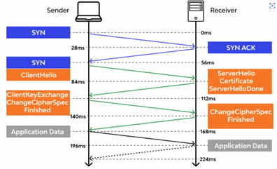
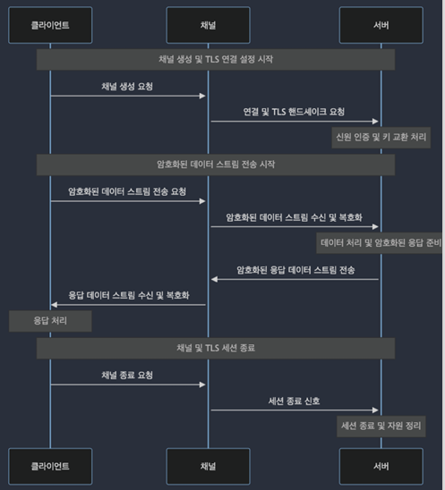
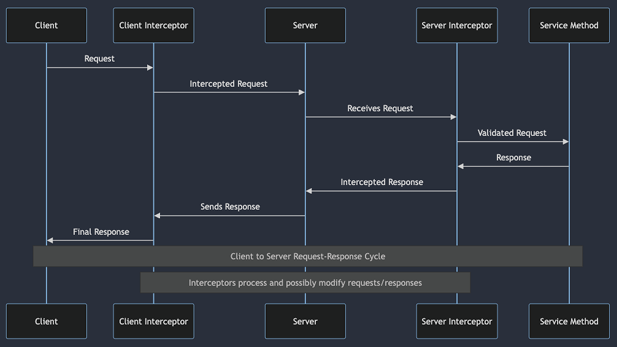

# gRPC 보안과 인증

## 1. gRPC 보안 계층 소개

 - `TLS의 이해`
    - TLS: Transport Layer Security
    - 암호화: 클라이언트와 서버 간에 전송되는 모든 데이터 암호화
    - 무결성 보호: 전송된 데이터가 변경되지 않았음을 확인, 데이터 무결성 보장
    - 인증: 서버(클라이언트)의 인증서를 사용하여 통신하는 양측의 신원을 인증

<div align="center">
    
</div>
<br/>

 - `스트림 암호화`
    - 상호 인증은 TLS 프로토콜을 통해 구현
    - 인증서 교환
    - 신원 인증 및 키 교환

<div align="center">
    
</div>
<br/>

## 2. SSL/TLS 기반의 보안 설정

### SSL/TLS 개요

SSL/TLS는 인터넷 상에서 데이터를 안전하게 전송하기 위함 암호화 프로토콜이다.  
 - SSL과 TLS는 인터넷 상에서 데이터를 안전하게 전송하기 위한 암호화 프로토콜이다.
 - TLS는 SSL의 후속 버전으로, 두 용어가 종종 교차 사용된다. (SSL은 보안 이슈로 대부분 TLS로 대체)
 - 이 프로토콜들은 데이터 전송 중 암호화를 제공하여 데이터 기밀성을 보장하고, 서버 및 클라이언트 인증을 통해 서로의 정체성을 확인한다.

### gRPC TLS 설정: 서버

서버 TLS 인증서와 키를 준비하고, 인증서 생성(Self-Signed Certificate) 또는 CA로 발급받은 인증서 준비한다. 이후 gRPC TlsServerCredentials를 사용하여 인증서와 키를 로드한다.  
 - 서버 TLS 인증서와 키 준비
 - 인증서 생성(Self-Signed Certificate) 또는 CA로 발급 받은 인증서 준비
 - gRPC TlsServerCredentials를 사용하여 인증서와 키를 로드
```bash
openssl genrsa out mykey.pem 2048 # 개인 키생성
openssl req new key mykey.pem out mycsr.csr # 인증서 서명요청 CSR
openssl x509 req days 365 in mycsr.csr signkey mykey.pem out mycert.pem
```
<br/>

 - `gRPC TlsServerCredentials를 사용하여 인증서와 키를 로드`
```java
public class SecureGrpcServer {
    public static void main(String[] args) throws Exception {
        // SSL/TLS 인증서와 개인 키 파일 경로 설정
        File certFile = new File("path/to/mycert.pem");
        File privateKeyFile = new File("path/to/mykey.pem");

        // TlsServerCredentials 생성
        TlsServerCredentials credentials = TlsServerCredentials.newBuilder()
                .keyManager(certFile, privateKeyFile)
                .build();
            
        // 보안 gRPC 서버 구성
        Server server = ServerBuilder.forPort(8443) // SSL/TLS를 사용할 포트 지정
                .useTransportSecurity(certFile, privateKeyFile) // SSL/TLS 설정 적용
                .addService(new  YourServiceImpl()) // gRPC 서버 구현체 추가
                .build();
        
        // 서버 시작
        server.start();
        System.out.println("Secure gRPC server started on port" + server.getPort());   
        server.awaitTermination();
    }
}
```
<br/>

### gRPC TLS 설정: 클라이언트

RPC 호출 시 해당 gRPC 서버에서 사용하는 공개 인증서를 사용해서 채널을 연다.  

```java
public class SecureGrpcClient {
    public static void main(String[] args) throws Exception {
        // 서버의 공개 인증서 파일 경로
        File trustCertCollectionFile = new File("path/to/mycert.pem");

        // SSL 컨텍스트 구성
        SslContext sslContext = GrpcSslContexts.forClient()
                .trustManager(trustCertCollectionFile)
                .build();

        // 보안 gRPC 채널 구성
        ManagedChannel channel = NettyChannelBuilder.forAddress("localhost", 8443)
                .sslContext(sslContext)
                .build();
        
        // gRPC 서비스 스텁 사용
        YourServiceGrpc.YourServiceBlockingStub stub = YourServiceGrpc.newBlockingStub(channel);

        // 서버에 요청
        ..
    }
}
```
<br/>

## 3. 사용자 인증 및 권한 부여 방법

### gRPC Interceptor

 - 인터셉터의 기능
    - 인증 처리
    - 로깅 및 모니터링
    - 메시지 변환
    - 오류 처리
 - 인터셉터 유형
    - 서버 인터셉터
    - 클라이언트 인터셉터

<div align="center">
    
</div>
<br/>

 - `서버 인터셉터 인터페이스`
```java
public class LogInterceptor implements ServerInterceptor {

    @Override
    public <ReqT, RespT> ServerCall.Listener<ReqT> interceptCall(
            ServerCall<ReqT, RespT> call, 
            Metadata headers, 
            ServerCallHandler<ReqT, RespT> next) {
        
        System.out.println("Received a call to method: " + call.getMethodDescriptor().getFullMethodName());

        // 다음 인터셉터나 서비스 메서드로 요청 전달
        return next.startCall(call, headers);
    }
}
```
<br/>

 - `클라이언트 인터셉터 인터페이스`
```java
public class ExampleClientInterceptor implements ClientInterceptor {

    @Override
    public <ReqT, RespT> ClientCall<ReqT, RespT> interceptCall(
            MethodDescriptor<ReqT, RespT> method,
            CallOptions callOptions,
            Channel next) {
        
        return new ForwardingClientCall.SimpleForwardingClientCall<ReqT, RespT>(next.newCall(method, callOptions)) {
            @Override
            public void start(Listener<RespT> responseListener, Metadata headers) {
                // 클라이언트 인터셉터
            }
        }
    }
}
```
<br/>

### 기본 인증 구현 예시

 - `기본 인증(Basic Authentication)`
    - 가장 기본적인 HTTP 인증 방식
    - 사용자 이름과 비밀번호를 조합해 생성된 인코딩된 문자열을 HTTP 헤더에 포함시켜 서버에 전송

<br/>

 - `기본 인증 서버 구현`
    - Interceptor를 구현하여 요청의 메타데이터에서 Authorization 헤더를 추출하고 이를 검증
```java
public class BasicAuthInterceptor implements ServerInterceptor {
    @Override
    public <ReqT, RespT> ServerCall.Listener<ReqT> interceptCall(
        ServerCall<ReqT, RespT> call, Metadata headers, ServerCallHandler<ReqT, RespT> next) {
        
        String basicAuth = headers.get(Metadata.Key.of("authorization", Metadata.ASCII_STRING_MARSHALLER));

        if (basicAuth != null && basicAuth.startsWith("Basic ")) {
            // Basic 인증 헤더에서 사용자 이름과 비밀번호 추출
            String base64Credentials = basicAuth.substring("Basic".length()).trim();
            String credentials = new String(Base64.getDecoder().decode(base64Credentials));
            // credentials: "username:password"
            String[] split = credentials.split(":", 2);
            String username = split[0];
            String password = split[1];

            if (username.equals(validUsername) && password.equals(validPassword)) {
                // 인증 성공, 요청 처리 계속
                return next.startCall(call, headers);
            }
        }

        // 인증 실패, 에러 응답
        call.close(Status.UNAUTHENTICATED.withDescription("Invalid credentials"), new Metadata());
        return new ServerCall.Listener<ReqT>() {};
    }
}


// 서버 생성시 구현한 Interceptor 등록
Server server = ServerBuilder.forPort(50051)
    .addService(new YourServiceImpl())
    .intercept(new BasicAuthInterceptor()) // 인터셉터 추가
    .build();
server.start();
```
<br/>

 - `기본 인증 클라이언트 구현`
    - 클라이언트 Interceptor를 구현하여 Authorization 헤더에 기본 인증 정보 추가
```java
public class BasicAuthClientInterceptor implements ClientInterceptor {
    private final String username;
    private final String password;

    public BasicAuthClientInterceptor(String username, String password) {
        this.username = username;
        this.password = password;
    }

    @Override
    public <ReqT, RespT> ClientCall<ReqT, RespT> interceptCall(
        MethodDescriptor<ReqT, RespT> method, CallOptions callOptions, Channel next) {
        
        return new ForwardingClientCall.SimpleForwardingClientCall<ReqT, RespT>(
            next.newCall(method, callOptions)) {
            
            @Override
            public void start(Listener<RespT> responseListener, Metadata headers) {
                String credentials = username + ":" + password;
                String basicAuth = "Basic " + Base64.getEncoder().encodeToString(credentials.getBytes());
                headers.put(Metadata.Key.of("authorization", Metadata.ASCII_STRING_MARSHALLER), basicAuth);
                super.start(responseListener, headers);
            }
        };
    }
}

// 클라이언트 측에서 서비스를 호출할 때 이 인터셉터를 사용하도록 설정
ManagedChannel channel = ManagedChannelBuilder.forAddress("localhost", 50051)
    .userPlaintext()
    .build();

// 인터셉터 채널에 추가
ClientInterceptor interceptor = new BasicAuthClientInterceptor();
Channel interceptedChannel = ClientInterceptors.intercept(channel, interceptor);
```
<br/>

### JWT 기반 인증 구현 예시

 - `JWT 기반 인증`
    - 보안 토큰을 사용하여 사용자 인증을 수행하는 방식
    - OAuth2, JWT 등이 해당

<br/>

 - `JWT 기반 인증 서버 구현`
    - ServerInterceptor를 구현하여 들어오는 요청의 메타데이터에서 Authorization 헤더를 통해 전송된 JWT를 추출하고 검증
```java
public class JwtAuthInterceptor implements ServerInterceptor {
    private final String secretKey;

    public JwtAuthInterceptor(String secretKey) {
        this.secretKey = secretKey;
    }

    @Override
    public <ReqT, RespT> ServerCall.Listener<ReqT> interceptCall(
        ServerCall<ReqT, RespT> call, Metadata headers, ServerCallHandler<ReqT, RespT> next) {
        
        String value = headers.get(Metadata.Key.of("authorization", Metadata.ASCII_STRING_MARSHALLER));

        if (value == null || !value.startsWith("Bearer ")) {
            call.close(Status.UNAUTHENTICATED.withDescription("JWT Token is missing from Authorization header"), headers);
            return new ServerCall.Listener<ReqT>() {};
        }

        String jwtToken = value.substring("Bearer".length()).trim();

        try {
            Jwts.parser().setSigningKey(secretKey).parseClaimsJws(jwtToken);
            // Token is valid
            return next.startCall(call, headers);
        } catch (JwtException e) {
            call.close(Status.UNAUTHENTICATED.withDescription("Invalid JWT Token"), headers);
            return new ServerCall.Listener<ReqT>() {};
        }
    }
}

// 서버에 JWT Interceptor 추가
Server server = ServerBuilder.forPort(50051)
    .addService(new YourServiceImpl())
    .intercept(new JwtAuthInterceptor("your_secret_key")) // JWT 인터셉터 추가
    .build();
server.start();
```
<br/>

 - `JWT 기반 인증 클라이언트 구현`
```java
public class BasicAuthClientInterceptor implements ClientInterceptor {
    private final String username;
    private final String password;

    public BasicAuthClientInterceptor(String username, String password) {
        this.username = username;
        this.password = password;
    }

    @Override
    public <ReqT, RespT> ClientCall<ReqT, RespT> interceptCall(
        MethodDescriptor<ReqT, RespT> method, CallOptions callOptions, Channel next) {

        return new ForwardingClientCall.SimpleForwardingClientCall<ReqT, RespT>(
            next.newCall(method, callOptions)) {
            
            @Override
            public void start(Listener<RespT> responseListener, Metadata headers) {
                String credentials = username + ":" + password;
                String basicAuth = "Basic " + Base64.getEncoder().encodeToString(credentials.getBytes());
                headers.put(Metadata.Key.of("authorization", Metadata.ASCII_STRING_MARSHALLER), basicAuth);
                super.start(responseListener, headers);
            }
        };
    }
}

// 클라이언트 측에서 서비스를 호출할 때 이 인터셉터를 사용하도록 설정
ManagedChannel channel = ManagedChannelBuilder.forAddress("localhost", 50051)
    .userPlaintext()
    .build();

// 인터셉터 채널에 추가
ClientInterceptor interceptor = new BasicAuthClientInterceptor("validUsername", "validPassword");
Channel interceptedChannel = ClientInterceptors.intercept(channel, interceptor);
```
<br/>

### mTLS(Mutual TLS Authentication)

 - 상호 TLS 인증은 클라이언트와 서버가 서로의 인증서를 검증하는 과정을 통해 양방향으로 인증을 수행하는 방식
 - 높은 보안 수준을 제공
 - 서버와 클라이언트가 서로를 인증하기 때문에, 양방향 인증에 대한 보안 요구사항이 있는 환경에 적합
 - 구현과 관리가 복잡하며, 인증서의 발급, 갱신, 폐기 등에 대한 추가적인 관리 작업이 필요하다. 또한, 인증서 기반 인증 구조를 구축해야 하므로 초기 설정 비용이 발생

