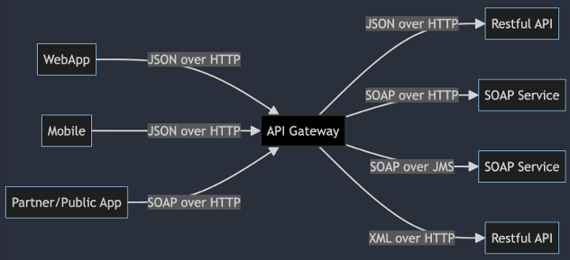
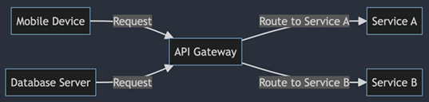
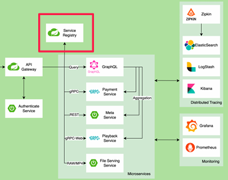
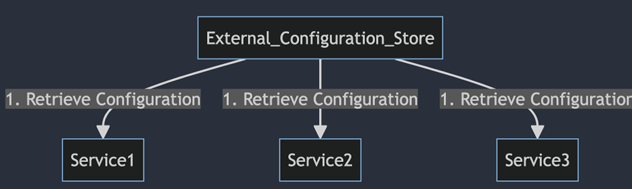
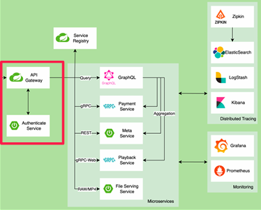
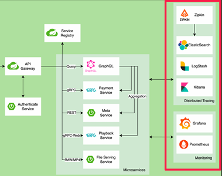
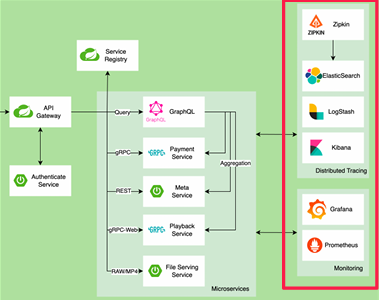

# API 게이트웨이 개념

## 1. API Gateway 개요

API Gateway는 애플리케이션 프로그래밍 인터페이스(API)를 관리하고 제공하는 데 사용되는 서버입니다. API Gateway는 여러 서비스와 클라이언트 간의 요청을 중개하고, 트래픽을 제어하며, 보안을 강화하는 중요한 역할을 합니다.  

 - __요청 라우팅(Routing)__
    - API Gateway는 클라이언트 요청을 적절한 마이크로서비스로 라우팅합니다. 이를 통해 클라이언트는 API Gateway를 통해 단일 엔드포인트를 사용하여 다양한 서비스에 접근할 수 있습니다.
 - __보안(Security)__
    - 인증 및 권한 부여(Authentication and Authorization): API Gateway는 사용자 인증 및 권한 부여를 통해 보안을 강화합니다. 예를 들어, OAuth, JWT(Json Web Token) 등을 사용하여 클라이언트를 인증할 수 있습니다.
    - 트래픽 암호화(Traffic Encryption): HTTPS를 통해 데이터를 암호화하여 전송 중 데이터 보안을 유지합니다.
 - __트래픽 관리(Traffic Management)__
    - 트래픽 제한(Rate Limiting): 클라이언트가 API에 과도한 요청을 보내는 것을 방지하기 위해 트래픽 제한을 설정할 수 있습니다.
    - 부하 분산(Load Balancing): 여러 백엔드 서비스로 트래픽을 분산하여 고가용성을 보장합니다.
 - __로깅 및 모니터링(Logging and Monitoring)__
    - API 요청 및 응답을 로깅하여 문제를 디버깅하고 성능을 모니터링할 수 있습니다. 이를 통해 API 사용 현황을 파악하고, 성능을 최적화할 수 있습니다.
 - __변환 및 처리(Transformation and Processing)__
    - 요청 및 응답 데이터를 변환하여 서로 다른 서비스 간의 호환성을 유지할 수 있습니다. 예를 들어, 요청 본문을 JSON에서 XML로 변환하는 작업을 수행할 수 있습니다.
 - __캐싱(Caching)__
    - 자주 요청되는 데이터를 캐시하여 응답 시간을 단축하고 백엔드 서비스의 부하를 줄일 수 있습니다.

    

 

### API Gateway 패턴이 생기게 된 배경

API Gateway 패턴은 마이크로서비스 아키텍처의 복잡성을 관리하고, 클라이언트와 서비스 간의 통신을 효율적으로 처리하기 위해 등장했습니다. 이 패턴은 애플리케이션의 확장성과 유지보수성을 높이고, 보안과 성능을 강화하는 데 중요한 역할을 합니다. API Gateway를 통해 개발자와 운영팀은 다양한 서비스와 클라이언트를 효과적으로 관리할 수 있습니다.  

API Gateway 패턴은 모놀리식 아키텍처의 한계를 극복하고 SOA 및 마이크로서비스의 발전을 수용하여 복잡한 서비스 간 통신을 단순화하고 중앙화한다.  
RESTful API의 등장흔 효율적인 HTTP 통신을 가능하게 하며, 마이크로서비스 아키텍처로의 전환을 가속화시켜 서비스 분리를 촉진하였다.  
클라우드 컴퓨팅의 성장과 함께 API Gatewayh는 인증, 로드 밸런싱 등의 기능을 통합하여 마이크로서비스 애플리케이션에 필수적인 구성 요소가 되었다.  

 - __1. 모놀리식 애플리케이션의 한계__
    - 복잡성 관리: 초기에는 대부분의 애플리케이션이 모놀리식 구조로 개발되었습니다. 이 구조는 하나의 코드베이스에서 모든 기능을 제공하기 때문에 애플리케이션이 커지면서 복잡성이 증가하고, 배포 및 유지보수가 어려워졌습니다.
    - 확장성 문제: 모놀리식 애플리케이션은 부분적인 확장이 어렵고, 전체 애플리케이션을 확장해야 하기 때문에 비효율적입니다.
 - __2. 마이크로서비스 아키텍처의 도입__
    - 서비스 분리: 마이크로서비스 아키텍처는 애플리케이션을 여러 작은 서비스로 분리하여 개발, 배포, 유지보수의 유연성을 높입니다. 각 서비스는 독립적으로 개발되고 배포될 수 있습니다.
    - 복잡성 증가: 서비스가 많아지면서, 각 서비스 간의 통신, 보안, 로깅, 모니터링 등의 관리가 복잡해졌습니다. 클라이언트는 여러 서비스에 직접적으로 요청을 보내야 했기 때문에 클라이언트 코드도 복잡해졌습니다.
 - __3. API 관리 필요성__
    - 단일 진입점 제공: 여러 서비스가 있는 경우, 클라이언트가 각 서비스에 직접 접근하는 대신, 단일 진입점을 통해 서비스에 접근할 수 있는 방법이 필요해졌습니다.
    - 보안 및 인증: 클라이언트와 서비스 간의 통신을 안전하게 관리하고, 인증 및 권한 부여를 중앙에서 처리할 필요가 생겼습니다.
    - 로드 밸런싱 및 트래픽 제어: 트래픽을 효율적으로 분산하고, 특정 서비스에 과도한 요청이 가지 않도록 제어할 필요가 있습니다.
    - 데이터 변환 및 통합: 서로 다른 서비스가 다양한 데이터 형식을 사용할 때, 클라이언트가 일관된 형식으로 데이터를 받을 수 있도록 변환해주는 기능이 필요했습니다.

 

## 2. API Gateway 역할과 특징

### API Gateway의 다양한 특징

#### Backend For Frontend (BFF)

BFF 패턴은 특정 클라이언트(예: 웹, 모바일 앱)에 맞춰 별도의 백엔드 서비스를 제공하는 방식입니다.  
 - 클라이언트에 맞춘 최적화된 API를 제공하여 성능을 향상시킵니다.
 - 각 클라이언트의 요구사항에 맞게 데이터를 가공할 수 있습니다.
 - 클라이언트별로 독립적인 개발 및 배포가 가능하여 유지보수성을 높입니다.

     
    일반적인 API Gateway 
     
    웹, 모바일 등에 맞는 API 제공

 

#### 다양한 서비스 등록, 탐색 (Service Registry and Discovery)

API Gateway는 서비스 레지스트리와 통합되어, 동적으로 서비스 인스턴스를 등록하고 탐색할 수 있습니다.  
 - 레지스트리: 서비스의 주소와 상태 정보를 중앙 관리하는 시스템
 - 디스커버리: 클라이언트가 레지스트리에서 서비스 정보를 조회하여 동적으로 서비스를 찾을 수 있는 메커니즘
 - 서비스 인스턴스의 자동 등록과 해제를 통해 유연성을 제공합니다.
 - 클라이언트가 서비스 위치를 알 필요 없이, API Gateway가 요청을 적절한 서비스로 라우팅합니다.
 - 서비스 가용성을 높이고, 부하 분산을 효과적으로 관리할 수 있습니다.

    

 

#### 외부 구성 저장소 (External Configuration Store)

API Gateway는 외부 구성 저장소와 통합되어, 설정 정보를 중앙에서 관리할 수 있습니다.  
 - 구성 설정을 외부 시스템에서 관리하고, 서비스 코드와 구성을 분리함으로써 구성 변경이 서비스 재배포 없이 이루어질 수 있게 한다.
 - 구성 변경을 중앙에서 관리하여 일관성을 유지할 수 있습니다.
 - 구성 정보의 동적 로딩을 통해 실시간으로 설정을 변경할 수 있습니다.
 - 보안 설정, 라우팅 정보 등 중요한 구성 요소를 중앙에서 제어합니다.

    

 

#### 마이크로서비스 인증/인가 (Authentication and Authorization)

API Gateway는 클라이언트의 요청을 처리하기 전에 인증 및 권한 부여를 수행합니다.  

 - 마이크로서비스 아키텍처에서 보안을 관리하는데 사용하며, 사용자의 신원 확인과 권한 부여를 처리하여 시스템의 보안을 강화한다. 주로 JWT 또는 OAuth와 같은 표준 프로토콜을 사용하여 구현한다.
 - 보안을 강화하여, 인증되지 않은 사용자의 접근을 차단합니다.
 - 다양한 인증 방식(OAuth, JWT 등)을 지원하여 유연한 보안 정책을 적용할 수 있습니다.
 - 중앙에서 권한 부여를 관리하여 각 서비스에서의 중복 작업을 줄입니다.

    

 

#### 장애 및 실패 처리를 위한 서킷 브레이커 (Circuit Breaker)

서킷 브레이커 패턴은 서비스 장애 발생 시 자동으로 요청을 차단하여 전체 시스템의 안정성을 높입니다.  

 - 서킷 브레이커는 원격 서비스 호출의 장애를 관리할 수 있다. 실패가 발생하면 장애가 확산되는 것을 방지하기 위해 서비스 호출을 중단하고, 다운스트림 서비스에 더 큰 영향을 방지한다.
 - 장애가 발생한 서비스로의 추가 요청을 방지하여 시스템의 안정성을 유지합니다.
 - 실패율이 일정 수준을 초과하면 서킷을 열고, 일정 시간 후 재시도를 통해 복구를 시도합니다.
 - 전체 시스템에 미치는 영향을 최소화하여 서비스의 복원력을 높입니다.

 

#### 모니터링과 추적 (Monitoring and Tracing)

API Gateway는 서비스 호출을 모니터링하고, 각 요청의 흐름을 추적할 수 있는 기능을 제공합니다.  

 - 시스템의 상태를 모니터링하고 문제를 추적하기 위해 로그 데이터와 메트릭을 수집하고 분석한다. 시스템의 실시간 상태 파악과 문제 발생 시 빠른 대응을 가능하게 한다.
 - 실시간으로 시스템 상태를 모니터링하여 문제를 신속하게 발견할 수 있습니다.
 - 분산 추적을 통해 각 요청의 경로와 성능을 분석하여 병목 지점을 파악할 수 있습니다.
 - 로그 및 메트릭 데이터를 수집하여 성능 최적화 및 문제 해결에 도움을 줍니다.

    

 

#### 중앙화된 로그 집계 (Centralized Log Aggregation)

API Gateway는 모든 서비스의 로그를 중앙에서 집계하여 관리할 수 있습니다.  

 - 모든 서비스의 로그를 한 곳에서 관리하여 분석 및 문제 해결을 용이하게 합니다.
 - 로그 데이터의 일관성을 유지하고, 감사 및 컴플라이언스 요구사항을 충족시킬 수 있습니다.
 - 로그 분석 도구와 연동하여 다양한 인사이트를 얻고, 시스템 성능을 최적화할 수 있습니다.

    

 

## 3. API Gateway 여러가지 사례

### Netflix - Zuul

 - Netflix는 마이크로서비스 아키텍처를 도입하여 수백 개의 마이크로서비스로 구성된 복잡한 시스템을 운영합니다.
 - Zuul은 요청 라우팅, 로드 밸런싱, 보안, API 게이트웨이 기능을 제공하여 Netflix의 다양한 클라이언트(예: 스마트 TV, 모바일 앱)와 백엔드 서비스 간의 통신을 관리합니다.
 - 이를 통해 Netflix는 각기 다른 클라이언트 요구사항에 맞춘 API를 제공하고, 시스템의 성능과 안정성을 유지할 수 있습니다.

 

### Amazon - Amazon API Gateway

 - Amazon API Gateway는 서버리스 아키텍처를 지원하여 AWS Lambda, DynamoDB, S3 등 다양한 AWS 서비스와 연동합니다.
 - AWS 고객은 API Gateway를 통해 RESTful 및 WebSocket API를 쉽게 생성, 배포, 관리할 수 있습니다.
 - Amazon API Gateway는 요청 인증, 트래픽 관리, 모니터링, 캐싱 등 다양한 기능을 제공하여 개발자들이 효율적으로 API를 운영할 수 있게 도와줍니다.

 

### Airbnb - NGINX + custom API Gateway

 - Airbnb는 NGINX와 자체 개발한 API Gateway를 사용하여 클라이언트 요청을 다양한 백엔드 서비스로 라우팅합니다.
 - API Gateway는 인증, 로깅, 모니터링 등의 기능을 제공하며, 서비스 간 통신의 일관성을 유지합니다.
 - 이를 통해 Airbnb는 고가용성, 확장성, 보안성을 확보하면서 다양한 기능을 제공하는 글로벌 플랫폼을 운영합니다.

 

### Spring Cloud Gateway

Spring Cloud Gateway는 Spring 프레임워크 기반의 API 게이트웨이 서비스입니다.  

 - __라우팅 (Routing)__
    - Spring Cloud Gateway는 다양한 조건에 따라 요청을 다른 서비스로 라우팅할 수 있습니다.
    - 예를 들어, 특정 경로, 헤더, HTTP 메소드에 따라 요청을 서로 다른 마이크로서비스로 전달할 수 있습니다.
 - __필터링 및 인터셉팅 (Filtering and Interception)__
    - 필터를 사용하여 요청과 응답을 수정하거나, 보안 체크, 로깅, 모니터링 등의 추가 기능을 적용할 수 있습니다.
    - 사전 필터(pre-filter)와 사후 필터(post-filter)를 지원하여 요청 처리 전후에 필요한 작업을 수행할 수 있습니다.
 - __로드 밸런싱 (Load Balancing)__
    - 여러 인스턴스로 구성된 서비스에 대한 요청을 자동으로 분배하여 부하를 균형있게 분산할 수 있습니다.
    - Spring Cloud의 기능을 활용하여 Ribbon 또는 서드파티 로드 밸런서와 연동하여 동작합니다.
 - __서킷 브레이커 (Circuit Breaker)__
    - 서킷 브레이커 패턴을 지원하여 특정 서비스의 장애 상황에서 요청을 차단하고, 장애 회복을 위한 조치를 취할 수 있습니다.
 - __경로 재작성 (Path Rewriting)__
    - 요청된 경로를 다른 경로로 재작성하여 백엔드 서비스의 구조를 숨기거나, 클라이언트에게 맞춤형 경로를 제공할 수 있습니다.

