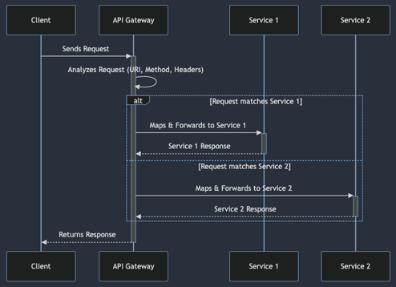
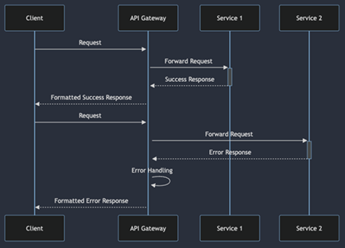

# API Gateway 프록시와 라우팅

## 1. 프록시 서버 개념과 역할

프록시 서버는 클라이언트와 서버 사이에서 중계 역할을 수행하는 중간 서버입니다. 이 서버는 클라이언트의 요청을 받아서 대신 서버에 전달하고, 서버로부터 받은 응답을 클라이언트에게 전달하는 역할을 합니다. 프록시 서버는 다양한 네트워크 서비스와 보안 기능을 제공하기 위해 사용됩니다.  

 - __중계 및 라우팅 (Intermediary and Routing)__
    - 클라이언트의 요청을 받아서 이를 서버에 중계하며, 서버로부터 받은 응답을 클라이언트에게 다시 전달합니다.
    - 이 과정에서 클라이언트는 직접적으로 서버와 통신하지 않고 프록시 서버를 통해 간접적으로 통신합니다.
 - __캐싱 (Caching)__
    - 프록시 서버는 이전에 받은 요청의 응답을 캐시에 저장하여 동일한 요청에 대해 서버에 직접 접근하지 않고 캐시에서 응답을 제공할 수 있습니다.
    - 이는 네트워크 대역폭을 절약하고, 응답 시간을 단축시켜 성능을 향상시킵니다.
 - __보안 및 필터링 (Security and Filtering)__
    - 프록시 서버는 클라이언트와 서버 사이에서 보안 기능을 제공할 수 있습니다.
    - 예를 들어, 특정 사이트 접근 제어, 콘텐츠 필터링, 암호화와 복호화 등의 보안 기능을 구현할 수 있습니다.
 - __익명화 (Anonymization)__
    - 클라이언트의 IP 주소를 숨기고 대신 프록시 서버의 IP 주소를 사용하여 서버에 접근할 수 있습니다.
    - 이는 클라이언트의 식별을 어렵게 하고 개인 정보 보호를 강화하는 데 도움을 줍니다.
 - __로드 밸런싱 (Load Balancing)__
    - 여러 서버 사이에서 요청을 분배하여 부하를 균형있게 분산할 수 있습니다.
    - 이는 서버의 가용성을 높이고, 시스템 전체의 성능을 개선하는 데 기여합니다.

<br/>

### 프록시 서버 개념과 역할 요약

 - 중계(Forwarding)
    - 요청 수신, 요청 전달, 응답 수신, 응답 전송
 - 보안(Security)
    - 요청 검사 및 필터링, 액세스 제어, 사용자 인증, SSL/TLS 암호화, 콘텐츠 캐싱과 보안
 - 캐싱(Caching)
    - 캐시 저장소 관리, 데이터 캐싱, 만료 정책 실행, 성능 최적화, 네트워크 트래픽 감소
 - 프로토콜변환(Protocol Conversion)
    - 다양한 프로토콜을 사용하는 클라이언트와 서버간의 호환성 문제 해결, 통신 범위 확장, 시스템 통합 용이성
 - 로드밸런싱(Load Balancing)
    - 가용성 향상, 부하 분산, 확장성, 유연성
 - 압축(Compression)
    - 효율적 대역폭 사용, 응답 시간 단축, 서버 및 네트워크 부하 감소
 - SSL/TLS 처리(SSL/TLS)
    - 성능 최적화, 보안 강화, 유연한 콘텐츠 처리

<br/>

## 2. 라우팅

라우팅은 네트워크에서 데이터 패킷이 출발지에서 목적지로 전송되는 경로를 결정하는 과정을 말합니다. 이 과정은 데이터 통신 네트워크의 핵심적인 기능 중 하나로, 데이터 패킷이 최종 목적지까지 안전하고 효율적으로 도달할 수 있도록 보장합니다.  

가령, 인터넷에서 사용하는 라우팅은 글로벌 네트워크에서 데이터 패킷이 출발지(송신자)에서 목적지(수신자)로 이동하는 경로를 결정하는 과정을 말합니다. 데이터 패킷은 여러 라우터를 거쳐 최종 목적지로 전달되며, 이 과정에서 라우팅 테이블과 라우팅 프로토콜이 중요한 역할을 합니다.  
 - 최적 경로 선택: 라우터는 여러 경로 중에서 가장 빠르고 안정적인 경로를 선택하여 데이터 패킷을 전송합니다.
 - 부하 분산: 여러 경로에 데이터를 분산하여 네트워크 전체의 성능을 최적화합니다.
 - 오류 회피: 네트워크에서 발생할 수 있는 문제나 장애에 대비하여 대체 경로를 찾아 데이터 전송을 보장합니다.

<br/>

### API Gateway에서 역할

클라이언트로부터 오는 요청을 적절한 백엔드 서비스나 마이크로 서비스로 전달한다.  
개별 서비스의 위치, 구현 세부사항, 변경 사항 등을 클라이언트로부터 추상화한다.  
서비스 간 결합도를 낮추고 시스템의 전체적인 유연성과 확장성을 향상시킨다.  

<br/>

#### API 요청 분석 및 매핑

API Gateway는 클라이언트로부터 수신한 API 요청을 분석하고, 이를 백엔드 마이크로서비스로 매핑하는 역할을 합니다.  
 - 요청 분석: 클라이언트의 요청을 분석하여 필요한 정보(경로, 헤더, 쿼리 매개변수 등)를 추출합니다.
 - 매핑: 추출된 정보를 바탕으로 요청을 하나 이상의 백엔드 서비스로 라우팅합니다.
 - 프로토콜 변환: 클라이언트와 백엔드 서비스 간의 프로토콜 변환을 수행할 수 있습니다. 예를 들어, HTTP 요청을 HTTPS로 변환하거나, JSON 요청을 SOAP 메시지로 변환하는 작업이 가능합니다.

```yml
spring:
  cloud:
    routes:
     - id: example_route
       uri: http://example.com
       predicates:
        - Path=/example/**
       filters:
        - AddRequestHeader=X-Example-Header,ExampleValue
```
<div align="center">
    
</div>
<br/>

#### API 동적 라우팅

API Gateway는 동적으로 요청을 처리하고 적절한 백엔드 서비스로 라우팅할 수 있는 기능을 제공합니다.  

 - 서비스 디스커버리 연동: API Gateway는 서비스 디스커버리 시스템과 통신하여, 실행 중인 서비스 인스턴스의 위치와 상태를 실시간으로 파악
 - 요청의 정호가한 라우팅: 서비스 인스턴스에 대한 최신 정보를 바탕으로, API Gateway는 들어오는 요청을 가장 적합하고 가용성이 높은 서버로 라우팅
 - 로드 밸런싱: 단일 서비스 인스턴스에 과부하가 집중되는 것을 방지하고, 전체 시스템의 안정성과 처리량을 최적화
 - 경로 기반 라우팅: 요청의 경로를 기준으로 특정 백엔드 서비스로 라우팅합니다.
 - 헤더 기반 라우팅: 요청의 헤더 정보를 기반으로 특정 조건을 충족하는 백엔드 서비스로 라우팅합니다.
 - 쿼리 매개변수 기반 라우팅: 요청의 쿼리 매개변수를 기준으로 백엔드 서비스를 선택하는 동적 라우팅을 수행합니다.

<br/>

#### API 버전 관리 및 단계적 배포

API Gateway는 여러 버전의 API를 관리하고, 요청을 적절한 버전의 API로 라우팅할 수 있습니다.  
 - API 버전 관리: 다양한 API 버전을 관리하고, 요청에 따라 적절한 버전의 API로 라우팅합니다.
    - API 버전 정의: API의 여러 버전을 명확하게 정의하고 관리
    - 요청 라우팅: 클라이언트의 요청에 포함된 버전 정보(URL 경로, 헤더 등)를 기반으로, API Gateway는 해당 요청을 올바른 버전의 API로 자동 라우팅
 - 단계적 배포: 새로운 API 버전을 점진적으로 배포하며, 사용자에게 영향을 최소화하고 안정성을 유지합니다.
    - 트래픽 분할: 새로운 API 버전을 배포할 때, API Gateway를 사용하여 전체 트래픽 중 일부만 새 버전으로 리다이렉션
    - 위험 최소화: 새 버전에서 예상치 못한 문제가 발생했을 떄, 전체 시스템에 미치는 영향을 최소화
<br/>

#### 에러 처리 및 통합 응답 포맷팅

API Gateway는 다양한 서비스에서 발생할 수 있는 에러를 처리하고, 통합된 응답 포맷을 제공하는 기능을 제공합니다.
 - 에러 처리: 백엔드 서비스에서 발생한 에러를 적절히 처리하고 클라이언트에게 응답합니다.
 - 통합 응답 포맷팅: 여러 백엔드 서비스에서 오는 응답을 통합하여 클라이언트에게 일관된 형식의 응답을 제공합니다. 예를 들어, JSON 형식으로 통합하여 클라이언트에게 반환할 수 있습니다.

<div align="center">
    
</div>

