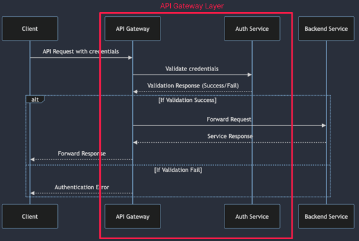
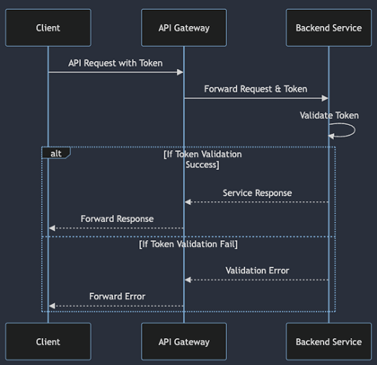
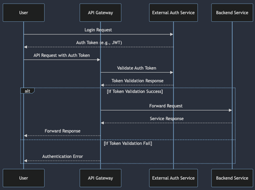
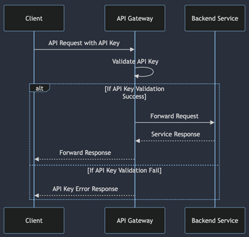

# 인증 및 인가

## 인증(AAuthentication)

인증은 사용자 또는 클라이언트가 자신이 주장하는 사람임을 증명하는 과정입니다.  

 - __API Key 기반 인증__
    - API Gateway는 클라이언트에게 발급된 API Key를 사용하여 요청의 유효성을 검사합니다.
    - 클라이언트가 API 요청을 보낼 때 HTTP 헤더나 쿼리 매개변수에 API Key를 포함시키고, API Gateway에서 이를 검증합니다.
 - __JWT(JSON Web Token) 기반 인증__
    - 클라이언트는 JWT를 발급받고, 이를 HTTP Authorization 헤더에 포함하여 API Gateway에 전송합니다.
    - API Gateway는 JWT의 유효성을 확인하고, 필요에 따라 클라이언트의 권한을 파악하여 인증을 완료합니다.
 - __OAuth 2.0 기반 인증__
    - OAuth 2.0 프로토콜을 사용하여 클라이언트와 리소스 소유자 간의 인증 및 권한 부여를 수행합니다.
    - 클라이언트는 액세스 토큰을 획득하고, 이를 API 요청에 포함시켜 API Gateway가 인증을 수행합니다.
 - __기타 인증 방식__
    - HTTP 기본 인증(Basic Authentication)과 같은 기본 인증 방식을 사용할 수 있습니다.
    - 사용자 이름과 비밀번호를 인코딩하여 요청의 Authorization 헤더에 포함시키고, API Gateway에서 이를 확인합니다.

 

## 인가(Authorization)

인가는 사용자가 특정 리소스에 접근할 수 있는 권한이 있는지 결정하는 과정입니다.  

 - __역할 기반 접근 제어(Role-Based Access Control, RBAC)__
    - API Gateway는 사용자의 역할(Role)에 기반하여 접근 권한을 부여하고 관리합니다.
    - 클라이언트의 인증 정보를 기반으로 API Gateway는 접근 권한을 확인하고, 요청된 리소스에 대한 접근을 허용 또는 거부합니다.
 - __ACL(Access Control List) 기반 접근 제어__
    - API Gateway는 ACL을 사용하여 특정 사용자나 그룹에게 허용되는 API 접근 권한을 설정할 수 있습니다.
    - ACL을 통해 세부적으로 API 엔드포인트 또는 HTTP 메소드 별로 접근 제어를 구성할 수 있습니다.
 - __정책 기반 접근 제어(Policy-Based Access Control)__
    - API Gateway는 정책을 사용하여 접근 권한을 제어합니다. 예를 들어, 특정 IP 주소 범위에서만 API 접근을 허용할 수 있습니다.
    - 이러한 정책은 API Gateway의 설정을 통해 관리되며, 요청이 접근 권한을 충족하는지 검사합니다.
 - __API 단위의 접근 제어__
    - API Gateway는 개별 API 엔드포인트마다 접근 권한을 구성할 수 있습니다.
    - 각 API에 대해 특정 사용자 또는 그룹에게 접근 권한을 설정하고, 요청에 따라 이를 검증하여 접근을 제어합니다.

 

## 인증 및 인가 구현 패턴

     
    직접 인증 
     
    토큰 전달(JWT 등) 
     
    외부 인증 서비스 사용(OAuth2 등) 
     
    API 키 관리 

