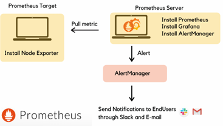
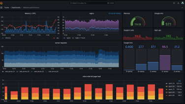

# 로깅 및 모니터링

## 1. 로깅과 모니터링의 중요성

 - __로깅의 중요성__
    - 트랜잭션 추적: API 호출의 전체 경로를 추적하여 문제 해결과 성능 최적화에 필요한 데이터 제공
    - 보안 검사: 불법적인 접근 시도 및 잠재적 보안 취약점 감지
    - 정책 위반 감지: API 사용 정책 위반 사항 기록 및 분석
    - 사용 패턴 분석: API 사용 통계를 통한 비즈니스 인사이트 도출 및 서비스 개선
 - __로깅 방법__
    - 액세스 로그: 모든 인바운드 요청과 아웃바운드 응답에 대한 정보를 기록
    - 에러 로그: 시스템 에러, 경고, 예외 상황을 기록
    - 트랜잭션 추적: 분산 시스템에서 서비스 간의 호출 체인을 추적

<BR/>

### 액세스 로그

 - 액세스 로그 주요 정보
    - Timestamp: 요청이 처리된 날짜와 시간
    - Client IP: 요청을 보낸 클라이언트 IP 주소
    - HTTP Method: 요청 HTTP 메서드(GET, POST, PUT, DELETE)
    - URL: 요청된 리소스 URL
    - HTTP Response Code: 요청에 대한 응답 코드
    - Response TIME: 서버가 요청을 처리하고 응답을 완료하는 데 걸린 시간
    - User-Agent: 요청을 보낸 클라이언트의 유저 에이전트 정보
 - 로그 수집 및 분석 도구
    - Nginx, Apache HTTP Server: 웹 서버는 기본적으로 액세스 로그를 생성, 로그 포맷을 사용자가 정의
    - Amazon API Gateway: AWS의 API Gateway는 CloudWatch와 통합되어 액세스 로그를 수집하고 분석
    - Kong, Tyk: 오픈 소스 API Gateway도 로깅 플러그인을 제공하여 액세스 로그를 기록하고, 필요에 따라 외부 로그 분석 시스템으로 전송

<br/>

### 에러 로그

 - 에러 로그 주요 정보
    - Timestamp: 에러가 발생한 날짜와 시간
    - Error Level: 에러의 심각도를 나타내는 레벨(ERROR, WARN, FATAL)
    - Error Message: 에러 설명 또는 메시지
    - Stack Trace: 에러가 발생한 시점의 호출 스택, 에러의 원인을 파악하는 데 유용
    - Service Name/ID: 에러가 발생한 서비스 또는 컴포넌트의 이름 또는 식별자
    - Additional Information: 요청 ID, 사용자 ID 등 에러 상황을 이해하는 데 도움이 되는 추가 정보
 - 에러 로그 수집 도구
    - 내장 로깅 기능: 대부분 API Gateway와 웹 서버는 기본적으로 에러 로깅 기능을 제공
    - Sentry: 애플리케이션 모니터링 및 에러 추적을 위한 도구, 실시간으로 에러를 수집하고 분석
    - Logstash: Elasticsearch, Logstash, Kibana(ELK) 스택의 일부로, 로그 데이터를 수집, 변환, 저장하고 분석할 수 있는 도구
        - Logstash를 사용하여 에러 로그를 중앙화하고, Kibana를 통해 시각화

<br/>

### 트랜잭션 추적 로그

 - 트랜잭션 추적 로그 주요 정보
    - Trace ID: 전체 트랜잭션을 식별하는 유니크한 식별자. 하나의 요청 경로를 따라가며 발생하는 모든 이벹느는 동일한 Trace ID 공유
    - Span ID: 특정 서비스 호출 또는 작업 단위를 식별하는 식별자
    - Operation Name: 수행된 작업 또는 호출된 서비스의 이름
    - Start Time / End Time: 각 Span의 시작 시간과 종료 시간
    - Tags / Annotations: 요청의 메타데이터, HTTP 상태 코드, 에러 메시지 등 추가적인 정보 제공
 - 트랜잭션 추적 로그 수집 도구
    - Zipkin: Twitter에 의해 개발된 분산 추적 시스템으로, 서비스 간의 요청 흐름을 시각적으로 추적하고, 지연 시간을 분석할 수 있는 기능을 제공
    - Jaeger: Uber에 의해 개발된 Jaeger는 분산 추적을 위한 오픈 소스 도구로, 트랜잭션과 서비스 간의 의존성을 시각화하며, 성능과 모니터링을 위한 다양한 메트릭을 제공

<br/>

### 모니터링 방법

 - Health Check: API Gateway 및 백엔드 서비스의 가용성과 정상 작동 여부를 확인
    - 목적: 가용성 확인, 정상 작동 여부 검증, 자동 복구 지원
    - 방법: 엔드포인트 호출, 정기적 점검
    - 도구: Spring Boot Actuator, Consul, Kubernetes Liveness/Readiness Probes
 - 트래픽 모니터링: 들어오는 요청의 양, 처리량, 응답 시간 등을 추적하여 시스템의 부하 상태를 이해
    - 목적: 성능 분석, 부하 상태 파악, 성능 문제 식별, 최적화 기회 발견
    - 방법: 지표 수집, 실시간 모니터링, 데이터 분석 및 시각화
    - 도구: Prometheus, Grafana, Amazon CloudWatch
 - 성능 모니터링: API 응답 시간, 데이터베이스 쿼리 성능 등을 모니터링하여 시스템의 성능 병목을 식별하고 개선
    - 목적: 응답 시간 최적화, 성능 병목 식별, 시스템 최적화
    - 방법: 실시간 모니터링, 데이터 분석 및 시각화, 문제 해결
    - 도구: Pinpoint, Scouter, New Relic, Datadog
 - 경보 및 알림 설정: 장애, 성능 저하, 보안 위협 등의 문제가 발생했을 때 즉시 알림을 받아 대응할 수 있도록 설계

<br/>

## 2. 분산 로깅 및 추적

### 분산 시스템에서 발생할 수 있는 문제 유형

 - 지연 시간 증가: 네트워크 지연, 서비스 오버로드, 비효율적인 데이터베이스 쿼리 등으로 인해 응답 시간이 증가할 수 있음
 - 서비스 가용성 문제: 하드웨어 장애, 소프트웨어 버그, 네트워크 문제 등으로 특정 서비스가 실패하거나 접근 불가능해질 수 있음
 - 잘못된 서비스 통신: 서비스 간의 의존성 오류, 잘못된 API 호출, 데이터 형식 불일치 등으로 인해 시스템이 예상대로 동작하지 않을 수 있음

<br/>

### Spring 생태계 분산 추적 방법

 - __Spring Cloud Sleuth__
    - Spring Cloud Sleuth는 분산 추적 정보를 자동으로 추가하여, 개발자가 분산 시스템 내에서 요청의 흐름을 쉽게 파악할 수 있도록 지원
    - 요청이 서비스를 거칠 떄마다 고유한 Trace ID를 생성하고, 각 서비스 호출에 대해 Span ID를 부여
    - Trce ID
        - 분산 시스템 내에서 단일 비즈니스 트랜잭션을 식별하는 데 사용되는 고유 식별자
        - 하나의 요청이 여러 서비스를 통과할 때, 이 요청을 추적하기 위해 동일한 Trace ID가 사용
    - Span ID
        - 특정 서비스 호출 또는 작업 단위를 식별하는 데 사용되는 고유 식별자
        - Span은 부모 Span의 자식이 될 수 있으며, 이를 통해 서비스 간 호출의 계층 구조를 나타냄

<br/>

 - __Zipkin__
    - Zipkin은 분산 시스템에서 서비스 간의 요청 추적을 위한 분산 추적 시스템
    - 개발자가 마이크로서비스 아키텍처 내에서 요청의 흐름을 시각적으로 이해하고, 성능 문제를 진단할 수 있도록 설계
    - Zipkin 아키텍처와 구성 요소
        - 컬렉터(Collector): 서비스로부터 추적 데이터를 수집하는 컴포넌트. HTTP, Kafka, RabbitMQ 등 다양한 방식으로 데이터 수집
        - 데이터베이스(Storage): 수집된 추적 데이터를 저장하는 컴포넌트. Zipkin은 Cassandra, ElasticSearch, MySQL 등 여러 스토리지 옵션 지원
        - API: 저장된 추적 데이터에 접근하기 위한 RESTful API를 제공. 이 API를 통해 사용자는 특정 Trace ID를 조회하거나 서비스 간 호출 관계를 분석
        - UI: 추적 데이터를 시각적으로 표현하는 웹 인터페이스

<br/>

 - __Sleuth와 Zipkin 통합__
    - Sleuth는 애플리케이션 추적 기능을 자동으로 추가(SpanID, TraceID)
    - Zipkin은 이 추적 정보를 저장하고 시각화하여 분석
    - 요청 흐름 추적: Sleuth는 각 요청에 Trace ID와 Span ID를 부여하여, 분산 시스템을 통과하는 요청의 경로를 추적, Zipkin은 이 추적 정보를 시각화하여, 어느 서비스에서 지연이 발생했는지, 어느 경로를 통해 데이터가 흐르는지 쉽게 파악
    - 성능 병목 진단: Zipkin UI를 통해 서비스 간의 호출 시간과 지연 시간을 분석함으로써 성능 병목 지점을 식별
    - 에러 추적: 에러 로그와 함께 추적 정보를 분석하여, 오류가 발생한 서비스와 그 원인을 정확하게 식별
    - 응답 시간 모니터링: Sleuth와 Zipkin을 지속적으로 사용하여 응답 시간을 모니터링하고, 성능 저하를 조기에 감지하여 대응
```
org.springframework.cloud:spring-cloud-starter-sleuth
org.springframework.cloud:spring-cloud-starter-sleuth-zipkin

spring:
  zipkin:
    base-url: http://localhost:9411/
  sleuth:
    sampler:
      probability: 1.0
```
<br/>

## 3. 모니터링 도구 Prometheus와 Grafana 연동

### Prometheus

시계열 데이터 모니터링에 최적화된 오픈 소스 시스템으로 멀티 차원 데이터 모델, 유연한 쿼리 언어(PromQL), 자체 서비스 발견 또는 정적 구성을 통한 시계열 수집 등의 기능이 있다.  
 - Exporters: 특정 시스템의 Metric을 Prometheus가 이해할 수 있는 형태로 변환해 주는 도구
 - Prometheus 서버: 수집된 Metric을 저장하고 처리하는 핵심 컴포넌트
 - Alert Manager: Prometheus 시스템의 알람을 관리

<div align="center">
    
</div>
<br/>

### Grafana

수집한 메트릭, 로그, 추적 데이터를 시각화하고 분석하는 데 사용되는 오픈 소스 플랫폼으로 다양한 데이터 소스를 지원하고, 대시보드를 통한 데이터 시각화 및 분석, 알림 채널을 통한 알림 설정 기능을 제공한다.  
 - Data Sources: Grafana는 Prometheus, InfluxDB, ElasticSearch, CloudWatch, MySQL, PostgreSQL 등 다양한 데이터 소스를 지원
 - Dashboards, Panels: 대시보드는 시각화 패널을 통해 데이터를 시각적으로 표현
 - Query: Grafana에서는 패널별로 쿼리를 설정하여, 원하는 데이터를 시각화

<div align="center">
    
</div>
<br/>

### Spring, Prometheus, Grafana 연동

 - 수집 항목
    - HTTP 요청메트릭: 요청수, 응답시간, HTTP 상태코드별 요청수 등
    - JVM 메트릭: 힙메모리사용량, 가비지 컬렉션 횟수 및 지속시간, 스레드수 등
    - 데이터베이스메트릭: 데이터 베이스 연결수, 쿼리 실행시간 등
    - 커스텀메트릭: 개발자가 직접 정의한 비즈니스 관련 메트릭 등
```
implementation io.micrometer:micrometer registryprometheus

management:
  endpoints:
    web:
      exposure:
        include: "prometheus"
```

<div align="center">
    
</div>
<br/>

