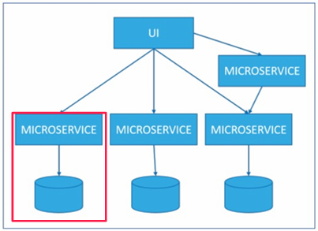
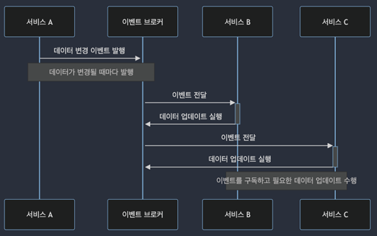
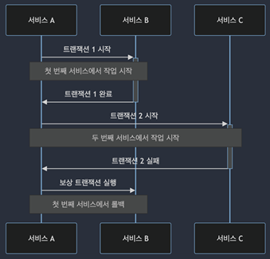
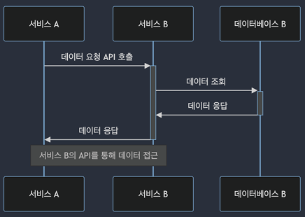
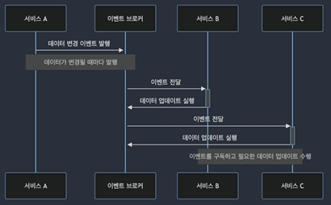
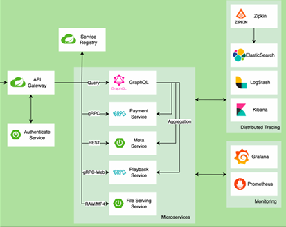

# 마이크로서비스 아키텍처

## 1. 마이크로서비스 아키텍처 개요

마이크로서비스 아키텍처는 소프트웨어 개발에서 애플리케이션을 독립적으로 배포 가능한 작은 서비스들로 분리하는 접근 방식을 말합니다. 각 서비스는 특정 비즈니스 기능을 수행하며 독립적으로 개발, 배포, 확장 및 관리될 수 있습니다. 이를 통해 복잡한 시스템을 보다 유연하고 관리하기 쉽게 만듭니다.  

 - __장점__
    - 독립 배포: 각 마이크로서비스는 독립적으로 배포 가능하여, 하나의 서비스 업데이트가 다른 서비스에 영향을 미치지 않습니다.
    - 모듈화: 서비스들이 명확히 정의된 인터페이스를 통해 통신하여, 각 서비스가 특정 비즈니스 기능을 담당합니다.
    - 기술 다양성: 각 마이크로서비스는 가장 적합한 기술 스택을 사용할 수 있어, 개발팀이 선택한 언어나 프레임워크에 구애받지 않습니다.
    - 확장성: 개별 서비스는 독립적으로 확장 가능하여, 필요한 부분만 확장함으로써 효율적인 자원 관리를 할 수 있습니다.
    - 장애 격리: 하나의 서비스에 장애가 발생해도 전체 시스템에 미치는 영향을 최소화할 수 있습니다.
 - __단점__
    - 복잡성 증가: 서비스 간 통신, 데이터 관리, 모니터링 등에서 복잡성이 증가합니다.
    - 데이터 일관성: 각 서비스가 독립적인 데이터베이스를 가질 경우 데이터 일관성을 유지하는 것이 어렵습니다.
    - 운영 부담: 많은 서비스가 독립적으로 운영되므로 모니터링, 로깅, 배포 등의 운영 부담이 커집니다.

 

### 모놀리식 아키텍처와 마이크로서비스 아키텍처

 - __모놀리식 아키텍처__
    - 전통적인 모놀리식 아키텍처는 소프트웨어를 단일, 덩치 큰 애플리케이션으로 갭라하는 방식
    - 이 방식에서는 모든 기능이 하나의 코드 베이스에 통합되어 있으며, 변경이나 업데이트 시 전체 애플리케이션을 재 배포 해야한다.
 - __마이크서비스 서비스 아키텍처__
    - 서비스를 작고 관리가 용이한 단위로 분리
    - 더 빠른 배포, 더 나은 확장성, 그리고 서비스 간의 느슨한 결합을 가능하게 한다.

 

### 마이크로 서비스 핵심 원칙

#### 분산된 데이터 관리

 - 독립적인 데이터 저장소: 각 마이크로 서비스는 고유한 데이터 베이스 또는 데이터 저장소를 소유
 - 데이터 일관성: 분산된 데이터 관리 원칙에 따라, 각 서비스는 독립적으로 데이터를 관리하면서 전체 시스템 내에서의 데이터 일관성을 유지

    

 

#### 데이터 일관성 유지 방법

 - `이벤트 기반 데이터 동기화`

    

 

 - `API를 통한 데이터 접근`

    

 

 - `트랜잭션 관리(Saga 패턴)`

    

 

#### 서비스별 독립적 배포

 - 속도와 유연성: 각 팀은 다른 서비스의 개발 일정에 영향을 받지 않고 자신의 서비스를 자유롭게 업데이트하고 배포
 - 리스크 최소화: 하나의 서비스에 문제가 발생하더라도, 시스템 전체에 영향을 미치지 않고 해당 서비스만을 신속히 롤백하거나 수정
 - 기술적 유연성: 각각의 서비스가 독립적으로 배포될 수 있기 때문에, 개별 서비스는 그 서비스의 요구사항에 가장 적합한 기술 스택을 자유롭게 선택

 

#### 결합도(Coupling)와 응집도(Cohesion)

 - 개별 마이크로 서비스 간의 낮은 결합도
    - 서비스 간의 의존성을 최소화하는 것을 목표
    - 각 서비스가 가능한 한 독립적으로 개발, 배포, 수정될 수 있게 하여 시스템 전체의 유연성과 확장성을 향상
 - 마이크로 서비스 내부의 높은 응집도
    - 모듈 내부의 요소들이 하나의 잘 정의된 작업이나 목적에 초점
    - 한 서비스 내에서만 관련된 기능들을 그룹화하고, 서로 다른 책임을 가진 기능들은 별도의 서비스로 분리하여 응집도를 높일 수 있음

 

#### 서비스 간 통신

 - `동기식 API 통신`
    - 한 서비스가 다른 서비스를 호출하고, 호출된 서비스가 응답할 떄까지 기다림
    - __장점__
        - 응답을 즉시 받기 떄문에, 요청 처리의 결과를 바로 알 수 있음
        - 구현이 비교적 간단하며, 많은 프로그래밍 언어와 프레임워크에서 널리 지원
    - __단점__
        - 요청을 처리하는 동안 클라이언트는 블로킹되어 다른 작업을 수행할 수 없음
        - 특정 서비스에 장애가 발생하면, 이는 의존하는 다른 서비스에도 영향을 미칠 수 있음

    

 

 - `비동기식 이벤트 기반 통신`
    - 한 서비스가 이벤트를 발행하고, 다른 서비스가 이를 구독하여 필요한 동작을 수행
    - __장점__
        - 서비스 간의 결합도가 낮아져, 각 서비스가 독립적으로 개발 및 확장 가능
        - 시스템 전체의 탄력성이 향상되며, 한 부분에 장애가 발생해도 전체 시스템에 미치는 영향이 줄어듦
        - 이벤트를 기반으로 하기 떄문에, 시스템의 상태 변화를 쉽게 추적 가능
    - __단점__
        - 이벤트의 순서와 일관성을 관리하는 것이 복잡함
        - 비동기 통신을 위한 추가적인 인프라(메시지 브로커)가 필요

    

 

## 2. API 게이트웨이와 마이크로서비스 아키텍처의 상호 작용

### API 게이트웨이가 제공하는 가치

 - __커플링 감소__
    - 직접적인 통신 제거
    - 모든 외부 요청을 받아 적절한 서비스로 라우팅
 - __확장성 향상__
    - 트래픽과 부하 분산
    - 유연한 확장과 축소
 - __유연성 증대__
    - 다양한 클라이언트 지원
    - 요구 사항에 유연한 대응

 

### API 게이트웨이를 통한 마이크로서비스 간 통신

 - __통신 프로토콜__
    - REST
    - gRPC
    - GraphQL
 - __보안__
    - 마이크로서비스 아키텍처의 보안 게이트키퍼 역할
    - SSL/TLS를 통한 데이터 암호화는 통신의 안전성 보장
 - __에러 처리__
    - 에러를 일관된 형식으로 변환
    - 에러 처리 복잡성을 줄여줌

    

 

### API 게이트웨이 및 마이크로서비스 배포 및 ㄱ ㅘㄴ리

 - __배포 방식__
    - 컨테이너화를 통한 배포: Docker, k8s
    - 클라우드 기반 서비스 사용: AWS API Gateway, Azure API Management, Google CLoud Endpoints와 같은 클라우드 기반의 API 게이트웨이 서비스 활용
 - __자동화 도구__
    - Terraform: 클라우드 서비스 및 온프레미스 환경에서 인프라를 코드 형태로 관리
    - Ansible: 구성 관리와 애플리케이션 배포를 자동화하는 도구
 - __CI/CD 파이프라인__
    - 지속적인 통합 및 배포

