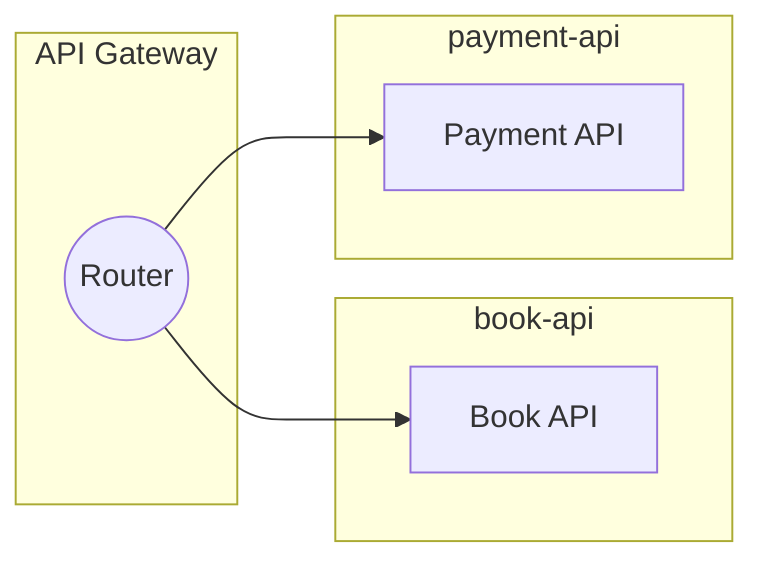
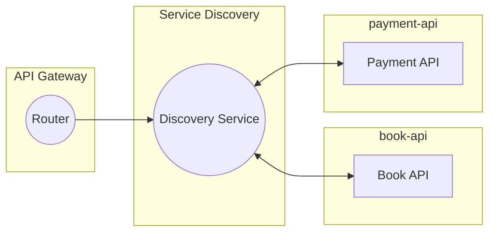

# API 게이트웨이 실습

## 1. 프로젝트 구축

### 루트 프로젝트 만들기

 - `build.gradle`
    - Spring Boot Actuator 의존성 추가
```groovy
plugins {
    id 'java'
    id 'org.springframework.boot' version '3.2.4'
    id 'io.spring.dependency-management' version '1.1.4'
}

group = 'com.fastcampus'
version = '0.0.1-SNAPSHOT'

java {
    sourceCompatibility = '17'
}

repositories {
    mavenCentral()
}

dependencies {
    implementation 'org.springframework.boot:spring-boot-starter'
    implementation 'org.springframework.boot:spring-boot-starter-actuator'
    testImplementation 'org.springframework.boot:spring-boot-starter-test'
}

tasks.named('test') {
    useJUnitPlatform()
}
```
<br/>

 - `application.yml`
```yml
spring:
  application:
    name: api-gatewawy
  cloud:
    gatewway:
      routes:
        - id: payment-api
          uri: http://localhost:9002
          order: 1
          predicates:
            - Path=/payments/** # 특정 경로로 오는 요청을 처리
          filters:
            - RewritePath=/payments/(?<segment>.*),/v1/payments/$\{segment}
        - id: book-api
          uri: http://localhost:9001
          order: 1
          predicates:
            - Path=/books/** # 특정 경로로 오는 요청을 처리
          filters:
            - RewritePath=/books/(?<segment>.*),/v1/books/$\{segment}
```
<br/>

 - `src/main/resources/http/routes.http`
    - 라우트 설정을 테스트한다.
```
GET http://localhost:8080/books/1
```
<br/>

 - `ApiGatewayConfiguration.java`
    - 애플리케이션 외부 설정 파일뿐 아니라, Java 코드로도 API Gateway 설정이 가능하다.
```java
@Configuration
public class ApiGatewayConfiguration {
    @Bean
    public RouteLocator customRouteLocator(RouteLocatorBuilder builder) {
        // http://localhost:8080/fastcampus/search/recommended
        return builder.routes()
                .route(r -> r
                        .path("/fastcampus/**")
                        .filters(f -> f.rewritePath("/fastcampus/(?<segment>.*)", "/.api/www/${segment}"))
                        .uri("https://fastcampus.co.kr/")
                )
                .build();
    }
}
```
<br/>

### api-gateway 모듈 만들기

 - `build.gradle`
    - Reactive Gateway, Spring Reactive Web 의존성 추가
```groovy
plugins {
    id 'java'
    id 'org.springframework.boot' version '3.2.4'
    id 'io.spring.dependency-management' version '1.1.4'
}

group = 'com.fastcampus'
version = '0.0.1-SNAPSHOT'

java {
    sourceCompatibility = '17'
}

repositories {
    mavenCentral()
}

ext {
	set('springCloudVersion', "2023.0.1")
}

dependencies {
    implementation 'org.springframework.boot:spring-boot-starter-webflux'
	implementation 'org.springframework.cloud:spring-cloud-starter-gateway'

	testImplementation 'org.springframework.boot:spring-boot-starter-test'
	testImplementation 'io.projectreactor:reactor-test'
}

dependencyManagement {
	imports {
		mavenBom "org.springframework.cloud:spring-cloud-dependencies:${springCloudVersion}"
	}
}

tasks.named('test') {
    useJUnitPlatform()
}
```
<br/>

### book-api 모듈 만들기

 - `build.gradle`
    - Spring Web 의존성 추가
```groovy
dependencies {
	implementation 'org.springframework.boot:spring-boot-starter-web'
	testImplementation 'org.springframework.boot:spring-boot-starter-test'
}
```
<br/>

 - `application.yml`
```yml
spring:
  application:
    name: book-api

server:
  port: 9001
```
<br/>

 - `BookController`
    - 예제용 호출을 위한 엔드포인트 생성
```java
@RestController
public class BookController {
    @GetMapping("/v1/books/{id}")
    public ResponseEntity getPaymentsInfo(@PathVariable("id") long bookId) {
        return new ResponseEntity<>(
                Map.of(
                        "bookId", bookId,
                        "bookInfo", Map.of("bookName", "testbook"),
                        "timestamp", System.currentTimeMillis()), HttpStatus.OK
        );
    }
}
```
<br/>

### payment-api 모듈 만들기

 - `build.gradle`
    - Spring Web 의존성 추가
<br/>

 - `application.yml`
```yml
spring:
  application:
    name: payment-api

server:
  port: 9000
```
<br/>

 - `PaymentController`
    - 예제용 호출을 위한 엔드포인트 생성
```java
@RestController
public class PaymentController {
    @GetMapping("/v1/payments/{id}")
    public ResponseEntity getPaymentsInfo(@PathVariable("id") long paymentId) {
        return new ResponseEntity<>(
                Map.of(
                        "paymentId", paymentId,
                        "paymentInfo", Map.of("paymentMethod", "CARD"),
                        "timestamp", System.currentTimeMillis()), HttpStatus.OK
        );
    }
}
```
<br/>

### API Gateway 그래프 정리


<br/>

## 2. 서비스 디스커버리 및 라우팅 구현

 - Eureka 서버 설정 및 실행
 - Eureka 클라이언트 설정 및 서비스 등록
 - Gateway와 Eureka 연동을 통한 동적 라우팅 구현



<br/>

### service-discovery 모듈 만들기

 - `build.gradle`
    - Eureka Server 의존성 추가
```groovy
dependencies {
    implementation 'org.springframework.cloud:spring-cloud-starter-netflix-eureka-server'
    testImplementation 'org.springframework.boot:spring-boot-starter-test'
}
```
<br/>

 - `application.yml`
```yml
server:
  port: 8000

spring:
  application:
    name: service-discovery

eureka:
  instance:
    hostname: localhost
  client:
    registerWithEureka: false
    fetchRegistry: false
    serviceUrl:
      defaultZone: http://${eureka.instance.hostname}:${server.port}/eureka/
    region: default

  # Renews Threshold => 분당 heartbeat 수 (기본값 30초) * Instance 수 + Spring 에서 구성하는 최소 Instance 수 (1) * renewal-percent-threshold 값 계산 후 반올림을 한다.
  # ex: 2 * 1 + 1 * 0.85 = 3
  # Renews (last min) => 분당 heartbeat 수 (기본값 30초) * Instance 수
  # ex: 2 * 1 = 2
  server:
    renewal-percent-threshold: 0 # 이 값은 분당 예상 heartbeat 를 계산하는 데 사용
```
<br/>

 - `ServiceDiscoveryApplication`
    - Eureka 서버 설정을 활성화한다.
```java
@SpringBootApplication
@EnableEurekaServer
public class ServiceDiscoveryApplication {

    public static void main(String[] args) {
        SpringApplication.run(ServiceDiscoveryApplication.class, args);
    }

}
```
<br/>

### api-gateway 모듈에 service-discovery 추가

 - `build.gradle`
    - Eureka Client 의존성 추가
```groovy
dependencies {
    implementation 'org.springframework.boot:spring-boot-starter-webflux'
	implementation 'org.springframework.cloud:spring-cloud-starter-gateway'
	testImplementation 'org.springframework.boot:spring-boot-starter-test'
	testImplementation 'io.projectreactor:reactor-test'

	implementation 'org.springframework.cloud:spring-cloud-starter-netflix-eureka-client'
}
```
<br/>

 - `application.yml`
    - Eureka Client 설정을 정의한다.
```yml
eureka:
  client:
    service-url:
      defaultZone: http://localhost:8000/eureka/
    registerWithEureka: true
    fetchRegistry: true
```
<br/>

 - `ApiGatewayApplication`
    - Eureka Client 설정을 활성화한다.
```java
@SpringBootApplication
@EnableDiscoveryClient
public class ApiGatewayApplication {

	public static void main(String[] args) {
		SpringApplication.run(ApiGatewayApplication.class, args);
	}

}
```

### book-api, payment-api 모듈에 service-discovery 추가

 - `build.gradle`
    - Eureka Client 의존성 추가
    - Spring Cloud를 위한 dependencyManagement 설정도 추가한다.
```groovy
dependencies {
    // ..

	implementation 'org.springframework.cloud:spring-cloud-starter-netflix-eureka-client'
}

dependencyManagement {
	imports {
		mavenBom "org.springframework.cloud:spring-cloud-dependencies:${springCloudVersion}"
	}
}
```
<br/>

 - `application.yml`
    - Eureka Client 설정을 정의한다.
```yml
eureka:
  client:
    service-url:
      defaultZone: http://localhost:8000/eureka/
    registerWithEureka: true
    fetchRegistry: true
```
<br/>

 - `XxxApplication`
    - Eureka Client 설정을 활성화한다.
```java
@SpringBootApplication
@EnableDiscoveryClient
public class XxxApplication {

	public static void main(String[] args) {
		SpringApplication.run(ApiGatewayApplication.class, args);
	}

}
```
<br/>

### api-gateway 변경

 - `application.yml`
    - API Gateway에 API 서버 URI 정보를 직접 입력하지 않고, 연결된 서비스 디스커버리에서 API 정보를 가져와서 사용한다.
    - URI를 'lb://애플리케이션이름'으로 등록한다.
```yml
spring:
  application:
    name: api-gatewawy
  cloud:
    gatewway:
      routes:
        - id: payment-api
          uri: lb://payment-api #http://localhost:9002
          order: 1
          predicates:
            - Path=/payments/** # 특정 경로로 오는 요청을 처리
          filters:
            - RewritePath=/payments/(?<segment>.*),/v1/payments/$\{segment}
        - id: book-api
          uri: lb://book-api #http://localhost:9001
          order: 1
          predicates:
            - Path=/books/** # 특정 경로로 오는 요청을 처리
          filters:
            - RewritePath=/books/(?<segment>.*),/v1/books/$\{segment}
```
