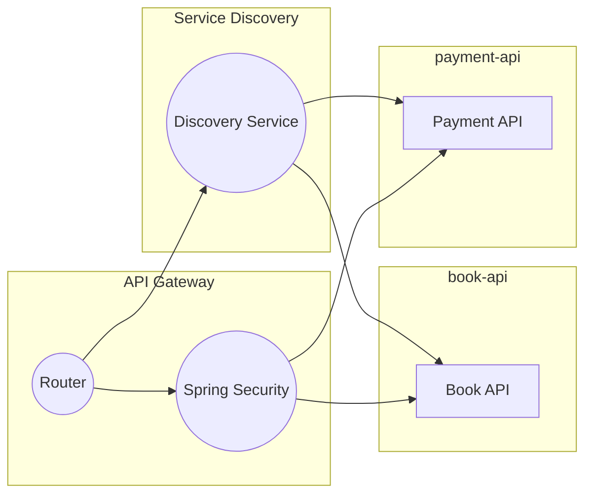

# API 게이트웨이 실습

## 3. Spring Security를 활용한 인증 및 인가 구현

 - 인증 메커니즘 구축
    - Spring Security 의존성 추가
    - 사용자 인증 정보 구성
 - 인가 규칙 설정
    - 역할 기반 접근 제어 구현
    - JWT를 이용한 상태 없는 인증 구현


<br/>

### api-gateway

 - `build.gradle`
    - Spring Security 의존성 추가
    - JWT 토큰을 위한 JJWT 의존성 추가
    - 편의를 위한 Lombok 의존성 추가
```groovy
dependencies {
    // ..

	implementation 'org.springframework.boot:spring-boot-starter-security'
	implementation 'io.jsonwebtoken:jjwt:0.12.5'
	annotationProcessor 'org.projectlombok:lombok'
}
```
<br/>

#### 시큐리티 설정 추가

 - `ReactiveSecurityConfig.java`
    - API Gateway는 WebFlux 기반의 리액티브 게이트웨이를 사용하고 있어, Reactive Security 설정이 필요하다.
```java
import com.fastcampus.apigateway.global.security.JwtReactiveAuthenticationManager;
import com.fastcampus.apigateway.global.security.JwtReactiveSecurityContextRepository;
import com.fastcampus.apigateway.global.security.JwtUtil;
import org.springframework.context.annotation.Bean;
import org.springframework.context.annotation.Configuration;
import org.springframework.security.core.userdetails.*;
import org.springframework.security.crypto.bcrypt.BCryptPasswordEncoder;
import org.springframework.security.crypto.password.PasswordEncoder;

import org.springframework.security.config.annotation.web.reactive.EnableWebFluxSecurity;
import org.springframework.security.config.web.server.ServerHttpSecurity;
import org.springframework.security.web.server.SecurityWebFilterChain;

@Configuration
@EnableWebFluxSecurity
public class ReactiveSecurityConfig {
    @Bean
    public JwtReactiveAuthenticationManager authenticationManager(ReactiveUserDetailsService userDetailsService, PasswordEncoder passwordEncoder) {
        return new JwtReactiveAuthenticationManager(userDetailsService, passwordEncoder);
    }

    @Bean
    public JwtReactiveSecurityContextRepository securityContextRepository(JwtUtil jwtUtil, ReactiveUserDetailsService userDetailsService) {
        return new JwtReactiveSecurityContextRepository(jwtUtil, userDetailsService);
    }

    @Bean
    public SecurityWebFilterChain securityWebFilterChain(ServerHttpSecurity http, JwtUtil jwtUtil, ReactiveUserDetailsService userDetailsService, PasswordEncoder passwordEncoder) {
        http
                .csrf(ServerHttpSecurity.CsrfSpec::disable)
                .formLogin(ServerHttpSecurity.FormLoginSpec::disable)
                .httpBasic(ServerHttpSecurity.HttpBasicSpec::disable)
                .authorizeExchange(exchanges ->
                        exchanges
                                .pathMatchers("/admin/**").hasAuthority("ROLE_ADMIN")
                                .pathMatchers("/login").permitAll()
                                .anyExchange().authenticated()
                )
                .authenticationManager(authenticationManager(userDetailsService, passwordEncoder))
                .securityContextRepository(securityContextRepository(jwtUtil, userDetailsService));
        return http.build();
    }

    // DB 없이 테스트를 위한 계정 설정
    @Bean
    public MapReactiveUserDetailsService userDetailsService() {
        UserDetails user = User
                .withUsername("fast").password(passwordEncoder().encode("campus")).roles("USER")
                .build();
        UserDetails admin = User
                .withUsername("admin").password(passwordEncoder().encode("admin")).roles("ADMIN")
                .build();
        return new MapReactiveUserDetailsService(user, admin);
    }


    @Bean
    public PasswordEncoder passwordEncoder() {
        return new BCryptPasswordEncoder();
    }
}
```
<br/>

#### JWT 관련 인증 매니저와 유틸 클래스 추가

 - `인증 프로세스`
```
1. 로그인 요청
 - 사용자가 로그인 폼을 제출하면 Authentication 객체가 생성됩니다.

2. 인증
 - 이 Authentication 객체는 AuthenticationManager에 의해 처리됩니다.
 - AuthenticationManager는 적절한 AuthenticationProvider를 사용하여 사용자의 자격 증명을 확인합니다.
 - 인증에 성공하면, 인증된 Authentication 객체가 반환됩니다.

3. SecurityContext 설정
 - 인증이 성공하면 SecurityContext에 인증된 Authentication 객체가 설정됩니다.
 - SecurityContextRepository는 이 SecurityContext를 저장합니다.
 - 예를 들어, 세션에 저장하거나 HTTP 응답 헤더에 설정할 수 있습니다.

4. 후속 요청
 - 사용자가 애플리케이션의 다른 부분을 요청할 때, SecurityContextRepository는 현재 요청에 대한 SecurityContext를 로드합니다.
 - 이 SecurityContext는 현재 사용자의 인증 정보를 포함하므로, 애플리케이션은 이를 사용하여 사용자의 권한을 확인하고, 적절한 리소스에 접근할 수 있도록 합니다.
```
<br/>

 - `JwtReactiveAuthenticationManager`
    - AuthenticationManager는 Spring Security의 핵심 인터페이스 중 하나로, 사용자의 인증을 담당합니다. 애플리케이션에서 사용자의 자격 증명을 확인하고, 사용자가 실제로 시스템에 액세스할 수 있는지를 결정하는 역할을 합니다.
        - 인증 처리: Authentication 객체를 받아서 이를 검증하고, 성공 시 인증된 Authentication 객체를 반환합니다. 실패 시 예외를 던집니다.
        - 확장성: 다양한 AuthenticationProvider를 통해 확장 가능하며, 각각의 AuthenticationProvider는 특정한 인증 방식을 처리할 수 있습니다.
```java
import lombok.extern.slf4j.Slf4j;
import org.springframework.security.authentication.BadCredentialsException;
import org.springframework.security.authentication.ReactiveAuthenticationManager;
import org.springframework.security.authentication.UsernamePasswordAuthenticationToken;
import org.springframework.security.core.Authentication;
import org.springframework.security.core.userdetails.ReactiveUserDetailsService;
import org.springframework.security.crypto.password.PasswordEncoder;
import reactor.core.publisher.Mono;

@Slf4j
public class JwtReactiveAuthenticationManager implements ReactiveAuthenticationManager {
    private final ReactiveUserDetailsService userDetailsService;

    private final PasswordEncoder passwordEncoder;

    public JwtReactiveAuthenticationManager(ReactiveUserDetailsService userDetailsService, PasswordEncoder passwordEncoder) {
        this.userDetailsService = userDetailsService;
        this.passwordEncoder = passwordEncoder;
    }

    @Override
    public Mono<Authentication> authenticate(Authentication authentication) {
        return Mono.just(authentication)
                .flatMap(auth -> {
                    // 사용자 이름과 비밀번호로 인증 과정 수행
                    String username = auth.getName();
                    String password = auth.getCredentials().toString();

                    return userDetailsService.findByUsername(username)
                            .filter(userDetails -> passwordEncoder.matches(password, userDetails.getPassword())) // 비밀번호 검증
                            .map(userDetails -> new UsernamePasswordAuthenticationToken(userDetails, null, userDetails.getAuthorities()))
                            .switchIfEmpty(Mono.error(new BadCredentialsException("Invalid Credentials")));
                });
    }
}
```
<br/>

 - `JwtReactiveSecurityContextRepository`
    - SecurityContextRepository는 현재의 SecurityContext를 저장하고 불러오는 역할을 합니다. SecurityContext는 보안과 관련된 모든 정보를 담고 있는 컨테이너로, 현재 인증된 사용자 정보를 포함합니다.
        - 저장: SecurityContext를 HTTP 요청과 연결된 저장소에 저장합니다.
        - 불러오기: HTTP 요청과 관련된 SecurityContext를 로드합니다.
        - 삭제: 요청이 끝나면 SecurityContext를 삭제할 수도 있습니다.
```java
import lombok.extern.slf4j.Slf4j;
import org.springframework.http.HttpHeaders;
import org.springframework.security.authentication.UsernamePasswordAuthenticationToken;
import org.springframework.security.core.context.SecurityContext;
import org.springframework.security.core.context.SecurityContextImpl;
import org.springframework.security.core.userdetails.ReactiveUserDetailsService;
import org.springframework.security.web.server.context.ServerSecurityContextRepository;
import org.springframework.web.server.ServerWebExchange;
import reactor.core.publisher.Mono;

@Slf4j
public class JwtReactiveSecurityContextRepository implements ServerSecurityContextRepository {

    private final JwtUtil jwtUtil;
    private final ReactiveUserDetailsService userDetailsService;

    public JwtReactiveSecurityContextRepository(JwtUtil jwtUtil, ReactiveUserDetailsService userDetailsService) {
        this.jwtUtil = jwtUtil;
        this.userDetailsService = userDetailsService;
    }

    // JWT 인증에서 사용되지 않아 Mono.empty() 반환
    @Override
    public Mono<Void> save(ServerWebExchange exchange, SecurityContext context) {
        return Mono.empty();
    }

    // HTTP 헤더에 정상적으로 JWT 값이 들어왔는지 검증한다.
    @Override
    public Mono<SecurityContext> load(ServerWebExchange exchange) {
        String authHeader = exchange.getRequest().getHeaders().getFirst(HttpHeaders.AUTHORIZATION);

        if (authHeader != null && authHeader.startsWith("Bearer ")) {
            String authToken = authHeader.substring(7);
            try {
                String username = jwtUtil.extractUsername(authToken);

                if (username != null && jwtUtil.validateToken(authToken)) {
                    return userDetailsService.findByUsername(username)
                            .map(userDetails -> new UsernamePasswordAuthenticationToken(userDetails, null, userDetails.getAuthorities()))
                            .map(SecurityContextImpl::new);
                }
            } catch (Exception e) {
                log.error("Authentication Error : ", e);
            }
        }

        return Mono.empty();
    }
}
```
<br/>

 - `JwtUtil`
```java
import io.jsonwebtoken.Claims;
import io.jsonwebtoken.Jwts;
import io.jsonwebtoken.security.Keys;
import org.springframework.beans.factory.annotation.Value;
import org.springframework.stereotype.Component;

import java.nio.charset.StandardCharsets;
import java.util.Date;
import java.util.function.Function;

@Component
public class JwtUtil {

    @Value("${jwt.secret}")
    private String secretKey;

    public String extractUsername(String token) {
        return extractClaim(token, Claims::getSubject);
    }

    public Date extractExpiration(String token) {
        return extractClaim(token, Claims::getExpiration);
    }

    public <T> T extractClaim(String token, Function<Claims, T> claimsResolver) {
        final Claims claims = extractAllClaims(token);
        return claimsResolver.apply(claims);
    }

    private Claims extractAllClaims(String token) {
        return Jwts.parser()
                .verifyWith(Keys.hmacShaKeyFor(secretKey.getBytes(StandardCharsets.UTF_8)))
                .build()
                .parseSignedClaims(token)
                .getPayload();
    }

    private Boolean isTokenExpired(String token) {
        return extractExpiration(token).before(new Date());
    }

    public String generateToken(String name) {
        return Jwts.builder().subject(name)
                .issuedAt(new Date(System.currentTimeMillis()))
                .expiration(new Date(System.currentTimeMillis() + 1000 * 60 * 60 * 10)) // 10시간
                .signWith(Keys.hmacShaKeyFor(secretKey.getBytes(StandardCharsets.UTF_8))).compact();
    }

    public Boolean validateToken(String token) {
       return !isTokenExpired(token);
    }
}
```
<br/>

#### 로그인 요청 엔드포인트 생성

 - `AuthenticationController`
```java
@RestController
public class AuthenticationController {

    private final ReactiveAuthenticationManager authenticationManager;
    private final JwtUtil jwtUtil;

    public AuthenticationController(ReactiveAuthenticationManager authenticationManager, JwtUtil jwtUtil) {
        this.authenticationManager = authenticationManager;
        this.jwtUtil = jwtUtil;
    }

    @PostMapping("/login")
    public Mono<ResponseEntity<AuthResponse>> login(@RequestBody AuthRequest authRequest) {
        Authentication authentication = new UsernamePasswordAuthenticationToken(authRequest.getUsername(), authRequest.getPassword());

        return authenticationManager.authenticate(authentication)
                .map(auth -> {
                    String token = jwtUtil.generateToken(auth.getName());
                    return ResponseEntity.ok(new AuthResponse(token));
                })
                .defaultIfEmpty(ResponseEntity.status(HttpStatus.UNAUTHORIZED).build());
    }

    @Getter
    @Setter
    public static class AuthRequest {
        private String username;
        private String password;
    }

    public record AuthResponse(String token) {
    }
}
```
<br/>

 - `엔드포인트 요청 테스트`
```http
### 로그인
POST http://localhost:8001/login
Content-Type: application/json

{
  "username": "fast",
  "password": "campus"
}

> 

### 결제 정보 조회
GET http://localhost:8080/payments/3
Authorization: Bearer {{authToken}}

### 책 정보 조회
GET http://localhost:8080/books/3
Authorization: Bearer {{authToken}}
```
