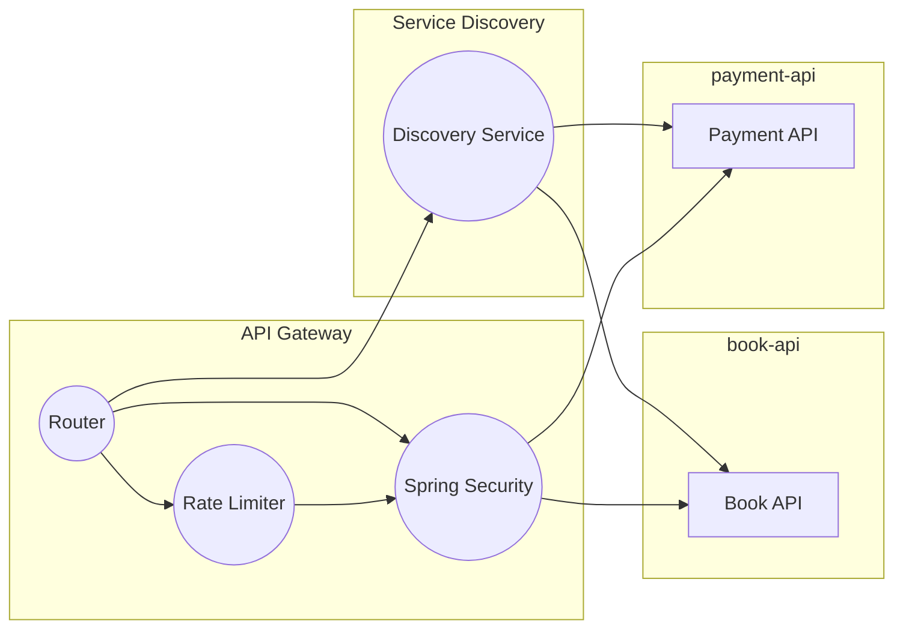
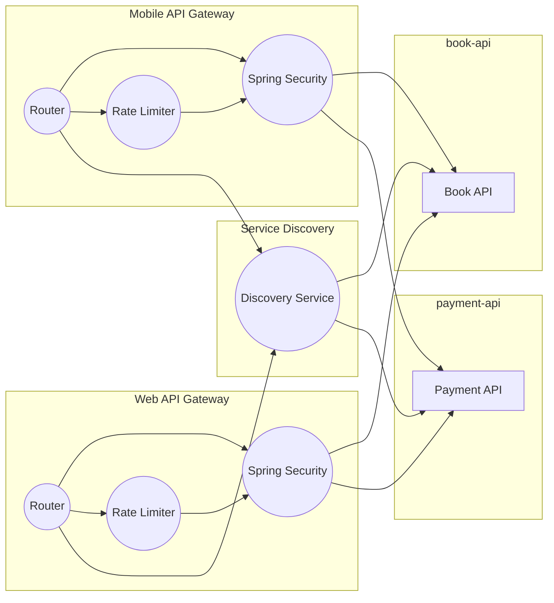

# API 게이트웨이 실습

## 4. Spring Cloud Gateway를 사용한 Rate Limiting 구현

 - Rate Limiter 구성
    - Redis Rate Limiter 설정
    - Rate Limit 필터 구성 및 적용


<br/>

### Spring Cloud Gateway Rate Limiting 설명

Rate Limiting(속도 제한)은 시스템을 보호하고 자원을 효율적으로 사용하기 위해 요청 수를 제어하는 중요한 기능 중 하나입니다.  

Rate Limiting은 특정 기간 동안의 요청 수를 제한하여 서버 과부하를 방지하고, 서비스의 안정성과 성능을 유지하는 기법입니다. 예를 들어, 사용자당 초당 10개의 요청으로 제한할 수 있습니다. 이렇게 하면 악의적인 대량 요청이나 과도한 사용으로부터 시스템을 보호할 수 있습니다.  

Spring Cloud Gateway에서 Rate Limiting은 RequestRateLimiter 필터를 통해 구현됩니다. 이는 주로 Redis를 백엔드 저장소로 사용하여 요청 수를 추적하고 제한합니다. Redis는 빠른 성능과 원자적 연산 지원으로 인해 Rate Limiting을 구현하기에 적합합니다.  
 - __주요 구성 요소__
    - RedisRateLimiter: 기본적으로 제공되는 구현체로, Redis를 사용하여 요청 수를 관리합니다.
    - KeyResolver: 요청을 식별하는 키를 생성하는 인터페이스입니다. IP 주소, 사용자 ID, API 키 등으로 키를 생성할 수 있습니다.
    - Filter: Gateway 필터로, 실제 요청을 처리하기 전에 Rate Limiting 로직을 적용합니다.
```yml
spring:
  redis:
    host: localhost
    port: 6379

spring:
  cloud:
    gateway:
      routes:
      - id: example_route
        uri: http://example.org
        filters:
        - name: RequestRateLimiter
          args:
            redis-rate-limiter.replenishRate: 10 # 초당 10개의 요청을 허용
            redis-rate-limiter.burstCapacity: 20 # 최대 20개의 요청까지 버스트 허용
        predicates:
        - Path=/example/**
```
<br/>

### Rate Limiting 실습

#### Redis Rate Limiter를 사용하기 위한 Redis 환경 설정

 - `docker-compose.yml`
```yml
version: '3'
services:
  redis:
    image: redis:latest
    ports:
      - "6379:6379"
    volumes:
      - redis-data:/data
    command: redis-server --appendonly yes

volumes:
  redis-data:
```
```java
// Key Resolver
// 요청을 식별할 키를 정의해야 합니다. 기본적으로는 PrincipalNameKeyResolver나 RemoteAddrKeyResolver를 사용할 수 있지만, 사용자 정의 키 리졸버도 가능합니다.
@Bean
public KeyResolver userKeyResolver() {
    return exchange -> Mono.just(exchange.getRequest().getRemoteAddress().getHostName());
}

```
<br/>

#### API Gateway에 Redis Rate Limiter 설정

 - `build.gradle`
    - Redis Reactive 의존성 추가
```groovy
dependencies {
	// ..

	implementation 'org.springframework.boot:spring-boot-starter-data-redis-reactive'
}
```
<br/>

 - `RateLimiterConfig`
```java
@Configuration
public class RateLimiterConfig {

    @Bean
    public KeyResolver ipKeyResolver() {
        // 요청을 식별하는 데 사용되는 키를 결정하는 역할
        return exchange -> Mono.just(Objects.requireNonNull(exchange.getRequest().getRemoteAddress()).getAddress().getHostAddress());
    }

/*
    @Bean
    public KeyResolver userIdQueryParamKeyResolver() {
        return exchange -> Mono.just(
                Objects.requireNonNull(
                    exchange.getRequest().getQueryParams().getFirst("userId")
                )
            );
    }
*/
}
```
<br/>

 - `application.yml`
```yml
spring:
  application:
    name: api-gatewawy
  cloud:
    gatewway:
      routes:
        - id: payment-api
          uri: lb://payment-api #http://localhost:9002
          order: 1
          predicates:
            - Path=/payments/** # 특정 경로로 오는 요청을 처리
          filters:
            - RewritePath=/payments/(?<segment>.*),/v1/payments/$\{segment}
        - id: book-api
          uri: lb://book-api #http://localhost:9001
          order: 1
          predicates:
            - Path=/books/** # 특정 경로로 오는 요청을 처리
          filters:
            - name: RequestRateLimiter
              args:
                redis-rate-limiter.replenishRate: 1 # replenishRate는 사용자가 일정 시간 동안(보통 초 단위) 발생시킬 수 있는 요청의 수를 정의
                redis-rate-limiter.burstCapacity: 5 # burstCapacity는 토큰 버킷이 담을 수 있는 최대 토큰의 수를 정의
                key-resolver: "#{@ipKeyResolver}"
            - RewritePath=/books/(?<segment>.*),/v1/books/$\{segment}
```
<br/>

## 5. Spring Cloud Gateway를 활용한 BFF 분리

- BFF를 위한 Gateway 라우트 설정
- BFF를 위한 여러가지 필터 만들어서 적용하기
    - 공통 필터 구현 및 적용 (Logging 등)
    - 모바일 앱을 위한 필터 적용 (Compression 필터 등)
    - 웹을 위한 필터 구현 (Cors 필터 등)

<br/>

### BFF 분리 실습

#### API Gateway의 MLBILE과 WEB API 라우팅 분리

 - `application.yml`
```yml
spring:
  config:
    activate:
      on-profile: mobile
  application:
    name: api-gatewawy-mobile
  cloud:
    gatewway:
      routes:
        - id: payment-api
          uri: lb://payment-api #http://localhost:9002
          order: 1
          predicates:
            - Path=/payments/** # 특정 경로로 오는 요청을 처리
          filters:
            - RewritePath=/payments/(?<segment>.*),/v1/payments/$\{segment}
        - id: book-api
          uri: lb://book-api #http://localhost:9001
          order: 1
          predicates:
            - Path=/books/** # 특정 경로로 오는 요청을 처리
          filters:
            - name: RequestRateLimiter
              args:
                redis-rate-limiter.replenishRate: 1 # replenishRate는 사용자가 일정 시간 동안(보통 초 단위) 발생시킬 수 있는 요청의 수를 정의
                redis-rate-limiter.burstCapacity: 5 # burstCapacity는 토큰 버킷이 담을 수 있는 최대 토큰의 수를 정의
                key-resolver: "#{@ipKeyResolver}"
            - RewritePath=/books/(?<segment>.*),/v1/books/$\{segment}

server:
  port: 8080
  compression:
    enabled: true

---
spring:
  config:
    activate:
      on-profile: web
  application:
    name: api-gatewawy-web
  cloud:
    gatewway:
      routes:
        - id: payment-api
          uri: lb://payment-api #http://localhost:9002
          order: 1
          predicates:
            - Path=/payments/** # 특정 경로로 오는 요청을 처리
          filters:
            - RewritePath=/payments/(?<segment>.*),/v1/payments/$\{segment}
        - id: book-api
          uri: lb://book-api #http://localhost:9001
          order: 1
          predicates:
            - Path=/books/** # 특정 경로로 오는 요청을 처리
          filters:
            - name: RequestRateLimiter
              args:
                redis-rate-limiter.replenishRate: 1 # replenishRate는 사용자가 일정 시간 동안(보통 초 단위) 발생시킬 수 있는 요청의 수를 정의
                redis-rate-limiter.burstCapacity: 5 # burstCapacity는 토큰 버킷이 담을 수 있는 최대 토큰의 수를 정의
                key-resolver: "#{@ipKeyResolver}"
            - RewritePath=/books/(?<segment>.*),/v1/books/$\{segment}

server:
  port: 8081
```
<br/>

#### 로깅 필터 구현(공통 필터)

 - `LoggingFilter`
```java
@Component
@Slf4j
public class LoggingFilter extends AbstractGatewayFilterFactory<LoggingFilter.Config> {

    public LoggingFilter() {
        super(Config.class);
    }

    @Override
    public GatewayFilter apply(Config config) {
        return (exchange, chain) -> {
            // 요청 로깅
            logRequest(exchange);
            
            // 응답 로깅은 응답 처리 후에 실행
            return chain.filter(exchange).then(Mono.fromRunnable(() -> logResponse(exchange)));
        };
    }

    private void logRequest(ServerWebExchange exchange) {
        String requestPath = exchange.getRequest().getPath().toString();
        String httpMethod = exchange.getRequest().getMethod().name();
        log.info("Incoming request {} {} {}", new Date(), httpMethod, requestPath);
    }

    private void logResponse(ServerWebExchange exchange) {
        Integer statusCode = Objects.requireNonNull(exchange.getResponse().getStatusCode()).value();
        log.info("Response with status code {}", statusCode);
    }

    public static class Config {
        // 필터 구성을 위한 설정을 추가
    }
}
```
<br/>

 - `application.yml`
    - 로깅 필터 적용 (default-filters 옵션)
```yml
spring:
  config:
    activate:
      on-profile: mobile
  application:
    name: api-gatewawy-mobile
  cloud:
    gatewway:
      default-filters:
        - name: LoggingFilter
        - name: RequestRateLimiter
            args:
            redis-rate-limiter.replenishRate: 1 # replenishRate는 사용자가 일정 시간 동안(보통 초 단위) 발생시킬 수 있는 요청의 수를 정의
            redis-rate-limiter.burstCapacity: 5 # burstCapacity는 토큰 버킷이 담을 수 있는 최대 토큰의 수를 정의
            key-resolver: "#{@ipKeyResolver}"
      routes:
        # ..
---
spring:
  config:
    activate:
      on-profile: web
  application:
    name: api-gatewawy-web
  cloud:
    gatewway:
      default-filters:
        - name: LoggingFilter
        - name: RequestRateLimiter
            args:
            redis-rate-limiter.replenishRate: 1 # replenishRate는 사용자가 일정 시간 동안(보통 초 단위) 발생시킬 수 있는 요청의 수를 정의
            redis-rate-limiter.burstCapacity: 5 # burstCapacity는 토큰 버킷이 담을 수 있는 최대 토큰의 수를 정의
            key-resolver: "#{@ipKeyResolver}"
      routes:
        # ..
```
<br/>

#### Compression 필터(모바일 앱을 위한 필터 적용)

 - `application.yml`
    - Content-Encoding이 gzip으로 설정된다.
```yml
spring:
  config:
    activate:
      on-profile: mobile
  application:
    name: api-gatewawy-mobile
  cloud:
    gatewway:
    # ..

server:
  port: 8080
  compression:
    enabled: true
```
<br/>

#### Cors 필터(웹을 위한 필터 적용)

 - `application.yml`
```yml
spring:
  config:
    activate:
      on-profile: web
  application:
    name: api-gatewawy-web
  cloud:
    gatewway:
      globalcors:
        cors-configurations:
          '[/**]': # 모든 라우트에 대해 적용
            allowedOrigins: "https://example.com" # 허용할 오리진
            allowedMethods: # 허용할 HTTP 메소드
              - GET
              - POST
            allowedHeaders: # 허용할 헤더
              - Content-Type
              - Authorization
            allowCredentials: true # 인증 허용 여부
            maxAge: 3600 # pre-flight 요청의 캐시 시간(초)
      # ..
```
<br/>

 - `CORS 필터 요청 테스트`
```http
# book 조회
OPTIONS http://localhost:8081/books/3
Authorization: Bearer {{authToken}}
Access-Control-Request-Method: GET
Origin: https://example.com
```
