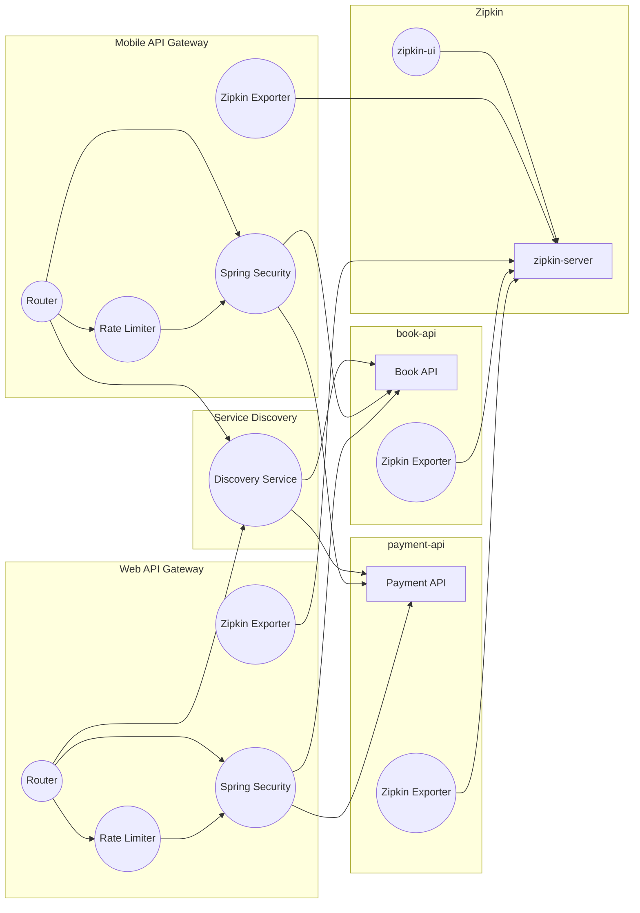
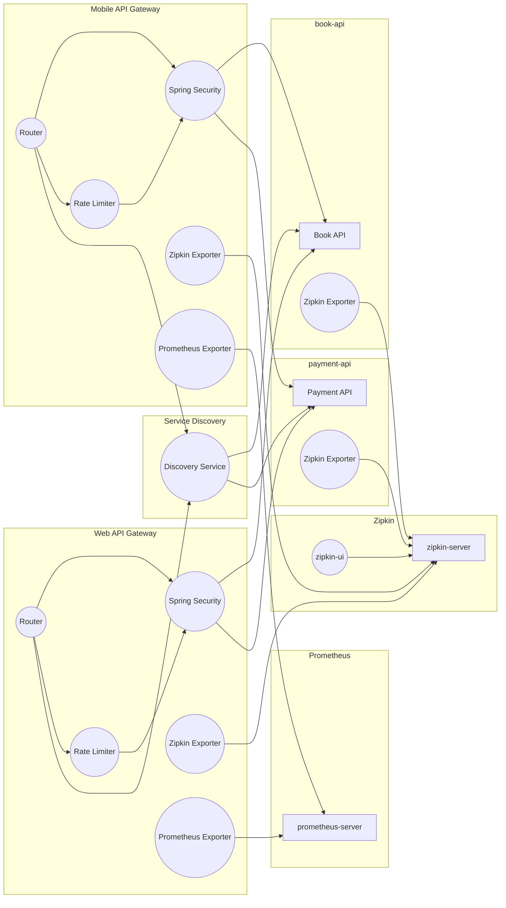
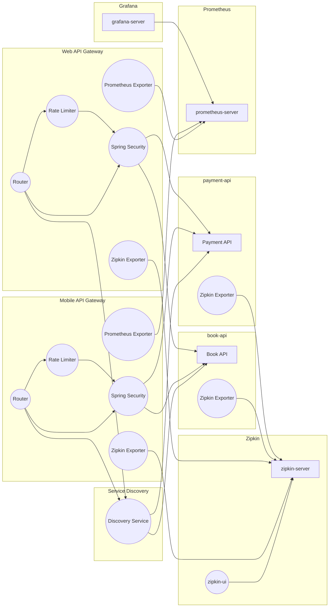

# API 게이트웨이 실습

## 6. Zipkin을 사용한 분산 로깅 구현

Spring Boot 3.x 부터 Sleuth가 deprecated되어 Micrometer Log Tracing을 통해서 분산 추적 기능을 구현한다.  

 - Sleuth와 Zipkin의 기본 설정
 - 로깅 데이터 수집
 - Zipkin 서버를 이용한 추적 데이터 시각화


<br/>

### Zipkin 실습

#### Zipkin Server 환경 설정

 - `docker-compose.yml`
```yml
version: '3'
networks:
  front-tier:
  back-tier:
    driver: bridge

services:
  redis:
    image: redis:latest
    ports:
      - "6379:6379"
    volumes:
      - redis-data:/data
    command: redis-server --appendonly yes
  zipkin:
    image: ghcr.io/openzipkin/zipkin-slim:${TAG:-latest}
    container_name: zipkin
    environment:
      - STORAGE_TYPE=mem
    ports:
      - 9411:9411

volumes:
  redis-data:
```
<br/>

#### Zipkin을 이용하기 위한 설정

각 컴포넌트에서 Zipkin 서버로 Metrics를 전송하기 위한 설정을 추가한다.  
api-gateway, book-api, payment-api 모듈에 Zipkin 관련 의존성을 추가한다.  

<br/>

 - `build.gradle`
    - Spring Boot 2.x: 'spring-cloud-starter-sleuth' 의존성을 추가한다.
    - Spring Boot 3.x: 'micrometer-tracing-bridge-brave', 'zipkin-reporter-brave' 의존성을 추가한다.
    - 공통적으로 'spring-boot-starter-actuator' 의존성을 추가한다.
```groovy
dependencies {
    // ..

	// springboot 3 부터 deprecated
	// implementation 'org.springframework.cloud:spring-cloud-starter-sleuth'
	implementation 'io.micrometer:micrometer-tracing-bridge-brave'
	implementation 'io.zipkin.reporter2:zipkin-reporter-brave'
    implementation 'org.springframework.boot:spring-boot-starter-actuator'
}
```
<br/>

 - `application.yml`
    - sampling.probability: 1.0은 모든 요청을 샘플링
```yml
management:
  tracing:
    sampling:
      probability: 1.0
    propagation:
      consume: b3
      produce: b3_multi
  zipkin:
    tracing:
      endpoint: "http://localhost:9411/api/v2/spans"
```
<br/>

## 7. Gateway와 Prometheus 연동

 - Prometheus 설정 및 메트릭 수집
    - Spring Boot 애플리케이션에 Prometheus 메트릭스 익스포트
    - Prometheus 서버 구성 및 실행

<br/>

### Prometheus 실습

#### Prometheus 서버 환경 구성

 - `docker-compose.yml`
    - Alertmanager: Prometheus 모니터링 시스템과 함께 사용되는 경고 관리 도구
        - 경고 집계: Prometheus로부터 받은 경고를 집계하여 중복된 경고를 하나로 묶습니다.
        - 경고 라우팅: 경고를 수신하고, 사전에 정의된 라우팅 규칙에 따라 적절한 수신자에게 전달합니다.
        - 경고 억제: 일정 조건을 만족하는 경고를 억제하여 특정 상황에서 발생하는 불필요한 경고를 피할 수 있습니다.
        - 경고 통합: 이메일, Slack, PagerDuty 등 다양한 통합 옵션을 통해 경고를 전송합니다.
    - Node Exporter: 시스템의 하드웨어 및 운영 체제 메트릭을 수집
        - 메트릭 수집: CPU 사용량, 메모리 사용량, 디스크 I/O, 네트워크 통계 등 다양한 시스템        - 메트릭을 수집합니다.
        - 다양한 플랫폼 지원: 리눅스, 윈도우, macOS 등 다양한 운영 체제에서 사용할 수         - 있습니다.
        - 프로메테우스 통합: Prometheus 서버가 수집된 메트릭을 스크랩할 수 있도록 지원합니다.
    - cAdvisor: 컨테이너 성능 분석 도구로, 주로 Docker 컨테이너의 리소스 사용량을 모니터링
        - 컨테이너 리소스 모니터링: CPU, 메모리, 디스크 I/O, 네트워크 사용량 등 컨테이너의 리소스 사용량을 모니터링합니다.
        - 실시간 메트릭 수집: 컨테이너의 성능 메트릭을 실시간으로 수집하고, 이를 Prometheus와 같은 시스템에 제공하여 모니터링할 수 있도록 합니다.
        - 다양한 컨테이너 런타임 지원: Docker를 포함하여 다양한 컨테이너 런타임을 지원합니다.
```yml
version: '3'
networks:
  front-tier:
  back-tier:
    driver: bridge

services:
  # Redis, Zipkin 서버 설정 ..

  prometheus:
    image: prom/prometheus:latest
    volumes:
      - ./prometheus/:/etc/prometheus/
      - prometheus_data:/prometheus
    command:
      - '--config.file=/etc/prometheus/prometheus.yml'
      - '--storage.tsdb.path=/prometheus'
      - '--web.console.libraries=/usr/share/prometheus/console_libraries'
      - '--web.console.templates=/usr/share/prometheus/consoles'
    ports:
      - 9090:9090
    links:
      - cadvisor:cadvisor
      - alertmanager:alertmanager
    #      - pushgateway:pushgateway
    depends_on:
      - cadvisor
    #      - pushgateway
    networks:
      - back-tier
    restart: always
  alertmanager:
    image: prom/alertmanager
    ports:
      - 9093:9093
    volumes:
      - ./alertmanager/:/etc/alertmanager/
    networks:
      - back-tier
    restart: always
    command:
      - '--config.file=/etc/alertmanager/config.yml'
      - '--storage.path=/alertmanager'
  node-exporter:
    image: quay.io/prometheus/node-exporter:latest
    volumes:
      - /proc:/host/proc:ro
      - /sys:/host/sys:ro
      - /:/rootfs:ro
      - /:/host:ro,rslave
    command:
      - '--path.rootfs=/host'
      - '--path.procfs=/host/proc'
      - '--path.sysfs=/host/sys'
      - --collector.filesystem.ignored-mount-points
      - "^/(sys|proc|dev|host|etc|rootfs/var/lib/docker/containers|rootfs/var/lib/docker/overlay2|rootfs/run/docker/netns|rootfs/var/lib/docker/aufs)($$|/)"
    ports:
      - 9100:9100
    networks:
      - back-tier
    restart: always
    deploy:
      mode: global
  cadvisor:
    image: gcr.io/cadvisor/cadvisor:v0.45.0
    container_name: cadvisor
    privileged: true
    devices:
      - /dev/kmsg:/dev/kmsg
    volumes:
      - /var/run:/var/run:ro
      - /sys:/sys:ro
      - /var/lib/docker/:/var/lib/docker:ro
      - /var/run/docker.sock:/var/run/docker.sock:ro
      - /etc/machine-id:/etc/machine-id:ro
      - /var/lib/dbus/machine-id:/var/lib/dbus/machine-id:ro
    restart: unless-stopped
    expose:
      - 8080
    networks:
      - back-tier
    labels:
      org.label-schema.group: "monitoring"
volumes:
  redis-data:
  prometheus_data: { }
```
<br/>

 - `alertmanager/config.yml`
```yml
route:
  receiver: 'slack'

receivers:
  - name: 'slack'
#       slack_configs:
#           - send_resolved: true
#             username: '<username>'
#             channel: '#<channel-name>'
#             api_url: '<incomming-webhook-url>'
```
<br/>

 - `prometheus/alert.rules`
```rules
groups:
- name: example
  rules:

  # Alert for any instance that is unreachable for >2 minutes.
  - alert: service_down
    expr: up == 0
    for: 2m
    labels:
      severity: page
    annotations:
      summary: "Instance {{ $labels.instance }} down"
      description: "{{ $labels.instance }} of job {{ $labels.job }} has been down for more than 2 minutes."

  - alert: high_load
    expr: node_load1 > 0.5
    for: 2m
    labels:
      severity: page
    annotations:
      summary: "Instance {{ $labels.instance }} under high load"
      description: "{{ $labels.instance }} of job {{ $labels.job }} is under high load."
```
<br/>

 - `prometheus/prometheus.yml`
```yml
global:
  scrape_interval:     15s # By default, scrape targets every 15 seconds.
  evaluation_interval: 15s # By default, scrape targets every 15 seconds.
  external_labels:
    monitor: 'my-project'

rule_files:
  - 'alert.rules'
  # - "first.rules"
  # - "second.rules"

alerting:
  alertmanagers:
    - scheme: http
      static_configs:
        - targets:
            - "alertmanager:9093"

scrape_configs:

  - job_name: 'prometheus'
    scrape_interval: 15s
    static_configs:
      - targets: ['localhost:9090']

  - job_name: 'cadvisor'
    scrape_interval: 15s
    static_configs:
      - targets: ['cadvisor:8080']

  - job_name: 'node-exporter'
    scrape_interval: 15s
    static_configs:
      - targets: ['node-exporter:9100']

  - job_name: 'api-gateway-mobile'
    metrics_path: '/actuator/prometheus'
    static_configs:
      - targets: [ 'host.docker.internal:8001' ]

  - job_name: 'api-gateway-web'
    metrics_path: '/actuator/prometheus'
    static_configs:
      - targets: [ 'host.docker.internal:8002' ]
```
<br/>

#### API Gateway에 Prometheus 설정

 - `build.gradle`
```groovy
dependencies {
  // ..

	implementation 'io.micrometer:micrometer-tracing-bridge-brave'
	implementation 'io.zipkin.reporter2:zipkin-reporter-brave'

	implementation 'io.micrometer:micrometer-registry-prometheus'
	implementation 'io.micrometer:micrometer-core'
}
```
<br/>

 - `application.yml`
    - Prometheus에 노출할 엔드포인트 설정
    - '{URL}/actuator/info', '{URL}/actuator/health' 등으로 URL 요청을 해본다.
```yml
management:
  tracing:
    sampling:
      probability: 1.0
    propagation:
      consume: b3
      produce: b3_multi
  zipkin:
    tracing:
      endpoint: "http://localhost:9411/api/v2/spans"
  endpoints:
    web:
      exposure:
        include:
          - info
          - health
          - loggers
          - mappings
          - metrics
          - shutdown
          - prometheus
```
<br/>

## 8. Grafana 연동 및 간단한 대시보드 구축

- Grafana 설정 및 대시보드 구축
    - Grafana 설치 및 설정
    - Prometheus 데이터 소스 연동
    - 간단한 대시보드 생성 및 커스터마이징

<br/>

### Grafana 실습

#### Grafana 환경 설정

 - `docker-compose.yml`
```yml
version: '3'
networks:
  front-tier:
  back-tier:
    driver: bridge

services:
  # ..
  grafana:
    image: grafana/grafana
    user: "472"
    depends_on:
      - prometheus
    ports:
      - 3000:3000
    volumes:
      - grafana_data:/var/lib/grafana
      - ./grafana/provisioning/:/etc/grafana/provisioning/
    env_file:
      - ./grafana/config.monitoring
    networks:
      - back-tier
      - front-tier
    restart: always
volumes:
  redis-data:
  prometheus_data: { }
  grafana_data: { }
```
<br/>

 - `grafana/config.monitoring`
    - 기본 ID와 PW: admin/admin
```monitoring
GF_SECURITY_ADMIN_PASSWORD=admin
GF_USERS_ALLOW_SIGN_UP=false
```
<br/>

 - `프로메테우스 어드민 접속`
```
1. Connections에 Data Sources 등록
 - Prometheus 데이터 소스 등록

2. 대시보드 등록(Import dashboard)
 - https://grafana.com/grafana/dashboards/
```

