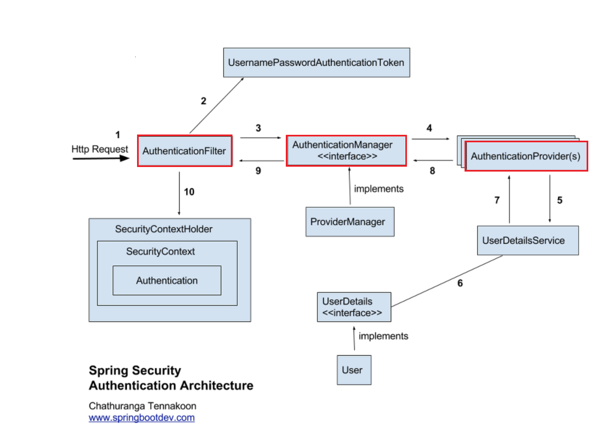
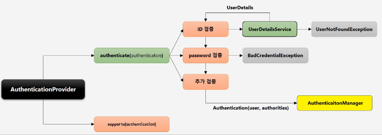

# 스프링 시큐리티 개념

 - 참고
    - https://assu10.github.io/dev/2023/11/25/springsecurity-authrorization-1/
    - https://gregor77.github.io/2021/05/18/spring-security-03/

<div align="center">
    
</div>
<br/>

 - `스프링 시큐리티 흐름`
    - AuthenticationManager
        - __전체 인증 프로세스를 관리하는 인터페이스__
        - 인증을 처리하는 주요 인터페이스
        - 사용자의 자격 증명을 확인하고 유효한 인증 객체를 반환
    - AuthenticationProvider
        - __특정 인증 논리를 구현하는 인터페이스__
        - AuthenticationManager는 실제 인증 작업을 AuthenticationProvider에 위임한다.
        - 예시: DaoAuthenticationProvider는 데이터베이스에서 사용자 정보를 조회하여 인증하는 데 사용된다.
    - UserDetailsService
        - __사용자 정보를 로드하는 데 사용되는 인터페이스__
        - 사용자 이름을 통해 사용자의 세부 정보를 로드하는 역할을 한다.
        - AuthenticationProvider는 UserDetailsService를 이용해 사용자 정보를 로드한다. 즉, 해당 인터페이스를 구현하여 사용자 정보를 데이터베이스, LDAP, 메모리 등에서 로드한다.
    - AuthenticationManager는 하나 이상의 AuthenticationProvider를 통해 실제 인증 작업을 수행하고, UserDetailsService는 사용자 세부 정보를 로드하여 인증 프로세스를 지원한다.
```
사용자 로그인 요청 -> AuthenticationFilter -> AuthenticationManager(ProviderManager) -> AuthenticationProvider(s)

1. 사용자 로그인 요청
2. AuthenticationFilter 동작
3. AuthenticationManager 인터페이스 동작
 - ProviderManager는 AuthenticationManager의 구현체
 - AuthenticationProvider 목록을 순회하여 적절한 Provider로 인증 진행
4. AuthenticationProvider 인터페이스 동작
 - UserDetailsService를 통해 사용자 정보를 조회
 - 조회한 사용자 정보로 유효성 검증
 - 유효하지 않거나 사용자 정보가 없으면 AuthenticationException 예외 발생
 - 유효한 사용자면 인증 객체(Aautnentication) 반환
```
<br/>

<div align="center">
    
</div>
<br/>

## UserDetailsService

UserDetailsService는 DaoAuthenticationProvider와 협력하는 인터페이스이다.  
DaoAuthenticationProvider는 요청받은 유저의 ID, Password와 저장된 ID, Password의 검증하는 책임을 갖고 있다.  

<br/>

클라이언트가 사용자 정보(ID, Password)를 입력하여 로그인 요청을 보내면, Authentication 객체가 생성된다.  
요청받은 Authentication 객체는 AuthenticationManager에 의해 처리가 되며, AuthenticationManager는 적절한 AuthenticationProvider를 사용하여 사용자의 자격 증명을 확인하게 된다.  

 - `UserDetailsService 인터페이스`
    - loadUserByUsername(): 파라미터로 username(사용자를 식별하기 위한 ID, PK)를 받고, 리턴값으로 UserDetails를 반환한다.
    - AuthenticationProvider 내부에서 UserDetailsService의 loadUserByUsername()을 호출하여 사용자 정보를 로드하고, 그 정보를 사용하여 사용자 인증을 수행한다.
```java
public interface UserDetailsService {

	UserDetails loadUserByUsername(String username) throws UsernameNotFoundException;

}
```
<br/>

## AuthenticationProvider

 - `AuthenticationProvider 인터페이스`
    - authenticate(): 인증 논리를 구현한다.
        - 인증이 실패한 경우 AuthenticationException 예외를 발생시킨다.
        - 현재 AuthenticationProvider에서 지원하지 않는 인증 객체를 받으면 NULL을 반환한다.
    - supports(): 현재 AuthenticationProvider가 Authentication 객체 형식을 지원하면 true를 반환한다.
        - supports()에서 true를 반환해도, authenticate() 메서드에서 NULL을 반환하면 요청이 거부된다.
    - AuthenticationManager는 사용 가능한 AuthenticationProvider 중 하나로 인증을 위임한다.
    - AuthenticationProvider는 주어진 인증 유형을 지원하지 않거나, 객체 유형은 지원하지만 해당 특정 객체를 인증하는 방법을 모르면 인증을 거부한다.
    - 인증을 평가한 후 해당 결과를 AuthenticationProvider가 AuthenticationManager에게 응답한다.
```java
public interface AuthenticationProvider {
  Authentication authenticate(Authentication authentication) throws AuthenticationException;

  boolean supports(Class<?> authentication);
}
```
<br/>

### CustomAuthenticationProvider

 - `CustomAuthenticationProvider`
```java
@Component
public class CustomAuthenticationProvider implements AuthenticationProvider {
    private final CustomUserDetailsService userDetailsService;
    private final SamplePasswordEncoder passwordEncoder;

    public CustomAuthenticationProvider(CustomUserDetailsService userDetailsService, SamplePasswordEncoder passwordEncoder) {
        this.userDetailsService = userDetailsService;
        this.passwordEncoder = passwordEncoder;
    }

    @Override
    public Authentication authenticate(Authentication authentication) throws AuthenticationException {
        String username = authentication.getName();
        String password = (String) authentication.getCredentials();

        // 1. username을 통해 사용자 정보 조회
        UserDetails user = userDetailsService.loadUserByUsername(username);
        if (user == null) {
            throw new BadCredentialsException("username is not found. username=" + username);
        }

        if (!this.passwordEncoder.matches(password, user.getPassword())) {
            throw new BadCredentialsException("password is not matched");
        }

        return new CustomAuthenticationToken(username, password, user.getAuthorities());
    }

    @Override
    public boolean supports(Class<?> authentication) {
        return CustomAuthenticationToken.class.isAssignableFrom(authentication);
    }
}
```
<br/>

 - `CustomAuthenticationToken`
    - Spring Security에서 기본적으로 AnonymousAuthenticationToken, UsernamePasswordAuthenticationToken 등 토큰을 제공한다.
    - Spring Security에서 제공하는 토큰 외에 추가적인 필드를 가지고 싶은 경우 별도의 토큰을 생성한다.
```java
public class CustomAuthenticationToken extends AbstractAuthenticationToken {
    private String email;
    private String credentials;

    public CustomAuthenticationToken(String email, String credentials, Collection<? extends GrantedAuthority> authorities) {
        super(authorities);
        this.email = email;
        this.credentials = credentials;
    }

    public CustomAuthenticationToken(Collection<? extends GrantedAuthority> authorities) {
        super(authorities);
    }

    @Override
    public Object getCredentials() {
        return this.credentials;
    }

    @Override
    public Object getPrincipal() {
        return this.email;
    }
}
```

