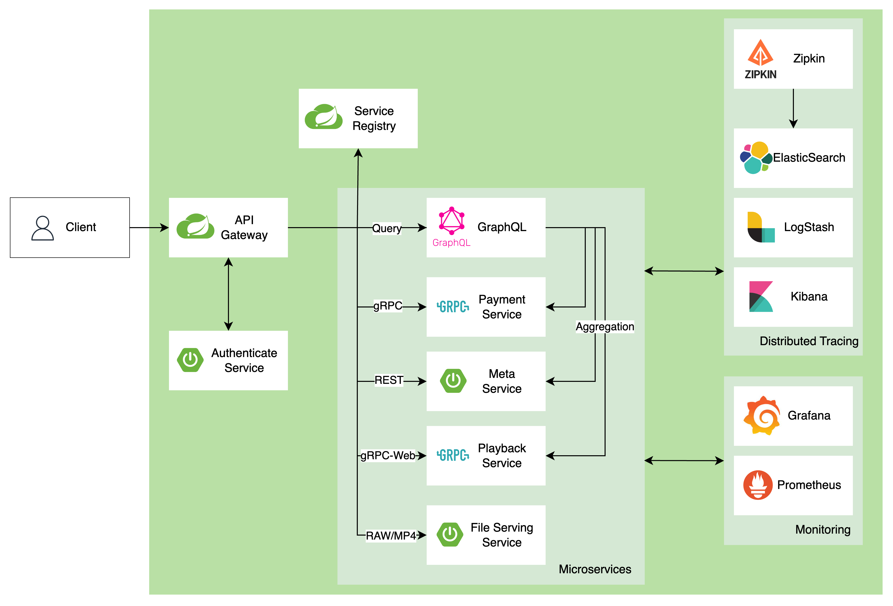

# 프로젝트 개요

## 요구사항 분석 및 기능 명세

 - 사용자 및 인증 관리 서비스
    - 사용자 등록 및 관리
        - 사용자가 시스템에 가입할 수 있어야 하며, 이름, 이메일 주소, 비밀번호를 입력하여 등록할 수 있다.
        - 사용자는 자신의 프로필 정보를 업데이트할 수 있다.
        - 시스템은 사용자의 로그인 및 로그아웃 기록을 관리한다.
    - 비밀번호 관리
        - 사용자는 비밀번호를 재설정할 수 있다.
        - 비밀번호 저장 시 안전한 해싱 알고리즘을 사용하여 저장한다.
 - 강의 관리 서비스
    - 강의 생성 및 관리
        - 관리자는 새 강의를 생성하고, 강의 제목, 설명, 강사 정보를 입력할 수 있다.
        - 강의 정보는 언제든지 업데이트할 수 있다.
    - 세션 관리
        - 각 강의에 대해 하나 이상의 세션을 추가할 수 있다.
        - 세션 정보에는 제목, 비디오 URL, 세션의 지속 시간이 포함된다.
    - 강의 평가
        - 사용자는 강의를 평가할 수 있으며, 평점과 코멘트를 남길 수 있다.
        - 시스템은 모든 사용자 평가를 수집하고 평균 평점을 계산해야 한다.
 - 등록 서비스
    - 강의 등록
        - 사용자는 특정 강의에 등록할 수 있으며, 등록 과정에서는 등록 날짜가 기록된다.
        - 사용자는 등록한 강의에 대한 액세스 권한을 가진다.
    - 구독 관리
        - 사용자는 강의 콘텐츠에 대한 구독을 구매할 수 있어야 하며, 구독 기간 동안 무제한으로 콘텐츠를 이용할 수 있다.
        - 구독의 유효 기간은 시스템에 의해 관리되며, 만료 시 자동으로 갱신 또는 만료 알림이 발생한다.
 - 컨텐츠 파일 관리 서비스
    - 파일 저장 및 관리
        - 강의 세션에 필요한 모든 파일은 시스템에 저장되어야 한다.
        - 파일은 세션별로 구분되며, 파일 유형과 경로가 구분되어야 한다.
 - 재생 서비스
    - 재생 세션 추적
        - 사용자가 강의를 시청할 대 시간과 종료 시간을 기록해야 한다.
        - 재생 데이터는 사용자의 학습 패턴 분석과 콘텐츠 이용도 평가에 사용된다.
    - 이벤트 로깅
        - 강의 재생 중 발생하는 모든 이벤트(재생, 일시 정지, 정지)는 시스템에 로그로 기록되어야 한다.
        - 이벤트 로그는 사용자의 상호 작용을 분석하고, 시스템 개선을 위한 인사이트를 제공하는 데 사용된다.

## 개발/운영/배포를 위한 요구사항 명세

### API Gateway 구성

 - API Gateway 라우팅 설정 및 테스트
    - 모든 서비스 호출은 API Gateway를 통해 라우팅되어야 하며, 라우팅 규칙은 정확하고 효율적으로 설정되어야 한다.
 - API Gateway와 JWT 인증 서버와의 연동
    - API Gateway는 JWT 인증 서버와 통합되어 모든 요청의 인증과 권한 부여를 관리할 수 있어야 한다.
 - API Gateway의 부하 분산 및 서킷 브레이커 설정
    - 고가용성을 위해 API Gateway는 부하 분산 기능을 제공해야 한다.
    - 서킷 브레이커 패턴을 구현하여 시스템 오류 또는 과부하 시 자동으로 회복할 수 있어야 한다.
 - API Gateway 캐싱 설정 및 성능 최적화
    - 자주 요청되는 데이터에 대해 캐싱을 구현하여 API 응답 시간을 최소화해야 한다.
    - 캐싱 전략은 시스템의 전반적인 성능을 최적화하는 방향으로 구성되어야 한다.
 
 ### Service Discovery

  - Eureka 기반 Service Discovery 구축
    - Eureka 서버 설정: 모든 마이크로서비스가 서로를 발견하고 통신할 수 있도록 Eureka 서버를 구성한다. Eureka는 서비스 레지스트리로 작동하며 각 마이크로서비스의 위치와 상태 정보를 중앙에서 관리한다.
    - 클라이언트 등록 및 발견: 각 마이크로서비스는 시작 시 Eureka에 자신을 등록하고, 필요한 다른 서비스를 찾기 위해 Eureka의 레지스트리를 조회한다.
    - 로드 밸런싱과 장애 대응: Eureka를 사용함으로써 클라이언트는 가용한 서비스 인스턴스 중 하나를 선택할 수 있으며, 실패한 인스턴스를 자동으로 감지하고 회피한다.

### 모니터링 및 로깅

 - 로깅 및 모니터링 도구 및 라이브러리 도입 및 설정
    - 모든 서비스는 효과적인 로깅 및 모니터링을 위해 적절한 도구와 라이브러리를 사용해야 한다.
    - 로그는 오류 추적, 사용자 행동 분석, 성능 모니터링에 활용되어야 한다.
 - 모니터링 대시보드 구축 및 사용
    - 운영 팀은 실시간으로 시스템 상태를 모니터링할 수 있는 대시보드를 구축해야 한다.
    - 대시보드는 시스템의 주요 지표를 포괄적으로 보여줄 수 있어야 하며, 문제 발생 시 빠른 진단과 대응이 가능해야 한다.

### 배포 및 컨테이너화

 - Docker 이미지 빌드 및 컨테이너 배포 설정
    - 각 마이크로서비스는 Docker 이미지로 빌드되어야 하며, 컨테이너로 배포되어야 한다.
    - 이미지 및 컨테이너 배포 과정은 자동화되어야 하며, 일관성 있는 환경에서 테스트되어야 한다.
 - Kubernetes 클러스터 설정 및 Helm Chart 작성
    - 서비스는 Kubernetes 클러스터에서 관리되어야 하며, Helm 차트를 사용하여 배포를 간소화해야 한다.

### API 문서화 및 검토

 - API 문서화 도구 도입 및 API 문서 작성
    - 모든 API는 문서화되어야 하며, 개발자가 쉽게 이해할 수 있도록 구성되어야 한다.
    - 문서화는 API 사용에 대한 가이드라인과 예제를 포함해야 한다.
 - 전체 프로젝트 검토
    - 프로젝트의 모든 부분은 출시 전에 철저히 검토되어야 하며, 성능, 보안, 사용성 등의 측면에서 최정 점검을 받아야 한다.

## MSA 아키텍처 설계 및 컴포넌트 정의

    

 

### 서비스 간 통신 방법

 - 통신 방법
    - 서비스 간 통신 방법으로 RESTful API, gRPC 사용
    - 해당 프로젝트에서는 Event-Driven Architecture는 도입하지 않고 전체 적인 GraphQL, gRPC, RESTful API 의 통신 방법 위주로 개발 예정
 - API Gateway 역할
    - 모든 API 진입점, 로그인/JWT 인증 담당
    - Public API/Internal API 관리
        - 외부 API: Authentication, GraphQL, File Serving Service
        - 로그인과 파일 재생을 제외한 모든 통신은 Graph QL을 통해서 이루어 짐
    - 모니터링 및 보안
        - pROMETHEUS로 각 컴포넌트의 Metrics 수집, Grafana 대시보드를 통해 컴포넌트 Metrics 시각화
        - Zipkin을 통해 각 컴포넌트의 트랜잭션 데이터 수집 후 ES에 저장
        - Kibana를 통해서 요청 데이터 시각화

### Database per Service 패턴

 - https://microservices.io/patterns/data/database-per-service.html
 - 컴포넌트 DB는 MySQL 사용, 논리 DB로 분리 사용
 - 논리적 데이터베이스 분리: 각 서비스가 독립적으로 관리하는 데이터베이스는 물리적으로는 같은 데이터베이스 클러스터 내에 존재할 수 있지만, 논리적으로는 완전히 분리
 - 데이터베이스 선택: 각 서비스의 특성에 맞는 데이터베이스를 선택 필요하지만, 해당 프로젝트에서는 MySQL을 메인 DB로 사용

### 각 서비스 컴포넌트 정의

 - GraphQL 서비스
    - 여러 컴포넌트의 데이터를 Aggregation 하는 역할
 - 사용자 관리 서비스
    - 사용자 인증 및 프로필 관리
 - 강의 관리 서비스
    - 강의 및 세션 정보 관리
    - 강의 평가 관리
 - 강의 등록/권한 서비스
    - 사용자가 구매한 강의, 이용권 권한 정보 관리
 - 컨텐츠 파일 관리 서비스
    - 강의 컨텐츠 파일 관리
 - 재생 서비스
    - 사용자의 강의 재생 세션 및 이벤트 추적

