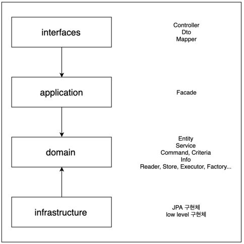
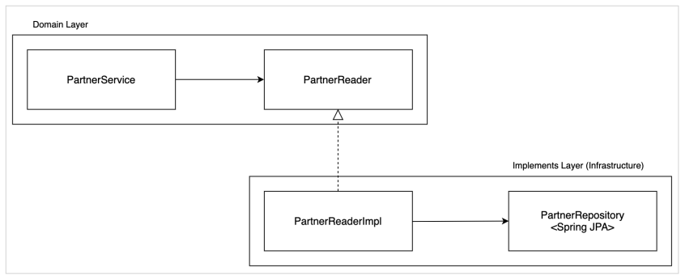

# 프로젝트 구조 및 설계

## 좋은 구현

 - __비즈니스 가치를 명확히 충족시켜야 한다.__
    -  기술 조직은 회사의 비즈니스 지표에 다라 평가되어야 한다.
    - 유저의 경험과 회사의 목표보다는 본인이 사용하게 될 기술 스택에 대한 관심만 높은 것은 좋지 않다. 기술은 도구일 뿐 도구에 익숙해지고 좀더 좋은 도구를 찾는 근원적인 이유도 비즈니스 목표 달성을 위한 것이어야 한다.
 - __잘 읽혀야 한다.__
    - 개발 업무에 대해서 코드 읽기와 쓰기로 분류한다면, 코드를 읽는 비중이 훨씬 더 높다.
    - 도메인 로직을 설명하는 별도의 문서보다는 코드 자체로 도메인을 파악할 수 있어야 한다.
 - __테스트 코드 작성이 쉬워야 한다.__
    - 테스트 코드는 지속적인 기능 런칭과 리팩토링을 가능하게 해주는 안전장치이다.
    - 코드간의 의존성이 많다면 그만큼 테스트 코드 작성이 어렵다.
 - __변경에 유연해야 한다.__
    - 요구 사항은 언제든지 추가되거나 바뀔 수 있다. 떄문에, 코드 구현과 설계는 요구사항 변경에 유연하도록 작성되어야 한다.
    - 이를 위한 객체지향 설계 원칙이 존재한다.
        - 단일 책임 원칙(SRP), 개방 폐쇄 원칙(OCP), 리스코프 치환 원칙(LSP), 의존 관계 역전 원칙(DIP), 인터페이스 분리 원칙(ISP)

<br/>

## 진행할 프로젝트 Layer 구조

레이어간의 참조 관계에서는 단방향 의존을 유지하고 계층간 호출에서는 인터페이스를 통한 호출이 되도록 한다.  

 - __사용자 인터페이스(interfaces)__
    - 사용자에게 정보를 보여주고 사용자의 명령을 해석하는 책임을 진다.
    - Controller, Dto, Mapper
 - __응용 계층(application)__
    - 수행할 작업을 정의하고 표현력 있는 도메인 객체가 문제를 해결하게 한다. 이 계층에서 책임지는 작업은 업무상 중요하거나 다른 시스템의 응용 계층과 상호 작용하는 데 필요한 것들이다. 이 계층은 얇게 유지되고, 오직 작업을 조정하고 아래에 위치한 계층에 포함된 도메인 객체의 협력자에게 작업을 위임한다.
    - Facade
 - __도메인 계층(domain)__
    - 업무 개념과 업무 상황에 대한 정보, 업무 규칙을 표현하는 일을 책임진다. 이 계층에서는 업무 상황을 반영하는 상태를 제어하고 사용하며, 그와 같은 상태 저장과 관련된 기술적인 세부사항은 인프라 스트럭처에 위임한다. 이 계층이 업무용 소프트웨어의 핵심이다.
    - Entity, Service, Command, Criteria, Info, Reader, Store, Executor, Factory
 - __인프라 스트럭처 계층(infrastructure)__
    - 상위 계층을 지원하는 일반화된 기술적 기능을 제공한다. 이러한 기능에는 애플리케이션에 대한 메시지 전송, 도메인 영속화, UI에 위젯을 그리는 것 등이 있다.
    - low level 구현체(ReaderImpl, StoreImpl, Spring JPA, RedisConnector 등)

<br/>

### Layer 간 참조 관계

 - application과 Infrastructure는 domain 레이어를 바라보게 하고 양방향 참조는 허용하지 않게 한다.
 - domain 레이어는 low level의 기술에 상관없이 독립적으로 존재할 수 있어야 한다.

<div align="center">
    
</div>
<br/>

## Layer 별 구현 상세

### 도메인 계층(domain)

도메인 계층은 업무 개념과 업무 상황에 대한 정보, 업무 규칙을 표현하는 일을 책임진다. 이 계층에서는 업무 상황을 반영하는 상태를 제어하고 사용하며 그와 같은 상태 저장과 관련된 기술적인 세부사항은 인프라 스트럭처에 위임한다.  

 - 도메인 레이어의 Service 에서는 해당 도메인의 전체 흐름을 파악할 수 있도록 구현되어야 한다. 
    - 추상화 레벨이 높아야 한다.
        - 도메인에서는 어떤 기술을 사용했는지 중요하지 않다.
        - 도메인 업무는 적절한 인터페이스를 사용하여 추상화하고 실제 구현은 다른 레이어가 담당한다.
    - 세세한 기술 구현은 Service가 아니라 Infrastructure의 implements 클래스에 위임하고, Service에서는 이를 활용하기 위한 인터페이스를 선언하고 사용한다.
        - DIP를 활용하여 도메인이 사용하는 인터페이스의 실제 구현체를 주입 받아 사용할 수 있도록 한다.
    - 도메인을 대표하는 하나의 Service가 존재하게 하고, 해당 Service에는 @Service를 붙인다.
 - 도메인 레이어의 모든 클래스명이 XxxService로 선언될 필요는 없다.
    - 하나의 도메인 패키지 내에 수많은 Service 클래스가 존재하게 되면, 도메인 전체의 흐름을 컨트롤하는 Service가 무엇인지 알기 어렵다. 때문에, 주요 도메인의 흐름을 관리하는 Service는 하나로 유지하고, 이를 위한 support 역할을 하는 클래스는 Service 이외의 네이밍을 가져가는 것이 좋다.
    - 하나의 책임을 가져가는 각각의 구현체는 그 책임과 역할에 맞는 네이밍으로 선언하는 것이 가독성에 좋다.
        - XxxReader: DB 데이터를 객체로 조회(읽기)
        - XxxStore: 객체를 DB에 저장(쓰기)
        - XxxExecutor: 읽기/쓰기를 조합하여 실행
        - XxxFactory: 객체가 규칙에 맞게 만들어져야 할 떄, Entity의 생성자나 빌더로 표현하기 어렵다. 이러한 경우 팩토리 개념을 사용
 - Service 간에는 참조 관계를 가지지 않도록 한다.
    - Service 내의 로직은 추상화 수준을 높게 하고, 각 추상화의 실제 구현체는 잘게 쪼개어 만들면, 도메인의 전체 흐름이 파악되면서도 로직이 간결하게 유지되는 코드를 가져갈 수 있다.

<br/>

### 인프라스트럭처 계층(Infrastructure)

상위 계층을 지원하는 일반화된 기술적 기능을 제공한다.  

 - 도메인 계층에 선언되고 사용되는 추상화된 인터페이스를 실제로 구현하여 런타임시에 실제 로직이 동작하게 된다.
 - 도메인 계층에서 Service 간의 참조 관계는 막았지만, 인프라스트럭처 계층에서 구현체 간에 참조 관계를 허용한다.
    - 인프라스트럭처에서 구현체는 도메인 계층에 선언된 인터페이스를 구현하는 경우가 대부분이므로 Service에 비해 의존성을 많이 가지지 않게 된다.
    - 로직의 재활용을 위해 인프라스트럭처 내의 구현체를 의존 관계로 활용해도 된다.
    - 다만, 순환 참조가 발생하지 않도록 적절한 상하관계를 정의하는 것이 좋다.
    - @Service 대신 @Componenet를 사용한다. 스프링 내의 동일한 빈이라도 구분하여 선언하여 명시적인 의미를 부여한다.

<div align="center">
    
</div>
<br/>

### 응용 계층(application)

 - __응용 계층의 역할__
    - 수행할 작업을 정의한다.
    - 도메인 객체가 문제를 해결하도록 지시한다.
    - 다른 애플리케이션 계층과의 상호 작용을 한다.
    - 비즈니스 규칙은 포함하지 않으며, 작업을 조정하고, 다음 하위 계층에서 도메인 객체의 협력을 위해 업무를 위임한다.
    - 작업을 조정하기만 하고 도메인 상태를 가지면 안 된다.
 - 응용 계층에서는 트랜잭션으로 묶여야 하는 도메인 로직과 그 외의 로직을 aggregation 하는 역할로 한정 짓는다.
 - 해당 레이어의 클래스 네이밍은 XxxFacade로 정한다.
    - Facade의 개념은 복잡한 여러 개의 API를 하나의 인터페이스로 aggregation 하는 역할이지만, 여기서 정의하는 응용 계층 내의 Facade는 서비스 간의 조합으로 하나의 요구사항을 처리하는 클래스로 정의한다.

#### Facade 예시

 - 주문 처리 과정에서의 모든 도메인 로직은 하나의 트랜잭션으로 묶여야 정합성 이슈가 없다.
 - 그러나, 주문 완료 후 카카오톡 알림 발송이 실패하더라도, 주문 로직이 전체 롤백될 필요는 없다.
    - 카카오톡 알림 발송이 실패했더라도, 메인 서비스에서 주문 완료 확인 가능하다.
 - Facade 안의 completeOrder 메서드에는 트랜잭션을 선언하지 않는다.
    - orderService.completeOrder() 안에 트랜잭션이 선언되어 있고, 주문 완료 처리 중에 예외가 발생하면 Order Aggregate 전체 데이터가 롤백 된다.
    - orderService.completeOrder()가 성공하고 notificationService.sendKakao()가 실패하더라도, 주문 완료 처리는 롤백되지 않는다.
```java
public String completeOrder(OrderCommand.RegisterOrder registerOrder) {
    var orderToken: String = orderService.completeOrder(registerOrder);
    notificationService.sendKakao("ORDER_COMPLETE", "content");
    return orderToken;
}
```
<br/>

### 사용자 인터페이스 계층(Interfaces)

사용자에게 정보를 보여주고 사용자의 명령을 해석하는 책임을 진다.  

 - 외부 요청을 해석하고 내부 요청으로 변환, 내부 응답을 해석하고 외부 응답으로 변환(Rest API, gRPC, 메시징 등을 받고, 내부 요청으로 변환하여 서비스로 넘긴다.)

<br/>

## 요약

 - 도메인 계층(domain)
    - Entity
    - Service, Reader, Store, Executor, Factory
    - Command, Criteria, Info
    - 인터페이스를 정의하고, 반환되는 값도 Entity가 아닌 Info 같은 다른 객체로 변환한다.
 - 인프라스트럭처 계층(infrastructure)
    - Spring JPA, MyBatis, JdbcTemplate, Query DSL
    - 도메인 계층에 정의된 인터페이스를 구현한다.
 - 응용 계층(application)
    - Facade
    - 여러 개의 인터페이스를 조합 및 이용하여 로직을 실행한다. (facade)
    - 정합성이 지켜져야 되는 도메인 로직과 그 외의 것을 분리하여 실행한다.
 - 사용자 인터페이스 계층
    - Controller
    - Dto
    - Mapper(Dto를 Command, Criteria, Info 등으로 변환)
    - 외부 요청을 해석하고 내부 요청으로 변환, 내부 응답을 해석하고 외부 응답으로 변환(Rest API, gRPC, 메시징 등을 받고, 내부 요청으로 변환하여 서비스로 넘긴다.)
