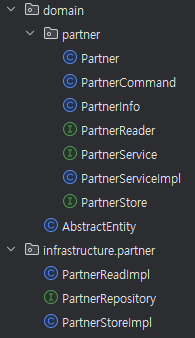

# Partner Domain 개발

<div ali>


## 1. Entity, Service 구현

<div align="center">
   
</div>
<br/>

### 공통 클래스

 - `/domain/AbstractEntity`
   - JPA Auditing 기능으로 공통으로 사용될 클래스
```java
@Getter
@MappedSuperclass
@EntityListeners(AuditingEntityListener.class)
public class AbstractEntity {

	@CreationTimestamp
	private ZonedDateTime createdAt;

	@UpdateTimestamp
	private ZonedDateTime updatedAt;
}
```
<br/>

 - `/common/util/TokenGenerator`
   - 파트너 ID PK 값 대신 비즈니스 영역에서 사용될 대체키(PK 값)를 생성하는 유틸
   - prefix 값 이후에 UUID 값을 생성한다.
```java
import org.apache.commons.lang3.RandomStringUtils;

public class TokenGenerator {
	private static final int TOKEN_LENGTH = 20;

	public static String randomCharacter(int length) {
		return RandomStringUtils.randomAlphanumeric(length);
	}

	public static String randomCharacterWithPrefix(String prefix) {
		return prefix + randomCharacter(TOKEN_LENGTH - prefix.length());
	}
}
```
<br/>

 - `/common/response/ErrorCode`
```java
@Getter
@RequiredArgsConstructor
public enum ErrorCode {
    COMMON_SYSTEM_ERROR("일시적인 오류가 발생했습니다. 잠시 후 다시 시도해주세요."), // 장애 상황
    COMMON_INVALID_PARAMETER("요청한 값이 올바르지 않습니다."),
    COMMON_ENTITY_NOT_FOUND("존재하지 않는 엔티티입니다."),
    COMMON_ILLEGAL_STATUS("잘못된 상태값입니다."),

    // GIFT
    GIFT_NOT_RECEIVABLE_CONDITION("선물 수락이 가능한 상태가 아닙니다."),
    GIFT_NOT_MODIFY_DELIVERY_CONDITION("배송지 변경이 가능한 상태가 아닙니다.");

    private final String errorMsg;

    public String getErrorMsg(Object... arg) {
        return String.format(errorMsg, arg);
    }
}
```
<br/>

 - `/common/exception/BaseException`
```java
@Getter
public class BaseException extends RuntimeException {
    private ErrorCode errorCode;

    public BaseException() {
    }

    public BaseException(ErrorCode errorCode) {
        super(errorCode.getErrorMsg());
        this.errorCode = errorCode;
    }

    public BaseException(String message, ErrorCode errorCode) {
        super(message);
        this.errorCode = errorCode;
    }

    public BaseException(String message, ErrorCode errorCode, Throwable cause) {
        super(message, cause);
        this.errorCode = errorCode;
    }
}
```
<br/>

 - `/common/exception/XxxException`
```java
public class EntityNotFoundException extends BaseException {

    public EntityNotFoundException() {
        super(ErrorCode.COMMON_INVALID_PARAMETER);
    }

    public EntityNotFoundException(String message) {
        super(message, ErrorCode.COMMON_INVALID_PARAMETER);
    }
}

public class IllegalStatusException extends BaseException {

    public IllegalStatusException() {
        super(ErrorCode.COMMON_ILLEGAL_STATUS);
    }

    public IllegalStatusException(String message) {
        super(message, ErrorCode.COMMON_ILLEGAL_STATUS);
    }
}

public class InvalidParamException extends BaseException {

    public InvalidParamException() {
        super(ErrorCode.COMMON_INVALID_PARAMETER);
    }

    public InvalidParamException(ErrorCode errorCode) {
        super(errorCode);
    }

    public InvalidParamException(String errorMsg) {
        super(errorMsg, ErrorCode.COMMON_INVALID_PARAMETER);
    }

    public InvalidParamException(String message, ErrorCode errorCode) {
        super(message, errorCode);
    }
}
```
<br/>

### Partner 도메인 계층 구현

 - `/domain/partner/Partner`
   - 파트너 엔티티
   - partnerToken 필드는 PK와 동일한 역할을 한다. 다만, 비즈니스 영역에서 사용될 유일한 값이다.
```java
@Slf4j
@Getter
@NoArgsConstructor
@Table(name = "partners")
@Entity
public class Partner extends AbstractEntity {
	private static final String PREFIX_PARTNER = "ptn_";

	@Id
	@GeneratedValue(strategy = GenerationType.IDENTITY)
	private Long id;
	private String partnerToken;
	private String partnerName;
	private String businessNo;
	private String email;

	@Enumerated(EnumType.STRING)
	private Status status;
	
	@Getter
	@RequiredArgsConstructor
	public enum Status {
		ENABLE("활성화"), DISABLE("비활성화");
		
		private final String description;
	}

	@Builder
	public Partner(String partnerName, String businessNo, String email) {
		if (StringUtils.isEmpty(partnerName)) throw new InvalidParamException("empty partnerName");
		if (StringUtils.isEmpty(businessNo)) throw new InvalidParamException("empty businessNo");
		if (StringUtils.isEmpty(email)) throw new InvalidParamException("empty email");

		this.partnerToken = TokenGenerator.randomCharacterWithPrefix(PREFIX_PARTNER);
		this.partnerName = partnerName;
		this.businessNo = businessNo;
		this.email = email;
		this.status = Status.ENABLE;
	}

	public void enable() {
		this.status = Status.ENABLE;
	}

	public void disable() {
		this.status = Status.DISABLE;
	}
}
```
<br/>

 - `/domain/partner/PartnerService`
   - 파트너 도메인에서 사용될 메서드 인터페이스를 제공한다.
   - XxxServiceImpl로 해당 메서드를 구현하고, Low Level의 구현은 infrastructure 계층에서 구현될 것이다. Service에서는 최대한 간소하게 구현한다.
   - 요청으로는 엔티티를 받지 않고, XxxCommand나 XxxCriteria 등으로 변환하여 받는다.
   - 응답으로는 엔티티를 반환하지 않고, XxxInfo로 변환하여 반환한다.
```java
public interface PartnerService {
    PartnerInfo registerPartner(PartnerCommand command);
    PartnerInfo getPartnerInfo(String partnerToken);
    PartnerInfo enablePartner(String partnerToken);
    PartnerInfo disablePartner(String partnerToken);
}
```
<br/>

 - `PartnerInfo & PartnerCommand`
   - XxxInfo는 엔티티를 대신 비즈니스 영역에 반환될 객체이다.
   - XxxCommand는 CUD 요청에 대해서 처리하는 객체이다.
```java
@Getter
public class PartnerInfo {
	private final Long id;
	private final String partnerToken;
	private final String partnerName;
	private final String businessNo;
	private final String email;
	private final Partner.Status status;

	public PartnerInfo(Partner partner) {
		this.id = partner.getId();
		this.partnerToken = partner.getPartnerToken();
		this.partnerName = partner.getPartnerName();
		this.businessNo = partner.getBusinessNo();
		this.email = partner.getEmail();
		this.status = partner.getStatus();
	}
}

@Getter
@Builder
@ToString
public class PartnerCommand {
	private final String partnerName;
	private final String businessNo;
	private final String email;

	public Partner toEntity() {
		return Partner.builder()
			.partnerName(partnerName)
			.businessNo(businessNo)
			.email(email)
			.build();
	}
}
```
<br/>

 - `PartnerStore & PartnerReader`
   - XxxStore: 저장 관련 인터페이스 제공
   - XxxReader: 읽기 관련 인터페이스 제공
   - 실제 인터페이스 구현체는 infrastructure 계층에서 구현된다.
```java
public interface PartnerStore {
	Partner store(Partner initPartner);
}

public interface PartnerReader {
	Partner getPartner(Long partnerId);
	Partner getPartner(String partnerToken);
}
```
<br/>

 - `/domain/partnerPartnerServiceImpl`
```java
@Slf4j
@Service
@RequiredArgsConstructor
public class PartnerServiceImpl implements PartnerService {

	private final PartnerStore partnerStore;
	private final PartnerReader partnerReader;

	@Override
	@Transactional
	public PartnerInfo registerPartner(PartnerCommand command) {
		// 1. XxxCommand -> InitPartner Entity
		// 2. InitPartner Entity Save To DB
		// 3. Partner -> PartnerInfo

		var initPartner = command.toEntity();
		Partner partner = partnerStore.store(initPartner);
		return new PartnerInfo(partner);
	}

	@Override
	@Transactional(readOnly = true)
	public PartnerInfo getPartnerInfo(String partnerToken) {
		// 1. partnerToken -> Partner
		// 2. Partner -> PartnerInfo

		Partner partner = partnerReader.getPartner(partnerToken);
		return new PartnerInfo(partner);
	}

	@Override
	@Transactional
	public PartnerInfo enablePartner(String partnerToken) {
		// 1. partnerToken -> Partner
		// 2. partner.enable()

		Partner partner = partnerReader.getPartner(partnerToken);
		partner.enable();
		return new PartnerInfo(partner);
	}

	@Override
	@Transactional
	public PartnerInfo disablePartner(String partnerToken) {
		// 1. partnerToken -> Partner
		// 2. partner.disable()

		Partner partner = partnerReader.getPartner(partnerToken);
		partner.disable();
		return new PartnerInfo(partner);
	}
}
```
<br/>

### Partner 인프라스트럭처 계층 구현

 - `PartnerRepository`
```java
public interface PartnerRepository extends JpaRepository<Partner, Long> {
	Optional<Partner> findByPartnerToken(String partnerToken);
}
```
<br/>

 - `PartnerReadImpl`
```java
@Slf4j
@Component
@RequiredArgsConstructor
public class PartnerReadImpl implements PartnerReader {
	private final PartnerRepository partnerRepository;

	@Override
	public Partner getPartner(Long partnerId) {
		return partnerRepository.findById(partnerId)
			.orElseThrow(EntityNotFoundException::new);
	}

	@Override
	public Partner getPartner(String partnerToken) {
		return partnerRepository.findByPartnerToken(partnerToken)
			.orElseThrow(EntityNotFoundException::new);
	}
}
```
<br/>

 - `PartnerStoreImpl`
```java
@Slf4j
@Component
@RequiredArgsConstructor
public class PartnerStoreImpl implements PartnerStore {

	private final PartnerRepository partnerRepository;

	@Override
	public Partner store(Partner partner) {
		if (StringUtils.isEmpty(partner.getPartnerToken())) throw new InvalidParamException("partner.getPartnerToken()");
		if (StringUtils.isEmpty(partner.getPartnerName())) throw new InvalidParamException("partner.getPartnerName()");
		if (StringUtils.isEmpty(partner.getBusinessNo())) throw new InvalidParamException("partner.getBusinessNo()");
		if (StringUtils.isEmpty(partner.getEmail())) throw new InvalidParamException("partner.getEmail()");
		if (partner.getStatus() == null) throw new InvalidParamException("partner.getStatus()");

		return partnerRepository.save(partner);
	}
}
```

## 2. Application, Interface 구현

### 공통 클래스

 - `/common/response/CommonControllerAdvice`
	- 공통 예외 처리 핸들러
```java
@Slf4j
@ControllerAdvice
public class CommonControllerAdvice {

    private static final List<ErrorCode> SPECIFIC_ALERT_TARGET_ERROR_CODE_LIST = Lists.newArrayList();

    /**
     * http status: 500 AND result: FAIL
     * 시스템 예외 상황. 집중 모니터링 대상
     *
     * @param e
     * @return
     */
    @ResponseBody
    @ResponseStatus(HttpStatus.INTERNAL_SERVER_ERROR)
    @ExceptionHandler(value = Exception.class)
    public CommonResponse onException(Exception e) {
        String eventId = MDC.get(CommonHttpRequestInterceptor.HEADER_REQUEST_UUID_KEY);
        log.error("eventId = {} ", eventId, e);
        return CommonResponse.fail(ErrorCode.COMMON_SYSTEM_ERROR);
    }

    /**
     * http status: 200 AND result: FAIL
     * 시스템은 이슈 없고, 비즈니스 로직 처리에서 에러가 발생함
     *
     * @param e
     * @return
     */
    @ResponseBody
    @ResponseStatus(HttpStatus.OK)
    @ExceptionHandler(value = BaseException.class)
    public CommonResponse onBaseException(BaseException e) {
        String eventId = MDC.get(CommonHttpRequestInterceptor.HEADER_REQUEST_UUID_KEY);
        if (SPECIFIC_ALERT_TARGET_ERROR_CODE_LIST.contains(e.getErrorCode())) {
            log.error("[BaseException] eventId = {}, cause = {}, errorMsg = {}", eventId, NestedExceptionUtils.getMostSpecificCause(e), NestedExceptionUtils.getMostSpecificCause(e).getMessage());
        } else {
            log.warn("[BaseException] eventId = {}, cause = {}, errorMsg = {}", eventId, NestedExceptionUtils.getMostSpecificCause(e), NestedExceptionUtils.getMostSpecificCause(e).getMessage());
        }
        return CommonResponse.fail(e.getMessage(), e.getErrorCode().name());
    }

    /**
     * 예상치 않은 Exception 중에서 모니터링 skip 이 가능한 Exception 을 처리할 때
     * ex) ClientAbortException
     *
     * @param e
     * @return
     */
    @ResponseBody
    @ResponseStatus(HttpStatus.OK)
    @ExceptionHandler(value = {ClientAbortException.class})
    public CommonResponse skipException(Exception e) {
        String eventId = MDC.get(CommonHttpRequestInterceptor.HEADER_REQUEST_UUID_KEY);
        log.warn("[skipException] eventId = {}, cause = {}, errorMsg = {}", eventId, NestedExceptionUtils.getMostSpecificCause(e), NestedExceptionUtils.getMostSpecificCause(e).getMessage());
        return CommonResponse.fail(ErrorCode.COMMON_SYSTEM_ERROR);
    }

    /**
     * http status: 400 AND result: FAIL
     * request parameter 에러
     *
     * @param e
     * @return
     */
    @ResponseBody
    @ResponseStatus(HttpStatus.BAD_REQUEST)
    @ExceptionHandler(value = {MethodArgumentNotValidException.class})
    public CommonResponse methodArgumentNotValidException(MethodArgumentNotValidException e) {
        String eventId = MDC.get(CommonHttpRequestInterceptor.HEADER_REQUEST_UUID_KEY);
        log.warn("[BaseException] eventId = {}, errorMsg = {}", eventId, NestedExceptionUtils.getMostSpecificCause(e).getMessage());
        BindingResult bindingResult = e.getBindingResult();
        FieldError fe = bindingResult.getFieldError();
        if (fe != null) {
            String message = "Request Error" + " " + fe.getField() + "=" + fe.getRejectedValue() + " (" + fe.getDefaultMessage() + ")";
            return CommonResponse.fail(message, ErrorCode.COMMON_INVALID_PARAMETER.name());
        } else {
            return CommonResponse.fail(ErrorCode.COMMON_INVALID_PARAMETER.getErrorMsg(), ErrorCode.COMMON_INVALID_PARAMETER.name());
        }
    }
}
```

 - `CommonResponse`
	- 공통 응답 클래스
```java
@Getter
@Builder
@NoArgsConstructor
@AllArgsConstructor
public class CommonResponse<T> {
    private Result result;
    private T data;
    private String message;
    private String errorCode;

    public static <T> CommonResponse<T> success(T data, String message) {
        return (CommonResponse<T>) CommonResponse.builder()
                .result(Result.SUCCESS)
                .data(data)
                .message(message)
                .build();
    }

    public static <T> CommonResponse<T> success(T data) {
        return success(data, null);
    }

    public static CommonResponse fail(String message, String errorCode) {
        return CommonResponse.builder()
                .result(Result.FAIL)
                .message(message)
                .errorCode(errorCode)
                .build();
    }

    public static CommonResponse fail(ErrorCode errorCode) {
        return CommonResponse.builder()
                .result(Result.FAIL)
                .message(errorCode.getErrorMsg())
                .errorCode(errorCode.name())
                .build();
    }

    public enum Result {
        SUCCESS, FAIL
    }
}
```
<br/>

### Application 계층

 - `/domain/notification/NotificaationService`
	- 알림 전송 서비스 인터페이스
```java
public interface NotificationService {
	void sendEmail(String email, String title, String description);
	void sendKakao(String phoneNo, String description);
	void sendSms(String phoneNo, String description);
}
```

 - `/infrastructure/notification/NotificationExecutore`
	- 알림 전송 서비스 구현체
```java
@Slf4j
@Component
public class NotificationExecutore implements NotificationService {

	@Override
	public void sendEmail(String email, String title, String description) {
		log.info("sendEmail");
	}

	@Override
	public void sendKakao(String phoneNo, String description) {
		log.info("sendKakao");
	}

	@Override
	public void sendSms(String phoneNo, String description) {
		log.info("sendSms");
	}
}
```

 - `/application/partner/PartnerFacade`
	- 응용 레벨은 XxxFacade로 네이밍한다.
	- 파트너 등록과 알림 전송은 별도의 로직으로 수행된다.
	- 파트너 등록은 하나의 트랜잭션에서 처리되어야 하고, 알림 전송은 성공, 실패에 대한 정합성이 필요없다.
```java
@Slf4j
@Service
@RequiredArgsConstructor
public class PartnerFacade {
	private final PartnerService partnerService;
	private final NotificationService notificationService;

	public PartnerInfo registerPartner(PartnerCommand command) {
		var partnerInfo = partnerService.registerPartner(command);
		notificationService.sendEmail(partnerInfo.getEmail(), "title", "description");
		return partnerInfo;
	}
}
```
<br/>

### Interface 계층

 - `/interfaces/partner/PartnerDto`
	- 인터페이스 계층에서 사용될 Dto
	- static inner class를 이용한다.
	- XxxRequest 클래스에서 toCommand()로 서비스로 전송될 객체로 변환한다.
	- XxxResponse 클래스 생성자로 XxxInfo 객체를 받아서 서비스에서 해당 인터페이스 응답 객체로 변환한다.
```java
public class PartnerDto {

    @Getter
    @Setter
    @ToString
    public static class RegisterRequest {
        @NotEmpty(message = "partnerName 는 필수값입니다")
        private String partnerName;

        @NotEmpty(message = "businessNo 는 필수값입니다")
        private String businessNo;

        @Email(message = "email 형식에 맞아야 합니다")
        @NotEmpty(message = "email 는 필수값입니다")
        private String email;

        public PartnerCommand toCommand() {
            return PartnerCommand.builder()
                    .partnerName(partnerName)
                    .businessNo(businessNo)
                    .email(email)
                    .build();
        }
    }

    @Getter
    @ToString
    public static class RegisterResponse {
        private final String partnerToken;
        private final String partnerName;
        private final String businessNo;
        private final String email;
        private final Partner.Status status;

        public RegisterResponse(PartnerInfo partnerInfo) {
            this.partnerToken = partnerInfo.getPartnerToken();
            this.partnerName = partnerInfo.getPartnerName();
            this.businessNo = partnerInfo.getBusinessNo();
            this.email = partnerInfo.getEmail();
            this.status = partnerInfo.getStatus();
        }
    }
}
```

 - `/interfaces/partner/PartnerApiController`
```java
@Slf4j
@RestController
@RequiredArgsConstructor
@RequestMapping("/api/v1/partners")
public class PartnerApiController {
	private final PartnerFacade partnerFacade;

	@PostMapping
	public CommonResponse registerPartner(@RequestBody @Valid PartnerDto.RegisterRequest request) {
		var command = request.toCommand();
		var partnerInfo = partnerFacade.registerPartner(command);
		var response = new PartnerDto.RegisterResponse(partnerInfo);
		return CommonResponse.success(response);
	}
}
```
<br/>

 - `/http-test/partner-api.http`
```http
### 파트너 등록
POST http://localhost:8080/api/v1/partners
Content-Type: application/json

{
  "partnerName": "테스트",
  "businessNo": "1234123456",
  "email": "test@test.com"
}
```
