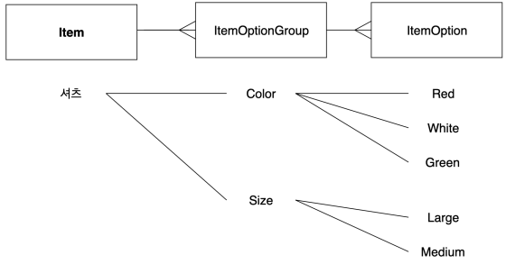

# Item Doamin 개발

## 요구사항

 - 시스템에 등록되고 활성화된 파트너는 상품을 등록할 수 있다.
 - 등록된 상품은 유저의 주문을 받아 판매될 수 있다.
 - 상품은 상품명, 가격 등의 기본 정보와 색상, 사이즈와 같은 옵션으로 구성된다.
 - 상품은 옵션 정보 없이 기본값으로만 저장될 수도 있다.
 - 주문 화면에서 보여지는 상품의 옵션은 파트너사가 원하는 순서에 맞게 노출될 수 있어야 한다.
 - 상품 구매 시 특정한 옵션을 선택하면 가격이 추가될 수 있다.
 - 상품은 판매 준비중, 판매중, 판매 종료와 같은 상태를 가진다.
 - 그 외 시스템을 사용하는 유저가 기본적으로 기대하는 기본 기능들(조회, 등록, 삭제)은 제공해야 한다.

## 도메인 계층 설계 및 구현

 - 상품 도메인은 아래와 같은 Entity로 구성된다.
    - Item
    - ItemOptionGroup
    - ItemOption
 - Item은 Item 도메인 전체의 Aggregate Root 역할을 한다.
    - Item Aggregate 경계 밖에서는 Item을 제외한 Aggregate 내부 구성 요소를 참조할 수 없다.
    - Item을 획득하면 Aggregate 내부의 객체를 탐색해서 획득할 수 있게 된다.
    - Item Aggregate 내부에서는 데이터가 변경될 때마다 유지돼야 하는 일관된 규칙이 지켜져야 한다.
    - 일관된 규칙은 Aggregate Root에 적용되는 모든 트랜잭션 내에서 지켜져야 한다. -> 규칙이 깨진다면 트랜잭션 롤백이 발생한다는 것
 - Item Aggregate를 만들어내는 과정에서 Factory의 사용을 검토한다.
    - Item 도메인의 경우 객체 생성 과정에서 Item 뿐만 아니라 OptionGroup과 Option의 정합성이 일관되게 지켜져야 한다.
    - 이 과정에서 각 클래스의 생성자만으로 Item Aggregate 생성 과정의 복잡한 규칙을 표현하기 어렵다.
    - 자신의 책임과 역할이 다른 객체를 생성하는 프로그램 요소를 Factory 라고 하는데, 복잡한 객체와 Aggregate 인스턴스를 생성하는 책임을 맡기기에 적합하다.
        - 프로젝트에서는 Item 도메인 내에 ItemOptionSeriesFactory를 정의하고, Implements 영역에는 해당 Factory를 활용한다.
        - Factory의 역할에서 객체를 데이터베이스와 같은 저장소에 영속화시키는 것은 포함되지 않는다.

<div align="center">
    
</div>
<br/>

## Entity 구현

요구사항을 기반으로 Item과 ItemOptionGroup, ItemOption의 필수 속성과 메서드를 정의하고 구현 방향을 정의한다.  
 - 필수 속성
    - itemToken(대체키)
    - partnerId
    - name
    - price
    - status
    - ordering
 - 필수 메서드
    - 상품 상태 변경
 - Item과 ItemOptionGroup, ItemOption 간의 연관관계 설정
    - OneToMany, ManyToOne 등의 연관 관계를 설정하여 객체 간의 참조 관계를 명확히 알 수 있도록 한다.
        - ManyToOne 만으로 객체 관계를 설정하는 것이 단방향을 유지하고 성능 측면에서도 좋겠지만, 실제 도메인 로직 구현 과정에서는 OneToMany 사용에 대한 장점이 있기 때문에 적절한 타협이 필요하다.

<br/>

## Service 및 Implements 구현

 - 상품 등록
   - 각 객체간의 부모 자식 관계를 설정하는 생성 과정은 하나의 생성자 안에서 처리하기에는 복잡도가 높다.
      - ItemOptionGroup 생성 시에는 Item의 reference가 필요하고, ItemOption에서는 ItemOptionGroup의 reference가 요구된다.
      - 때문에, 하나의 트랜잭션 안에서 Item, ItemOptionGroup, ItemOption을 순차적으로 생성하는 구조를 가지게 된다.
      - 경우에 따라서 Option 정보가 없는 상품의 경우는 Item만 독립적으로 생성하게 된다.
   - Option 계열의 복잡한 객체 생성 로직은 ItemOptionSeriesFactory에서 구현하고, 도메인 서비스에서는 적절한 추상화를 통해 가독성을 유지하도록 한다.
      - Factory 생성의 범위를 Aggregate 전체로 할 수도 있지만, 프로젝트에서는 Option 계열의 Factory 만으로 한정 짓는다.
 - 상품 정보 조회
   - itemToekn으로 Item Aggregate의 Root가 되는 Item을 조회한다.
   - 이를 기반으로 ItemInfo 객체를 생성 후 리턴한다.
      - ItemInfo 객체는 DB에서 조회하여 가져온 Entity를 그대로 리턴하지 않기 위한 객체이다.
      - ItemInfo 객체는 Item Aggregate의 매핑이 가능하도록 적절히 구조화하여 생성한다.
      - 1:N:N의 구조를 가지는 Item:ItemOptionGrgoup:ItemOption를 생각할 때, 두 번의 Stream 구문으로 ItemInfo 객체 생성이 가능하다.
   - 구현이 완료되면 리팩토링한다.
      - Item Aggregate와 ItemInfo 간에는 반복적인 파라미터 매핑 코드가 존재하게 된다.
      -  boilerplate 코드를 줄이기 위해 매핑 라이브러리를 사용할 수 있다. (MapStruict)

<br/>

## Application 및 Interfaces 구현

### Facade 구현

 - Item Facade 에서는 Item domain 에서 요구사항을 처리하도록 domain service를 호출하는 이상의 역할은 없다.
 - 이런 경우 Controller에서 곧장 Service를 호출할 수도 있지만, 추후의 요구사항 대응을 위한 buffer를 생각할 떄 Facade를 유지하는 것이 낫다.
   - 프로젝트 전체 구조 유지
   - 추후 요구사항 추가 및 변경 용이

<br/>

### Controller 구현

 - Item Aggregate 생성을 위한 request dto와 ItemInfo 조회 시 사용할 response dto는 Item Aggregate 만큼 복잡한 구조를 가진다.
   - dto를 domain 측 객체로 변환시 bolierplate code가 많이 생길 수 있다.
   - MatStruct를 사용하여 해결한다.

<br/>

## DDD 에서의 Aggregate

 - __필요성__
   - 모델 내에서 복잡한 연관 관계를 맺는 객체를 대상으로 일관된 규칙을 보장하기 쉽지 않다.
   - 개별 객체만이 아닌 서로 밀접한 관계에 있는 객체 집합에도 변경에 대한 일관된 규칙이 유지되어야 하기 떄문이다.
   - 이를 위해 Aggregate를 구성하고 Aggregate에 적용되는 불변식은 각 트랜잭션이 완료될 떄 이행되도록 한다.
 - __특징__
   - Aggregate는 데이터 변경의 단위로 다루는 연관 객체의 묶음을 말한다.
   - 각 Aggregate에는 루트와 경계가 있는데 경계는 Aggregate에 무엇이 포함되고 포함되지 않는지를 정의한다. 루트는 단 하나만 존재하며, Aggregate에 포함된 특징 Entity를 가리킨다.
   - 각 루트 Entity는 전역 식별성을 지니고, 경계 안의 Entity는 지역 식별성을 지닌다.
   - Aggregate 경계 밖에서는 루트 Entity를 제외한 Aggregate 내부의 구성 요소를 참조할 수 없다.
   - Aggregate 경계 안의 어떤 객체를 변경하더라도 전체 Aggregate의 불변식은 모두 지켜져야 한다.

<br/>

## Factory와 Repository

### Factory

 - __필요성__
   - 복잡한 객체를 생성하는 일은 도메인 계층의 책임이지만, 그것이 모델을 표현하는 객체에 속하는 것은 아니다.
      - 자동차를 조립하는 것과 자동차를 운전하는 것은 다른 영역의 것이다. 결코 동시에 일어날 수 없는 일이다.
   - 그렇다고 객체의 생성을 클라이언트에 두면 Aggregate의 캡슐화를 위반하고 클라이언트의 설계가 지저분해지게 된다.
   - 복잡한 객체와 Aggregate의 인스턴스 생성을 책임지는 별도의 객체를 선언하여 운여하는 것이 필요하다.
 - __특징__
   - 자신의 책임과 역할이 다른 객체를 생성하는 것인 프로그램 요소를 Factory라고 한다.
   - Factory는 해당 Factory에서 만들어내는 객체와 매우 강하게 결합돼 있으므로, 자신이 생성하는 객체와 가장 가까이 있어야 한다.
   - Factory는 Aggregate에서 유지되어야 할 불변식 로직을 Factory 내에 둬서 Aggregate 내에 들어 있는 복잡한 요소를 줄일 수도 있다.

<br/>

### Repository

 - __필요성__
   - 객체를 이용해 뭔가를 하려면 해당 객체애 대한 참조를 가지고 있어야 한다.
   - 클라이언트는 이미 존재하는 도메인 객체의 참조를 획득할 수 있는 실용적인 수단을 필요로 한다.
      - 해당 객체의 속성을 활용하여 검색하는 식으로 객체의 참조를 획득할 수 있어야 한다.
      - 이때, 마음대로 DB에 질의를 수행하면 도메인 객체와 Aggregate의 캡슐화를 어기는 질의를 수행할 수도 있게 된다.
 - __특징__
   - 클라이언트는 지정된 기준에 근거해 객체를 선택하는 질의 메서드를 이용해 Repository 에서 객체를 요청하게 된다.
   - DB 관련 기술은 다양하고 복잡한데 이를 Repository 인터페이스로 도출하면 클라이언트는 단순하고 의도가 드러나는 구현이 가능하고 실제 복잡한 구현은 인프라스트럭쳐에 맡길 수 있다.
   - 즉, 객체를 추가하거나 제거하고 조회하는 기술을 캡슐화하여 제공하는 것이 Repository의 특징이다.

<br/>

## 연관관계 설정

 - 팀과 회원
   - 하나의 팀에 여러 명의 회원이 포함된다는 개념을 생각하면 팀과 회원의 관계는 팀:회원 = 1:N 의 관계이다.
   - 객체의 경우 2개의 연관 관계가 생긴다.
      - 팀에서 회원, 회원에서 팀 단방향 2개 연관 관계
   - 테이블에서는 양방향 연관관계가 생긴다.
 - 객체의 일대다, 다대일 관계에서 연관 관계의 주인은 외래키를 관리하는 곳이 주인이 된다.
   - 테이블 기준으로 생각해보면 회원마다 팀의 PK를 가질 수는 있어도 하나의 팀에 여러 회원의 PK를 가질 수는 없다.
   - 연관 관계의 주인은 외래 키를 가지게 되는 N 쪽이라고 생각할 수 있고, 팀과 회원에서는 회원이 연관 관계의 주인이 된다.
 - JPA 동작 원리상 OneToMany를 사용하는 경우 ManyToOne 함께 사용이 권장된다.
   - OneToMany는 연관 관계의 주인이 되는 외래 키가 다른 테이블에 있다.
   - 이런 구조 때문에 연관 관계 데이터가 변경되는 과정에서 불필요한 UPDATE가 실행된다.
```java
// Item
@OneToMany(mappedBy = "item", cascade = CascadeType.PERSIST)
private List<ItemOptionGroup> itemOptionGroupList = List.newArrayList();

// ItemOptionGroup
@ManyToOne
@JoinColumn(name = "item_id")
private Item item;
```
<br/>

## MapStruct 사용

 - 복잡한 애플리케이션을 여러 개의 계층으로 나누어 개발하는 것은 각 계층의 관심 측면만을 전문적으로 다룬다는 점에서 의의가 있다.
   - 이떄 각 Layer 마다 사용하고 전달되는 객체는 적절한 컨버팅 로직을 통해서 격리되고 변환되어야 한다.
   - 특정 Layer에서 사용되는 객체가 다른 Layer로 전달되는 과정에서 적절한 컨버팅이 없다면 Layer 간의 의존 관계가 깨질 수도 있다.
   - 경우에 따라서는 특정 기술 사용에 따른 예상치 못한 예외가 발생할 수도 있다. (Spring JPA 기반 Lazy Loading 예외 등)
 - Layer 간의 객체 변환 로직은 개발자가 일일이 직접 구현해도 되지만,
   - 반복적이고 불필요한 코드가 많아지게 되고
   - 단순한 실수로 인한 개발 생산성이 떨어지게 된다.
 - 이를 위해 매핑 라이브러리를 사용할 수 있다. (ModelMapper, MapStruct)
   - ModelMapper는 리플렉션 기반으로 동작하여 실제 매핑 로직을 쉽게 파악하기 어려움
   - MapStruct는 코드 생성 방식으로 동작하여 생성된 코드를 통해 매핑 로직을 쉽게 파악할 수 있고, 컴파일 타임에 매핑 오류를 인지하고 설정에 따라 빌드 시 에러를 던질 수도 있다.

### MapStruct 사용법

 - `build.gradle`
```groovy
dependencies {
   // ..

    implementation 'org.mapstruct:mapstruct:1.4.2.Final'
    annotationProcessor "org.mapstruct:mapstruct-processor:1.4.2.Final"
    annotationProcessor(
            'org.projectlombok:lombok',
            'org.projectlombok:lombok-mapstruct-binding:0.1.0'
    )
}
```

 - `매핑 선언`
   - 특별한 구현 없이 Mapper Interface 만 정의하면 컴파일 과정에서 해당 인터페이스의 구현체를 생성한다.
```java
@Mapper(
   componentModel = "spring",
   injectionStrategy = InjectionStrategy.CONSTRUCTOR,
   unmappedTargetPolicy = ReportingPolicy.ERROR
)
public interface PartnerDtoMapper {
   PartnerCommand.RegisterPartner of(PartnerDto.RegisterRequest request);
   PartnerDto.RegisterResponse of(PartnerInfo partnerInfo);
}
```