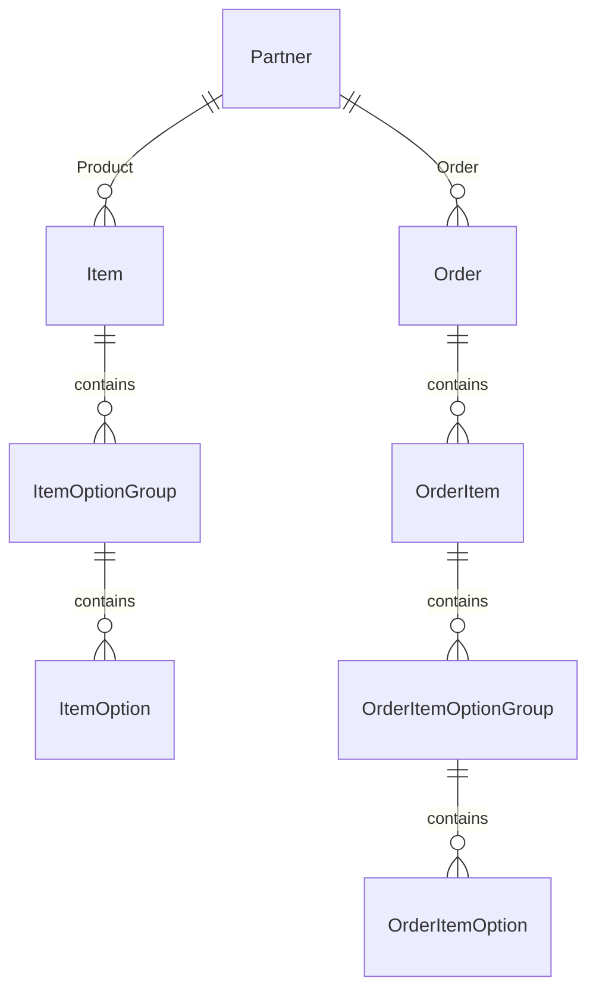
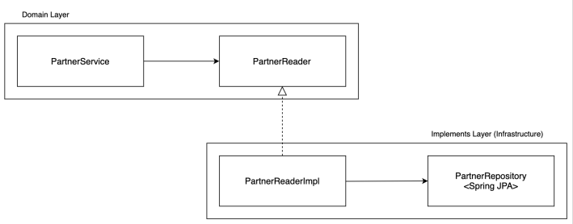

# 주문 프로젝트 개발

## 1. 프로젝트 설명

 - __해당 서비스 주요 이해관계자__
    - 유저: 서비스를 통해 상품을 선택하여 주문하는 고객
    - 파트너: 해당 서비스에 입점하여 상품을 판매하는 업체
    - 내부 운영자: 해당 서비스를 운영하고 관리하는 담당자
 - __해당 서비스 주요 도메인__
    - 파트너: 파트너 등록과 운영 처리
    - 상품: 상품과 상품의 옵션 정보 등록 및 관리
    - 주문: 유저가 선택한 상품 정보와 주문 정보를 관리하고 결제
 - __도메인별 주요 요구사항__
    - 파트너
        - 시스템에 등록된 파트너만이 상품을 등록하고 주문을 처리할 수 있다.
        - 파트너 등록 시 파트너명, 사업자 등록번호, 이메일은 필수값이다.
        - 파트너 등록이 성공하면 등록된 이메일로 가입 완료 안내 메일을 발송한다.
        - 그 외 시스템을 사용하는 유저가 기본적으로 기대하는 기본 기능들(조회, 등록, 수정, 삭제)을 제공해야 한다.
    - 상품
        - 시스템에 등록되고 활성화된 파트너는 상품을 등록할 수 있다.
        - 등록된 상품은 유저의 주문을 받아 판매될 수 있다.
        - 상품은 상품명, 가격 등의 기본 정보와 색상, 사이즈와 같은 옵션으로 구성된다.
        - 상품은 옵션 정보 없이 기본값으로만 저장될 수도 있다.
        - 주문 화면에서 보여지는 상품의 옵션은 파트너사가 원하는 순서에 맞게 노출될 수 있어야 한다.
        - 상품 구매 시 특정한 옵션을 선택하면 가격이 추가될 수 있다.
        - 상품은 판매 준비중, 판매중, 판매 종료와 같은 상태를 가진다.
        - 그 외 시스템을 사용하는 유저가 기본적으로 기대하는 기본 기능들(조회, 등록, 수정, 삭제)을 제공해야 한다.
    - 주문
        - 시스템에 등록된 상품은 유저가 주문할 수 있다.
        - 주문은 주문 등록, 결제, 배송 준비, 배송중, 배송 완료의 단게를 가진다.
        - 주문 등록 과정에서 결제수단을 선택하고 상품 및 상품 옵션을 선택한다.
        - 시스템에서 사용 가능한 결제 수단은 카드, 토스페이, 카카오페이, 네이버페이 등이 있다.
        - 결제 과정에서는 유저가 선택한 결제수단으로 결제를 진행한다.
        - 결제 완료 후 유저에게 카카오톡으로 주문 성공 알림이 전달된다.
        - 결제가 완료되면 배송 준비 단계로 넘어간다.
        - 배송중, 배송 완료의 단계로 순차적으로 진행된다.


<br/>

## 2. Entity, Service 개요

 - `/domain/AbstractEntity.java`
    - 모든 시간 관련 컬럼은 LocalDateTime이 아니라 ZonedDateTime을 사용한다. Spring이 제공하는 @CreatedDate와 @LastModifiedDate는 ZonedDateTime을 지원하지 않아 JPA에서 제공하는 CreationTimestamp와 @LastModifiedDate를 사용한다.
```java
@Getter
@MappedSuperclass
@EntityListeners(AuditingEntityListener.class)
public class AbstractEntity {

    @CreationTimestamp
    private ZonedDateTime createdAt;

    @UpdateTimestamp
    private ZonedDateTime updatedAt;
}
```
<br/>

 - `/config/JpaAuditingConfiguration.java`
```java
@EnableJpaAuditing
@Configuration
public class JpaAuditingConfiguration {
}
```
<br/>

### Service 및 Implements 구현

 - 코드를 읽으면 해당 도메인의 전체 흐름을 파악할 수 있어야 한다.
 - 세세한 구현과 Low Level 기술은 Implements(infrastructure 계층)에 위임하고, 위임을 맡기는 구간은 interface로 정의하여 사용한다.
 - Service 간에는 참조 관계를 두지 않는다.

### Service 계층 DTO

 - Command: CUD
 - Criteria: R
 - Info: 리턴 객체, DB에서 조회하여 가져온 Entity를 그대로 리턴하지 않기 위한 객체
    - 도메인 로직과 Entity는 프로젝트 전반에 걸쳐 사용된다.
    - 도메인 로직의 리턴 값으로 Entity를 그대로 전달하면, 도메인 계층 바깥에서 Entity 내의 도메인 로직이 호출되거나 Entity의 속성을 변경하는 명령어가 실행될 수도 있다.
    - 이는 도메인 로직을 도메인 계층에 응집하고자 하는 의도에 맞지 않고, 경우에 따라서는 Entity 하위 객체의 로딩 과정에서 Lazy Initialization Exception 등이 발생할 수도 있다.

### 구현 시 네이밍 규칙

 - getXxx: 해당 파라미터로 Entity 또는 Projection 리턴. 해당 파라미터로 조회 결과가 없다면 Exception 발생
 - findByXxx: Optional 리턴
 - makeXxx: DB Operation과 관계없이 메모리 상에서 값을 조합하여 객체를 생성
 - initEntity: makeXxx로 생성된 초기 Entity. DB에 저장된 객체가 아니므로 Auto Increment 기반의 PK 값이 null 임

<br/>

### Entity가 제공하는 기능과 세부적인 기술을 제공하는 implements와의 조합으로 Service 구현체 생성

 - Partner 도메인의 조회와 저장을 담당하는 interface를 각각 선언한다.
    - PartnerReader
    - PartnerStore
 - Spring JPA를 사용하여 PartnerReader와 PartnerStore의 구현체를 만들고, 이를 infrastructure layer에 둔다.
    - 도메인 로직이 Low Level 기술에 영향을 받지 않도록 DIP 개념을 적용한다.
    - Spring JPA를 활용하여 Persistence Layer를 구현한다. 추후에 다른 Data Access Layer 구현 기술을 사용할 수도 있다.

<br/>

### 리팩토링을 통해 Service 로직 자체의 가독성을 높인다.

 - 지속적으로 Service의 추상화 레벨을 확인한다. 도메인 로직의 가독성을 유지하고 너무 세세한 구현이 반영되지 않도록 한다.
 - 모든 비즈니스 로직의 접미사를 XxxService로 정할 필요는 없다.
    - Reader, Store, Aggregator, Executor 등의 접미사를 통해 좀 더 해당 객체의 책임과 역할을 상세히 정의할 수 있다.
 - Service 간에는 참조 관계를 가지지 않게 하고, 도메인의 요구사항을 한 눈에 파악할 수 있는 지속적으로 리팩토링 해나간다.
    - Service 간에 참조 관계가 생기면 해당 클래스가 너무 뚱뚱해지고, 도메인 흐름을 파악하기 어렵고 테스트도 어렵게 된다.
    - 기능이 추가될 때마다 생성자의 인자나 import가 과도하게 늘어나지 않도록 주의한다.

<br/>

### Transactional을 붙인다.

- Service에서 정의하고 구현한 메서드는 요구사항 하나 하나를 반영한다. 이때, 데이터 정합성을 생각하면 하나의 트랜잭션으로 묶어서 처리되어야 하는 경우가 대부분이다.
    - Service 에서는 Domain의 Aggregate Root와 연관된 객체를 모두 가져오고 Low Level 기술을 활용하여 데이터를 조회하고 저장한다.
    - 이때, 데이터 처리 및 외부 API 호출의 성공/실패 여부에 따라서 처리한 데이터 전체 커밋 또는 롤백을 해야할 수도 있따.
    - 가령 부모 객체는 데이텁에ㅣ스 저장에 실패하고 자식 객체만 저장에 성공하면 데이터 정합성 측면에서 이슈가 된다.
    - 데이터 정합성을 위해 의미있는 작업 단위마다 @Transactional을 붙여야 한다.

<br/>

## 3. 대체키와 DIP

### 식별자(PK)

 - Entity 개념에서 고유한 식별자는 중요한 개념이다.
 - Entity는 자신의 생명주기동안 형태와 내용이 급격하게 바뀔 수도 있지만 연속성은 유지해야 한다.
 - 변화하는 Entity를 추적하려면 식별성이 부여되어야 하고, 식별자는 해당 시스템 내에서 유일하고 변경되어서는 안 된다.
 - 보통 DBMS로 영속성을 관리하는 시스템에서의 Entity 식별자는 Table의 PK와 매핑되는 경우가 대부분이다. (MySQL AUTO_INCREMENT)

<br/>

### 대체키의 정의와 필요성

 - 대체키는 자연키라는 용어와 대칭되는 개념이다. 해당 프로젝트에서는 Entity의 식별자와 동급의 의미를 가지는 추가 식별자 정도로 용어를 정의한다.
 - Entity의 식별자는 외부에 오픈하거나 오용되지 않도록 주의하고, 식별자가 아닌 대체키를 오픈하는 것이 여러모로 좋다.
```
★ Entity 식별자를 외부에 직접 오픈했을 때의 이슈 상황

 - 특정 서비스 사례
시퀀스값의 유저 아이디를 URL PATH로 사용하여 유저의 거래내역을 노출하는 API가 있다고 가정한다.
이런 경우, URL의 숫자만 조작하면 다른 이의 거래 내역을 손쉽게 볼 수 있다. (인증 과정이 없는 경우)
이슈 발생 후 랜덤 스트링 형태의 대체키로 변환하여 API를 수정

 - 외부 연동 서비스
외부 협력사와 자사 서비스 간에 상품 데이터 연동 과정에서 키 값을 시스템 내부의 PK로 사용했다고 가정한다.
그렇게 되면 양사간의 데이터는 자사 시스템 내부의 PK로 강하게 묶이게 된다.
이후 자사 시스템에서 데이터베이스는 MySQL에서 MongoDB 등으로 변경하게 된다면,
달라진 PK 체계로 인해 많은 공수가 발생할 수 있다.
또한, 외부 협력사와 추가적인 식별자 논의도 진행해야 한다.
```
<br/>

### 구현

 - 시스템 내부에서의 Entity 식별자는 Long 타입의 id를 사용하고, 외부에 오픈하여 사용할 떄에는 대체키를 사용한다.
 - 대체키는 String 기반의 token을 생성하고 Unique Index로 설정하여 사용한다.
 - 대체키를 사용할 때에는 성능에 대한 고민이 많지만, MySQL 기준으로 1천만건 이상으로 넘어가기 전까지 Random String으로 사용해도 조회 성능에 크게 이슈가 없고, 성능을 고려한다면 UUID를 Rearranged 하여 사용하는 것을 검토할 수 있다.
 - 관련글: https://www.percona.com/blog/2014/12/19/store-uuid-optimized-way/

<br/>

### 의존성 역전 원칙(DIP)

 - DIP는 추상화 레벨이 높은 상위 수준의 모듈이 추상화 레벨이 낮은 하위 모듈에 의존하면 안되는 것이다.
 - 도메인 정책이나 업무 모델을 포함하는 것을 상위 수준의 모듈이라고 볼 수 있고, 이를 구현하기 위한 구체적인 세부 기술을 하위 모듈이라고 볼 수 있다.
 - 상위 수준의 모듈이 하위 수준의 모듈에 의존하는 전통적인 소프트웨어 개발 방식과 달리, 추상화된 상위 모듈에 하위 모듈이 의존하게 만드는 것이 의존성 역전 원칙이다.

<div align="center">
    
</div>
<br/>

## 4. Application, Interface 개요

### Facade 구현

 - 응용 계층 구현
    - 비즈니스 결정을 내리진 않지만 수행할 작업을 정의해야 한다.
    - 주로 트랜잭션으로 묶여야 하는 도메인 로직과 그 외 로직을 aggregation 하는 역할로 한정 짓는다.
    - 네이밍으로 Service와 구분짓기 위해 XxxFacade라는 접미사를 활용한다.
        - Facade 패턴은 다양한 외부 인터페이스를 하나의 인터페이스로 통합하는 개념으로 사용되지만, 해당 프로젝트에서는 로직의 조합이라는 측면을 강조하기 위해 Facade를 차용한다.
 - 도메인의 요구사항 구현
    - 외부에 전달할 요구사항을 온전히 만족하는 메서드를 구현한다.
        - 보통 XxxService에 정의된 인터페이스와 일대일 매칭되는 메서드가 도출된다.
    - 파트너 등록의 경우 등록 성공 후 해당 파트너에게 이메일로 등록 성공 알림을 보내는 요구사항이 있다.
        - 파트너 등록 과정에서의 모든 도메인 로직은 하나의 트랜잭션으로 묶여야 정합성에 이슈가 없다.
        - 이메일 발송의 경우 발송에 실패하더라도 파트너 등록이 정상적으로 이루어졌다면 큰 문제가 되지 않는다.
        - PartnerService와 NotificationService의 조합으로 요구사항을 만족시키는 구현을 완성한다.
    - 응용 계층을 하나 더 둠으로써 도메인 계층에서 처리하기 애매한 요구사항을 충족할 수 있는 여유가 생긴다.
        - 필요에 따라서 여러 개의 Info를 조합하여 만드는 Result 객체가 필요할 수 있다.
        - 이 때에는 여러 개의 Service를 호출한 후 이를 조합하는 Result 생성 로직이 생길 수 있다.

<br/>

### Controller 구현

 - 외부 인터페이스 계층 구현은 서비스 전체의 시스템간 인터페이스 표준을 정의하고 그에 맞게 외부 호출과 응답이 정의되도록 구현해야 한다.
```javascript
/**
    API endpoint 는 /api/{version}/{도메인명} 의 패턴을 prefix 로 한다
    content-type 은 application/json 으로 한다
**/

// 성공 응답
{
    "result": "SUCCESS",
    "data": "plain text 또는 json 형태의 데이터",
    "messsage": "성공 메시지",
    "error_code": null
}

// 실패응답
{
    "result": "FAIL",
    "data": null 또는 json 형태의 데이터
    "messsage": "에러 메시지",
    "errorCode": "plain text"
}
```
<br/>

 - API 처리 결과에 따른 응답 형태
```
1. http status: 2xx 이면서 result: "SUCCESS"
→ 시스템 이슈 없고, 비즈니스 로직도 성공적으로 처리됨

2. http status: 2xx 이면서 result: "FAIL"
→ 시스템 이슈 없고, 비즈니스 로직 처리에서 에러가 발생함
→ 예시: 중복 데이터가 이미 존재함 / 인증 이슈

3. http status: 4xx 이면서 result: "FAIL"
→ 잘못된 request 가 전달됨
→ 예시: 필수 요청 파라미터 키를 전달하지 않은 경우

4. http status: 5xx 이면서 result: "FAIL"
→ 시스템 에러 상황. 집중적으로 모니터링할 응답
→ 예시: 시스템 장애
```
<br/>

#### 외부 서비스의 요청과 응답은 내부 도메인 로직을 처리하는 레이어와 명확히 분리되어야 한다.

 - 인터페이스 계층에서 사용할 DTO를 정의하고 해당 DTO가 도메인 계층으로 침투되지 않도록 유의해야 한다.
 - 별도의 Convert 로직이 필요하다.
    - Request DTO를 도메인의 Command, Criteria로 변환하는 로직
    - 도메인의 Info를 Response DTO로 변환하는 로직
    - 변환 로직을 DTO 내에 구현하는 것은 응집도를 높이는 측면에서 좋은 구현이 된다.
 - 인터페이스 계층에서만 사용할 DTO를 정의한다.
    - 이때, static inner class를 적극 활용한다. 여러 개의 DTO를 목적에 맞게 묶어둘 수 있다는 장점이 있다.
    - Validation을 정의하고 @Valid를 선언한다.
    - toCommand()를 활용한다.
 - Facade를 호출하고 결과를 받아 API 응답에 맞게 변환한다.
    - CommonResponse.success(response)
    - Facade 호출 과정에서 Exception이 발생하면 CommonControllerAdvice에서 이를 처리한다.
    - 불필요한 try-catch 선언을 하지 않는다.

<br/>

### 로깅의 중요성

 - 로깅시 확인할 것
    - 중앙화된 로깅이 구축되어 있는지
    - 로깅 시에 남기는 항목이 무엇인지
    - 에러 발생 시 해당 로그를 통해 버그 원인을 찾을 수 있는지
    - 로그 모니터링을 통해 적절한 시스템 알람이 전송되고 있는지
 - API 레벨의 request, respones 로깅은 추후 리팩토링에 필수 항목이 될 수 있다.
    - 테스트 코드가 적절히 작성되지 않은 시스템 환경에서는 API의 request, response 로그만이 시스템 개선을 가능하게 해준다.
    - 문서화된 스팩보다 정확한 것은 API의 request, response 로그이다.
 - ELK + Kafka 스택은 생각보다 구축이 어렵지 않다.
    - 자체적인 구축이 어렵다면 로깅 및 애플리케이션 모니터링 서비스를 활용해도 좋다.
 - 서비스를 이용하는 유저가 에러를 접하게 되면 개발팀은 이를 즉시 인지할 수 있어야 한다.

<br/>

### API 응답 체계

 - API의 응답 체계는 시스템 전체가 일관되고 명확한 형태를 가진다면, 어떠한 구조이든 문제가 되지 않는다.
 - 실제로 Google, Facebook, Naver와 같은 서비스도 각자 고유한 방식의 API 응답 체계를 가진다.
    - Google: https://cloud.google.com/storage/docs/json_api/v1/status-codes
    - Facebook: https://developers.facebook.com/docs/graph-api/guides/error-handling
```javascript
/**
    API endpoint 는 /api/{version}/{도메인명} 의 패턴을 prefix 로 한다
    content-type 은 application/json 으로 한다
**/

// 성공 응답
{
    "result": "SUCCESS",
    "data": "plain text 또는 json 형태의 데이터",
    "messsage": "성공 메시지",
    "error_code": null
}

// 실패응답
{
    "result": "FAIL",
    "data": null 또는 json 형태의 데이터
    "messsage": "에러 메시지",
    "errorCode": "plain text"
}
```
