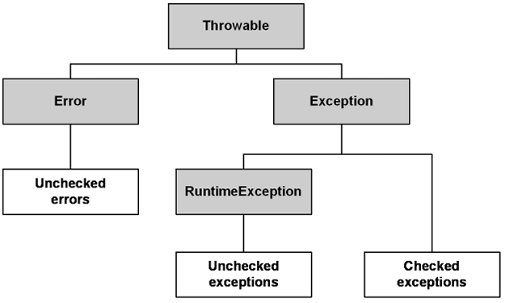

# 코틀린 소개

Kotlin은 JetBrains에서 개발한 현대적인 프로그래밍 언어로, JVM (Java Virtual Machine)에서 실행될 수 있으며 Android 개발에 특히 많이 사용됩니다. Kotlin은 간결하고, 안전하며, 상호운용성이 뛰어나도록 설계되었습니다.  

 - __간결함__: Kotlin은 코드를 더 간결하게 작성할 수 있게 도와줍니다. 반복적인 코드를 줄이고, 간단한 구문을 사용해 코드를 더 읽기 쉽고 유지보수하기 쉽게 만듭니다.
 - __안전성__: Kotlin은 NullPointerException(NPE) 문제를 방지하기 위해 언어 차원에서 null 안전성을 지원합니다. nullable 타입과 non-nullable 타입을 명확히 구분하여 null 관련 오류를 줄일 수 있습니다.
 - __상호운용성__: Kotlin은 Java와 100% 상호운용이 가능합니다. 기존의 Java 코드를 변경하지 않고도 Kotlin을 프로젝트에 도입할 수 있으며, Java 코드와 Kotlin 코드를 함께 사용할 수 있습니다.
 - __함수형 프로그래밍__: Kotlin은 함수형 프로그래밍 스타일을 지원합니다. 람다식, 고차 함수, 불변성 등을 활용하여 코드를 더 간결하고 예측 가능하게 작성할 수 있습니다.

```kotlin
// data class를 사용하면 equals(), hashCode(), toString() 등 유용한 함수가 자동 생성된다.
data class Person(
    val name: String,
    val age: Int,
    val email: String
)

// object를 사용하면 싱글턴 객체를 생성해준다.
object MyCompany {
    const val name: String = "MyCompany"
}

// 탑-레벨 함수로 클래스 외부에서 함수 작성 가능
fun main() {
    // 'new' 키워드 없이 객체 생성
    val person = Person("홍길동", 20, "test@test.com")
    println(person)
}
```
<br/>

## 자바와 코틀린의 차이점

### Checked Exception

코틀린은 Checked Exception을 강제하지 않는다. 원하는 경우에만 try-catch를 사용하면 된다.  

 - __자바의 익셉션 계층__
    - Throwable: 예외 계층의 최상위 클래스
    - Error: 시스템에 비정상적인 상황이 발생. 예측이 어렵고 기본적으로 복구가 불가능
        - OutOfMemoryError, StackOverflowError, etc
    - Exception: 시스템에 포착 가능하여 복구 가능. 예외 처리 강제
        - IOException, FileNotFoundException, etc
        - @Transactional에서 해당 예외가 발생하면 기본적으로 롤백이 동작하지 않는다. (rollbackFor 옵션을 사용)
    - RuntimeException: 런타임시 발생하는 예외. 예외 처리를 강제하지 않음
        - NullPointerException, ArrayIndexOutOfBoundsException, etc

<div align="center">
    
</div>

```java
// 자바에서 Checked Exception은 컴파일 에러가 발생하여,
// 무조건 try-catch로 감싸거나 throws로 예외를 전파해야 한다.
try {
    Thread.sleep(1);
} catch (InterruptedException e) {
    // 예외 처리
}
```
<br/>

### 기본 자료형

 - 자바는 원시 자료ㅗ형을 지원하며 객체로된 레퍼런스 타입도 지원한다.
```java
int i = 0;
Integer ii = 0;
String str = ii.toString();
```
<br/>

 - 코틀린은 레퍼런스 타입만 지원한다.
 - 코틀린의 레퍼런스 탕비은 최적화된 방식으로 컴파일된다.
```kotlin
val i: Int = 0;
val str: String = i.toString()

// 컴파일 코드
int i = 0;
String str = String.valueOf(i);
```
<br/>

### 정적 멤버

 - 자바는 static 키워드로 정적 멤버를 선언한다.
```java
public class JavaClass {
    static int i = 0;

    public static void staticMethod() {
        // ..
    }
}
```
<br/>

 - 코틀린은 companion object 키워드를 사용한다.
```kotlin
class KotlinClass {
    companion object {
        val i: Int = 0;

        fun function() {
            // ..
        }
    }
}
```
<br/>

### 삼항 연산자

 - 자바는 삼항 연산자가 존재한다.
```java
String animalSound = "호랑이".equals(animal) ? "어흥" : "야옹";
```
<br/>

 - 코틀린은 if-else로 대신한다.
```kotlin
val animalSound: String = if ("호랑이" == animal) "어흥" else "야옹"
```
<br/>

### 세미콜론

 - 자바에서 라인의 끝은 무조건 세미콜론으로 끝나야 한다.
 - 코틀린은 세미콜론이 필수가 아니다.

<br/>

### 코틀린에는 있지만 자바에는 없는 기능

 - `확장`
    - 개발자가 임의로 객체의 함수나 프로퍼티를 확장해서 사용할 수 있다.
```kotlin
MyStringExtensions.kt 

fun String.first(): Char { 
    return this[0] 
} 

fun String.addFirst(char: Char): String { 
    return char + this.substring(0) 
} 

fun main() { 
    println("ABCD".first())  // 출력: A  
    println("ABCD".addFirst('Z'))   // 출력: ZABCD 
}
```
<br/>

 - `데이터 클래스`
    - 데이터를 보관하거나 전달하는 목적을 가진 불변 객체로 사용
    - 자바에서는 주로 Lombok을 사용 (JDK 15부터 record 키워드가 추가됨)
```kotlin
data class Person(val name: String, val age: Int)
// equals(), hashCode(), toString() 등 유용한 함수를 자동 생성
```
<br/>

 - `문자열 템플릿`
    - 문자열에 변수를 사용하거나 여러 행으로 된 텍스트 블록을 만들 수 있다.
```kotlin
val text = "World"
val greeting = "Hello, ${text}"
println(greeting)

// 문자열 템플릿 기반의 다이나믹 쿼리
fun sql(nameIncluded: Boolean) =
    """
        SELECT id, name, email, age
        FROM users
        WHERE id = :id
        ${
            if (nameIncluded) {
                """
                AND name = :name
                """
            } else ""
        }
    """
```
<br/>

 - `널 안정성`
    - 자바에서 가장 많이 발생하는 예외는 NullPointerException(NPE)
    - 자바의 옵셔널은 값을 래핑하기 때문에 객체 생성에 따른 오버헤드가 발생핳고, 컴파일 단계에서 Null 가능성을 검사하지 않는다.
    - 코틀린은 언어적 차원에서 NPE가 발생할 가능성을 제거한다.
```kotlin
val a: String = null // ❌ 컴파일 오류
val b: String = "aabbcc"
b = null // ❌ 컴파일 오류

// Nullable 참조는 컴파일 단계에서 널 안정성을 제공
var a: String? = null
a.length // ❌ 컴파일 오류
a?.length // ✔ safe-call 정상
a!!.length // ✔ Null이 아니라고 확신하는 경우
```
<br/>

 - `기타`
    - 스마트 캐스트
    - 실드 클래스(JDK 15)
    - 위임
    - 중위 표현식
    - 연산자 오버로딩
    - 코루틴

<br/>

## 스프링의 코틀린 지원

 - 스프링 공식 문서 샘플로 Kotlin 코드 지원
 - Spring 프로젝트 생성시 기본 언어를 Kotlin으로 만들 수 있고, Gradle의 경우 Kotlin DSL 기반으로도 만들 수 있음
 - @ConfigurationProperties
    - 스프링 애플리케이션에 지정한 설정을 기반으로 설정 클래스를 만들 때, @ConstructorBinding을 사용하면 Setter가 아닌 생성자를 통해 바인딩하므로 불변 객체를 쉽게 만들 수 있다.
```kotlin
@ConstructorBinding
@ConfigurationProperties("example.kotlin")
data class KotlinExampleProperties(
    val name: String,
    val description: String,
    val myService: MyService) {

        data class MyService(
            val apiToken: String,
            val uri: URI
        )
    }
)
```
<br/>

 - 테스트 지원
    - 기본 제공되는 JUnit5 기반의 테스트를 특별한 설정 없이 그대로 사용 가능하다.
    - 모의 객체를 만들어 테스트하려면 Mockito 대신 MockK를 사용한다.
        - Mockito에서 제공하는 @MockBean, @SpyBean을 대체하는 SpringMockK의 @MockkBean, @SpykBean
```kotlin
@ExtendWith(SpringExtension::class) 
@WebMvcTest 
class GreetingControllerTest { 

    @MockkBean 
    private lateinit var greetingService: GreetingService 

    @Autowired 
    private lateinit var controller: GreetingController 

    @Test 
    fun `should greet by delegating to the greeting service`() { 
        // Given 
        every { greetingService.greet("John") } returns "Hi John" 

        // When 
        assertThat(controller.greet("John")).isEqualTo("Hi John") 

        // Then 
        verify { greetingService.greet("John") } 
    } 
}
```
<br/>

 - 확장 함수
    - 스프링에서 지원하는 코틀린 API의 대부분은 이러한 확장 기능을 사용해 기존 API에 코틀린 API를 추가
```kotlin
fun <T, ID> CrudRepository<T, ID>.findByIdOrNull(id: ID): T? { 
    return findById(id).orElse(null) 
}

// MyService.kt
class MyService(
    private val myRepository: MyRepository,
) {
    fun findById(id: Long): My? = myRepository.findByIdOrNull(id)
}
```
<br/>

 - 코루틴
    - 비동기-논블로킹 방식을 선언형으로 구현하기 위한 코틀린 기능
    - 스프링 MVC, 스프링 WebFlux 모두 코루틴을 지원하여 의존성만 추가하면 바로 사용 가능
```kotlin
// build.gradle.kts 
dependencies { 
    implementation("org.jetbrains.kotlinx:kotlinx-coroutines-core") 
    implementation("org.jetbrains.kotlinx:kotlinx-coroutines-reactor") 
}

// 코루틴이 지원되어 비동기-논블로킹 스타일의 구현을 쉽게 할 수 있다.
@RestController 
class UserController( 
    private val userService : UserService, 
    private val userDetailService: UserDetailService 
) { 

    @GetMapping("/{id}") 
    suspend fun get(@PathVariable id: Long) : User { 
        return userService.getById(id) 
    } 

    @GetMapping("/users") 
    suspend fun gets() = withContext(Dispatchers.IO) { 
        val usersDeffered = async { userService.gets() } 
        val userDetailsDeffered = async { userDetailService.gets() } 
        return UserList(usersDeffered.await(), userDetailsDeffered.await())
    }

}
```
<br/>

 - 스프링 Fu
    - https://github.com/spring-projects-experimental/spring-fu
    - 스프링 부트 설정을 Java DSL 혹은 Kotlin DSL 방식으로 작성 가능한 프로젝트
    - Java DSL은 JaFu, Kotlin DSL은 KoFu로 부른다.

