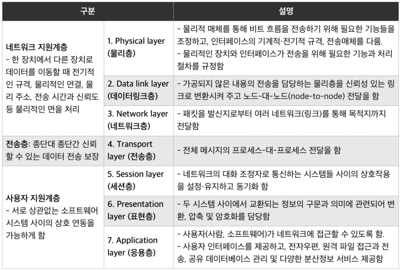
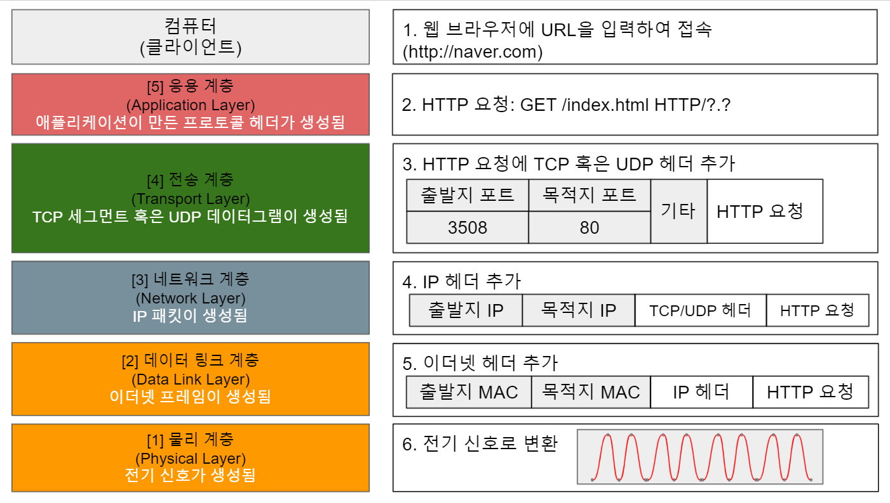
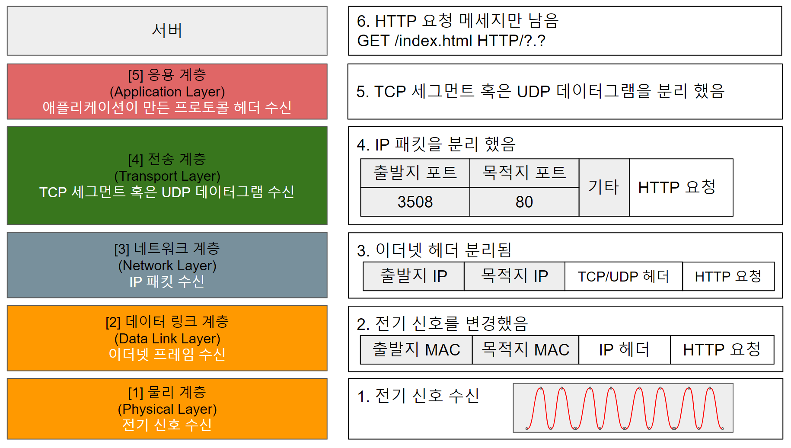

# OSI 7 계층 이해

OSI(Open Systems Interconnection) 모델은 컴퓨터 네트워크와 통신 시스템에서 데이터 통신을 구성하는 다양한 계층을 나눈 개념적인 모델입니다. 이 모델은 7개의 계층으로 구성되며, 각 계층은 서로 다른 기능과 역할을 수행하며 상위 계층과 하위 계층 간의 인터페이스를 정의합니다.  
 - 서로 이질적인 네트워크 간의 연결에 어려움이 많아, 호환성 이슈를 방지하고자 ISO(국제 표준화 기구)에서 OSI 참조모델을 제시하게 된다.
 - OSI 7 모델: 국제표준화기구(ISO)가 1977년에 정의한 국제 통신 표준 규약. 네트워크의 기본 구조를 7개 계층으로 나눠서 표준화한 통신규약으로 현재 다른 모든 통신 규약의 기반이 됨.
 - TCP/IP 모델: OSI 모델 계층의 네트워크에서 데이터를 전송하는 과정을 4개 계층으로 단순화 시켜 사용하는 모델. 인터넷 모델이라고도 한다.
<p style="text-align: center;">
     
</p>
<p style="text-align: center;">
     
</p>

<br/>

## 1계층 (Physical Layer, 물리 계층)

컴퓨터는 전기가 흐른다(1), 흐르지 않는다(0) 신호로 데이터를 정의한다.  
하지만, 전자기파는 항상 0, 무한대, 0, 무한대의 주파수 범위를 갖기 때문에 이런 전기적 신호를 통과시킬 수 없다. 즉, 곡선 형태의 아날로그 신호로 변경해주어야 한다.  
즉, 다른 컴퓨터끼리 통신하기 위해 0, 1의 나열을 아날로그 신호로 바꾸어 전선으로 흘려 보내고, 아날로그 신호를 0, 1의 나열로 해석하는 역할을 하는 것이 물리 계층의 역할이다.  
 - 데이터를 전기 신호로 변환하고 전송하는 역할
 - 비트(Bit) 단위
 - 장비: 케이블, 리피터, 허브

<br/>

## 2계층 (Data Link Layer, 데이터 링크 계층)

데이터 링크 계층은 직접 연결된 이웃 컴퓨터와의 통신만을 다룬다.  
이 계층에서 전송되는 데이터 단위는 프레임이라 부르고, 이웃 컴퓨터와의 통신에 오류가 없도록 다양한 역할을 수행한다.
 - 물리 계층에서 발생할 수 있는 오류를 검출하고 수정하여 신뢰성 있는 연결 제공
 - 랜에서 데이터를 송수신 역할
 - 프레임(Frame) 단위
 - MAC 주소를 통해 장치 식별
 - 장비: 브리지, 스위치

<br/>

## 3계층 (Network Layer, 네트워크 계층)

네트워크 계층은 전송할 데이터를 여러 개의 경로를 거쳐 목적지에 전송하는 계층이다.  
주소(IP)를 정하고 경로를 선택하고, 패킷을 전달하는 것이 네트워크 계층에서 이루어지고 이것을 라우팅이라고 한다.  
라우팅은 네트워크에서 패킷을 보낼 때 목적지까지 갈 수 있는 여러 경로 중 한 경로를 설정해주는 과정이다.  
 - 여러 경로 중에서 최적의 경로를 선택하고 라우팅 수행
 - 다른 네트워크에 데이터를 전달 역할
 - 패킷(Packet) 단위
 - IP 주소를 사용하여 장치를 식별
 - 장비: 라우터, L3 스위치

<br/>

## 4계층 (Transport Layer, 전송 계층)

IP 주소를 통해 모든 데이터를 송수신할 수 있다.  
하지만, 데이터를 주고 받을 수 있다고 해서 끝은 아니다.  
전송 계층은 사용자들이 신뢰성있는 데이터를 받을 수 있도록 전송 속도를 조절하거나, 오류가 발생하면 맞춰주는 역할을 한다.  
 - 목적지에 데이터를 정확히 전달
 - 데이터 통신의 세션 관리 수행
 - TCP 프로토콜: 신뢰성있는 통신을 보장
 - UDP 프로토콜: 빠른 데이터 전송에 초점
 - 장비: L4 스위치 (포트 기반 트래픽 분류, 로드 밸런싱 등)

<br/>

## 5계층 (Session Layer, 세션 계층)

1 ~ 4계층의 주된 기능은 데이터를 전달하는 것이다.  
5계층부터는 데이터를 송수신하는 양쪽 종점 컴퓨터 내의 프로세스들 간의 통신 프로토콜이라 할 수 있다.  
세션 계층에서는 응용 프로그램 간의 통신을 하기 위한 세션을 운영 체제를 통해 확립, 유지, 중단하는 작업을 수행한다.  
즉, 응용 프로그램들 간의 접속을 설정, 유지하고 끊어질 경우 데이터를 재전송하거나 연결을 복구한다.  
 - 데이터 통신의 세션 관리 수행
 - 세션의 시작, 유지, 종료 등을 담당하고, 동기화 및 데이터 교환 제어

<br/>

## 6계층 (Presentation Layer, 표현 계층)

표현 계층은 응용 계층(7계층)에서 넘겨받은 데이터를 세션 계층(5계층)이 다룰 수 있는 데이터로 변환하고, 반대로 세션 계층(5계층)에서 넘겨받은 데이터를 응용 계층(7계층)이 이해할 수 있는 형태로 변환하고 전달한다.  
즉, 사용자들이 상위나 하위 계층에서 사용하는 데이터 표현 양식과 무관하게 사용할 수 있도록 데이터 형식 변환을 담당한다.  
 - 데이터 압축, 암호화, 변환 등의 과정을 거쳐 응용 계층이 이해할 수 있는 형태로 변환
 - 데이터의 형식 변환과 보안 기능을 담당

<br/>

## 7계층 (Application Layer, 응용 계층)

응용 계층은 유저와 가까운 계층으로 응용 프로세스와 직접 관계해 일반적인 응용 서비스를 수행한다.  
 - 최종 사용자에게 네트워크 서비스를 제공
 - 사용자 인터페이스, 파일 전송, 이메일, 웹 브라우징 등의 응용 프로그램이 이 계층에서 동작
 - HTTP: 응용 계층의 프로토콜로 응용 프로그램인 웹이나 브라우저에 필요한 데이터를 송수신할 때 사용
 - FTP: 파일 전송 프로토콜로 서버와 클라이언트 사이의 파일을 주고 받을 떄 사용

<br/>

## 인터넷(HTTP) 통신 흐름

<p style="text-align: center;">
     
</p>
<p style="text-align: center;">
    클라이언트 송신 흐름
</p>
<p style="text-align: center;">
     
</p>
<p style="text-align: center;">
    서버 수신 흐름
</p>

```
★ 이메일을 보내는 과정
 - 클라이언트 송신 흐름
1. 작성된 메세지는 Application 계층(7계층)에서 Presentation 계층(6계층)으로 전달하게 된다.

2. Presentation 계층(6계층)에서는 전달된 메세지를 데이터로 변환 하거나, 암호화 또는 압축을 수행한다. 이렇게 변한된 데이터는 Session 계층(5계층)으로 전달되게 된다.

3. Session 계층(5계층)으로 전달된 데이터는 동기화를 위하여 주기적으로 동기점(sync)을 삽입하여 Transport 계층(4계층)으로 데이터를 전달하게 된다.

4. Transport 계층(4계층)에서는 발신지와 목적지를 정하고 연결 방식을 연결성, 비연결성 방식으로 설정하여, 흐름 제어와 오류 제어 기능을 한다. 데이터 단위를 Segment 또는 Datagram으로 나눈다. 만약에 악성코드가 있을 경우 방화벽이 작동을 해서 걸러준다.

5. Network 계층(3계층)에서 라우팅에 필요한 논리 주소를 설정하고, 패킷에 대한 라우팅 정보를 삽입한다.

6. Data Link 계층(2계층)에는 우선 Frame 단위로 데이터를 나눈다. 그리고 MAC 주소로 지정을 하고 속도 차이를 원할히 메꾸기 위해서 흐름 제어를 한다.

7. Physical 계층(1계층)에는 전송 매체가 일반 케이블인지 광케이블인지 매체의 길이를 설정한다. 그리고 데이터를 회선으로 보내기 위해 전기적인 변환을 담당한다.

 - 서버 수신 흐름
서버의 경우 클라이언트에서 받은 정보들이 하나씩 분리되어 사라지며, 마지막에 HTTP 메세지만 받게 된다.
```

## 참고하면 좋은 블로그

 - [OSI 7계층 흐름](https://velog.io/@jakeseo_me/OSI-7%EA%B3%84%EC%B8%B5-%EC%8B%9C%EB%A6%AC%EC%A6%88-6-OSI-7%EA%B3%84%EC%B8%B5-%EC%A0%84%EC%B2%B4%EC%A0%81%EC%9D%B8-%ED%9D%90%EB%A6%84-%EC%A0%95%EB%A6%AC)
 - [OSI 7 계층 그림으로 이해하기](https://velog.io/@jeongs/%EB%84%A4%ED%8A%B8%EC%9B%8C%ED%81%AC-OSI-7-%EA%B3%84%EC%B8%B5-%EA%B7%B8%EB%A6%BC%EA%B3%BC-%ED%95%A8%EA%BB%98-%EC%9D%B4%ED%95%B4%ED%95%98%EA%B8%B0)
 - [프로토콜과 TCP/IP 이해하기](https://m.blog.naver.com/wngjs3/222067721866)