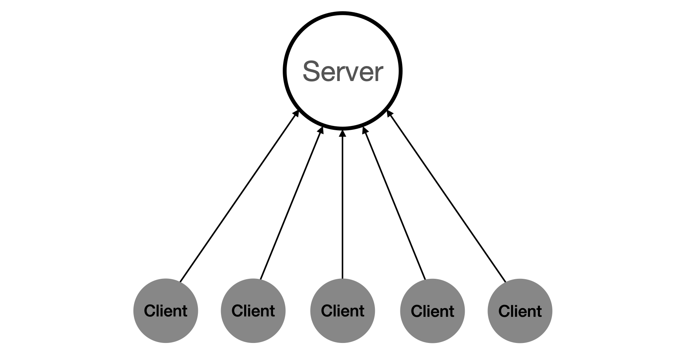
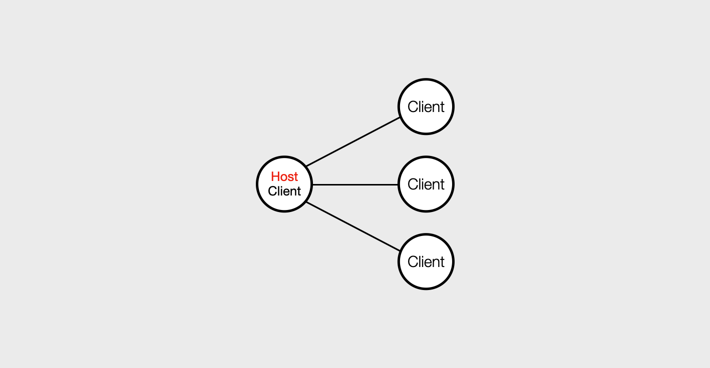
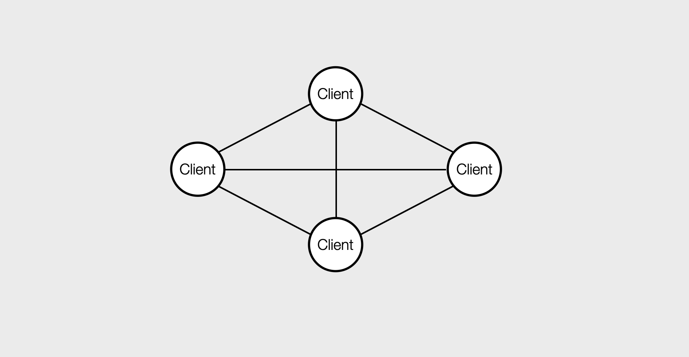

# 게임 서버 종류

 - 참고 자료
    - https://xclass.tistory.com/m/276
    - http://post.procademy.co.kr/archives/312
    - https://youtu.be/YHswt4VCeJs?si=QMuHGZl1LMplEbPU

 

## 전용 서버 (Dedicated Server)

전용 서버는 특정 게임을 호스팅하기 위해 완전히 헌신된 서버입니다. 고성능의 하드웨어를 사용하며, 안정적이고 빠른 연결을 제공합니다. 이러한 서버는 대규모 온라인 게임(MMO)에서 주로 사용됩니다.  
 - 모든 클라이언트가 1개의 전용 서버를 중심으로 데이터를 주고 받는다.
 - 이벤트에 대한 모든 네트워크 트래픽이 서버에 집중된다. 떄문에, 빠른 응답성을 요구하는 FPS에서는 적합하지 않다.
 - 예시: 클라이언트가 Field에 있는 상대방을 공격했다고 하면, 공격했다는 데이터는 서버게 전송되어, 서버는 피격 판정, 미스 판정을 확정하여 다시 모든 클라이언트에게 보내게 된다.

    

 

## 리스닝 서버 (Listening Server) 혹은 Super Peer

리스닝 서버는 플레이어가 자신의 컴퓨터에서 직접 서버를 호스팅하는 방식입니다. 즉, 서버와 클라이언트가 동일한 기기에서 실행됩니다. 소규모 친구들과의 게임 플레이에 적합하지만, 호스트 플레이어의 인터넷 속도와 컴퓨터 성능에 따라 성능이 좌우됩니다.  
 - 클라이언트 중 한 명이 서버의 역할을 겸임한다. 서버의 역할을 하는 클라이언트를 호스트로 지칭하며, 다른 클라이언트들은 호스트와 통신을 진행한다.
 - 호스트와 물리적인 거리가 가까운 사용자끼리는 지연시간이 짧다.
 - 호스트의 악의적인 데이터 변조에 취약하다.

    

 

## P2P(Peer to Peer)

P2P 서버는 전통적인 서버-클라이언트 모델 대신, 각 플레이어가 서버 역할을 하는 분산 네트워크 방식입니다. 특정 중앙 서버 없이 플레이어들 간의 직접 연결을 통해 게임 데이터를 교환합니다. 소규모 멀티플레이 게임에 적합하지만, 보안과 안정성에 제한이 있을 수 있습니다.  
 - 게임에 참가한 모두가 호스트 역할을 진행한다. 클라이언트들이 모두 서로 연결된다.
 - 모든 클라이언트가 직접 연산을 진행하고 그 결과를 다른 클라이언트에 전파하여 통신을 진행한다.
 - 모든 클라이언트가 서로 연결된 형태이기 떄문에, 클라이언트가 많아질수록 급격하게 연산량이 많아지며, 통산적으로 최대 클라이언트 수가 정해져 있다.
 - 보안 문제: P2P 네트워크는 분산 구조로 인해 중앙 관리자가 없어 보안 관리가 어렵습니다. 데이터 유출, 악성 코드 유포 등의 위험이 존재한다.

    

 

