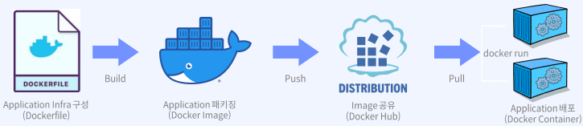

# 컨테이너 기술이란?

컨테이너는 애플리케이션을 언제든 실행 가능하도록 필요한 모든 요소(소스 코드, 구성 요소, 종속성 등)를 하나의 런타임 환경으로 패키지한 논리적 공간을 말한다. 한마디로, 애플리케이션과 종속 항목을 하나로 묶어, 실행하게 해주는 운영 시스템을 가상화한 경량의 격리된 프로세스라고 볼 수 있다.  
컨테이너 기술은 개인 PC, 기업 내의 온프레미스 서버, AWS 퍼블릭 클라우드 등 언제 어디서든 빠르고 효율적으로 배포 가능하며, 확장성 또한 가지고 있다. 이를 통해 서버 구성, OS 설치, 네트워크, 개발 도구 구성 등의 반복적이고 불편한 작업에 시간을 낭비하지 않고 개발자는 애플리케이션 개발 그 자체에 집중할 수 있게 된다.  
 - microVM 이라고도 한다.
 - 운영체제 수준의 가상화 제공
 - 독립성을 갖기 때문에 다른 컨테이너에 영향을 주지 않는 statless 환경 제공

 

## 컨테이너 특징

 - 컨테이너는 최소한의 Image를 통해 실행되므로 경량이다.
 - 일반 서버 환경에서의 애플리케이션 실행과 달리 언제든 프로세스 수준의 속도로 빠르게 실행할 수 있고, 한 번에 여러 개의 컨테이너를 동시에 실행 가능하다.
 - 개인 환경, 클라우드 환경, 어떤 OS, 어떤 환경에서든지 동작 가능한 이식성을 보유하고 있다.
 - 컨테이너 자체 애플리케이션 환경에 대한 관리만 요구되므로 지속적 서버 관리 비용을 절감할 수 있다.

 

## 컨테이너 타입

컨테이너는 이미지를 패키징하여 실행하여 사용할 수 있도록 하는 패키징 메커니즘이다.  
패키징 메커니즘을 보통 시스템, 애플리케이션, 라우터 컨테이너로 나눌 수 있다.  

 - 시스템 컨테이너
    - 호스트 OS 위에 Ubuntu와 같은 배포판 리눅스 이미지를 통해 배포되는 컨테이너
    - 또 다른 VM의 형태로, 내부에 다양한 애플리케이션 및 라이브러리 도구를 설치하고 실행이 가능하다.
    - 대표적으로 LXC, LXD, OpenVZ, Linux VServer, BSD Jails 등이 있다.
        - Ubuntu 20.04, CentOS 7, RHEL 8 등
 - 애플리케이션 컨테이너
    - 단일 애플리케이션 실행을 위해 해당 서비스를 패키징하고 실행하도록 설계된 컨테이너이다.
    - 3-tier 애플리케이션과 같은 경우 각 tier를 개별 컨테이너로 실행하여 연결한다.
    - 대표적으로 Docker container runtime, Rocket 등이 있다.
        - Nginx 1.23.1, Python 3.10, MySQL 8.0 등

 

## Docker란?

도커(Docker)는 컨테이너 기반의 가상화 플랫폼으로, 개발과 배포를 더욱 효율적으로 관리하기 위해 사용되는 오픈 소스 소프트웨어입니다. 도커를 사용하면 애플리케이션과 그에 필요한 환경을 컨테이너로 패키징하여 빠르고 쉽게 배포할 수 있습니다.  

 

도커(Docker)는 여러 계층의 애플리케이션을 컨테이너로 분리, 연결하여 실행하는 MSA 프로젝트에 유용하며, 애플리케이션의 인프라(runtime)는 이미지를 통해 제공하고, Public or Private 하게 공유가 가능하다. Github과 유사한 방식(Open Share)으로 도커 허브에서 제공한다. 이렇게 제공된 이미지를 기반으로 애플리케이션 서비스를 컨테이너화하여 운영할 수 있다.  

 - 컨테이너 기반 가상화: 도커는 컨테이너라는 단위로 애플리케이션과 그에 필요한 라이브러리, 실행환경을 격리된 상태로 패키징합니다. 이러한 격리된 환경 덕분에 도커 컨테이너는 호스트 시스템과는 독립적으로 실행되며, 이식성과 확장성이 높아집니다.
 - 간편한 배포: 도커를 사용하면 개발 환경과 운영 환경 간의 일관성을 유지하면서, 개발한 애플리케이션을 더욱 쉽고 빠르게 배포할 수 있습니다. 도커 컨테이너는 어떤 환경에서든 실행 가능하므로 "한 번 작성하고 어디서든 실행한다"라는 철학을 실현합니다.
 - 성능: 도커 컨테이너는 가상 머신과 비교하여 가볍고 빠르게 시작됩니다. 호스트 운영체제의 커널을 공유하기 때문에 오버헤드가 적어집니다.
 - 확장성: 도커는 클라우드와 컨테이너 오케스트레이션 도구(예: Kubernetes)와 연동하여 자동화된 확장과 로드 밸런싱을 수행할 수 있어 대규모 애플리케이션 배포에도 적합합니다.
 - 이미지 관리: 도커 이미지는 컨테이너를 실행하기 위한 파일과 설정 정보들을 포함하고 있으며, 버전 관리 및 배포가 쉬워집니다.

     

