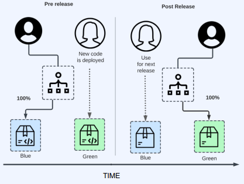
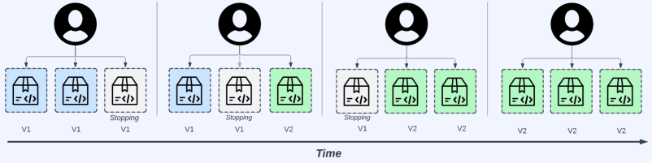
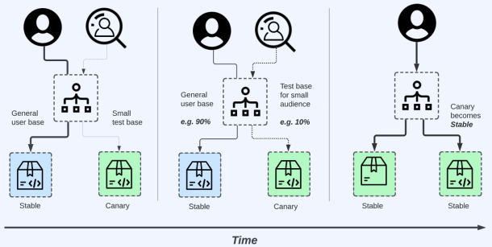

# 무중단 배포 원리

무중단 배포(Continuous Deployment)는 소프트웨어 개발에서 변경사항을 지속적으로 테스트하고, 릴리즈하여 운영 환경에 배포하는 프로세스를 뜻합니다. 무중단 배포를 통해 사용자들에게 서비스 중단 없이 최신 버전의 애플리케이션을 제공할 수 있습니다.  
무중단 배포는 비즈니스 요구 사항에 빠르게 대응하고, 안정적인 서비스를 제공하기 위한 중요한 개발 방법론 중 하나입니다. CI/CD 파이프라인과 지속적인 자동화를 통해 품질 높은 소프트웨어를 빠르게 제공할 수 있으며, 사용자들의 편의성과 만족도를 높일 수 있습니다.  
 - 서버 그룹과 롤링 업데이트: 무중단 배포는 서버 그룹을 사용하여 트래픽을 처리하는 서버를 여러 개 운영합니다. 각 서버는 별도의 환경(예: 개발, 스테이징, 프로덕션)에서 작동하며, 업데이트되는 동안에도 사용자 요청을 처리할 수 있어야 합니다. 롤링 업데이트를 통해 서버 그룹의 일부를 업데이트하고 기존 서버들이 정상적으로 처리하는지 확인한 후 나머지 서버들도 업데이트합니다.
 - 로드 밸런싱: 무중단 배포 시 로드 밸런서를 사용하여 트래픽을 여러 서버 그룹으로 분산시킵니다. 이를 통해 사용자들이 일관된 서비스를 경험하며, 특정 서버의 과부하를 피할 수 있습니다.

 

---
## 블루 그린

블루 그린 배포(Blue-Green Deployment)는 소프트웨어 배포 방법 중 하나로, 사용자들에게 중단 없이 새로운 버전의 애플리케이션을 제공하는 전략입니다. 이러한 방식은 서비스 중단 시간을 최소화하고, 배포 중에 발생할 수 있는 문제를 미리 확인하고 대응하는 데 유용합니다.  
블루 그린 배포는 무중단 배포의 한 방식으로서, 사용자들에게 서비스 중단 없이 새로운 버전의 애플리케이션을 제공할 수 있습니다. 또한 롤백을 쉽게 수행할 수 있어 배포 중 문제가 발생하는 경우에도 빠른 대응이 가능합니다.  
 - 블루(BLUE) 그린(GREEN) 환경: 블루 그린 배포는 두 개의 별도 환경(블루와 그린)을 운영합니다. 초기에는 블루 환경에서 현재 버전의 애플리케이션이 동작하고 있으며, 사용자들이 해당 서비스를 이용합니다.
 - 새로운 버전 배포: 애플리케이션을 업데이트하고자 할 때, 새로운 버전의 애플리케이션을 블루 환경 외에 별도의 그린 환경에 배포합니다. 이 단계에서는 사용자들이 새 버전을 접근할 수 없도록 설정합니다.
 - 서버 그룹 전환: 새로운 버전의 애플리케이션 배포가 완료되면, 블루 그린 배포는 서버 그룹을 전환합니다. 이 단계에서는 블루 환경의 서버 그룹을 그린 환경으로 변경하여 사용자의 트래픽을 그린 환경으로 이동시킵니다.
 - 테스트와 롤백: 그린 환경에서 새로운 버전을 사용하면서 테스트를 진행합니다. 만약 문제가 발생한다면 블루 환경으로의 롤백(되돌리기)이 쉽게 가능합니다. 롤백을 통해 사용자 서비스에 대한 영향을 최소화할 수 있습니다.
 - 로드 밸런싱: 블루 그린 배포에서는 로드 밸런서를 사용하여 트래픽을 블루와 그린 환경으로 분산시킵니다. 이를 통해 사용자들이 일관된 서비스를 경험하며, 특정 환경의 과부하를 피할 수 있습니다.

     

 

## 롤링 업데이트

롤링 업데이트(Rolling Update)는 소프트웨어 배포 방법 중 하나로, 서비스의 지속적인 가용성을 유지하면서 새로운 버전의 애플리케이션을 점진적으로 배포하는 전략입니다. 이러한 방식은 서비스 중단 시간을 최소화하고, 사용자들에게 최신 버전의 애플리케이션을 제공하는데 유용합니다.  
롤링 업데이트는 새로운 버전의 애플리케이션을 점진적으로 배포하는 방식으로서, 전체 배포 완료 전까지 기존 서비스의 가용성을 유지하면서 사용자들에게 최신 버전의 애플리케이션을 제공할 수 있습니다. 또한 롤백을 쉽게 수행할 수 있어 배포 중 문제가 발생하는 경우에도 빠른 대응이 가능합니다.  
 - 서버 그룹: 롤링 업데이트는 여러 대의 서버를 서버 그룹으로 묶어 배포하는 방식을 사용합니다. 이 서버 그룹은 로드 밸런서 등을 통해 사용자 트래픽을 분산 처리하는 역할을 수행합니다.
 - 새로운 버전 배포: 새로운 버전의 애플리케이션을 배포하기 위해, 먼저 새로운 버전의 애플리케이션을 하나의 서버 또는 일부 서버에 배포합니다. 이 서버는 새 버전을 실행하면서 기존 버전과 함께 동작합니다.
 - 서버 그룹 전환: 새로운 버전의 애플리케이션 배포가 완료되면, 서버 그룹을 점진적으로 변경합니다. 기존 서버 그룹에서 새로운 서버 그룹으로 서비스의 트래픽을 천천히 이동시킵니다.
 - 테스트와 롤백: 새로운 버전의 애플리케이션 배포가 완료된 후에는 새 버전의 서버 그룹에서 테스트를 진행합니다. 만약 문제가 발생한다면 이전 버전으로 롤백(되돌리기)이 쉽게 가능합니다. 롤백을 통해 사용자 서비스에 대한 영향을 최소화할 수 있습니다.
 - 전체 배포 완료: 새로운 버전의 애플리케이션 배포가 모든 서버 그룹으로 완료되면 롤링 업데이트가 완료됩니다. 이로써 사용자들은 새로운 버전의 애플리케이션을 사용하며, 서비스는 지속적인 가용성을 유지하게 됩니다.

     

 

## 카나리

카나리(Canary) 또는 카나리 배포(Canary Deployment)는 소프트웨어 배포 방법 중 하나로, 새로운 버전의 애플리케이션을 사용자들에게 점진적으로 릴리즈하는 전략입니다. 카나리 배포는 일부 사용자 또는 특정 그룹의 사용자에게만 새 버전을 제공하고, 그들의 반응을 모니터링하여 문제를 조기에 발견하고 대응하는데 주로 사용됩니다.  
카나리 배포는 새 버전의 애플리케이션을 점진적으로 릴리즈하면서 사용자들의 반응을 모니터링하여 안정성과 성능을 확인하는 데 사용됩니다. 이를 통해 사용자들에게 가장 우수한 사용자 경험을 제공하고, 배포 중 발생할 수 있는 문제를 최소화할 수 있습니다.  
 - 새로운 버전 배포: 새로운 버전의 애플리케이션을 일부 사용자 또는 특정 그룹의 사용자에게 제공하기 시작합니다. 이러한 사용자들을 "카나리"라고 합니다. 이 단계에서는 대다수의 사용자는 여전히 기존 버전의 애플리케이션을 사용합니다.
 - 모니터링: 카나리 배포가 시작되면, 카나리 사용자들의 반응과 서비스 성능을 지켜봅니다. 이를 통해 새 버전의 애플리케이션에 대한 성능 문제, 버그, 또는 호환성 문제를 조기에 발견할 수 있습니다.
 - 전체 배포 여부 결정: 카나리 사용자들의 경험이 만족스러운지 확인한 후, 문제가 발생하지 않았다고 판단되면 새 버전의 애플리케이션을 전체 사용자에게 배포할 수 있습니다. 반대로 문제가 발생한 경우, 배포를 중단하거나 롤백하여 기존 버전의 애플리케이션을 사용자들에게 다시 제공할 수 있습니다.

     

