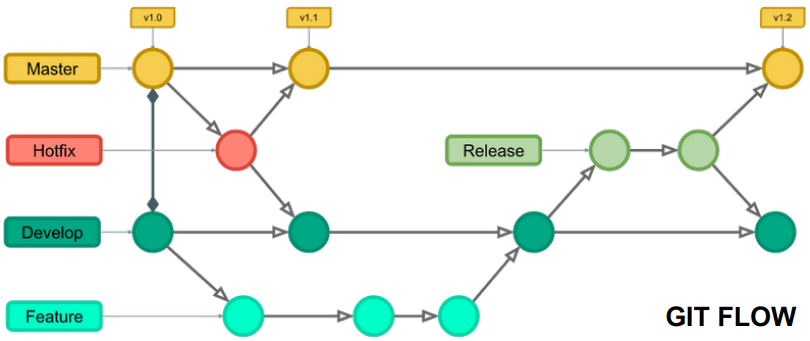
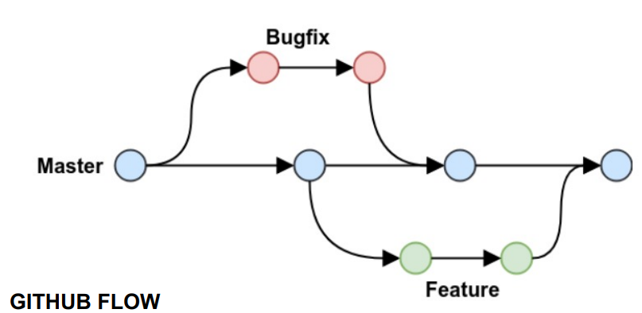

# 브랜치 전략과 CI-CD

만약, Git 형상 관리 시스템을 사용 중이라면 Git Flow, Github Flow, Gitlab Flow 등 Git 을 사용한 브랜치 전략을 사용할 수 있다.  

 

## Git Flow

Git Flow는 Git을 이용한 소프트웨어 개발에서 사용되는 브랜치 관리 전략 중 하나로, 원활한 협업과 소프트웨어 릴리즈를 위한 표준적인 접근 방식입니다. Vincent Driessen이 제안한 Git Flow 모델은 메인 브랜치와 서포트 브랜치를 포함하여 총 5개의 브랜치를 사용합니다.  

 

Master 브랜치와 Develop 브랜치를 따로 운영하며 신규 기능을 Feature 브랜치를 만들어 작업을 한다. 이후에 개발이 완료되면 Develop 브랜치로 머지한다. 릴리즈할 타이밍이 되면, Develop 브랜치로부터 Release 브랜치를 만들고, 이 브랜치를 이용해 테스트와 버그 수정을 하게 된다. 이후 충분히 품질이 확보되면, 최종 Release 브랜치를 Develop 브랜치와 Master 브랜치로 머지한다. 마스터 브랜치로 머지가 되면, 태그를 만들어 해당 태그가 가리키는 지점이 최종 배포되는 지점임을 명시한다. 릴리즈 이후에 핫 픽스가 필요하게 되면, Master 브랜치에서 Hotfix 브랜치를 만들어 변경을 작업하며 변경 사항을 Master 브랜치와 Develop 브랜치로 머지한다.  

 - Git Flow의 주요 브랜치:
    - master 브랜치: 제품으로 출시될 수 있는 안정된 코드만을 가지고 있는 브랜치입니다. 즉, 제품의 현재 버전과 동일한 코드를 유지하며, 이 브랜치로부터 배포용 태그를 생성하여 릴리즈합니다.
    - develop 브랜치: 개발 중인 최신 코드를 유지하는 브랜치입니다. 새로운 기능들이 추가되고 버그가 수정되며, 기능 개발이 완료되면 release 브랜치를 통해 마스터 브랜치로 합쳐집니다.
 - Git Flow의 보조 브랜치:
    - feature 브랜치: 새로운 기능을 개발할 때 사용하는 브랜치입니다. 개발자는 develop 브랜치에서 feature 브랜치를 생성하여 새로운 기능을 개발하고, 기능 개발이 완료되면 develop 브랜치로 다시 합칩니다.
    - release 브랜치: 마스터 브랜치로의 배포를 위해 준비하는 브랜치입니다. 개발이 완료되어 배포할 준비가 되면 develop 브랜치에서 release 브랜치를 생성하고, 테스트와 버그 수정이 이루어진 후 master와 develop 브랜치로 병합하여 배포합니다.
    - hotfix 브랜치: 제품의 긴급한 버그 수정이 필요할 때 사용하는 브랜치입니다. master 브랜치에서 문제가 발생한 경우, 즉시 hotfix 브랜치를 생성하여 수정한 뒤 master와 develop 브랜치에 반영합니다.
 - Git Flow에서의 CI/CD
    - 회사 및 조직마다 CI/CD 정책이 다를 수 있다.
    - Feature 브랜치에 신규 코드가 커밋될 때마다 지속적으로 CI를 실행한다.
    - Feature 브랜치가 Develop 브랜치에 머지될 때마다 Develop 브랜치에 대해 CI 및 CD를 수행한다. (즉, Develop 브랜치에 변경이 일어날 때마다 개발 서버에 배포한다.)
    - Release 브랜치는 테스트트와 버그 수정이 일어나야 한다. 때문에, 자동으로 CI만 수행하고 필요시마다 수동으로 배포하거나 자동으로 QA 서버로 배포하는 정책을 사용할 수 있다.
    - Master 브랜치는 최종 배포되는 버전이기 때문에, 변경이 머지될 때마다 CI를 수행하고 수동으로 특정 태그에 해당하는 버전을 서버에 배포할 수 있다.

     

 

## Github Flow

GitHub Flow는 GitHub를 기반으로 한 단순하고 유연한 협업 방법론으로, 프로덕션 릴리즈를 주기적으로 진행하는 대신 빠른 릴리즈와 지속적인 배포에 초점을 둔 개발 접근 방식입니다. GitHub Flow는 크게 3가지 주요 개념에 기반하고 있습니다.  
GitHub Flow는 단계가 간소하고 빠르며, 지속적으로 작은 배포를 하도록 유도합니다. 이 방법론을 통해 릴리즈 주기가 짧아지고 사용자들에게 빠르게 새로운 기능을 제공할 수 있습니다. 또한 PR과 코드 리뷰를 통해 코드 품질을 개선하고, 팀원들 간의 협업을 촉진합니다.  

 

Github Flow에서는 Master(메인) 브랜치만을 유지하고, Feature 혹은 Bugfix가 필요할 때 브랜치를 만들고 이를 PR로 올려서 리뷰를 받고, Master 브랜치에 머지한다.  
Github Flow에서는 각각의 Feature 브랜치들이 커밋되면, 빌드와 테스트를 실행하여 변경 사항이 시스템을 깨뜨리지 않으면 Master 브랜치에 머지한다. Master 브랜치에 머지가 되면, Master 브랜치의 내용을 자동으로 CI/CD하여 개발서버에 배포한다. QA/운영 서버에서는 수동으로 배포담당자가 CI/CD를 수행하여 특정 버전을 배포할 수 있다.

 - Main Branch: GitHub Flow에서는 보통 master 또는 main 브랜치를 사용합니다. 이 브랜치는 항상 제품으로 출시될 수 있는 안정된 상태를 유지해야 합니다. 모든 기능 개발, 버그 수정 등은 이 브랜치에서 이루어집니다.
 - Feature Branches: 새로운 기능을 개발하거나 버그를 수정하기 위해 main 브랜치에서 분기된 개별적인 브랜치를 사용합니다. 이러한 브랜치는 보통 "feature/" 또는 "bugfix/"와 같은 접두어를 사용하여 이름을 지정합니다. 개발자들은 각각의 기능 또는 버그 수정을 별도의 브랜치에서 작업합니다.
 - Pull Requests (PR): 기능 개발 또는 버그 수정이 완료되면, 해당 브랜치에서 main 브랜치로의 병합을 위해 Pull Request를 생성합니다. Pull Request는 코드 리뷰를 통해 변경사항에 대한 피드백을 받을 수 있고, CI/CD 파이프라인을 실행하여 테스트를 수행할 수 있습니다. 코드 리뷰와 테스트를 통과한 후에는 해당 브랜치가 main 브랜치로 병합됩니다.

     

 

## GitLab Flow

GitLab Flow는 GitLab을 기반으로 한 협업 방법론으로, 간단하고 효율적인 개발과 지속적인 배포에 중점을 둔 개발 접근 방식입니다. GitLab Flow는 GitLab의 기능을 최대한 활용하여 개발과 배포를 간소화하고 통합합니다.  
GitLab Flow는 GitLab의 다양한 기능을 활용하여 개발과 배포를 통합하고, 협업을 간편하게 만들어줍니다. 이 방법론을 통해 개발자들은 개발 과정에서 더욱 효율적으로 협력하며, 배포를 빠르고 안정적으로 수행할 수 있습니다.  

 

Git Flow는 너무 복잡하고, Github Flow는 너무 간단하다.  
떄문에, 이들에 중간지점인 GitLab Flow를 도입할 수 있다.  
GitLab Flow는 기능(Feature) 브랜치들이 머지되는 Master 브랜치와 운영 서버 배포 대상인 Production 브랜치를 가진다.  
Master 브랜치가 어느정도 완성될 때마다 Production 브랜치로 머지하는 정책을 가진다.  
GitLab Flow는 적당한 복잡성과 제어권이 주어지기 때문에, 용이하다.

 - GitLab Flow에서의 CI/CD
    - Master 브랜치는 자동으로 CI/CD하여 개발서버에 배포한다.
    - Production 브랜치는 자동으로 CI만 수행하고, QA 서버에서는 자동 혹은 수동으로 배포하고, 운영서버에는 수동으로 배포하도록 할 수 있다.