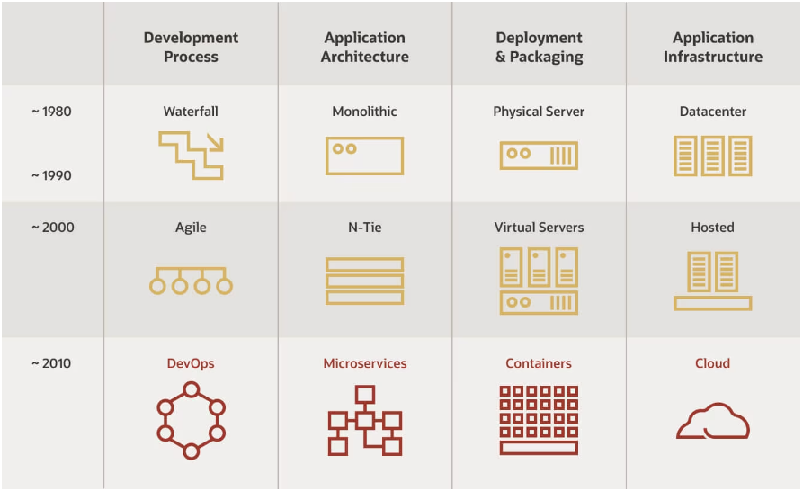
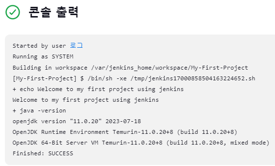

# DevOps와 CI/CD의 이해

## Waterfall vs Agile

Waterfall과 Agile은 소프트웨어 개발 방법론(Methodology) 또는 프로젝트 관리 방식입니다. 이 두 방법론은 소프트웨어 개발 및 프로젝트 관리 접근 방식에서 크게 다릅니다.  
두 방법론 간의 선택은 프로젝트의 성격, 요구 사항의 변동성, 일정, 예산 및 프로젝트 목표에 따라 다릅니다. Waterfall은 예측 가능한 프로젝트에서 유용할 수 있지만, Agile은 변화와 협력이 필요한 프로젝트에 더 적합할 수 있습니다. 종종 두 방법론의 요소를 혼합하여 하이브리드 방법론을 채택하기도 합니다.  

<div align="center">
    
</div>
<div align="center">
    출처 - https://www.oracle.com/kr/cloud/cloud-native/what-is-cloud-native/
</div>

<br/>

### Waterfall(폭포수 모델)

Waterfall 방법론은 전통적인 개발 방법론 중 하나로, 선형적인 접근 방식을 채택합니다. 다음 단계로 넘어가기 전에 각 단계를 완료하고 결과물을 검증하는 순차적인 접근 방식을 따릅니다.  
 - 단계별 진행: 요구 사항 정의, 설계, 개발, 테스트, 배포 및 유지 보수와 같은 단계를 순차적으로 진행합니다.
 - 요구 사항 변경 어려움: 한 번 요구 사항이 정의되면 변경하기 어려우며, 변경 사항은 종종 비용과 시간을 증가시킵니다.
 - 전체 범위 미리 결정: 프로젝트 범위, 일정 및 예산은 초기에 정확하게 결정됩니다.
 - 큰 프로젝트에 적합: 큰 규모의 프로젝트에서 효과적일 수 있으며, 안정성과 예측 가능성을 중요시하는 경우에 적합합니다.

<br/>

### Agile(애자일)

Agile 방법론은 Waterfall과 대조적으로 민첩한 접근 방식을 채택합니다. 개발 작업을 작은 반복적인 주기로 나누고, 요구 사항 변경을 환영하며 고객과의 끊임없는 협력을 강조합니다.  
 - 반복과 반응: 개발 작업을 짧은 주기로 나누어 진행하고, 각 주기 끝에 결과물을 검토하며 요구 사항 변경에 민첩하게 대응합니다.
 - 요구 사항 변경 용이: 고객 요구 사항의 변화를 수용하며 프로젝트 중간에 수정 가능합니다.
 - 고객 중심: 고객의 피드백을 활용하여 제품을 개선하며 고객의 우선 순위를 중요하게 생각합니다.
 - 적응 가능: 프로젝트의 진행 상황에 따라 계획을 조정하고 최적화할 수 있습니다.
팀 협력: 작은 팀이 긴밀하게 협력하며 자체 조직을 통해 작업을 관리합니다.

<br/>

### 클라우드 네이티브 아키텍처


클라우드 네이티브 아키텍처(Cloud-Native Architecture)는 애플리케이션과 시스템을 클라우드 환경에서 최적화하고 구축하는 방식을 지칭합니다. 클라우드 네이티브 아키텍처는 전통적인 데이터 센터나 로컬 서버 환경과 달리 클라우드 플랫폼을 활용하여 높은 확장성, 가용성, 신속한 배포 및 관리를 지원하는 방식으로 설계됩니다.  

<br/>

클라우드 네이티브 아키텍처 및 기술은 클라우드에서 빌드되고 클라우드 컴퓨팅 모델을 최대한 활용하는 워크로드를 디자인, 생성 및 운영하는 접근 방식입니다.  
클라우드 네이티브 기술을 통해 조직은 퍼블릭, 프라이빗 및 하이브리드 클라우드와 같은 최신 동적 환경에서 확장 가능한 애플리케이션을 빌드하고 실행할 수 있습니다. 컨테이너, 서비스 메시, 마이크로 서비스, 변경할 수 없는 인프라 및 선언적 API는 이 접근 방식을 예로 들 수 있습니다.  
이러한 기술을 사용하면 복원력, 관리 기능 및 관찰 가능한 느슨하게 결합된 시스템을 사용할 수 있습니다. 강력한 자동화와 결합되어 엔지니어는 최소한의 수고로 자주 예측 가능하게 높은 영향을 미치는 변경을 할 수 있습니다.  

<br/>

## Cloud Native Application의 구성요소

 - 마이크로서비스 아키텍처: 클라우드 네이티브 애플리케이션은 작고 독립적인 서비스로 분해됩니다. 이러한 마이크로서비스는 개별적으로 개발, 배포 및 확장 가능하며, 각 서비스는 특정 기능 또는 비즈니스 로직을 담당합니다.
 - 컨테이너화: 애플리케이션 컴포넌트는 컨테이너 기술을 사용하여 패키징되며, Docker와 Kubernetes와 같은 오케스트레이션 도구를 활용하여 관리됩니다. 이렇게 하면 애플리케이션 이식성과 확장성이 향상됩니다.
 - 자동화: 클라우드 네이티브 환경에서는 자동화가 핵심 요소입니다. CI/CD (Continuous Integration/Continuous Deployment) 파이프라인을 통해 소프트웨어 배포를 자동화하고, 오토스케일링과 같은 클라우드 서비스 기능을 사용하여 리소스 관리를 자동화합니다.
 - 탄력성과 가용성: 클라우드 네이티브 애플리케이션은 장애 발생 시에도 가용하고 탄력적으로 대응할 수 있어야 합니다. 다중 리전 및 가용 영역을 활용하여 고가용성을 유지하고, 자동 장애 복구 기능을 통해 서비스를 지속적으로 제공합니다.
 - 서비스 메시: 서비스 메시 아키텍처를 활용하여 마이크로서비스 간의 통신을 관리하고 보안, 부하 분산, 모니터링 등을 처리합니다.
 - 서버리스 컴퓨팅: 클라우드 네이티브 애플리케이션에서는 필요한 경우 서버리스 컴퓨팅 서비스를 사용하여 코드 실행을 관리하며, 리소스 할당과 관리를 클라우드 공급업체에게 위임합니다.

<div align="center">
    
</div>
<div align="center">
    Inner Architecture는 도메인, 비즈니스 로직 등 내부 서비스에 대한 설계 <br/>
    (서비스 정의, DB Access 구조, API 설계 등)
    Outer Architecture는 애플리케이션을 운영하고 작동될 수 있도록 지원하는 부분 <br/>
    (External Gateway, Service Mesh, Container Management, Backing Service, Telemetry, CI/CD Automation 등)
</div>
<div align="center">
    
</div>

<br/>

## CI/CD 자동화 도구의 이해


CI/CD는 "Continuous Integration"와 "Continuous Deployment" 또는 "Continuous Delivery"의 줄임말로, 소프트웨어 개발 및 배포 프로세스를 자동화하고 지속적으로 통합하고 제공하는 소프트웨어 개발 방법론입니다.  
CI/CD를 통해 팀은 소프트웨어를 신속하게 빌드, 테스트 및 제공하여 빠르게 사용자에게 새로운 기능을 제공하고 버그를 수정할 수 있습니다. 이는 개발 생산성을 높이고 소프트웨어의 안정성과 신뢰성을 향상시키는 데 도움이 됩니다.  

<br/>

### Continuous Integration (CI - 지속적 통합)

CI는 개발자들이 작성한 코드를 정기적으로 (보통 여러 번 하루에 한 번 이상) 통합하는 프로세스를 의미합니다.  

```
1. 코드 변경 사항을 공유 코드 저장소 (예: Git)에 커밋합니다.
2. CI 서버 (예: Jenkins, Travis CI, CircleCI)는 새 코드를 가져와서 자동으로 빌드, 테스트, 정적 분석 및 기타 검증 프로세스를 실행합니다.
3. CI 서버는 빌드 및 테스트 결과를 팀에게 알립니다.
4. 만약 문제가 발생하면, 팀은 빠르게 문제를 해결하고 개선된 코드를 다시 커밋하여 통합합니다.
```

<br/>

### Continuous Deployment (CD - 지속적 배포) 및 Continuous Delivery (지속적 제공)

CD는 CI의 확장으로, 지속적으로 개발된 소프트웨어를 자동으로 프로덕션 환경에 배포하는 것을 의미합니다.   
 - Continuous Delivery (CD)
    - Continuous Delivery는 개발된 코드가 품질 테스트 및 스테이징 환경을 거쳐 승인 단계를 거친 후에 프로덕션 환경에 배포될 준비가 되었음을 의미합니다. 배포 프로세스를 자동화하고 프로덕션 환경으로 배포하기 위한 검증 단계가 수동으로 이루어질 수 있습니다.
 - Continuous Deployment (CD)
    - Continuous Deployment는 코드가 통합되면 자동으로 프로덕션 환경에 배포되는 것을 의미합니다. 승인 단계나 수동 검토 없이 자동 배포가 이루어집니다.

<br/>

## CI/CD Work flow

```
1. 버전 관리 도구인 Git을 통해 코드를 저장소에 커밋과 푸시한다.
2. Github Webhook을 통해 Jenkins에 소스 코드 버전 관리가 새롭게 되었다고 알린다.
3. Jenkins는 빌드 도구(Maven, Gradle)를 통해 코드를 빌드한다.
4. Jenkins는 빌드된 결과물을 운영서버에 배포한다.
 - 컨테이너 가상화 환경에 배포한다면 Docker 컨테이너를 이용할 수 있다.
 - 또, 도커 컨테이너들의 시스템 관리를 위해 쿠버네티스를 이용할 수 있다.
 - ※ Jenkins에 바로 Tomcat 혹은 Docker에 배포를 할 수도 있지만, 중간에 IaC(Ansible, Terraform)을 추가하여 이용할 수도 있다.
```

<br/>

## Jenkins 소개

Jenkins는 오픈 소스 자동화 도구로, 지속적 통합 (Continuous Integration, CI) 및 지속적 배포 (Continuous Deployment, CD) 워크플로우를 구현하고 관리하는 데 사용되는 소프트웨어입니다. Jenkins는 다양한 플러그인과 함께 사용되며, 소프트웨어 개발 및 배포 프로세스를 자동화하고 최적화하는 데 도움을 줍니다.  
 - 자동화된 빌드: Jenkins는 코드 커밋이나 일정한 주기에 따라 소스 코드를 자동으로 가져와 빌드 프로세스를 실행합니다. 이는 소프트웨어 빌드 작업을 자동화하여 일관된 빌드 결과를 생성하고 버그를 빠르게 식별할 수 있도록 도와줍니다.
 - 다양한 통합 테스트: Jenkins는 다양한 테스트 도구와 통합할 수 있으며, 단위 테스트, 통합 테스트, 성능 테스트 등을 자동으로 실행할 수 있습니다.
 - 플러그인 생태계: Jenkins는 풍부한 플러그인 생태계를 가지고 있어 다양한 개발 도구, 빌드 도구, 클라우드 서비스, 배포 도구 등을 통합하여 사용할 수 있습니다. 이러한 플러그인을 통해 사용자 정의 워크플로우를 구성할 수 있습니다.
    - Build Plugins: Maven, Ant, Gradle 등
    - VCS Plugins: Git, SVN 등
    - Languages Plugins: Java, Python, Node 등
 - 지속적인 통합과 제공: Jenkins는 코드 커밋 시에 통합 테스트를 실행하고, 테스트를 통과한 경우 지속적으로 제품을 제공하거나 스테이징 환경으로 푸시할 수 있습니다.
 - 보안 및 권한 관리: Jenkins는 사용자 및 역할 기반의 권한 관리를 제공하여 프로젝트 및 워크플로우의 접근 권한을 관리할 수 있습니다.
 - 모니터링 및 알림: Jenkins는 빌드 및 배포 프로세스를 모니터링하고 문제가 발생할 경우 알림을 보내는 기능을 제공합니다.

<br/>

## Jenkins 설치 및 설정

 - 젠킨스 깃헙: https://github.com/jenkinsci/docker
 - 도커 허브: https://hub.docker.com/r/jenkins/jenkins
```Bash
# 이미지 다운로드
$ docker pull jenkins/jenkins

# Jenkins 실행
$ docker run -d -p 8080:8080 -p 50000:50000 --name jenkins-server --restart=on-failure jenkins/jenkins
$ docker run -d -p 8080:8080 -p 50000:50000 --name jenkins-server --restart=on-failure -v jenkins_home:/var/jenkins_home jenkins/jenkins

# 초기 패스워드를 확인한다.
$ docker logs jenkins-server
6109dd1485ff4cfeae09ebd0008ce066
```

<br/>

 - Jenkins 접속
```
1. 브라우저를 통해 http://localhost:8080 접속
 - Administrator password를 이전에 초기 패스워드로 입력한다.

2. 플러그인 설치 옵션을 설정한다.
 - Install suggested plugins: 기본적인 모든 플러그인을 설치한다.

3. 초기 관리자 계정을 설정한다.
 - 계정명: admin
 - 암호: 1234
 - 이름: 로그
 - 이메일 주소: hj_kim97@naver.com
```

<br/>

 - Jenkins 초기 설정
```
 - Jenkins 관리
    - Global Tool Configuration
        - JDK installations
            - JDK가 설치되어있다면 Name가 JAVA_HOME 경로를 지정해준다.
            - 만약, JDK가 설치되어있지 않다면, Install automatically 체크박스를 클릭하여 설치하도록 한다.
            - Docker Jenkins 이미지는 기본적으로 JDK를 포함한다.
            - Name: Jenkins Default JDK
            - JAVA_HOME: /opt/java/openjdk
```

<br/>

## 첫 번째 Item 생성

```
 - 새로운 Item
    - Name: My-First-Project
    - Project: Freestyle project

 - Build Steps
    - Execute shell
echo "Welcome to my first project using jenkins"
java -version
```

<div align="center">
    
</div>
