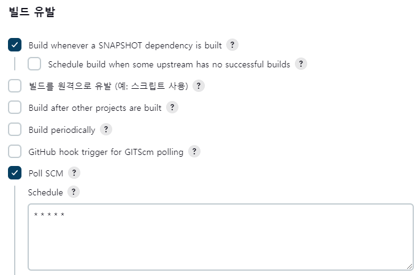

# Jenkins를 이용한 CI/CD 자동화 도구의 사용

## CI/CD를 위한 Git, Maven 설정

```
 - Jenkins 관리
    - Plugins
        - GitHub plugin 설치
        - Maven Integration 설치
    - Global Tool Configuration
        - Git installations
            - Name: Default
            - Path to Git executable: git
        - Maven installations
            - Name: Maven 3.8.5
            - Install automatically
                - Version: 3.8.5
```

<br/>

## Maven 프로젝트 생성

 - 빌드가 정상적으로 완료되면, 작업공간(workspace)에서 확인이 가능하다.
 - 빌드의 결과는 '/var/jenkins_home/workspace' 디렉토리에서 확인이 가능하다.
```
 - 새로운 Item
    - Name: My-Second-Project
    - Project: Maven project

 - General
    - 설명: My maven project build

 - 소스 관리
    - Git
        - Repository URL: https://github.com/joneconsulting/cicd-web-project
        - Branches to build
            - Branch Specifier: */main

 - Build
    - Root POM: pom.xml
    - Goals and options: clean compile package
```

<br/>

## CI/CD 작업을 위한 Tomcat 서버 연동

 - 플러그인 설치
```
 - Jenkins 관리
    - Plugins
        - Deploy to container 설치
```

 - Item 생성
    - Jenkins와 Tomtcat을 Docker 컨테이너로 사용하는 중이라면, Jenkins 내부에서 "127.0.0.1" 주소를 자기 자신 컨테이너를 바라보게 된다. 때문에 Windows나 Mac OS의 IP 주소를 찾아서 입력한다.
        - Windows: ipconfig
        - Linux, MacOS: ifconfig
    - Jenkins에서 Github 저장소의 소스 코드를 pom.xml 명세에 따라 WAR 파일로 빌드한다. 빌드 후에 Tomcat 서버(http://[공인 IP]:8088/)의 webapps로 WAR 파일을 전달한다.
```
 - 새로운 Item
    - Name: My-Third-Project
    - Project: Maven project

 - General
    - 설명: Deploy the Second project on Tomcat

 - 소스 코드 관리
    - Git
        - Repository URL: https://github.com/joneconsulting/cicd-web-project
        - Branches to build
            - Branch Specifier: */main

 - Build
    - Root POM: pom.xml
    - Goals and options: clean compile package

 - 빌드 후 조치
    - Deploy war/ear to a container
        - WAR/EAR files: **/*.war
        - Context path:
        - Containers
            - Tomcat 9.x Remote
                - Credentials
                    - Username: deployer
                    - Password: deployer
                    - ID: deployer_user1
                    - Description: user to deploy on tomcat VM
                - Tomcat URL: http://[Windows IP]:8088/
```

<br/>

## PollSCM 설정을 통한 지속적인 파일 업데이트

Jenkins의 Item 설정에서 Build Triggers를 지정하여 스케줄링 작업을 등록할 수 있다.  
 - 빌드 유발(Build Triggers)
    - Build periodically: 무조건 빌드
    - Poll SCM: Git 저장소의 새로운 커밋이 있으면 빌드
    - 분, 시, 일, 월, 요일 순서로 cron schedule을 정의한다.

<div align="center">
    
</div>

<br/>

## SSH + Docker가 설치되어 있는 VM(컨테이너) 사용하기

Jenkins를 통해 Local Tomcat 서버에 복사하는 작업 말고, 다른 서버에 복사하는 방식으로 사용한다.  

 - 플러그인 설치
```
 - Jenkins 관리
    - Plugins
        - Publish Over SSH 설치
    - Configure System
        - Publish over SSH
            - Name: docker-host
            - Hostname: [Remote IP]
            - Username: root
            - Passphrase/Password: P@ssw0rd
            - Port: 10022
```

 - Jenkins 흐름
```
1. Jenkins에서 Github 저장소의 소스 코드를 빌드한다.
2. 빌드하여 만들어진 WAR 파일을 SSH를 이용해서 서버로 전송한다.
3. 서버에서 Dockerfile과 전송된 WAR 파일을 통해 Docker Image를 빌드한다.
4. 빌드된 Docker Image 파일로 컨테이너를 생성한다.
```

<br/>

 - Item 만들기
```
 - name: My-Docker-Project
 - Copy from: My-Third-Project

 - General
    - 설명: Deploy the Second project on Tomcat

 - 소스 코드 관리
    - Git
        - Repository URL: https://github.com/joneconsulting/cicd-web-project
        - Branches to build
            - Branch Specifier: */main

 - 빌드 유발
    - Poll SCM -> Disable (X)

 - Build
    - Root POM: pom.xml
    - Goals and options: clean compile package

 - 빌드 후 조치
    - Deploy war/ear to a container -> Delete
    - Send build artifacts over SSH
        - SSH Server
            - Name: docker-host
            - Transfer Set
                - Source files: target/*.war
                - Remove prefix: target
                - Remote directory: .
                - Exec command:
                    docker build --tag=cicd-project -f Dockerfile .
                    docker run -d -p 8081:8080 --name mytomcat cicd-project:latest
```

 - Dockerfile
    - 베이스 이미지를 Tomcat으로 한다.
    - hello-world.war 파일을 이미지안에 'tomcat/webapps' 경로로 복사한다.
    - 이미지 빌드: docker build -t docker-server -f Dockerfile .
    - 컨테이너 실행: docker run -p 8081:8080 --name mytomcat docker-server:latest
```Dockerfile
FROM tomcat:9.0

COPY ./hello-world.war /usr/local/tomcat/webapps
```
