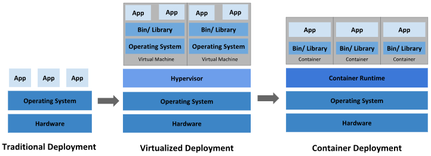
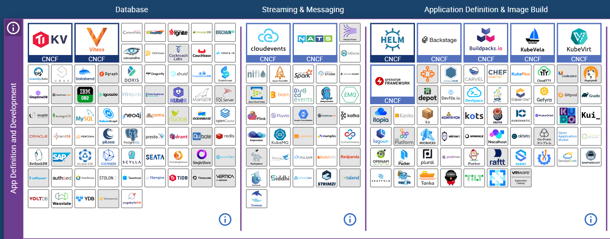
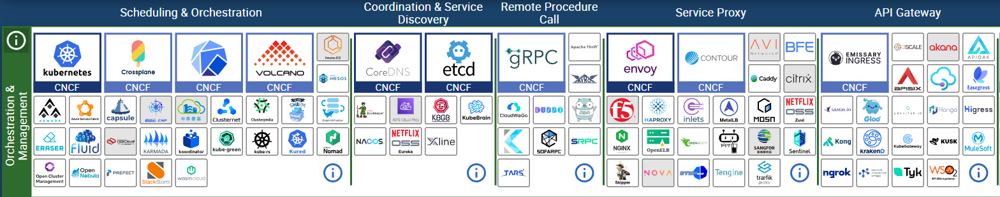
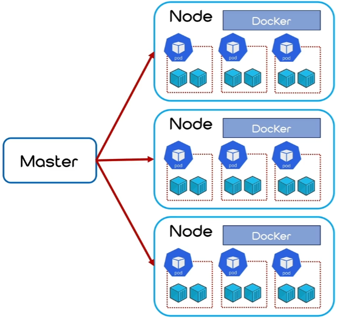
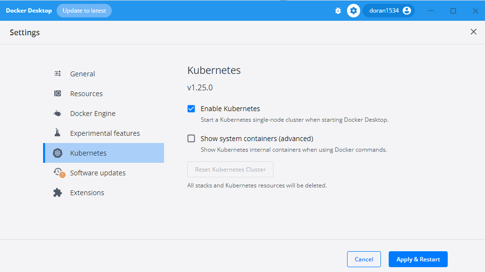

# Jenkins + Ansible + Kubernetes 와의 연동

## Kubernetes

Kubernetes(쿠버네티스 또는 줄여서 "K8s"로도 불립니다)는 컨테이너 오케스트레이션 플랫폼으로, 컨테이너화된 응용 프로그램을 자동화하고 관리하기 위한 오픈 소스 시스템입니다.  

쉽게, 쿠버네티스는 오픈 소스 기반의 컨테이너화 된 애플리케이션의 자동 배포, 스케일링 등을 제공하는 관리 플랫폼입니다.  

 - 스케일링 및 로드 밸런싱: Kubernetes는 컨테이너화된 애플리케이션을 클러스터 내에서 수평으로 확장하고 자동으로 로드 밸런싱을 수행할 수 있습니다. 이를 통해 애플리케이션의 가용성과 성능을 향상시킬 수 있습니다.
 - 자동 복구: Kubernetes는 컨테이너 또는 노드의 실패에 대비하여 자동으로 재시작 및 복구 작업을 수행합니다. 이를 통해 서비스의 무중단 운영을 지원합니다.
 - 설정 관리: Kubernetes는 설정 데이터를 저장하고 관리하며, 설정 변경을 롤백하거나 구성을 업데이트할 수 있습니다. 이는 애플리케이션의 유연성을 제공합니다.
 - 스토리지 관리: Kubernetes는 다양한 스토리지 백엔드와 통합하여 데이터를 저장하고 관리할 수 있습니다. 이로써 데이터 관리와 복제를 간편하게 수행할 수 있습니다.
 - 서비스 디스커버리와 로드 밸런싱: Kubernetes는 내부 서비스 간 통신을 쉽게 구성하고 관리할 수 있으며, 내부 DNS를 통해 서비스 디스커버리와 로드 밸런싱을 제공합니다.
 - 롤링 업데이트와 롤백: Kubernetes는 애플리케이션 업데이트를 롤링 업데이트로 수행하고, 문제가 발생한 경우 이전 버전으로 롤백할 수 있습니다.
 - 배포 관리: Kubernetes는 다양한 배포 전략을 제공하며, Blue-Green 배포, 카나리아 배포 등을 수행할 수 있습니다.
 - 모니터링 및 로깅: Kubernetes는 모니터링 및 로깅 도구와 통합하여 애플리케이션 및 인프라스트럭처의 상태를 지속적으로 관찰하고 분석할 수 있습니다.
 - 쿠버네티스 기능: 컨테이너화 된 애플리케이션 구동, 서비스 디스커버리와 로드 밸런싱, 스토리지 오케스트레이션, 자동화된 롤아웃과 롤백, 자동화된 빈 패킹, 자동화된 보구, 시크릿과 구성 관리
 - 쿠버네티스 미지원 기능: 소스 코드 배포 X, 빌드 X, 애플리케이션 레벨 서비스 X, 로깅 및 모니터링 솔루션 X, 포괄적인 머신 설정과 유지 보수 관리와 자동 복구 시스템 제공 X

<div align="center">
    
</div>
<div align="center">
    시대별 배포 방식 흐름 <br/>
    출처 - https://kubernetes.io/docs/concepts/overview/
</div>

<br/>

### CNCF와 Cloud Native

CNCF(Cloud Native Computing Foundation)는 2015년 12월 리눅스 재단 소속의 비영리 단체입니다. 첫 번째 프로젝트로 Kubernetes 를 Google에서 기증하였습니다. 클라우드네이티브 컴퓨팅 환경에서 필요한 다양한 오픈소스 프로젝트를 추진하고 관리하고 있습니다. CNCF맴버로는 인텔, Arm, 알리바바클라우드, 에저, 구글, 레드헷, SAP, vmware 등등 500개 이상의 글로벌 기업들이 활동하고 있습니다.  

CNCF가 정의 하는 클라우드네이티브의 의미는 조금더 좁아서 컨테이너화되는 오픈소스 소프트웨어를 사용하는 것을 의미 합니다. 클라우드네이티브 환경에서 어플리케이션은 컨테이너로 패키징되고 오케스트레이션을 통해 각 컨테이너가 스케줄링 및 관리가 되어 리소스의 사용율을 최적화하고, 마이크로서비스 구조를 통해 어플리케이션의 민첩성과 유지관리의 편의성을 높입니다. 클라우드네이티브 기술로는 컨테이너, 서비스메시, 마이크로서비스 등이 있으며 2025년까지 새로운앱의 90%이상이 클라우드네이티브 환경으로 구현될 것이라고 예상하고 있습니다.  

클라우드 네이티브 컴퓨팅 재단(CNCF) 사이트에서 클라우드와 컨테이너 관련 기술 스택들을 확인할 수 있습니다.  

 - 홈페이지: https://landscape.cncf.io/
<div align="center">
    
</div>
<div align="center">
    
</div>

<br/>

### 쿠버네티스 클러스터(Kubernetes Cluster)

쿠버네티스 클러스터(Kubernetes Cluster)는 쿠버네티스를 사용하여 컨테이너화된 애플리케이션을 관리하기 위한 환경입니다. 클러스터는 다수의 컴퓨터 노드로 구성되며, 이 노드는 애플리케이션 컨테이너를 실행하고 관리하는데 사용됩니다. 클러스터 내에서 컨테이너화된 애플리케이션을 배포하고 관리하며, 고가용성, 확장성, 복원력 및 자동화를 지원합니다.  

쿠버네티스 클러스터는 마스터 노드와 여러 워커 노드로 구성되며, 이러한 구조를 통해 컨테이너화된 애플리케이션을 스케일링하고 관리할 수 있습니다. 클러스터에서 애플리케이션을 배포하면 스케줄링, 로드 밸런싱, 자동 복구 및 다양한 관리 작업이 쿠버네티스에 의해 자동으로 처리됩니다. 이를 통해 애플리케이션의 가용성과 확장성을 높일 수 있으며, 개발 및 운영을 간소화할 수 있습니다.  

 - 마스터 노드
    - 마스터 노드는 클러스터의 제어 플레인(Control Plane)을 담당합니다. 제어 플레인은 클러스터 전체를 관리하고 클러스터 상태를 유지하는 역할을 합니다. 마스터 노드에는 다음과 같은 중요한 컴포넌트가 포함됩니다.
    - API 서버 (API Server): 클러스터에 대한 모든 요청을 처리하고 쿠버네티스 API를 노출합니다.
    - 스케줄러 (Scheduler): 새로운 애플리케이션 인스턴스를 어떤 노드에 배치할지 결정합니다.
    - 컨트롤 매니저 (Controller Manager): 클러스터의 상태와 상태를 원하는 상태로 유지하기 위한 컨트롤러를 관리합니다.
    - etcd: 클러스터의 구성 정보와 상태를 저장하는 분산 데이터베이스입니다.
 - 워커 노드 (Worker Node)
    - 워커 노드는 애플리케이션 컨테이너를 실행하는 데 사용됩니다. 각 워커 노드에는 다음과 같은 중요한 구성 요소가 있습니다.
    - 컨테이너 런타임 (Container Runtime): 컨테이너를 실행하는 데 사용되는 소프트웨어, 대표적으로 Docker가 있습니다.
    - Kubelet: 마스터 노드와 통신하여 노드에서 컨테이너를 관리합니다.
    - Kube Proxy: 서비스 디스커버리 및 로드 밸런싱을 제공하는 네트워킹 컴포넌트입니다.
    - Pod: 하나 이상의 컨테이너를 그룹화하는 작업 단위입니다. 같은 Pod 내의 컨테이너는 동일한 노드에서 실행됩니다.
 - 쿠버네티스 대시보드
    - 클러스터의 상태 및 리소스를 시각적으로 모니터링하고 관리할 수 있는 웹 기반 대시보드입니다.
 - kubectl
    - 커맨드 라인 도구로, 쿠버네티스 클러스터를 제어하고 관리하는 데 사용됩니다.

<div align="center">
    
</div>
<div align="center">
    이미지 출처 - njone company(Jenkins를 이용한 CI/CD Pipeline 구축 강의)
</div>

<br/>

## Kubernetes 설치

Vagrant를 사용하지 않고, 직접 VM을 구성하셔도 됩니다. (VirtualBox or VMWare)
Windows의 Docker Desktop은 Cluster 구성이 되지 않기 때문에, 가능하면 VM사용을 권장합니다.  
 - 쿠버네티스 설치 가이드: https://github.com/joneconsulting/k8s/blob/master/install/kubernetes_install.md
 - Virtual Box: https://www.virtualbox.org/
 - Vagrant: https://www.vagrantup.com/

<br/>

### 작업 폴더 생성 및 Vagrant

```Bash
# Vargrant 초기화
$ vagrant init

# Vagrant VM 실행 (Vargrantfile 파일)
$ vagrant up

# Vagrant VM 확인
$ vagrant status
    
        # 192.168.32.10 -> Kubernetes Master
        # 192.168.32.11 -> Kubernetes Node1
        # 192.168.32.12 -> Kubernetes Node2

# Vagrant VM 실행
$ vagrant ssh [Vagrant VM 이름]

        # ex) vagrant ssh k8s-master 

```

<br/>

### 사전 준비 (Master, Worker Node 모두 작업)

```Bash
# Root 계정 비밀번호 변경
$ sudo su - 
$ passwd root

# SELinux 설정
$ setenforce 0
$ sestatus
$ sed -i 's/^SELINUX=enforcing$/SELINUX=permissive/' /etc/selinux/config

# 방화벽 해제
$ systemctl stop firewalld && systemctl disable firewalld
$ systemctl stop NetworkManager && systemctl disable NetworkManager

# SWAP 비활성화
swapoff -a && sed -i '/swap/s/^/#/' /etc/fstab

# iptables 커널 옵션 활성화
$ cat <<EOF>>  /etc/sysctl.d/k8s.conf
net.bridge.bridge-nf-call-ip6tables = 1
net.bridge.bridge-nf-call-iptables = 1
EOF

$ sysctl --system

# 쿠버네티스를 위한 yum repository 설정
$ cat <<EOF>> /etc/yum.repos.d/kubernetes.repo
[kubernetes]
name=Kubernetes
baseurl=https://packages.cloud.google.com/yum/repos/kubernetes-el7-x86_64
enabled=1
gpgcheck=1
repo_gpgcheck=0
gpgkey=https://packages.cloud.google.com/yum/doc/yum-key.gpg https://packages.cloud.google.com/yum/doc/rpm-package-key.gpg
EOF

# Hostname 변경 (Hosts 파일 수정)
# 각 노드의 ipaddress에 맞게 수정한다. 변경하지 않으면 kubeadm join 시 오류 발생
$ vi /etc/hosts 
192.168.32.10 -> $ hostname k8s-master (or $ hostnamectl set-hostname k8s-master)
192.168.32.11 -> $ hostname k8s-node01
192.168.32.12 -> $ hostname k8s-node02

# 서버 재실행
$ ping k8s-master
```

 - Docker 설치 (Master, Worker Node 모두 작업)
```Bash
# Docker를 위한 yum repository 설정
$ yum install -y yum-utils device-mapper-persistent-data lvm2 
$ yum-config-manager --add-repo https://download.docker.com/linux/centos/docker-ce.repo
$ yum install -y docker

$ cat <<EOF>> /etc/docker/daemon.json
{
  "log-driver": "json-file",
  "log-opts": {
    "max-size": "100m"
  },
  "storage-driver": "overlay2",
  "storage-opts": [
    "overlay2.override_kernel_check=true"
  ]
}
EOF

$ systemctl enable --now docker && systemctl start docker

# dockeradmin 계정 생성
# usermod group 'docker' dose not exist 오류가 발생하면 sudo groupadd docker 명령어 실행 -> 다시 위 명령어 실행 -> systemctl restart docker
$ useradd dockeradmin
$ passwd dockeradmin # password --> dockeradmin
$ usermod -aG docker dockeradmin

# Docker compose 설치
$ curl -L "https://github.com/docker/compose/releases/download/1.24.1/docker-compose-$(uname -s)-$(uname -m)" -o /usr/local/bin/docker-compose
$ chmod +x /usr/local/bin/docker-compose
$ ln -s /usr/local/bin/docker-compose /usr/bin/docker-compose
$ docker-compose -version 

# Docker 설치 확인
$ docker run hello-world
```

 - Kubernetes 설치 (Master, Worker Node 모두 작업)
```Bash
# 1.15 버전 설치시
$ yum install -y kubeadm-1.15.5-0.x86_64 kubectl-1.15.5-0.x86_64 kubelet-1.15.5-0.x86_64 --disableexcludes=kubernetes 

# 1.20 버전 설치시
$ yum install -y kubeadm-1.20.5-0.x86_64 kubectl-1.20.5-0.x86_64 kubelet-1.20.5-0.x86_64 --disableexcludes=kubernetes

# 최신 버전 설치시
$ yum install -y kubeadm kubectl kubelet --disableexcludes=kubernetes
```

 - Kubernetes 설정 (Master)
```Bash
# 실행 (오류 발생시 kubeadm init을 먼저 실행)
$ systemctl start kubelet
$ systemctl enable kubelet

# Unit kubelet.service entered failed state. kubelet.service failed. 오류 발생시
# (ExecStart 항목에 아래 내용 추가)
$ vi /usr/lib/systemd/system/docker.service  
--exec-opt native.cgroupdriver=systemd

# 초기화 (Master ipaddress)
$ kubeadm init --pod-network-cidr=10.96.0.0/16 --apiserver-advertise-address=192.168.32.10

# kubeadm init 실행 시 오류 발생 (Status from runtime service failed), kubeadm join 명령어 실행 시 오류가 발생해도 아래 명령어 실행
$ rm /etc/containerd/config.toml
$ systemctl restart containerd
$ kubeadm init

# Node에서 실행, Kubeadm 실행 후 아래 커맨드 부분을 복사 (생성되는 값은 본인의 환경에 따라 다름)
$ kubeadm join 192.168.56.10:6443 --token x1qogf.3i1d8zc267sm4gq8 \
--discovery-token-ca-cert-hash sha256:1965b56832292d3de10fc95f92b8391334d9404c914d407baa2b6cec1dbe5322

# 환경 변수 설정 -> 모든 pods가 Running 상태인지 확인 (K8s-node를 Master에 Join 후 모든 PODS Running 중인지 확인)
$ mkdir -p $HOME/.kube
$ sudo cp -i /etc/kubernetes/admin.conf $HOME/.kube/config
$ sudo chown $(id -u):$(id -g) $HOME/.kube/config
$ kubectl get pods --all-namespaces

# Calico 기본 설치 (Kubernetes Cluster Networking plugin)
$ kubectl apply -f https://docs.projectcalico.org/manifests/calico.yaml
$ kubectl get pods --all-namespaces
```

 - Kubernetes 노드 연결 (Worker Node)
```Bash
# 연결
$ kubeadm join 192.168.56.10:6443 --token x1qogf.3i1d8zc267sm4gq8 \
--discovery-token-ca-cert-hash sha256:1965b56832292d3de10fc95f92b8391334d9404c914d407baa2b6cec1dbe5322  

# 연결시 오류 발생시 아래 명령어 수행
$ kubeadm reset

# 연결 확인 (Master 에서 작업)
$ kubectl get nodes
```

<br/>

## minikube 설치

Minikube는 로컬 개발 환경에서 쿠버네티스(Kubernetes) 클러스터를 간편하게 구축하고 관리하기 위한 도구입니다. 개발자들이 개발 및 테스트 목적으로 로컬 머신에서 쿠버네티스를 사용할 수 있도록 도와줍니다. Minikube는 가벼우며 빠르게 설치하고 사용할 수 있으며, 로컬에서 쿠버네티스 애플리케이션을 개발 및 디버깅하기에 이상적입니다.  

<div align="center">
    
</div>
<div align="center">
    Docker Desctop 화면
</div>

```Bash
# nodes 확인
$ kubectl get nodes

# pods 확인
$ kubectl get pods
```
