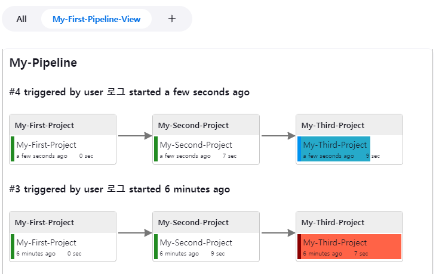
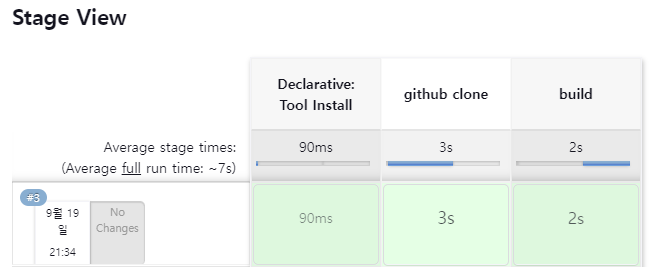
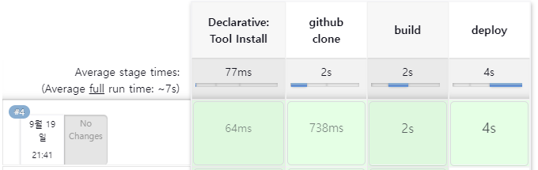
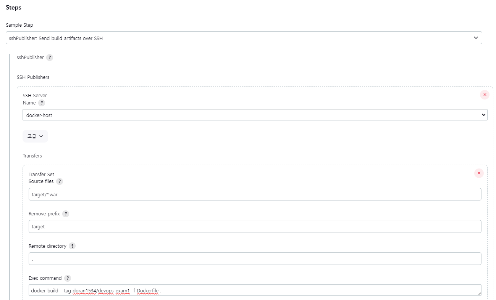
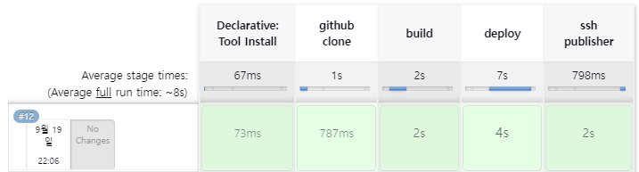

# Advanced Jenkins 사용 - Pipeline

## 빌드 후 조치를 통한 파이프라인

 - 플러그인 설치
```
 - Jenkins 관리 > Plugins > Available
    - Delivery Pipeline 플러그인 설치
```

 - Item 만들기
    - 기존에 있었던 First, Second, Third 프로젝트를 이용한다.
```
 - Item
    - 빌드 후 조치
        - Build other projects
            - Project to build: 현재 아이템 빌드 완료시 다음으로 진행할 아이템
            - Trigger only if build is stable: 아이템 빌드 성공일 경우 트리거
```

 - 새로운 뷰 만들기
```
 - Name: My-First-Pipeline-View
 - Pipelines (Components)
    - Name: My-Pipeline
    - Initial Job: 파이프라인 Item 설정 (My-First-Project)
```

<div align="center">
    
</div>
<div align="center">
    Delivery Pipeline 플러그인의 뷰 화면을 통해 파이프라인 진행 상황을 확인할 수 있다.
</div>

## 스크립트를 이용한 파이프라인

enkins 파이프라인은 지속적 통합 및 지속적 전달 (CI/CD) 프로세스를 구축하고 관리하기 위한 도구입니다. 이것은 Jenkins 서버에서 코드 빌드, 테스트 및 배포를 자동화하며, 코드 변경 사항을 빠르게 개발 및 배포 환경으로 전달하는 데 사용됩니다. 파이프라인은 Jenkins의 플러그인인 "Pipeline Plugin"을 기반으로 작동하며, 코드를 정의하고 실행하는 데 스크립트 기반 접근 방식을 사용합니다.  

Jenkins 파이프라인을 사용하면 소프트웨어 개발 및 배포 프로세스를 자동화하고, 코드 변경 사항을 신속하게 검증하고 배포할 수 있습니다. 이를 통해 소프트웨어 개발 및 유지 보수 과정의 효율성을 향상시킬 수 있으며, 품질을 관리하고 배포 과정을 투명하게 만들 수 있습니다.  

 - Pipeline Script: 파이프라인은 Groovy 기반의 DSL(Domain Specific Language)을 사용하여 정의됩니다. 파이프라인 스크립트는 빌드, 테스트, 배포 단계 등을 세부적으로 정의하며, 코드 변경 사항을 어떻게 처리할지 지정합니다.
 - Node: 노드는 스크립트가 실행되는 환경을 나타냅니다. Jenkins 에이전트(로컬 머신 또는 원격 머신)에서 스크립트를 실행할 수 있습니다.
 - Stages: 스테이지는 파이프라인의 단계를 나타냅니다. 일반적으로 빌드, 테스트, 배포와 같은 여러 스테이지가 있으며, 각 스테이지에서 실행할 작업을 정의합니다.
 - Steps: 스텝은 스테이지 내에서 수행할 개별 작업을 나타냅니다. 이러한 작업은 쉘 명령, 스크립트 실행, 플러그인 호출 등으로 구성될 수 있습니다.
 - Agent: 에이전트는 스크립트를 실행하는 환경을 제공하는 머신 또는 컨테이너를 나타냅니다. 파이프라인은 다른 에이전트에서 실행되도록 구성할 수 있으며, 이는 분산 CI/CD 작업을 가능하게 합니다.
 - Parallel Execution: 여러 스테이지 또는 단계를 동시에 실행하려면 병렬 실행을 사용할 수 있습니다. 이를 통해 작업을 효율적으로 처리할 수 있습니다.
 - Post-Build Actions: 빌드 후에 실행할 작업을 정의할 수 있으며, 예를 들어 통합 테스트 결과를 보고, 알림을 보내거나 배포를 트리거하는 등의 작업을 수행할 수 있습니다.

```gradle
pipeline {
    agent any // 실행 가능한 Agent에서 Pipeline 실행
    stages {
        steps('build') { // build 스테이지 서언
            // 스테이지에 필요한 작업 수행
        }

        steps('test') { // test 스테이지 선언
            // 스테이지에 필요한 작업 수행
        }

        steps('deploy') { // deploy 스테이지 선언
            // 스테이지에 필요한 작업 수행
        }
    }
}
```

<br/>

### Jenkins Pipeline 만들기

 - 단순 출력 Pipeline Item
```
 - 새로운 Item
 - Item name: My-First-Pipeline
 - Project: Pipeline
 - 설명: My first pipeline using Declarative
```
```gradle
// Pipeline Script

pipeline {
    agent any
    stages {
        stage('Compile') {
            steps {
                echo "Compiled successfully!";
            }
        }

        stage('JUnit') {
            steps {
                echo "JUnit passed successfully!";
            }
        }

        stage('Code Analysis') {
            steps {
                echo "Code Analysis completed successfully!";
            }
        }

        stage('Deploy') {
            steps {
                echo "Deployed successfully!";
            }
        }
    }

    post { // 빌드가 완료되었을 때 실행되는 항목
      always { // 항상 출력되는 항목
        echo "This will always run"
      }
      success { // 성공시 출력되는 항목
        echo "This will run when the run finished successfully"
      }
      failure { // 실패시 출력되는 항목
        echo "This will run if failed"
      }
      unstable { // 부분 실패시 출력되는 항목
        echo "This will run when the run was marked as unstable"
      }
      changed { // 변경된 사항이 없을시 출력되는 항목
        echo "This will run when the state of the pipeline has changed"
      }
    }
}
```

 - Git Repository의 소스 코드를 가져오고, 해당 소스 코드에 쉘 스크립트(sh) 실행하기
```
 - 새로운 Item
 - Item name: My-Second-Pipeline
 - Project: Pipeline
 - 설명: My second pipeline using Declarative
```
```gradle
pipeline {
    agent any
    stages {
        stage('Git clone') {
            steps {
                git 'https://github.com/joneconsulting/jenkins_pipeline_script';
            }
        }

        stage('Compile') {
            steps {
                echo "Compiled successfully!";
                sh './build.sh'
            }
        }

        stage('JUnit') {
            steps {
                echo "JUnit passed successfully!";
                sh './unit.sh'
            }
        }

        stage('Code Analysis') {
            steps {
                echo "Code Analysis completed successfully!";
                sh './quality.sh'
            }
        }

        stage('Deploy') {
            steps {
                echo "Deployed successfully!";
                sh './deploy.sh'
            }
        }
    }
}
```

 - Maven Build를 Pipeline으로 실행하기
    - 해당 스크립트를 만들기 이전에 Jenkins 관리 Tools에 해당 메이븐 도구를 설정해주어야 한다. (해당 설정된 Maven 이름으로 사용된다.)
```
 - 새로운 Item
 - Item name: My-Third-Pipeline
 - Project: Pipeline
 - 설명: My second pipeline using Declarative
```
```gradle
pipeline {
    agent any
    tools { 
      maven 'Maven 3.8.5'
    }
    stages {
        stage('github clone') {
            steps {
                git branch: 'main', url: 'https://github.com/joneconsulting/cicd-web-project.git'; 
            }
        }
        
        stage('build') {
            steps {
                sh '''
                    echo build start
                    mvn clean compile package -DskipTests=true
                '''
            }
        }
    }
}
```
<div align="center">
    
</div>
<br/>

 - Pipeline을 통해 Maven Build된 소스 코드를 Tomcat 서버에 배포 (Pipeline Syntax: deploy: war/ear to a container)
    - My-Third-Pipeline Item을 사용한다.
    - Git Repository 클론 > Maven Build 수행 > Tomcat 배포
    - Pipeline Script 내부에 deploy 스테이지를 추가한다.
```gradle
pipeline {
    agent any
    tools { 
      maven 'Maven 3.8.5'
    }
    stages {
        stage('github clone') {
            steps {
                git branch: 'main', url: 'https://github.com/joneconsulting/cicd-web-project.git'; 
            }
        }
        
        stage('build') {
            steps {
                sh '''
                    echo build start
                    mvn clean compile package -DskipTests=true
                '''
            }
        }
        
        stage('deploy') {
            steps {
                deploy adapters: [tomcat9(credentialsId: 'deployer_user1', path: '', url: 'http://192.168.0.7:8088/')], contextPath: null, war: '**/*.war'
            }
        }
    }
}
```
<div align="center">
    
</div>
<br/>

 - Docker 컨테이너에 배포하기 (Pipeline Syntax: sshPublisher)
    - My-Third-Pipeline Item을 사용한다.
    - Git Repository 클론 > Maven Build 수행 > Tomcat 배포
    - Pipeline Script 내부에 ssh publisher 스테이지를 추가한다.
```
stage('ssh publisher') {
    steps {
        sshPublisher(publishers: [sshPublisherDesc(configName: 'docker-host', transfers: [sshTransfer(cleanRemote: false, excludes: '', execCommand: 'docker build --tag doran1534/devops_exam1 -f Dockerfile .', execTimeout: 120000, flatten: false, makeEmptyDirs: false, noDefaultExcludes: false, patternSeparator: '[, ]+', remoteDirectory: '.', remoteDirectorySDF: false, removePrefix: 'target', sourceFiles: 'target/*.war')], usePromotionTimestamp: false, useWorkspaceInPromotion: false, verbose: false)])
    }
}
```
<div align="center">
    
</div>
<div align="center">
    
</div>
