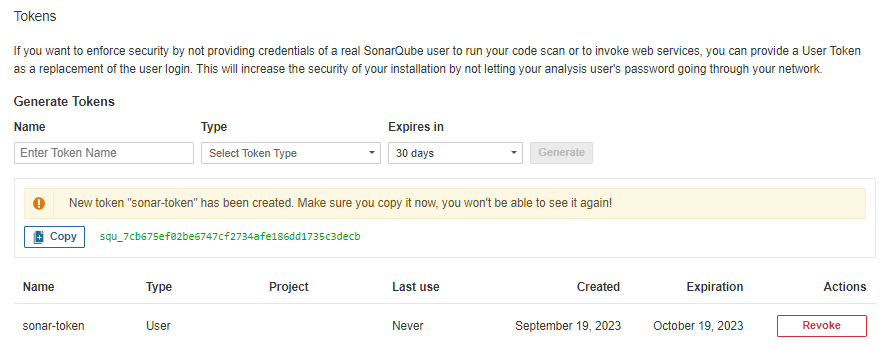

# Advanced Jenkins - SonarQube, Multi nodes

## SonarQube

SonarQube는 소프트웨어 개발 프로젝트에서 코드 품질 및 보안을 평가하고 관리하기 위한 오픈 소스 플랫폼입니다. 이 도구는 정적 코드 분석을 수행하여 소스 코드의 결함, 취약점, 복잡성, 스타일 문제 및 기타 코드 품질 관련 정보를 제공합니다. SonarQube를 사용하면 개발자 및 품질 엔지니어가 프로젝트의 코드 품질을 모니터링하고 개선할 수 있습니다.  
 - https://www.sonarqube.org/
 - 정적 코드 분석: SonarQube는 소스 코드를 검사하여 버그, 보안 취약점, 코드 스멜(코드의 안티 패턴 또는 나쁜 관행) 등을 감지합니다. 이를 통해 코드의 품질과 안정성을 향상시킬 수 있습니다.
 - 보안 분석: SonarQube는 코드에서 보안 취약점을 식별하고 보안 문제를 보고합니다. 이것은 보안 감사 및 개발 시 보안 문제 식별에 도움이 됩니다.
 - 다양한 언어 지원: SonarQube는 다양한 프로그래밍 언어를 지원하며, Java, C#, JavaScript, Python, Kotlin, 등 다양한 언어의 코드를 분석할 수 있습니다.
 - CI/CD 통합: SonarQube는 대부분의 CI/CD 도구와 통합될 수 있습니다. 이를 통해 코드 변경 사항이 푸시될 때 자동으로 코드 품질 분석을 실행하고 결과를 통합 테스트 및 배포 프로세스에 통합할 수 있습니다.

<br/>

### SonarQube 사용하기

 - Maven Build Plugin 등록
    - 프로젝트 pom.xml에 Build Plugin 정보를 등록한다.
    - https://docs.sonarqube.org/latest/analysis/scan/sonarscanner-for-maven/
    - https://mvnrepository.com/artifact/org.sonarsource.scanner.maven/sonar-maven-plugin
```XML
<build>
  <pluginManagement>
    <plugins>
      ..

      <plugin>
        <groupId>org.sonarsource.scanner.maven</groupId>
        <artifactId>sonar-maven-plugin</artifactId>
        <version>3.9.1.2184</version>
      </plugin>
    </plugins>
  </pluginManagement>
</build>
```

 - Docker를 이용하여 SonarQube 설치
```Bash
$ docker pull sonarqube
$ docker run --rm -p 9000:9000 --name sonarqube sonarqube
```

 - SonarQube Token 생성
```
1. 브라우저를 통해 소나큐브 어드민 사이트로 접속한다.
 - http://localhost:9000

2. 어드민 사이트에 접속한다.
 - admin / admin

3. SonarQube Token을 생성한다.
 - My Account > Security > User Token
 - squ_7cb675ef02be6747cf2734afe186dd1735c3decb
```
<div align="center">
    
</div>
<br/>

 - Maven Build
    - SonarQube를 통한 빌드 후 해당 정보를 SonarQube 사이트에 넘긴다. 이후 SonarQube 사이트에서 UI로 확인할 수 있다.
```Bash
$ mvn clean compile package -DskipTests=true
$ mvn sonar:sonar -Dsonar.host.url=http://IP_address:9000 -Dsonar.login=[토큰값]
```

<br/>

## Jenkins - SonarQube 연동

 - 플러그인 설치 및 Credentials 등록
```
 - Jenkins 관리 > Plugins > Available
    - SonarQube Scanner for Jenkins 설치

 - Jenkins 관리 > Security > Credentials > Add Credentials
    - Kind: Secret text
    - Secret: [토큰값]
    - ID: sonarqube-token


 - Jenkins 관리 > System > SonarQube servers
    - Environment variable 선택
    - Name: SonarQube 서버 이름 지정
    - Server URL: SonarQube 서버 IP Address:PORT
    - Server authentication token: Credentails에서 지정한 Token 정보
```

 - Pipeline 추가
```
pipeline {
    agent any
    tools { 
      maven 'Maven 3.8.5'
    }
    stages {
        stage('github clone') {
            steps {
                git branch: 'main', url: 'https://github.com/joneconsulting/cicd-web-project.git'; 
            }
        }
        
        stage('build') {
            steps {
                sh '''
                    echo build start
                    mvn clean compile package -DskipTests=true
                '''
            }
        }
        
        stage('SonarQube analysis') {
            steps {
                withSonarQubeEnv('SonarQube-server') {
                    sh 'mvn sonar:sonar'
                }
            }
        }
        
        stage('deploy') {
            steps {
                deploy adapters: [tomcat9(credentialsId: 'deployer_user1', path: '', url: 'http://192.168.0.7:8088/')], contextPath: null, war: '**/*.war'
            }
        }
        
        stage('ssh publisher') {
            steps {
                sshPublisher(publishers: [sshPublisherDesc(configName: 'docker-host', transfers: [sshTransfer(cleanRemote: false, excludes: '', execCommand: 'docker build --tag doran1534/devops_exam1 -f Dockerfile .', execTimeout: 120000, flatten: false, makeEmptyDirs: false, noDefaultExcludes: false, patternSeparator: '[, ]+', remoteDirectory: '.', remoteDirectorySDF: false, removePrefix: 'target', sourceFiles: 'target/*.war')], usePromotionTimestamp: false, useWorkspaceInPromotion: false, verbose: false)])
            }
        }

    }
}
```
