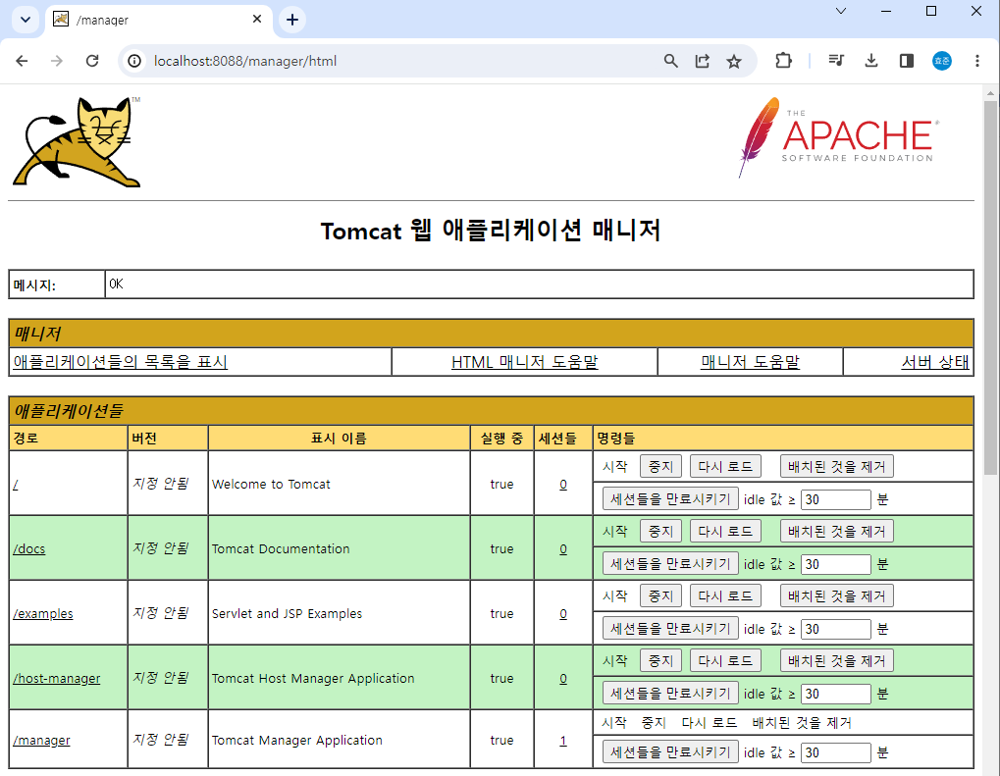

# 실습 환경을 위한 필수 SW

## 필수 SW 설치

 - Docker Desktop for Windows (or MacOS)
 - Installed SW on Local
    - JDK 1.8+, Git, Maven
    - Tomcat Server
    - SSH Server/Client (Windows, MacOS or Docker)
 - 소스 코드, Script
    - 샘플 소스 코드: https://github.com/joneconsulting/cicd-web-project
    - Jenkins Pipelin Script: https://github.com/joneconsulting/jenkins_pipeline_script

<br/>

```
1. Docker Desktop
 - https://www.docker.com/products/docker-desktop/

2. Git
 - https://git-scm.com/

3. Maven
 - https://maven.apache.org/download.cgi

4. Tomcat Server
 - https://tomcat.apache.org/download-90.cgi

5. SSH Server
 - https://hub.docker.com/r/edowon0623/docker
 - docker run --privileged --name docker-server -itd -p 10022:22 -p 8081:8080 -e container=docker -v /sys/fs/cgroup:/sys/fs/cgroup edowon 0623/docker:latest /usr/sbin/init
 - ssh root@localhost -p 10022
 - 비밀번호: P@ssw0rd
    - $ yum install -y iptables net-tools
    - $ sed -i -e 's/overlay2/vfs/g' /etc/sysconfig/docker-storage
    - $ systemctl start docker

6. SSH Client
 - Windows
    - Xshell (https://www.netsarang.com/ko/free-for-home-school/)
    - MobaXterm (https://mobaxterm.mobatek.net/download-home-edition.html)
    - Terminus (https://termius.com)
 - MacOS
    - Terminus (https://termius.com)
```

<br/>

## Docker Desktop 설치

 - Docker: https://www.docker.com/products/docker-desktop/
 - WSL 2: https://aka.ms/wsl2kernel
```
1. Docker Desktop 설치
2. 가상화 활성화 여부 확인
 - 작업관리자 > 성능 > 가상화 사용 확인
```

<br/>

## Git 설치

 - Git: https://git-scm.com
```Bash
# 설치 확인
$ git --version

# 홈 디렉토리에 작업 폴더 생성
$ mkdir practice
$ cd practice
$ mkdir git
$ cd git

# Git 소스 코드 및 Script 가져오기
$ git clone https://github.com/joneconsulting/cicd-web-project.git
$ git clone https://github.com/joneconsulting/jenkins_pipeline_script.git
```

<br/>

## Tomcat Server 설치

 - Tomcat: https://tomcat.apache.org
 - OpenJDK: https://jdk.java.net/11/
   - JDK 환경 변수 등록 (JAVA_HOME)
```Bash
# Tomcat 시작
$ .\bin\startup.bat 
$ ./bin/startup.sh

# Tomcat 종료
$ .\bin\shutdown.bat 
$ ./bin/shutdown.sh
```

 - Tomcat 설정 변경
```
# 포트 변경 
 - %TOMCAT_HOME%\conf\server.xml
   - <Connector/>의 port 변경
   - <Connector port="8088" .. />

# 접근 엑세스 변경 
 - %TOMCAT_HOME%\webapps\manager\META-INF\context.xml 
 - %TOMCAT_HOME%\webapps\host-manager\META-INF\context.xml 
   - <Valve /> 부분 주석 처리
   - <!-- <Valve className="org.apache.catalina.valves.RemoteAddrValve" allow="127\.\d+\.\d+\.\d+|::1|0:0:0:0:0:0:0:1" /> -->

# 유저 추가
 - %TOMCAT_HOME%\conf\tomcat-users.xml

# tomcat-users.xml 추가 내용
<role rolename="manager-gui" />
<role rolename="manager-script" />
<role rolename="manager-jmx" />
<role rolename="manager-status" />
<user username="admin" password="admin"  roles="manager-gui, manager-script, manager-jmx, manager-status"/>
<user username="deployer" password="deployer"
roles="manager-script"/>
<user username="tomcat" password="tomcat"  roles="manager-gui"/>
```

<div align="center">
   
</div>

<br/>

## SSH Server 설치

 - Windows 환경에서의 실행
   - https://www.inflearn.com/questions/659729
   - https://www.inflearn.com/questions/658601
   - DooD 방식으로 대체: 호스트 OS의 도커를 이용한다.
```Bash
$ docker pull edowon0623/docker

$ docker run -itd --name docker-server -p 10022:22 -e container=docker --tmpfs /run --tmpfs /tmp -v /sys/fs/cgroup:/sys/fs/cgroup:ro -v /var/run/docker.sock:/var/run/docker.sock edowon0623/docker:latest /usr/sbin/init

# SSH 접속 확인
$ ssh root@localhost -p 10022
The authenticity of host '[localhost]:10022 ([::1]:10022)' can't be established.
ECDSA key fingerprint is SHA256:IDvURBPNV6zfg7IPfXPrsBTbgobGcESxbUrAaA4pQPI.
Are you sure you want to continue connecting (yes/no/[fingerprint])? yes
Warning: Permanently added '[localhost]:10022' (ECDSA) to the list of known hosts.
root@localhost's password: P@ssw0rd

# Docker 확인 및 사용 설정
$ systemctl status docker
$ systemctl enable docker
$ systemctl start docker

# Docker 실행을 위한 설정 변경
$ vi /etc/sysconfig/docker
$ yum install -y iptables net-tools
$ sed -i -e 's/overlay2/vfs/g' /etc/sysconfig/docker-storage
$ systemctl start docker
```

 - 호스트 키 에러
```Bash
$ ssh root@localhost -p 10022
@@@@@@@@@@@@@@@@@@@@@@@@@@@@@@@@@@@@@@@@@@@@@@@@@@@@@@@@@@@
@    WARNING: REMOTE HOST IDENTIFICATION HAS CHANGED!     @
@@@@@@@@@@@@@@@@@@@@@@@@@@@@@@@@@@@@@@@@@@@@@@@@@@@@@@@@@@@
IT IS POSSIBLE THAT SOMEONE IS DOING SOMETHING NASTY!
..

# 기존 호스트 키 삭제
$ ssh-keygen -R [localhost]:10022

# 새 호스트 키 수락
$ ssh root@localhost -p 10022
```

<br/>

## SSH Server 에러시

 - Windows 1 Dind 방식
   - docker run --privileged --name docker-server -itd -p 10022:22 -p 8081:8080 -e container=docker -v /sys/fs/cgroup:/sys/fs/cgroup edowon0623/docker:latest /usr/sbin/init
 - Windows 2 DooD 방식
   - 도커 바깥에서 도커 데몬을 실행하기 위한 명령어
   - docker run -itd --name docker-server -p 10022:22 -e container=docker --tmpfs /run --tmpfs /tmp -v /sys/fs/cgroup:/sys/fs/cgroup:ro -v /var/run/docker.sock:/var/run/docker.sock edowon0623/docker:latest /usr/sbin/init
 - MacOS 1. intel chip
   - docker run --privileged --name docker-server -itd -p 10022:22 -p 8081:8080 -e container=docker -v /sys/fs/cgroup:/sys/fs/cgroup edowon0623/docker:latest /usr/sbin/init
 - MacOS 2. Apple Silicon Chip M1
   - docker run --privileged --name docker-server -itd -p 10022:22 -p 8081:8080 -e container=docker -v /sys/fs/cgroup:/sys/fs/cgroup:rw --cgroupns=host edowon0623/docker-server:m1 /usr/sbin/init

<br/>

#### DooD 특징

 - Host PC Docker daemon이 사용하는 Socket을 이용하여 Docker Client에서 Container 실행
 - Docker Client의 환경과 Host PC Docker daemon 환경이 동일하다.
   - Docker Images 및 Container 목록이 동일
 - 컨테이너 내에서 도커 데몬을 실행하기 위한 명령어를 사용할 수 없다.
   - systemctl start docker 등
 - --privileged 옵션을 사용하지 않는다.
 - Host PC Docker daemon이 사용하는 리소스 명과 충돌하지 않도록 설정울 주의하여야 한다.
   - Container, Volume mount, Port 등

<br/>

## SSH Client 설치

 - Termius: https://termius.com/windows
 - 대체 도구: SecureCRT, PuTTY, MobaXterm 등

<br/>

## AWS EC2 인스턴스 생성

 - EC2 인스턴스 만들기
```
 - 리전: 아시아 태평양(서울)
 - EC2
   - 인스턴스 시작
      - 이름: cicd-project-ec2
      - 애플리케이션 및 OS 이미지
         - 이미지: Amazon Linux AWS
         - 종류: 프리 티어
      - 인스턴스 유형
         - t2.micro
      - 키 페어(로그인)
         - 인스턴스에 접속하기 위한 암호 파일
         - 새 키 페어 생성: cicd-project-key (RSA, .pem)
      - 네트워크 설정
         - 방화벽(보안 그룹): 보안 그룹 생성
         - SSH 트래픽허용 (위치 무관: 0.0.0.0/0)
      - 스토리지 구성
         - 8 GiB
```

 - 보안 그룹 설정
```
 - 인바운드 규칙
   - 규칙 1
      - 유형: SSH
      - 프로토콜: TCP
      - 포트 범위: 22
   - 규칙 2
      - 
```

<br/>

## AWS EC2 인스턴스 접속

 - Termius 도구 이용
```
 - NEW HOST
   - Label: AWS EC2-1
   - Address: 퍼블릭 IPv4 값
   - Port: 22
   - Username: ec2-user
   - Password: PEM 키 정보 (Keys 클릭 후 Add key)
      - Key name: AWS EC2-key
      - 키 파일 경로 지정
```

 - 기본 라이브러리 설치
```Bash
# AWS Coreetto 다운로드
$ sudo curl -L https://corretto.aws/downloads/latest/amazon-corretto-11-x64-linux-jdk.rpm -o aws_corretto_jdk11.rpm

# JDK 11 설치
$ sudo yum localinstall aws_corretto_jdk11.rpm

# Java 버전 확인
$ java -version
$ javac -version

# JDK 버전 변경시
$ sudo /usr/sbin/alternatives --config java

# 다운받은 패키지 삭제
$ rm -rf aws_corretto_jdk11.rpm
```

 - 
```
1. 인스턴스 중지

2. 인스턴스를 이미지로 만들기 (JDK가 설치된 인스턴스)
 - 작업
   - 이미지 및 템플릿
      - 이미지 생성
         - 이미지 이름: cicd-project-image
```
