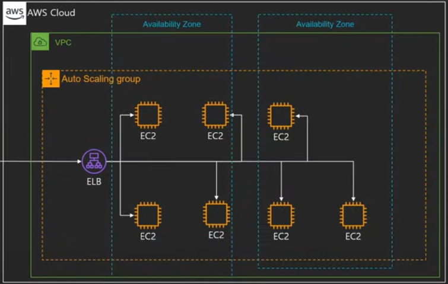

# Elastic Load Balancer(ELB)

Elastic Load Balancing은 들어오는 애플리케이션 트래픽을 Amazon EC2 인스턴스, 컨테이너, IP 주소, Lambda 함수와 같은 여러 대상에 자동으로 분산시킨다.  
Elastic Load Balancing은 단일 가용 영역 또는 여러 가용 영역에서 다양한 애플리케이션 부하를 처리할 수 있다.  
Elastic Load Balancing이 제공하는 세 가지 로드 밸런서는 모두 애플리케이션의 내결함성에 필요한 고가용성, 자동 확장/축소, 강력한 보안을 갖추고 있다.  

 - 다수의 서비스에 트래픽을 분산 시켜주는 서비스
 - Health Check: 직접 트래픽을 발생시켜 Instance가 살아있는지 체크한다.
 - Autoscaling과 연동 가능
 - 여러 가용 영역에 분산 가능
 - 지속적으로 IP 주소가 바뀌며 IP 고정 불가능: 항상 도메인 기반으로 사용해야 한다.
 - 4가지 종류
    - Application Load Balancer
        - 트래픽을 모니터링하여 라우팅 가능
        - 도메인에 따라 서버 분산 처리 가능(프록시)
    - Network Load Balancer
        - TCP 기반 빠른 트래픽 분산
        - Elastic IP 할당 가능
    - Classic Load Balancer
        - 예전에 사용되던 타입으로 현재는 잘 사용하지 않음
    - Gateway Load Balancer
        - 트래픽을 먼저 네트워크 어플라이언스에 전달을 하여 해당 트래픽으로 방화벽, 트래픽 분석, 캐싱, 인증, 로깅 등을 체크 후에 Instance에 보낸다.
        - 가상 어플라이언스 배포/확장 관리를 위한 서비스

<br/>

## ELB 대상 그룹

 - ALB가 라우팅 할 대상의 집합
 - 구성: 3 + 1 가지 종류
    - Instance
    - IP(private)
    - Lambda
    - ALB
 - 프로토콜
    - HTTP, HTTPS, gRPC 등
 - 기타 설정
    - 트래픽 분산 알고리즘, 고정 세션 등

<br/>

## ELB 실습

<div align="center">
    
</div>

```
1. 시작 템플릿 만들기
 - EC2 대시보드 > 인스턴스 > 시작 템플릿 > 생성
    - 고급 세부 정보 > 사용자 데이터 아래 입력
        - EC2 인스턴스가 올라갈때 아래 스크립트를 자동으로 실행해준다.
        - 인스턴스 ID를 가져오고, 웹 서버를 설치 후 index.html에 인스턴스 ID를 넣어주고 웹 서버 실행
#!/bin/bash
INSTANCE_ID=$(curl -s http://IP주소/latest/meta-data/instance-id)
yum  install httpd -y
echo ""$INSTANCE_ID"" >> /var/www/html/index.html
service httpd start


2. 로드 밸런서 대상 그룹 만들기
 - EC2 대시보드 > 로드 밸런서 > 대상 그룹 > 생성
    - 유형: 인스턴스
    - 대상 그룹 이름: MyWebTargetGroup
    - 프로토콜 버전: HTTP1
    - 사용 가능한 인스턴스: 전부 선택

3. 로드 밸런서 만들기
 - EC2 대시보드 > 로드 밸런서 > 로드 밸런서
    - 유형: Application Load Balancer 선택
    - 로드 밸런서 이름: MyWebALB
    - 체계: 인터넷 경계
    - IP 주소 유형: IPv4
    - 리스너 및 라우팅: 만들어놓은 대상 그룹 선택

```

 - `로드밸런서 오토스케일링에 붙이기`
    - 오토스케일링을 통해 로드밸런서 대상 그룹에 포함되게 된다.
```
1. 오토스케일링 그룹 편집
 - EC2 대시보드 > Auto Scaling > Auto Scaling 그룹 > 상세 > 로드 밸런싱 편집
    - 로드 밸런서 체크 후 업데이트
```

 - `오토스케일링 그룹에서는 정상, ELB에서는 비정상`
    - EC2 인스턴스는 가동 중이지만, 웹 서버가 죽은 경우
    - 기본적으로 ELB에서는 웹 서버의 502 Bad Gateway를 보여준다.
```
로드밸런서 입장에서는 웹 서버가 죽으면 보여줄게 없어 비정상
하지만, 오토스케일링 입장에서는 웹서버의 상태는 관심이 없고, EC2 인스턴스의 상태만을 확인한다.

1. 오토스케일링 그룹에 3개의 인스턴스를 사용하도록 설정한다.
2. 오토스케일링 그룹에 로드 밸런서를 연결한다.
3. 오토스케일링을 통해 로드 밸런서 대상 그룹에 3개의 인스턴스가 설정된다.
4. 인스턴스 하나의 접속하여 웹 서버를 종료시킨다. (2개는 정상, 1개는 종료)

종료된 웹서버에서 502 Bad Gateway를 반환한다.
이러한 경우에 오토스케일링 그룹단에서 웹서버가 종료된 경우를 체크할 수 있도록 하기 위해 추가 설정이 필요하다.
 - EC2 대시보드 > Auto Scaling > 오토스케일링 그룹
    - 상태 확인 편집 > ELB 체크(ELB의 상태로 확인하도록)

즉, 웹서버가 죽은 경우 ELB에서는 비정상으로 체크하고 오토스케일링 그룹에서 비정상인 EC2에 대해서 종료시키고 다른 인스턴스를 실행시킨다.
Health Check 자체가 완전 실시간이 아니고 몇 번 이상 Fail이 났을 때 기준으로 EC2를 내리는 등의 임계치가 있기 때문에 실제로는 유저에게 502 가 전달 될 수 있다.
```
