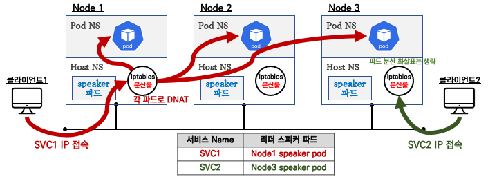
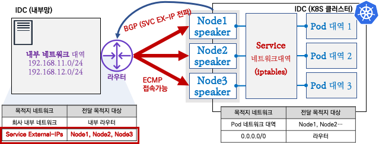

# MetalLB

Kubernetes 사용 시 AWS, GCP, Azure 같은 클라우드 플랫폼에서는 자체적으로 로드 밸런서를 제공해주지만, 온프레미스 클러스터에서는 로드 밸런싱 기능을 제공하는 모듈을 추가적으로 설치해야 한다.  

MetalLB는 BareMetalLoadBalancer의 약자로 베어메탈 환경에서 사용할 수 있는 로드 밸런서를 제공하는 오픈소스 프로젝트이다.  

서비스(로드 밸런서)의 External IP 전파를 위해서 표준 프로토콜인 ARP(IPv4)/NDP(IPv6), BGP를 사용한다.  

 - 깃허브 주소: https://github.com/metallb/metallb

## MetalLB 모드

### MetalLB L2 모드

 - Speaker 파드 중 1개가 리더로 선출되고, 리더는 ARP(GARP, Gratuitous APR)를 이용하여 서비스 External IP 광고합니다.
 - 아래 그림과 같이 iptables 분산룰을 이용하여 Traffic을 전달합니다.

<div align="center">
    
</div>
<br/>

### MetalLB BGP 모드

 - 일반적으로 서버상단에는 L3 스위치가 구성되며, Speaker와 BGP Neighbor를 맺으며, 서비스 External IP를 32bit로 광고합니다.
 - Aggregation-length로 네트워크 Summary로 가능하지만, 좀 더 디테일한 서비스를 위해서라면 32bit로 광고하는걸 권장합니다. 현시점 DataCenter 스위치는 144k이상의 ipv4 Host Routes를 갖고 있습니다.
 - BGP Community와 localpref 등 BGP 설정을 할수 있습니다.

<div align="center">
    
</div>
<br/>

## MetalLB 설치

```bash
# metallb-system 네임스페이스 생성, 파드(컨트롤러, 스피커) 생성, RBAC(서비스/파드/컨피그맵 조회 등등 권한들) 생성
kubectl apply -f https://raw.githubusercontent.com/metallb/metallb/v0.12.1/manifests/namespace.yaml
kubectl apply -f https://raw.githubusercontent.com/metallb/metallb/v0.12.1/manifests/metallb.yaml

# 확인 : 데몬셋으로 배포되는 metallb 스피커 파드의 IP는 네트워크가 host 모드이므로 노드의 IP를 그대로 사용
kubectl get all -n metallb-system
kubectl get pod -n metallb-system -o wide
```

