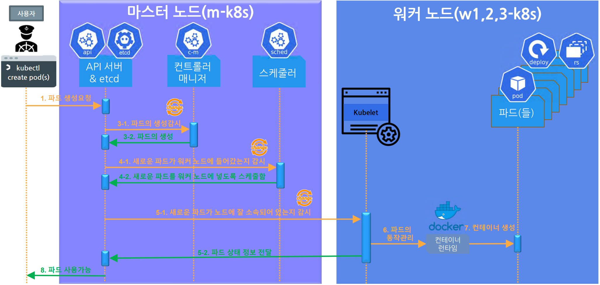
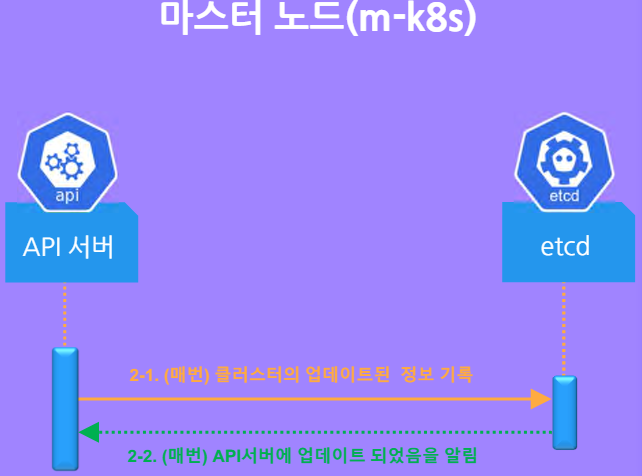
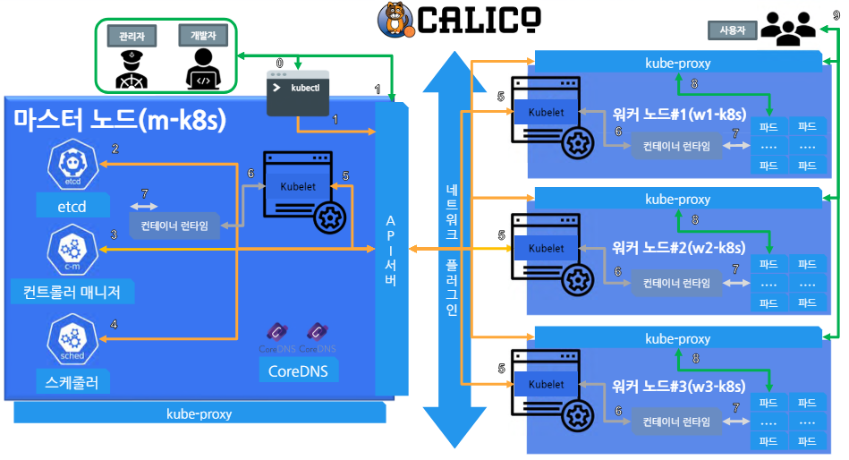

# 쉽게 시작하는 쿠버네티스

 - 홈페이지: https://www.inflearn.com/course/쿠버네티스-쉽게시작/dashboard

<br/>

## 커리큘럼

 - Chapter 01. 쿠버네티스 환경 구성
 - Chapter 02. 배포를 통한 쿠버네티스 체험
 - Chapter 03. 쿠버네티스 인사이드
 - Chapter 04. 문제를 통해 배우는 쿠버네티스
 - Chapter 05. 쿠버네티스 오브젝트
 - Chapter 06. 쿠버네티스 Tips

<br/>

## 1. 쿠버네티스 환경 구성

### 쿠버네티스 배포 종류

 - 관리형 쿠버네티스: AWS, GCP, Azure
 - 설치형 쿠버네티스: RANCHER, RED HAT Openshift
 - 구성형 쿠버네티스: kubeadm, KRIB, kops, kubespray

<br/>

### 쿠버네티스 랩 환경

 - 플레이 쿠버네티스: https://labs.play-with-k8s.com/
 - 쿠버네티스 플레이 그라운드: https://www.katacoda.com/courses/kubernetes/playground
 - VAGRANT, VirtualBox를 이용한 방법
    - VAGRANT: https://www.vagrantup.com/
    - VirtualBox: https://www.virtualbox.org/
    - 깃허브: https://github.com/sysnet4admin/_Lecture_k8s.starterkit
```
1. 깃허브에서 코드를 다운로드받고, 해당 폴더로 이동
2. vagrant를 이용하여 가상화 환경 구성(Kubernetes 설치)
$ cd ch1/1.2/k8s-min-5GiB
$ vagrant up

3. VirtualBox 설정
 - VirtualBox -> 파일 -> 환경 설정 -> 입력 -> 가상머신
    - 호스트 키 조합: ctrl + alt

4. 가상머신 접속
 - root / vagrant
$ kubectl get nodes # 노드 확인
```

<br/>

### 쿠버네티스 랩을 쉽게 접근하기 위한 터미널 구성

 - Supper Putty: https://github.com/jimradford/superputty/releases
 - Putty: https://www.chiark.greenend.org.uk/~sgtatham/putty/latest.html
```
1. Supper PuTTY에 putty 경로를 설정한다.
2. 구성 파일을 임포드 한다.
 - File -> import Sessions -> From File -> ch1/1.3/Sessions.XML
```
<br/>

## 2. 쿠버네티스 체험

### 파드(Pod)

마스터 노드에서 워커 노드로 애플리케이션을 배포하도록 실행한다.  
파드(Pod)란 컨테이너의 집합이다. 대부분 단일 컨테이너로 구성한다. 즉, 한가지 일을 하기 위한 단위로 볼 수 있다.  

```bash
# 파드 생성
kubectl run nginx --image=nginx

# 파드 정보 확인
kubectl get pod
kubectl get pod -o wide

# 파드 IP로 요청 테스트
curl <Pod-IP>
```
<br/>

### 파드 외부 접속 설정(Service)

쿠버네티스 클러스터 외부의 접근을 허용하기 위해서는 설정이 필요하다.  

Service 영역에 배포한 파드를 연결해두면, Service를 통해서 파드에 접근하게 된다. 실제 구조는 노드 포트를 통해서 노드에 연결되어 노드 안의 파드에 접속하게 된다. (Service -> Node Port -> Node -> Pod 접근)
```bash
# nginx 파드의 노출(expose) 설정
kubectl expose pod nginx --type=NodePort --port=80

# service 정보 확인
kubectl get service

# 노드 정보 확인
kubectl get nodes -o wide

curl <INTERNAL-IP>:<PORT>
```
<br/>

### 파드와 디플로이먼트(Deployment)

디플로이먼트는 파드를 여러 개 모아놓은 단위로 볼 수 있다.  
 - kubectl run: 파드만을 배포할 수 있다. (단일 파드)
 - kubectl create: 파드와 디플로이먼트를 배포할 수 있다.
 - kubectl apply: 파드아 디플로이먼트를 배포할 수 있다. (yml 파일을 읽어서 실행한다.)
```bash
# 디플로이먼트 배포
kubectl create deployment deploy-nginx --image=nginx

# 파드 확인
kubectl get pods
kubectl get pods -o wide
```
<br/>

 - 디플로이먼트로 다수의 파드 배포
    - 다수의 파드를 배포하기 위해서는 ReplicaSet을 이용한다. 기본값은 1이다.
```bash
# 파드 배포수 늘리기
kubectl scale deployment deploy-ngignx --replica=3

# 파드 확인
kubectl get pods
```
<br/>

### 로드밸런서(LoadBalancer)

디플로이먼트를 노출하기 위해서는 NodePort를 이용할 수 있다.  

```bash
# 외부 노출 설정
kubectl expose deployment deploy-nginx --type=NodePort --port=80

# 서비스 확인
kubectl get services
```
<br/>

디플로이먼트를 노드 포트로 노출하는 것은 좋은 방법은 아니다. 가장 좋은 방법으로는 로드밸런서 타입을 이용하는 것이다.  
 - 노드 포트보다 로드밸런서가 좋은 점
    - 로드밸런서는 고유의 IP를 만들어 사용할 수 있다.
    - 즉, 노드 포트의 IP를 외부에 노출할 필요가 없다.
```bash
kubectl apply -f ~/_Lecture_k8s.starterkit/ch2/2.4/metallb.yaml

kubectl create deployment chk-hn --image=sysnet4admin/chk-hn
kubectl scale deployment chk-hn --replicas=3
kubectl expose deployment chk-hn --type=LoadBalancer --port=80
kubectl get services
```
<br/>

### 배포한 것들 삭제하기

 - 파드: 컨테이너를 모아 놓은 것
 - 디플로이먼트: 파드를 모아 놓은 것
    - ReplicaSet을 이용하여 배포되는 파드의 수를 조절한다. (scale 명령)
 - 서비스: 파드나 디플로이먼트에 접근하기 전에 처음으로 접근하는 곳곳
    - NodePort, LoadBalancer 등 타입이 존재
```bash
# 삭제 명령어: kubectl delete <종류> <이름>
kubectl delete service chk-hn
kubectl delete service deploy-ngins
kubectl delete service nginx

kubectl delete deployment chk-hn
kubectl delete deployment deploy-nginx

kubectl delete pod nginx

kubectl delete -f ~/_Lecture_k8s.starterkit/ch2/2.4/metallb.yaml
```
<br/>

## 3. 쿠버네티스 인사이드

### 쿠버네티스 구성 요소

 - api, etcd, c-m, sched, CoreDNS, k-proxy, CNI, kubelet

쿠버네티스는 구역을 나누는 네임스페이스라는 단위를 가지고 있다.  
배포했던 파드, 디플로이먼트는 default 네임스페이스에 존재했고, 쿠버네티스를 이루는 구성 요소들은 kube-system 이라는 네임스페이스에 존재한다.  

```bash
# 네이티브 쿠버네티스 구성 요소 확인
kubectl get pods -n kube-system 
```
<br/>

 - AWS - EKS
    - EKS에서도 kube-system 안에 쿠버 시스템 구성 요소가 존재한다.
```bash
kubectl get nodes
aws eks --region us-east-2 update-kubeconfig --name eks

kubectl get nodes
kubectl get pods -n kube-system
```
<br/>

### 쿠버네티스 기본 철학

 - 마이크로서비스 아키텍처: 하는 일들이 나누어져 있다.
 - 선언적인 시스템: 추구하는 상태와 현재 상태를 맞추려고 한다.
    
<div align="center">
    <br/>
    
</div>
<br/>

### 쿠버네티스 파드 배포 흐름

<div align="center">
    
</div>
<br/>

 - 쿠버네티스에서 API 서버는 모든 것의 중심이 된다.
```
1. 사용자가 kubectl 명령을 입력한다.
 - kubectl > API 서버로 전송

2. API 서버는 etcd에 해당 정보를 저장한다.
 - API 서버 > etcd

3. 컨트롤러 매니저가 API 서버를 확인한다.

4. 스케줄러는 API 서버를 확인한다.

5. Kubelet은 API 서버를 확인하고 컨테이너 런타임에 요청을 전송한다.
 - Kubelet > 컨테이너 런타임 > 파드 생성
```
<br/>

## 4. 문제를 통해 배우는 쿠버네티스

### 배포된 파드에 문제가 생긴 경우

 - 단일 파드가 실수로 삭제된 경우 단순 삭제된다.
 - 디플로이먼트가 관리하는 파드가 삭제된 경우 자동으로 생성된다.
```bash
# 단일 Pod와 Deployment를 이용한 3개의 Pod 생성
kubectl apply -f ~/_Lecture_k8s.starterkit/ch4/4.1

# 생성된 파드 확인
kubectl get pods

# 파드 삭제 (단일 파드)
kubectl delete pod del-pod

# 파드 삭제 (디플로이먼트 관리 파드)
kubectl delete pod del-deploy-해쉬값

kubectl get pods
```
<br/>

### 쿠버네티스 구성 요소에 문제가 생긴 경우

kubelet에 문제가 생기면 배포되지 않는다.  
컨테이너 런타임에 문제가 생기면 다른 워커 노드에 파드가 배포된다. 기존의 배포된 파드는 5분 이상 컨테이너 런타임에 문제가 있는 경우 다른 파드로 배포된다.  

 - kubelet이 문제가 생기면 배포되지 않는다.
```bash
# 워커 노드: kubelet 종료
systemctl stop kubelet
systemctl status kubelet

# 마스터 노드: kubelet이 종료된 워커 노드는 배포가 되지 않는다.
kubectl apply -f ~/_Lecture_k8s.starterkit/ch4/4.1/del-deploy.yaml
kubectl get pods
kubectl get pods -o wide

# 워커 노드: kubelet 실행
systemctl start kubelet

# 마스터 노드: kubelet이 실행된 워커 노드에 자동으로 배포된다.
kubectl get pods -o wide
```
<br/>

 - 컨테이너 런타임에 문제가 생기면, 더 이상 파드를 해당 워커 노드에 배포할 수 없다.
 - 컨테이너 런타임에 5분 이상 문제가 생기면 컨테이너 런타임이 동작하지 않음을 인식하고, 다른 워커 노드로 파드가 생성되게 된다.
```bash
# 워커 노드: 컨테이너 런타임 종료
systemctl stop containerd
systemctl status containerd

# 마스터 노드
kubectl scale deployment del-deploy --replicas=6
kubectl get pods -o wide
```
<br/>

### 마스터 노드에 문제가 생긴 경우

 - 스케줄러가 삭제된다면 바로 재생성된다.
```bash
# 쿠버네티스 시스템 파드 확인
kubectl get pods -n kube-system

# 스케줄러 파드 삭제
kubectl delete pod kube-scheduler-m-k8s -n kube-system

# 스케줄러 파드가 다시 재생성된다.
kubectl get pods -n kube-system
```
<br/>

 - 마스터 노드의 kubelet이 중단되면 문제가 있는 것처럼 보이지만, 모든 애플리케이션 배포와 워커 노드 문제가 없이 동작한다.
```bash
# 마스터 노드의 kubelet 중지
systemctl stop kubelet

# 스케줄러 파드 삭제
kubectl delete pod kube-scheduler-m-k8s -n kube-system

# 쿠버네티스 시스템 파드 확인: Terminating으로 나온다.
kubectl get pods -n kube-system

# 파드 배포 -> 정상 배포된다.
kubectl create deployment nginx --image=nginx

# 스케일 3으로 늘리기 -> 정상적으로 배포된다.
kubectl scale deployment nginx --replicas=3

systemctl start kubelet
```
<br/>

 - 마스터 노드의 컨테이너 런타임이 중단되면
    - 시스템 파드들은 동작을 유지한다. (apiserver, controller manager, scheduler 등)
    - coredns 처럼 마스터 노드에 속하지 않는 파드들은 다른 곳으로 배포된다.
```bash
systemctl stop containerd
systemctl status containerd

kubectl get pod
```
<br/>

## 5. 쿠버네티스 오브젝트

쿠버네티스(예를 들어, 파드, 서비스, 볼륨 등)는 쿠버네티스 클러스터 내에서 관리되는 배포 및 네트워킹 등을 정의하는 기본 구성 요소입니다. 쿠버네티스 오브젝트는 쿠버네티스 시스템에서 관리되며, 클러스터의 현재 상태를 나타내는 JSON 또는 YAML 포맷으로 정의됩니다. 이러한 오브젝트는 쿠버네티스 API를 통해 생성, 수정, 검색 및 삭제할 수 있습니다. 이를 통해 쿠버네티스 클러스터를 관리하고 애플리케이션을 배포하고 실행할 수 있습니다.  
 - 네임스페이스, 파드, 서비스, 디플로이먼트, 볼륨 등
<br/>

### 볼륨 실습

```bash
# NFS 서비스 구동
~/_Lecture_k8s.starterkit/ch5/5.2/nfs-exporter.sh log

cat /etc/exports

kubectl apply -f ~/_Lecture_k8s.starterkit/ch5/5.2/dpy-chk-log.yaml

kubectl exec dpy-chk-log-해시값 -it -- /bin/bash
```
<br/>

## 6. 쿠버네티스 Tips

### kubectl을 쉽게 쓰는 법

 - BASH 쉘의 설정은 '~/.bashrc' 파일안에 설정할 수 있다.
 - 여기서, /etc/bash_completion.d/kubectl 에서 불러오도록 설정한다.
 - 이를 통해서, Tab을 눌러 자동 완성을 쉽게 사용할 수 있고, k, ka, kd 등의 별칭으로 단축어를 사용할 수 있다.
```bash
# install bash-completion for kubectl 
yum install bash-completion -y 

# kubectl completion on bash-completion dir
kubectl completion bash >/etc/bash_completion.d/kubectl

# alias kubectl to k 
echo 'alias k=kubectl' >> ~/.bashrc
echo "alias ka='kubectl apply -f'" >> ~/.bashrc
echo "alias kd='kubectl delete -f'" >> ~/.bashrc
echo 'complete -F __start_kubectl k' >> ~/.bashrc
```
<br/>

### 쿠버네티스 버전 업그레이드

 - 업그레이드 계획 수립
 - kubeadm 업그레이드
 - kubelet 업그레이드
 - 업그레이드 완료 확인
```bash
# 쿠버네티스 버전 확인
kubectl get nodes

# 업그레이드 계획 수립
kubeadm upgrade plan

# kubeadm 업그레이드
yum upgrade kubeadm-버전 -y
kubeadm version # 버전 확인
kubeadm upgrade apply 버전

# kubelet 업그레이드
yum upgrade kubelet-버전 -y
kubelet --version
systemctl restart kubelet
systemctl daemon-reload

# 업그레이드 완료 확인
kubectl get nodes

# 해당 과정을 워커 노드에 모두 진행
```
<br/>

### 오브젝트 예약 단축어

```
Pod: po, pod, pods
Deployment: deploy, deployment, deployments
Service: svc, service, services
Node: no, node, nodes
Namespace: ns, namespace, namespaces
```

