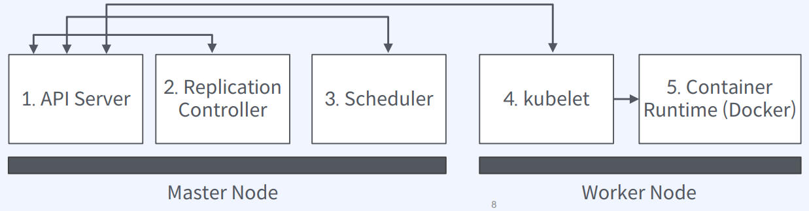

# Pod와 친해지기

 - https://medium.com/finda-tech/kubernetes-%EB%84%A4%ED%8A%B8%EC%9B%8C%ED%81%AC-%EC%A0%95%EB%A6%AC-fccd4fd0ae6

## 1. Pod

쿠버네티스에서 Pod는 가장 기본적인 배포 단위입니다. Pod는 일반적으로 하나 이상의 컨테이너를 포함하며, 이 컨테이너들은 동일한 네트워크 네임스페이스, IPC(Inter-Process Communication) 네임스페이스, 그리고 파일 시스템을 공유합니다. 즉, Pod 내의 컨테이너들은 동일한 호스트에서 실행되며, 서로 간에 localhost를 통해 통신할 수 있습니다.  

일반적으로 한 Pod 내에는 관련 있는 여러 컨테이너가 함께 배치됩니다. 이러한 컨테이너들은 종종 동일한 애플리케이션의 여러 구성 요소를 담당하거나, 하나의 애플리케이션과 함께 부가적인 도구 또는 서비스를 제공하는 용도로 함께 그룹화됩니다.  

 - __원자성(Atomicity)__: Pod 내의 컨테이너들은 함께 스케줄되고 함께 배포됩니다. 즉, Pod는 동일한 노드에서 같은 시점에 실행됩니다.
 - __동일한 네트워크 네임스페이스와 IP 주소__: Pod 내의 컨테이너들은 같은 IP 주소와 포트 범위를 공유하므로, 서로 localhost를 통해 통신할 수 있습니다.
 - __공유 스토리지__: Pod 내의 컨테이너들은 동일한 스토리지 볼륨을 공유할 수 있습니다.

     
    

 

### Pod의 특징

Pod는 노드에서 컨테이너를 실행하기 위한 가장 기본적인 배포 단위로, 여러 노드에 1개 이상의 Pod을 분산 배포/실행 가능하다.  
 - 쿠버네티스는 Pod을 생성할 때 노드에서 유일한 IP를 할당
 - Pod 내부 컨테이너 간에 localhost로 통신 가능(포트 충돌 주의)
 - Pod 안에서 네트워크와 볼륨 등 자원을 공유
 - 보통 하나의 Pod에는 하나의 컨테이너만 존재하지만, 두 개의 컨테이너가 하나의 Pod에 속할 수도 있다. (하나의 Pod 안에 여러 개의 컨테이너가 속할 수 있음)
 - Pod IP는 클러스터 안에서만 접근할 수 있다. 클러스터 외부 트래픽을 받기 위해서는 Service 혹은 Ingress 오브젝트가 필요하다.

     
    이미지 출처 - 카카오 테크

 

### 노드에 배포되는 과정

1. 사용자로부터 Pod 배포 요청을 수락한다.  
2. 요청 받은 수만큼 Pod Replica를 생성한다.  
3. Pod을 배포할 적절한 노드를 선택한다. (nodeSelector)  
4. 컨테이너 런타임(Docker)에 이미지 다운로드를 명령하고 Pod 실행을 준비한다. Pod 상태를 업데이트한다.  
5. 이미지를 다운로드하고 컨테이너를 실행한다.  

    

 

### Pod 기본 상식

 - __Pod 생성과 배포__
    - Pod은 여러 개의 컨테이너를 포함할 수 있고 하나의 노드에 배포된다.
    - Pod을 YAML 파일로 정의해두면 필요할 때 원하는 수 만큼 노드에 배포할 수 있다.
    - Pod과 컨테이너를 1:1로 기본 설계하고 특별한 사유가 있는 경우 1:N 구조를 고민한다.
 - __Pod IP__
    - 쿠버네티스는 Pod을 생성할 때 클러스터 내부에서만 접근할 수 있는 IP를 할당한다.
    - Pod IP는 컨테이너와 공유되기 때문에 컨테이너 간 포트 충돌을 주의해야 한다.
    - 하나의 Pod에 속한 컨테이너들은 localhost로 통신할 수 있다.
    - 다른 Pod(컨테이너)과 통신은 Pod IP를 이용한다.
