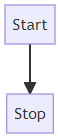
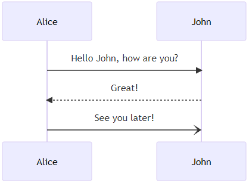
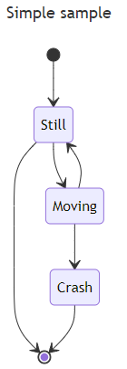
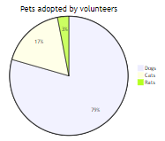
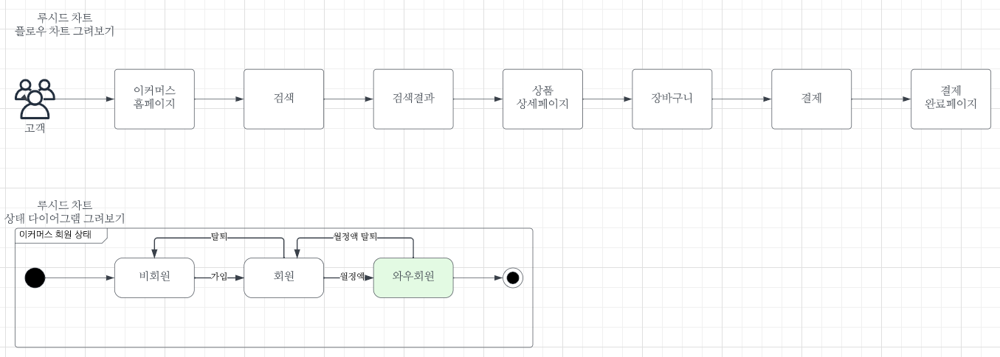
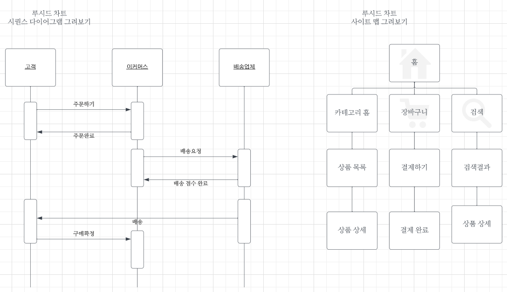
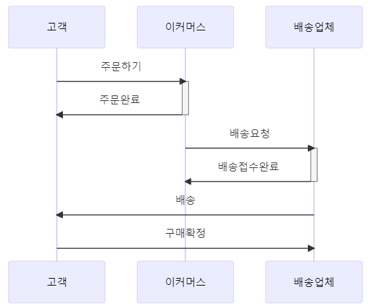
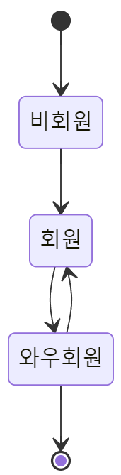
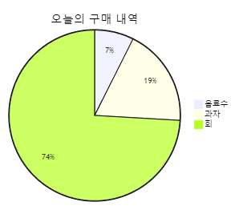

# 초기 이커머스 아이디어 기획하기

 - 루시드 차트와 머메이드 사용법

## 아이디어 시각화하기

 - 여러가지 아이디어가 필요한 상황들
    - 새로운 제품 또는 서비스 개발
    - 새로운 기능 추가
    - 새로운 마케팅 프로그램
    - 기존 제품 도는 서비스 수정
    - 업무 절차 수정
 - 아이디어 표현하는 방법들
    - 제품 또는 서비스 모양 그려보기
        - 냅킨, 노트, 연습장, 화이트 보드 등
    - 서비스 흐름을 그려보기
        - UML(플로우차트)
    - 상태 전이를 그려보기
        - UML(상태 다이어그램)
    - 누가 사용자 또는 고객인가?
        - 유즈 케이스, 액터 정의, 액터별 사용 케이즈 파악하기
 - 아이디어를 서비스 수준으로 구체화
    - 고객 시나리오
        - 고객의 전체 여정, 시작부터 끝까지 그려보기, 다양한 시나리오 그려보기
    - MVP(Minimum Variable Product)
        - 린 스타트업의 개념
        - Minimum Variable Product, Minimum Valuable Product
        - 최소 기능 제품 도는 최소 실행 가능 제품, 최소의 노력, 최소의 공수, 가설 고객 테스트
    - PRD(Product Requirement Document)
        - 요구사항과 이에 대한 효과를 표현하는 방법
        - 배경, 목표, 사용자 스토리, UX 원칙, 주요 지표, 개발 계획, FAQ
    - 1 Pager
        - 자신이 만들 서비스나 기능에 대해서 종이 한장에 표현하는 것
        - 목적, 배경, 원칙, 주요 지표, 개발 계획, FAQ, 고객은 왜 우리를 고용했는가?
    - 보도 자료 포맷
        - 자신의 서비스가 신문이나 뉴스에 TV에 나오는 것을 가정
        - 제목, 부제목, 새로운 기능 등 세부적인 내용, 고객이 받을 수 있는 혜택, 담당 책임자의 말
    - 3 Whys
        - 왜 고객은 이 기능을 사용해야 하는가?
        - 왜 고객은 이 서비스를 사용해야 하는가?
        - 왜 고객은 이 제품을 사용해야 하는가?
        - 목적, 대의, 신념, 방향
        - 문제의 핵심에 도달
 - 아이디어 시각화 도구들
    - 자신의 생각을 표현하는 방법은 다양하다. 도구가 생각을 방해하면 안 된다.(단순한 것이 최고) 편집이 생각을 방해하면 안 된다.(선기록, 후편집)
    - 오프라인 도구
        - 냅킨, 포스트잇, 노트, 메모장, 화이트 보드
    - 온라인 도구
        - 파워포인트, 엑셀, Balsamiq, Figma, Lucid Chart, Mermaid
 - 추천하는 아이디어 시각화 방법
    - 오프라인 도구로 생각을 모으고 정리한다.
        - 메모장, 포스트잇, 화이트보드, 종이 프로토 타이핑
    - 온라인으로 표현한다.
        - 루시드 차트(Lucid Chart)
        - 피그마(Figma)
        - 머메이드(Mermaid)
 - 관련 개발자 도구
    - 화이트보드
        - 쉽고 빠르다.
        - 공동 작업이 가능하다.
        - 표현력이 높다.
        - 학습 곡선이 없다.
        - 사진 촬영으로 공유
    - 루시드 차트
        - 쉽고 빠르다.
        - 공동 작업이 가능하다.
        - 표현력이 높다.
        - 학습 곡선이 낮다.
        - 공유하기 쉽다.
    - 머메이드
        - 마크다운 스타일
        - 타 도구들과 연동이 가능하다. (깃허브, 노션)
        - 온라인 라이브 에디터 제공

<br/>

## 아이디어 시각화 도구

### 루시드 차트

루시드 차트(Lucid Chart)는 온라인 다이어그램 및 플로우차트 작성을 위한 웹 기반 도구입니다. 이 도구를 사용하면 사용자는 간단한 기업 다이어그램, 프로세스 플로우차트, 조직도, 와이어프레임, UML 다이어그램, 네트워크 다이어그램 등을 만들 수 있습니다. Lucid Chart를 통해 사용자는 협업을 쉽게 할 수 있으며 여러 사용자가 동시에 작업할 수 있도록 지원합니다.  

 - UML (통합 모델링 언어)
 - 객체 관계, 상호 작용
 - 도메인 분석 및 설계, 업무 분석, 시스템 분석
 - 상태 전이
 - 동료와 협업과 공유
 - 다른 도구와 통합

<br/>

#### 루시드 차트 주요 기능

 - 기본 도형 및 UML 기반
    - 도메인 분석, 절차 구성, 플로우 차트, 상태, ERD
 - 아키텍처 설계
    - 클라우드 설계(AWS, Azure, GCP), 네트워크
 - 마인드 맵
 - 조직 구성도
 - 공유 및 협업하기
 - 내보내기
 - 그 외 수많은 템플릿
 - UML 기반 시각화 템플릿 제공
    - 기본 도형, 플로우 차트, 클래스 다이어그램, 시퀀스 다이어그램, 상태, 유스케이스, ERD
 - 시스템 구성도 템플릿 제공
    - 서비스 시스템 구성도, 내부 연동 시스템, 외부 연동 시스템, 플랫폼, 클라우드
 - 사이트 맵
    - 웹 서비스 맵, 모바일 앱 서비스 맵, 타사 벤치마킹

<br/>

### 머메이드

머메이드(Mermaid)는 마크다운(Markdown) 문법을 사용하여 다이어그램 및 그래프를 생성하는 오픈 소스 JavaScript 라이브러리입니다. 머메이드를 사용하면 간단한 텍스트 기반 명령어를 통해 다양한 종류의 다이어그램을 만들 수 있습니다.  

 - 홈페이지: https://mermaid.js.org/#/
 - 플로우 차트
 - 시퀀스 다이어그램
 - 상태 다이어그램
 - 파이차트
 - 다른 도구와 통합 (노션, 깃허브)

<br/>

#### 머메이드 기본 기능

 - 플로우 차트
    - flowchart, 방향, 화살표, 노드
    - TB: top to bottom
    - TD: top-down
    - BT: bottom to top
    - RL: right to left
    - LR: left to right
 - 시퀀스 다이어그램
    - sequenceDiagram, 화살표, 메시지
    - ->>
    - -->>
    - -)
 - 상태 다이어그램
    - stateDiagram-v2
 - 파이 차트
    - pie title

```
flowchart TD
    Start --> Stop
```

<div align="center">
    
</div>

```
sequenceDiagram
    Alice->>John: Hello John, how are you?
    John-->>Alice: Great!
    Alice-)John: See you later!
```

<div align="center">
    
</div>

```
---
title: Simple sample
---
stateDiagram-v2
    [*] --> Still
    Still --> [*]

    Still --> Moving
    Moving --> Still
    Moving --> Crash
    Crash --> [*]
```

<div align="center">
    
</div>

```
pie title Pets adopted by volunteers
    "Dogs" : 386
    "Cats" : 85
    "Rats" : 15
```

<div align="center">
    
</div>

<br/>

## 아이디어 시각화 도구 실습하기

### 루시드 차트 실습

 - 회원 가입 및 로그인
    - 홈페이지: https://www.lucidchart.com/pages/ko

<div align="center">
    
</div>
<div align="center">
    
</div>

<br/>

### 머메이드 실습

 - 머메이드 공식 문서: https://mermaid.js.org/
 - 머메이드 라이브: https://mermaid.live/edit

```
flowchart LR
    고객 --> 이커머스
    이커머스 --> 검색
    검색 --> 검색결과
    검색결과 --> 상품상세
    상품상세 --> 장바구니
    장바구니 --> 결제
    결제 --> 결제완료
```
<div align="center">
    
</div>

```
sequenceDiagram
    고객->>+이커머스: 주문하기
    이커머스->>-고객: 주문완료
    이커머스->>+배송업체: 배송요청
    배송업체->>-이커머스: 배송접수완료
    배송업체->>고객: 배송
    고객->>배송업체: 구매확정
```
<div align="center">
    
</div>

```
stateDiagram-v2
    [*] --> 비회원
    비회원 --> 회원
    회원 --> 와우회원
    와우회원 --> 회원
    와우회원 --> [*]
```
<div align="center">
    
</div>

```
pie title 오늘의 구매 내역
    "음료수" : 2000
    "과자" : 5000
    "회" : 20000
```
<div align="center">
    
</div>

<br/>

## 이커머스 서비스 흐름 정의하기

상대의 얘기가 복잡하다고 느껴지면 오프라인 도구(메모장, 화이트보드), 온라인 도구(루시드차트, 머메이드 등)를 이용하여 바로 시각화하고, 시각화한 내용을 공유한다.  

 - 구매자 서비스 흐름
    - 구매자 > 홈페이지 > 검색 > 검색 결과 > 상세페이지 > 장바구니 > 결제 > 완료페이지
    - 검색
        - 구매자는 이커머스 홈페이지에 접속한다.
        - 구매자는 검색 기능을 이용해 상품 검색을 한다.
        - 구매자는 검색 결과에서 맘에 드는 상품을 선택한다.
    - 탐색
        - 구매자는 이커머스 홈페이지에 접속한다.
        - 구매자는 메뉴 목록을 클릭한다.
        - 구매자는 메뉴 상품 목록에서 맘에 드는 상품을 선택한다.
 - 판매자 서비스 흐름
    - 온보딩(입점)
        - 판매자 > 판매자 홈 > 회원 가입 > 판매자 정보 정산 정보 등록
        - 판매자는 가입을 위해 판매자 홈페이지에 접속한다.
        - 판매자는 판매자 회원 가입을 한다.
        - 판매자는 판매 정보와 정산 계좌 정보를 등록한다.
    - 판매 등록
        - 판매자 > 판매자 홈 > 상품 관리 > 신규 상품 등록 > 상품 목록
        - 판매자는 상품 관리 홈페 접속한다.
        - 판매자는 신규 상품 등록을 한다.
        - 판매자는 등록된 상품 목록을 볼 수 있다.
 - 운영자 서비스 흐름
    - 운영자 등록
        - 운영자 > 운영 관리 홈 > 권한 요청
        - 운영자는 운영 툴에 접속할 수 있다.
        - 운영자는 특정 운영 기능(주문)의 권한을 얻을 수 있다.
    - 서비스 운영
        - 운영자 > 운영 관리 홈 > 주문 관리 목록 > 주문 검색 > 주문 상세 정보
        - 운영자는 주문 관리 메뉴에 접속할 수 있다.
        - 운영자는 주문 목록을 볼 수 있다.
        - 운영자는 검색 조건으로 주문을 검색할 수 있다.
        - 운영자는 주문 상세 정보를 볼 수 있다.

<br/>

## 이커머스 시스템 설계하기

 - 시스템 설계시 고려해야할 점
    - 목적, 시간, 인력, 비용, 확장성, 기타
    - 시스템이 왜 필요한지?
    - 해당 서비스를 언제 고객에게 전달하는지?
    - 현재 소요한 인력과 예산 고려
    - 소규모 고객이 사용하는 상황과 대규모 고객이 사용하는 상황에 따른 확장
 - 이커머스 고객 시스템
    - 홈, 검색, 탐색, 상품 상세, 장바구니, 결제, 마이페이지 등
 - 이커머스 판매자 시스템
    - 판매자 홈, 판매 상품 목록, 판매 상품 상세, 정산, 판매자 정보 등
 - 이커머스 운영자 시스템 (어드민, 백오피스)
    - 운영자 홈, 판매 상품 목록, 판매 상품 상세, 주문 목록, 주문 상세, 정산, 운영자 정보 등

