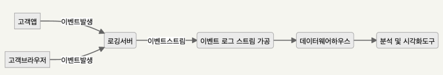

# 초간단 이커머스 서비스 로깅

## 로깅 남기기

 - `로깅이란?`
    - 필요한 정보를 출력 매체를 통해 보여주거나 기록하는 것
    - 출력한 로그를 기반으로 서비스나 시스템의 진단, 분석, 예측
 - `로그 기록 방법`
    - 콘솔
    - 파일
    - 이메일
    - 데이터베이스
 - `로깅 프레임워크`
    - 각 언어별 로깅 방법이 유사하다.
    - 자바 진영에서 사용되는 로깅 프레임워크: Logback, Log4j
 - `Logback 특징`
    - SLF4J 기반의 구현체 (Simple Loggin Facade For Java 구현체)
    - 5단계의 로그 레벨 지원
    - 서비스나 앱의 운영 환경에 따라 별도로 로그 설정 적용 간으
    - Log4J 보다 뛰어난 성능, 필터링, 로그레벨 변경 등의 향상
    - 기본적으로 Spring Boot Start Web에 포함되어 있음
    - 서버를 재시작하지 않고도 설정 변경 가능
    - 압축 지원
    - 보관 기간 관리 가능
 - `Logback 아키텍처`
    - Logger
        - 로그 메시지 생성 관련 클래스
    - Appender
        - 로그를 출력할 대상 클래스
        - 로거가 로깅 이벤트를 전달
        - 실제 로깅 작업 담당
    - Layout
        - 로그 포맷 관련 클래스
        - 패턴을 통한 로깅 메세지 형식 지정
 - `5가지 로깅 레벨`
    - TRACE < DEBUG < INFO < WARN < ERROR
    - TRACE 레벨로 지정하면 TRACE, DEBUG, INFO, WARN, ERROR 모든 로그가 출력된다.
    - ERROR 레벨로 지정하면 ERROR 로그만 출력된다.
    - 상용 서버에서는 보통 INFO 레벨을 지정한다.
 - `Logback 로깅 방법`
    - 로그를 어떤 방법으로 남길지 설정 가능
    - ConsoleAppender
    - FileAppender
    - RollingFileAppender
    - SMTPAppender
    - DBAppender
 - `Logback 적용 방법`
    - 스프링 부트에서는 2가지 설정 방법이 존재한다.
    - application.yml 파일에 설정하는 방법
    - logback-spring.yml 파일에 설정하는 방법
```properties
logging.level.root=warn
logging.level.org.springframework.web=debug
logging.level.org.hibernate=error
```
 - `Logback 로그 설정`
    - 클래스 패스 위치에 있어야 한다.
    - 리소스 폴더에 생성 ('src/main/resources/')
    - 설정 파일명
        - logback-spring.xml
        - logback-spring.groovy
        - logback.xml
        - logback.groovy
```XML
<!-- Logback 설정 - 콘솔 -->
<configuration>
    <appender name="STDOUT" class="ch.qos.logback.core.ConsoleAppender">
        <encoder>
            <pattern>%d{HH:mm:ss.SSS} [%thread] %-5level %logger{36} - %msg%n</pattern>
        </encoder>
    </appender>

    <root level="debug">
        <appender-ref ref="STDOUT" />
    </root>
</configuration>
```
```XML
<!-- Logback 설정 - 롤링 파일 -->
<!-- https://logback.qos.ch/manual/appenders.html -->
<configuration>
  <appender name="FILE" class="ch.qos.logback.core.rolling.RollingFileAppender">
    <file>logFile.log</file>
    <rollingPolicy class="ch.qos.logback.core.rolling.TimeBasedRollingPolicy">
      <!-- daily rollover -->
      <fileNamePattern>logFile.%d{yyyy-MM-dd}.log</fileNamePattern>

      <!-- keep 30 days' worth of history capped at 3GB total size -->
      <maxHistory>30</maxHistory>
      <totalSizeCap>3GB</totalSizeCap>

    </rollingPolicy>

    <encoder>
      <pattern>%-4relative [%thread] %-5level %logger{35} -%kvp- %msg%n</pattern>
    </encoder>
  </appender> 

  <root level="DEBUG">
    <appender-ref ref="FILE" />
  </root>
</configuration>
```
 - `Logback 스프링 프로파일별 설정`
    - 스프링 부트의 프로파일에 따라 로깅 정책을 변경할 수 있다.
```XML
<springProfile name="staging">
    <!-- configuration to be enabled when the "staging" profile is active -->
</springProfile>

<springProfile name="dev | staging">
    <!-- configuration to be enabled when the "dev" or "staging" profile is active -->
</springProfile>

<springProfile name="!production">
    <!-- configuration to be enabled when the "production" profile is not active -->
</springProfile>
```
 - `Logback 로깅 남기기`
    - LoggerFactory를 통해 로거를 얻고, 로깅을 남길 수 있다.
```Java
public class Example {
    private static final Logger logger = LoggerFactory.getLogger(Example.class)

    public static void main(String[] args) {
        logger.info("Example log from {}", Example.class.getSimpleName());
    }
}
```
 - `로깅 패턴 알아보기`
```
날짜
 - 패턴: %d{날짜패턴}, %date{날짜패턴}
 - 설정: %d{HH:mm:ss.SSS}
 - 결과: 2006-10-20 14:06:49,812

로그레벨(고정폭)
 - 패턴: %-5level
 - 설정: %-5level
 - 결과: INFO, DEBUG, WARN, ERROR, TRACE

로그메시지
 - 패턴: %m, %msg, %message
 - 설정: %m, %msg, %message
 - 결과: Debug Log Test

로깅 발생 클래스
 - 패턴: %C
 - 설정: %C
 - 결과: com.example.sample.LogTest

현재 쓰레드
 - 패턴: %thread
 - 설정: [%thread]
 - 결과: [nio-8080-exec-1]

로거의 이름
 - 패턴: %logger{length}
 - 설정: %logger{36}
 - 결과: c.f.t.l.h.LogTestController

줄바꿈
 - 패턴: %n
 - 설정: %n
 - 결과:
```
 - `실전 Tip`
    - Java 로깅은 로그백을 사용한다.
    - 스프링 부트 설정 파일 또는 로그백 설정 파일을 사용할 수 있다.
    - 스프링 프로파일에 맞춰 로깅 정책을 설정할 수 있다.
    - 개발 서버에서는 ConsoleAppender와 DEBUG 레벨을 사용한다.
    - 운영 서버에서는 RollingFileAppender와 INFO 레벨을 사용한다.

<br/>

## 로깅 수집하기

 - `로깅 수집이란`
    - 서비스나 시스템에서 발생한 이벤트를 전송하거나 기록하는 것
    - 전송되거나 기록된 이벤트 데이터를 가공하고, 가공된 로그를 저장소에 적재하는 것
    - 검색이 목적이라면 검색 엔진에 적재되면서 인덱싱, 보관 목적이라면 AWS S3 같은 대용량 파일 저장소에 적재하게 된다.
 - `로깅 수집 방법들`
    - 1. 메시지 플랫폼과 병합하여 로그 기록시 메시지를 발행하고, 메시지를 수신한 곳에서 적절하게 가공하여 적재
    - 2. 로그를 기록하면 이를 동기화하는 툴을 이용하여 다른 곳에 해당 로그를 복제
    - 3. 로그를 기록하면 특정 에이전트가 수집해서 특정 시스템에 푸시한다.
 - `로깅 수집 도구들`
    - Filebeat (엘라스틱)
        - 엘라스틱 제품군에 포함되어 LOGSTASH나 ELASTIC SEARCH와 결합되어 사용된다. 로그를 수집하려는 각 시스템에 Filebeat를 설치하고, 해당 시스템에 로그를 수집해서 전송하는 방식을 이용한다.
        - 경량 로그 수집기
        - 모니터링 시스템에 설치
        - 수집 대상 지정
        - 로그 데이터 파싱
        - 전송: Logstash, Elastic Search
    - Fluentd (오픈 소스)
        - 범용적인 로그 수집기 (Web, App, System, DB 로그 등)
        - JSON 구조
        - 500개 이상의 다양한 플러그인 제공
        - 아주 적은 시스템 리소스 사용
        - 데이터 손실 방지(버퍼링 지원)
    - Promtail (그라파나)
        - 그라파나 제품군에 포함되어 Grafana Loki와 결합되어 사용된다. 모니터링하려는 시스템에 에이전트형으로 설치하고, 해당 시스템에 로그를 수집해서 전송하는 방식을 이용한다.
 - `로그 처리 세트 아이템`
    - 실무에서는 로그 수집기를 단독으로 사용하지 않는다. 로그 수집 뿐 아니라, 이를 적재해서 전송하고 분석 및 조회하고 시각화하도록 한다. 때문에, 다른 제품과 조합하여 사용하게 된다.
    - ELK (Elastic Search + Logstash + Kibana)
    - EFK (Elastic Search + Fluentd + Kibana)
    - Grafana + Loki
 - `로깅 수집된 이후`
    - 수집된 로그를 전송
    - 전송된 로그를 적재
    - 적재된 로그를 활용

<br/>

## 로깅 조회하기

로그를 남기면 해당 로그는 어디엔가 적재될 것이다.  
이렇게 적재된 로그를 검색할 수 있는 도구가 필요하다.  

 - `로그 조회`
    - 서비스나 이벤트에서 발생한 로그를 검색
    - 검색 조건: 언제(When), 어디서(Where), 무엇(What), 로그등급
 - `로그 조회 도구`
    - 터미널
    - Elastic Search + Kibana
        - Elastic Search에 로그를 적재하고, Kibana를 통해서 조회한다.
        - Full-text 검색 가능
        - 다양한 검색 조건 가능
        - KQL을 통한 조회 (Kibana Query Language)
        - Kibana 풍부한 시각화가 가능
        - 유지 비용이 상대적으로 높다.
    - Loki + Grafana
        - Loki에 로그를 적재하고, Grafana를 통해서 조회한다.
        - 데이터 소스별 인덱싱 지원(자곡, 매우 빠르다.)
        - LogQL을 통한 조회 (Log Query Language)
        - Grafana에서 통합 사용
        - 시계열 데이터에 특화
        - 유지 비용이 상대적으로 낮다.
 - `로그 검색 필수 조건`
    - 어디서 로그가 발생했는지?
        - 역할(Role) - 주문, 결제, 배송
    - 언제 로그가 발생했는지?
        - 시간 범위, 보관 기한 중요
    - 로그 레벨은?
        - 5단계 로그 레벨
    - 어떤 애플리케이션에서 발생했는지?
        - nginx, springboot, nodejs, django
    - 기타 키워드

<br/>

## 확장성 있는 로깅 설계

 - `확장성 있는 로깅을 위한 가이드`
    - 로깅 레벨을 판단하는 기준을 만든다.
    - 구조화된 로깅 (Plain Text -> JSON or XML)
    - 맥락을 담은 로깅(Context)
        - 누가 요청했는지? 어디서 요청했는지? 무엇을 요청했는지? 언제 요청했는지?
    - 민감 정보를 담지 않는다. (개인정보, 시스템 비밀번호)
    - 영어로 로깅을 남기도록 노력한다.
    - 사람이 읽을 수 있어야 한다.
 - `로깅 방법의 큰 분류`
    - 도메인 서버의 직접 파일 로깅
    - 도메인 서버의 데이터베이스 로깅
    - 도메인 서버의 원격 로깅
 - `도메인 서버의 직접 파일 로깅`
    - 로깅 프레임워크를 이용한 로깅 (Logback, Log4j)
    - 개발과 디버깅 목적
    - 서비스 운영 관련 정보 확인 및 수집 목적
    - 서비스 오류 및 이상 알림
 - `도메인 서버의 직접 데이터베이스 로깅`
    - 변경 이력 기록 및 추적 목적의 로깅
    - 중요한 정보에 대한 기록 및 이력
        - 고객 정보 변경
        - 상품 정보 변경
        - 판매자 정보 변경
        - 수수료 정보 변경
        - 결제 수단 변경
    - 파일 로깅이나 원격 로깅에 비해 양이 적다.
    - 많은 양을 쌓을 수 없어 테이블 파티션 전략 필요
        - 범위, 목록, 키, 해시
        - 연도별
 - `도메인 서버의 원격 로깅`
    - 원격 로깅 전용 서버
        - 솔루션 사용
        - 직접 구현
    - 원격 로깅 방법
        - HTTP 메서드: POST
        - 데이터 타입: JSON, XML
    - 원격 로깅 특징
        - 고객의 행동을 분석하는 목적이 크다. (클릭, 뷰, 고객 여정, 머무는 시간 등)
        - 일부 유실을 가정
        - 엄청난 양의 데이터가 생성되는 것을 가정
        - 빠르게 수집하고 분석
        - 원격 로깅으로 인한 타 시스템의 영향을 주지 않아야 한다.
    - 원격 로깅 구조
        - 공통 정보
            - 클라이언트 정보
        - 로깅 구조 관련 메타 정보
            - 로깅 구조 관리
        - 로깅 데이터
            - 이벤트 유형: 클릭, 노출, 속도, 에러
            - 이벤트 데이터
        - 확장 데이터
            - 각 도메인에서 추가로 필요한 정보
    - 원격 로깅 흐름
        - 원격지 로깅 서버가 필요하다.
        - 고속 처리를 위한 메시징 플랫폼을 활용한다.
        - 대용량 로깅 저장소가 필요하다.
        - 도메인 서버에서 로깅을 HTTP 프로토콜로 전송하고, 로깅 서버가 해당 요청을 수신한다. 이후 로깅 서버는 메시지 플랫폼을 이용하여 메시지를 발행하고, 발행된 메시지를 컨슈머가 수신하여 고속으로 이를 처리하고 가공한다. 가공된 로깅 정보는 통합 저장소에 저장한다. 저장된 정보는 데이터 분석이나 조회를 통해서 서비스나 사업에 재활용된다.
        - 도메인 서버 > HTTP POST 요청 > 로깅 서버 > 로깅 기록, 메시지 전송 > 메시지 수신 > 저장소

<br/>

## 웹로깅 시스템 만들기

웹 로깅 시스템은 웹 애플리케이션의 동작을 모니터링하고 문제를 해결하며, 보안을 강화하고 사용자 경험을 개선하기 위해 필수적인 도구 중 하나이다.  
이러한 시스템을 사용하여 데이터 기반 의사 결정을 하고 비즈니스 및 기술적인 목표를 달성하는 데 도움이 될 수 있다.  

 - `웹로깅 시스템`
    - 웹 애플리케이션에서 발생하는 다양한 이벤트와 활동을 기록하고 저장하는 시스템입니다. 이러한 시스템은 웹 사이트 또는 웹 애플리케이션의 동작을 모니터링하고 분석하는 데 사용됩니다.
 - `웹로깅 시스템 흐름`
    - 이벤트 및 데이터 생성
        - 웹 애플리케이션에서 발생하는 다양한 이벤트와 데이터를 생성
        - 이벤트는 사용자의 요청 및 응답, 오류 메시지, 보안 이벤트, 성능 메트릭 (예: 응답 시간), 사용자 활동 로그 등을 포함할 수 있다.
    - 로그 수집
        - 생성된 이벤트 및 데이터는 로그 수집 컴포넌트에 의해 수집된다.
        - 로그 수집은 웹 서버, 애플리케이션 서버, 로드 밸런서, 웹 애플리케이션 프레임워크 또는 특수한 로깅 에이전트를 통해 이루어질 수 있다.
    - 로그 전송
        - 수집된 로그는 로그 전송 프로토콜을 통해 로그 저장소로 전송된다.
        - 로그는 실시간 또는 배치 처리 방식으로 전송될 수 있으며, 안전하게 보관된다.
     - 로그 저장
        - 로그 저장소는 수집된 로그 데이터를 저장하고 보관하는 공간으로 로그 데이터베이스, 파일 시스템, 클라우드 스토리지 등으로 구성된다.
        - 로그 저장소는 데이터의 안정성, 보안, 검색 기능, 보관 기간 등을 관리한다.
    - 로그 분석
        - 로그 저장소에 저장된 데이터는 로그 분석 도구 또는 시스템에 의해 분석된다.
        - 로그 분석은 로그 데이터를 가공, 집계 및 시각화하여 정보를 추출하고 문제나 패턴을 식별하는 데 사용된다.
        - 로그 분석은 보안 이벤트 탐지, 성능 최적화, 사용자 경험 향상, 비즈니스 인텔리전스 등 다양한 목적으로 수행한다.
    - 알림 및 대응
        - 로그 분석 결과에 따라 알림을 생성하고, 보안 이슈 또는 성능 문제에 대한 대응 조치를 수행하는 것이 중요하다.
        - 예를 들어, 보안 공격 감지 시 관리자에게 경고를 보내거나, 성능 이슈를 해결하기 위해 리소스를 조정할 수 있다.
    - 보고서 및 시각화
        - 로그 데이터를 시각적으로 나타내거나 보고서 형태로 제공하여 사용자 및 관리자에게 정보를 전달합니다. 대시보드, 그래프, 통계, 히트맵 등을 사용하여 로그 데이터를 시각적으로 표현한다.
<div align="center">
    
</div>

 - `웹로깅 시스템 구성`
    - 이벤트 로그 수집
        - 실시간(준실시간)
        - 데이터 포맷(JSON → Parquet), 용량
    - 이벤트 로그 가공
        - 데이터 카달로그
    - 이벤트 로그 적재
        - 대형 중앙 집중식 리포지토리(데이터 웨어하우스)
    - 로그 조회 및 분석
        - 분석 및 시각화 도구
 - `웹로깅 시스템 도구 사례`
    - 고객 이벤트 로그 수집
        - Amazon Kinesis Data Firehose
        - 안정적으로 실시간 스트림을 데이터 레이크, 웨어하우스, 분석 서비스에 로드
    - 고객 이벤트 로그 가공
        - AWS Glue
        - 데이터 통합 서비스
        - 여러 소스의 데이터를 쉽게 검색, 준비, 이동, 통합할 수 있도록 하는 서버리스
    - 고객 이벤트 로그 적재
        - Amazon Redshift (클라우드 데이터 웨어하우징)
        - S3 (확장 가능한 데이터 스토리지)
    - 고객 이벤트 로그 조회 및 분석
        - AWS Athena (like Google Big Query)
        - 대용량 파일 시스템(S3)를 조회
        - 필요한 만큼 데이터를 분석하고 돈을 지불한다는 장점
 - `웹로깅 시스템 응용`
    - ABTest
    - 기능 플래그
    - 트래픽 조절기

<br/>

## 로깅 시각화

로깅 시각화(Logging Visualization)는 로그 데이터를 그래프, 차트, 대시보드 및 다른 시각적 요소를 사용하여 시각적으로 나타내는 프로세스입니다. 이것은 로그 데이터를 이해하기 쉽고 정보를 추출하고 분석하는 데 도움이 되며, 로그 데이터의 트렌드, 패턴, 이상 징후를 시각적으로 확인하는 데 유용합니다.  

 - `로깅 시각화`
    - 수집된 데이터를 기반으로 시각적으로 표현하는 것
    - 복잡한 데이터, 방대한 데이터, 큰 숫자를 쉽게 표현하는 것
 - `데이터 시각화 목적`
    - 시각화를 통해 데이터를 쉽게 이해할 수 있도록 하여 전략적인 의사결정, 고객 서비스 개선, 시스템 운영 및 대처하기 위해 사용한다.
 - `데이터 시각화 주기`
    - 실시간(준 실시간): 이벤트 스트림
    - 비실시간(배치): 동기화 주기에 따른 분석 및 시각화, 일반적으로 하루 전 데이터
 - `데이터 시각화 도구들`
    - 공통: 엑셀
        - 실무에서 가장 자주 사용하는 도구
        - 원시 데이터의 분석과 시각화
        - 사업의 초기 분석, 트렌드 파악, 인사이트 도출
        - 다야한 그래프와 차트 지원
    - 엔지니어링 사이드: Elastci Search + Kibana, Grafana
        - 엔지니어링 관점의 로그 데이터 분석
        - 시스템의 이상 유무 파악 및 대처
        - 로그 데이터 검색
    - 데이터 & 비즈니스 사이드: Redash, Power BI, Tableau
        - 비즈니스 분석과 시각화
        - 데이터 소스와 연결
        - 직접 쿼리 및 대시보드 생성
        - 알림 연동 지원(슬랙)

