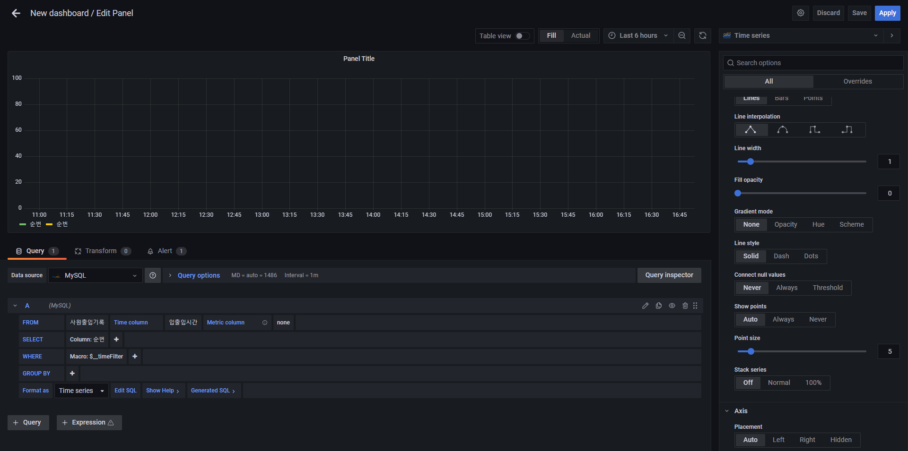
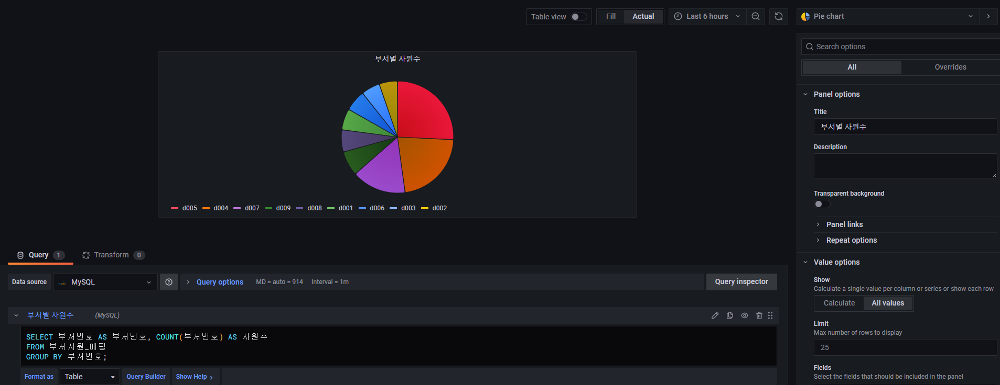

# 초간단 이커머스 서비스 모니터링 구축

## 모니터링이란?

모니터링(Monitoring)은 시스템, 네트워크, 응용 프로그램 또는 서비스와 관련된 데이터와 활동을 지속적으로 관찰하고 감시하는 과정을 의미합니다.  

 - 상태 파악: 모니터링은 시스템 또는 서비스의 현재 상태를 파악하기 위해 사용됩니다. 이것은 하드웨어, 소프트웨어, 네트워크 및 응용 프로그램의 상태에 대한 정보를 제공합니다.
 - 성능 분석: 모니터링은 시스템 또는 서비스의 성능을 분석하고 문제를 식별하는 데 사용됩니다. 성능 모니터링은 응답 시간, 처리량, 자원 사용량 및 병목 현상과 같은 지표를 측정합니다.
 - 이상 징후 탐지: 모니터링은 이상 징후 또는 비정상적인 동작을 감지하고 경고 또는 알림을 생성하여 시스템 관리자 또는 운영팀에게 문제를 알려줍니다. 이것은 보안 위협, 서비스 다운타임 및 시스템 장애 등을 탐지하는 데 사용됩니다.
 - 자원 관리: 자원 모니터링은 CPU, 메모리, 디스크 공간 및 네트워크 대역폭과 같은 시스템 자원의 사용을 관리하고 최적화하는 데 도움을 줍니다. 이로써 자원 부족 문제를 방지하고 효율성을 향상시킬 수 있습니다.
 - 로그 및 이벤트 기록: 모니터링은 로그 및 이벤트를 기록하고 저장하는 데 사용됩니다. 이러한 기록은 장애 분석, 보안 감사, 오류 추적 및 기록 보존을 위한 중요한 역할을 합니다.
 - 사용자 경험 평가: 웹 애플리케이션 및 서비스에서는 사용자 경험을 모니터링하여 성능 저하나 문제가 있는 경우에 빠르게 대응할 수 있도록 합니다.
 - 보안 감시: 보안 모니터링은 네트워크 및 시스템에서 보안 위협을 탐지하고 대응하는 데 사용됩니다. 이것은 침입 탐지, 악성 코드 감지 및 로그 분석과 같은 보안 작업을 지원합니다.


#### `모니터링 항목`

 - 서비스 모니터링
    - 고객의 PV, UV, Impression
    - 검색량
    - 주문 건 수, 결제 건 수
    - 가입자 ,탈퇴
    - 판매 등록
    - 핵심 사업 지표들
 - 시스템 모니터링
    - CPU, 메모리, GC, Database Connection
    - Request, Throughput, Response Time, TTI
    - 에러 개수
    - 저장소 공간 (HDD)
    - SSL 인증서 만료
    - 카프카 랙

#### `모니터링 도구 및 시각화`

 - Prometheus: 오픈 소스 모니터링 툴
 - Loki: Prometheus를 모태로 Grafana Labs 개발
 - Grafana: 오픈 소스 시각화, 대시보드 툴
 - Pinpoint
 - ELK 스택
 - AWS, Azure, Google Cloud
 - Custom Agent & Virsualization

<br/>

## Grafana란 무엇인가?

Grafana는 오픈 소스 데이터 시각화 및 대시보드 도구로, 다양한 데이터 원본에서 데이터를 수집하고 이를 시각적으로 표현하는 데 사용됩니다. 주로 시스템 모니터링, 애플리케이션 성능 분석, 인프라스트럭처 모니터링 및 로그 분석에 활용됩니다. Grafana는 사용자가 대시보드를 생성하고 사용자 지정하여 데이터를 모니터링하고 분석할 수 있는 기능을 제공합니다.  
 - 다양한 데이터 소스 지원: Grafana는 다양한 데이터 소스와 통합할 수 있습니다. Prometheus, InfluxDB, Elasticsearch, MySQL, PostgreSQL, AWS CloudWatch, Azure Monitor, 및 여러 다른 데이터베이스와 시스템과 통합하여 데이터를 시각화할 수 있습니다.
 - 시각적 대시보드: Grafana는 사용자가 사용자 정의 대시보드를 만들고 구성할 수 있는 풍부한 시각화 도구를 제공합니다. 다양한 차트, 그래프, 테이블, 경고, 패널 등을 사용하여 데이터를 효과적으로 표현할 수 있습니다.
 - 대화형 대시보드: 대시보드를 통해 데이터를 선택하고 확대하거나 축소하여 원하는 정보를 빠르게 확인할 수 있습니다. 또한 대시보드에서 필터링 및 시계열 데이터 조작을 지원합니다.
 - 알림 및 경고: Grafana는 임계값을 설정하고 이를 초과하거나 미달할 때 알림을 생성하는 경고 기능을 제공합니다. 이를 통해 문제가 발생할 때 신속하게 대응할 수 있습니다.
 - 템플릿 변수: 대시보드의 유연성을 향상시키기 위해 템플릿 변수를 사용하여 대시보드의 일부 또는 전체를 동적으로 필터링하고 구성할 수 있습니다.
 - 플러그인 생태계: Grafana는 다양한 플러그인을 통해 기능을 확장할 수 있습니다. 사용자 지정 데이터 소스, 시각화, 테마, 인증 및 다른 기능을 플러그인을 통해 추가할 수 있습니다.
 - 앱 및 웹 인터페이스: Grafana는 웹 기반 인터페이스를 제공하여 사용자가 브라우저를 통해 대시보드 및 데이터를 액세스하고 관리할 수 있습니다.

<br/>

#### `Grafana 활용`

 - 시스템 모니터링
 - 비즈니스 모니터링
 - 임계치 설정을 통한 알림

#### `Grafana 맛보기`

Mac인 경우 Brew를 이용하여 설치할 수 있고, Docker나 Grafana Playground 사이트에서 체험해볼 수 있다. (Grafana Playground: https://play.grafana.org)  

- Brew를 이용한 설치
```Bash
# Brew를 이용한 설치
$ brew update
$ brew install grafana

# 설치 결과 위치
# Homebrew v2: /usr/local/Cellar/grafana/[version]
# Homebrew v3: /opt/homebrew/Cellar/grafana/[version]

# 서비스 시작 및 중지
$ brew services start grafana
$ brew services stop grafana
```

 - Docker를 이용한 설치
```Bash
# 실행
# docker run -d -p 3000:3000 --name grafana grafana/grafana-oss:<버전>
$ docker run -d -p 3000:3000 --name grafana grafana/grafana-oss:8.2.0
```

 - Grafana 첫 화면 접속 후 설정
     - Configuration 메뉴 > Data Sources > MySQL
     - Create 메뉴 > Dashboard
```
1. Grafana 접속
 - URL: http://localhost:3000/
 - 초기 계정: admin / admin

2. Grafana 시각화를 위한 데이터 소스 설정
 - MySQL
    - Grafana와 MySQL 둘다 Docker로 설치한 경우 Grafana에서 Host 정보를 localhost로 하면 Docker 컨테이너 내부 포트를 조회하게 된다. Host PC의 IP를 확인하여 해당 IP로 사용한다. (ipconfig, ifconfig)
 - Grafana 대시보드 설정
```

<div align="center">
    
</div>
<div align="center">
    
</div>

<br/>

#### `Grafana 쿼리 기본 정보`

Grafana 쿼리는 Grafana 대시보드에서 데이터를 검색하고 시각적으로 표현하기 위한 데이터 검색 요청 또는 데이터베이스 질의입니다.  
Grafana 대시보드를 구성할 때, 원하는 데이터를 어떻게 검색하고 표현할지를 정의하기 위해 쿼리를 사용합니다.  
주로 데이터베이스나 데이터 소스에 대한 데이터를 검색하거나 필터링하는 데 사용됩니다. 
 - GUI 형태의 쿼리 빌더나 직접 쿼리를 사용 가능하고, 편의 매크로가 지원된다. 또, 퀄 ㅣ결과 미리보기가 가능하며, 쿼리 결과 시각화 방법 추천을 제공한다. 
 - 시간 범위 지정: 대시보드에서 표시할 시간 범위를 정의합니다. 예를 들어, "최근 24시간" 또는 "지난 7일"과 같은 기간을 선택할 수 있습니다.
 - 데이터 소스 선택: 어떤 데이터 소스에서 데이터를 검색할지를 선택합니다. Grafana는 다양한 데이터 소스를 지원하며, Prometheus, InfluxDB, Elasticsearch, MySQL, 등이 있습니다.
 - 메트릭 또는 필드 선택: 시각화할 데이터의 메트릭 또는 필드를 선택합니다. 예를 들어, CPU 사용률, 네트워크 패킷 수, 특정 지표 등을 선택할 수 있습니다.
 - 필터링: 필요한 경우 데이터를 필터링하여 원하는 결과를 얻을 수 있습니다. 이는 특정 호스트, 애플리케이션, 레이블 또는 조건에 따라 데이터를 제한하는 데 사용됩니다.

