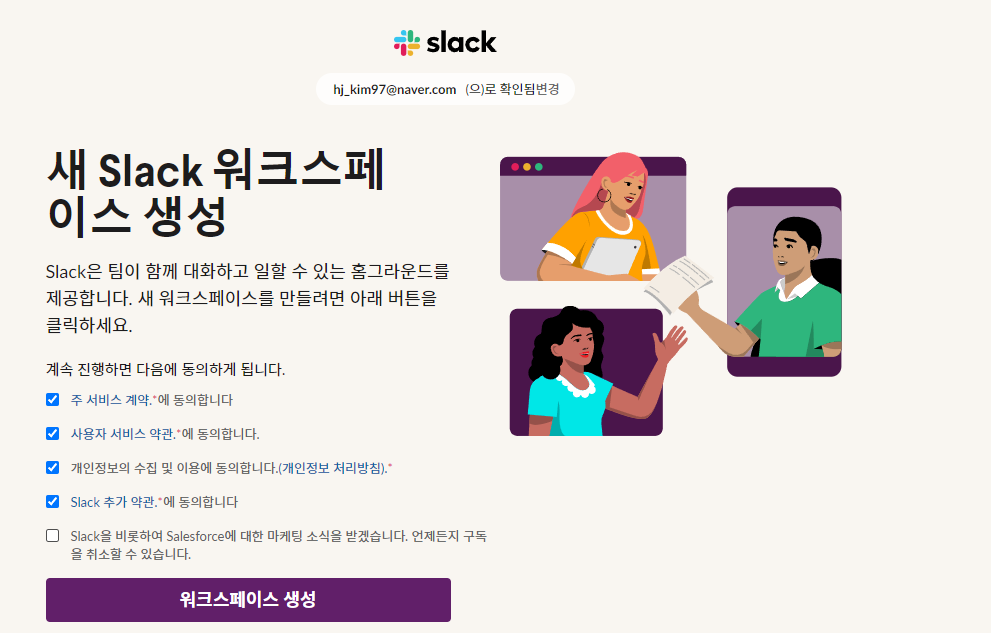
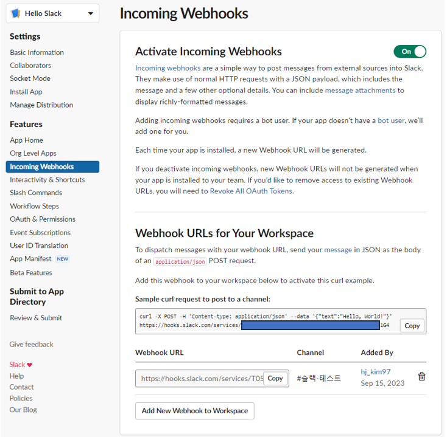
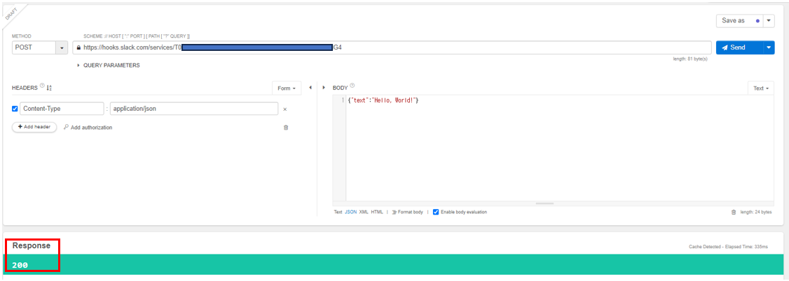
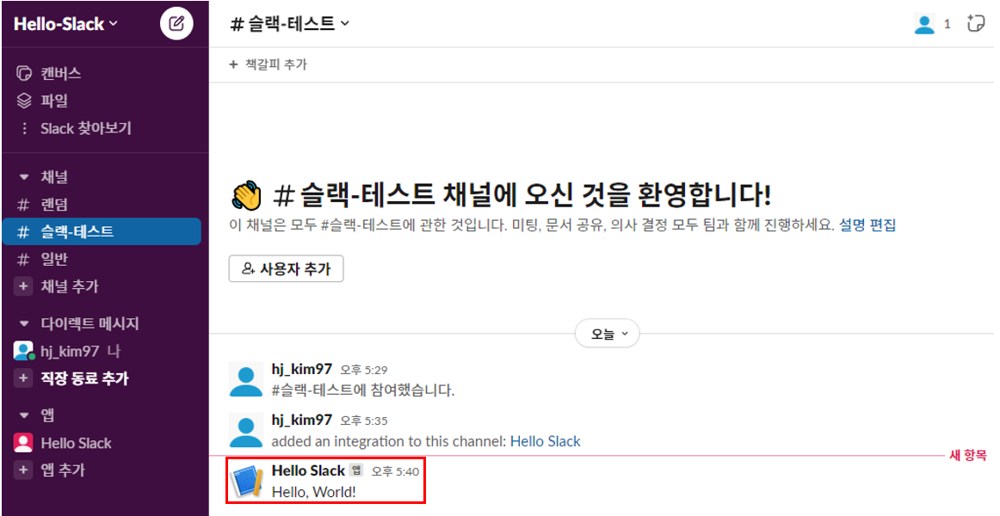

# 이커머스 서비스 알람 구축

## 서비스 알람

서비스 알람(Service Alert)은 서비스 또는 시스템의 상태 또는 동작에 대한 중요한 정보 또는 경고를 제공하는 메시지 또는 통지입니다. 서비스 알람은 다양한 유형의 IT 서비스, 응용 프로그램, 하드웨어, 네트워크 및 인프라스트럭처와 관련이 있으며, 이러한 서비스와 시스템의 정상 동작 또는 이상 동작을 식별하고 모니터링하는 데 사용됩니다.  
 - 장애 감지: 서비스나 시스템에서 장애가 발생했을 때, 예를 들어 서버 다운, 네트워크 연결 끊김, 애플리케이션 오류 등의 문제가 발생한 경우 경고 및 알람을 발생시킵니다.
 - 성능 이슈 감지: 서비스나 시스템의 성능이 저하되었거나 예상치 못한 성능 문제가 발생할 때 경고 메시지가 생성됩니다. 이로써 성능 감시 및 최적화에 도움을 줍니다.
 - 보안 이벤트 감지: 보안 이벤트, 침입 시도, 악성 코드 탐지 등과 같은 보안 위협이 감지되면 보안 알람이 생성됩니다.
 - 자원 부족: 서버 자원 (CPU, 메모리, 디스크 공간)이 부족한 경우, 운영 팀에 경고를 보냅니다.
 - 주요 이벤트 및 업데이트: 예를 들어, 예정된 서비스 업데이트, 예약된 작업, 시스템 이벤트 또는 예약된 백업과 같은 중요한 이벤트에 대한 알람을 생성할 수 있습니다.

<br/>

 -  `서비스 알람 방법`
    - 이메일, SMS, MMS, 메신저(카카오톡), ARS, 슬랙 등
 - `서비스 알람 주기`
    - 한 번만 알리기
    - n번 알리기
    - n시간 동안 알리기
    - 응답할 때까지 알리기
 - `서비스 알람 정책`
    - 알람 트리거(시작 기준)
        - 데이터 임계점
        - 데이터 생성, 삭제, 수정
    - 알람 타겟(대상)
        - 개인, 그룹
    - 알람 주기와 횟수
    - 알람 종료 조건
        - 수동 종료
        - 자동 종료
 - `서비스 알람의 중요한 사례`
    - 고객 서비스
        - 급격한 주문 건수 감소
        - 급격한 결제 건수 감소
        - 급격한 검색량 감소
        - 급격한 매출 감소
    - 판매자 서비스
        - 급격한 상품 등록 감소
        - 급격한 배송 출고 감소
        - 급격한 상품 진열 감소
    - 시스템 이상 알람
        - CPU 사용률 증가
        - 오류 증가
        - 메모리 부족
        - 데이터베이스 커넥션 부족
        - Full GC 발생
        - API 지연
        - 카프카 메시지 랙
 - `모니터링 도구와 연동`
    - 태블로, 그라파나, 리대시
    - Cloud Monitoring Service
    - Custom Dashboard
 - `실전 Tips`
    - 핵심 지표나 핵심 데이터를 대상으로 임계치를 설정한다.
    - 개인보다 그룹으로 알람 타겟을 설정한다. (채널에 들어온 모든 사람에게 알람이 가도록)
    - 대응이 필요한 데이터나 지표만 알람을 한다. (스팸으로 인식되지 않도록)
    - 알람을 받았을 경우 바로 대응한다. (담당자 선정, 담당팀 선정)

<br/>

## Slack을 이용한 알람 서비스

### `슬랙 가입 및 Workspace 생성`

 - 슬랙 홈페이지: https://slack.com/intl/ko-kr/
 - 워크스페이스 생성: https://slack.com/intl/ko-kr/get-started#/landing

<div align="center">
    
</div>

<br/>

### `슬랙 앱 만들기`

 - Slack API: https://api.slack.com/
    - 앱 생성
        - Your Apps > Create an app > From scratch
    - 웹훅 설정
        - App 화면 > Features > Incomming Webhooks > 활성화
        - Add New Webhook to Workspace > 채널 선택

<div align="center">
    
</div>
<div align="center">
    
</div>
<div align="center">
    
</div>

<br/>

### `Spring Slack API 이용`

 - build.gradle
    - Slack API 의존성을 추가한다.
```gradle
dependencies {
	..
	implementation 'com.slack.api:slack-api-client:1.27.2'
}
```

 - application.yml
    - Slack API URL을 설정 파일로 관리한다.
    - 사용하는 곳에서 @Value 어노테이션을 통해 해당 메시지를 가져올 수 있다.
```YML
notification:
  slack:
    webhook:
      url: [Put your Slack-webhook URL Dev Alert here]
```

 - SlackErrorMessage
    - 에러 메시지 전달용 객체
    - 단순히 필드에 text가 존재한다.
```Java
@Data
@AllArgsConstructor
@NoArgsConstructor
public class SlackErrorMessage {
    private String text;
}
```

 - HelloRestTemplateController
    - RestTemplate를 이용하여 직접 Slack 제공 URL로 HTTP 요청
    - postForEntity() 메서드를 통해 HTTP POST 요청이 전달되며, URL과 Body를 넘긴다.
```Java
@RestController
public class HelloRestTemplateController {

    @Value("${notification.slack.webhook.url}")
    private String slackAlertWebhookUrl;

    @GetMapping(value = "/hello")
    public String hello() {
        return "Hello Slack Alert " + slackAlertWebhookUrl;
    }

    @GetMapping(value = "/hello-error")
    public String helloError() throws URISyntaxException {
        RestTemplate restTemplate = new RestTemplate();
        URI uri = new URI(slackAlertWebhookUrl);

        String errorMessage = "주문에서 에러 메세지 발생!!!";
        SlackErrorMessage slackErrorMessage = new SlackErrorMessage(errorMessage);
        ResponseEntity<String> result = restTemplate.postForEntity(uri, slackErrorMessage, String.class);

        return "Hello Slack Alert Sent = " + result.getStatusCodeValue();
    }
}
```

 - HelloSlackClientController
    - Slack.getInstance() 메서드를 통해 SlackClient 객체를 얻는다.
    - SlackClient의 send() 메서드를 통해 API 요청을 할 수 있다.
```Java
@RestController
@RequiredArgsConstructor
public class HelloSlackClientController {

    @Value("${notification.slack.webhook.url}")
    private String slackAlertWebhookUrl;

    private final ObjectMapper objectMapper;

    @GetMapping(value = "/hello-error-slack-client")
    public String helloErrorSlackClient() throws IOException {
        Slack slack = Slack.getInstance();
        String errorMessage = "주문에서 에러 메세지 발생!!!";
        SlackErrorMessage slackErrorMessage = new SlackErrorMessage(errorMessage);
        WebhookResponse response = slack.send(slackAlertWebhookUrl, objectMapper.writeValueAsString(slackErrorMessage));
        return "Hello Slack Alert Sent = " + response.getCode();
    }
}
```
