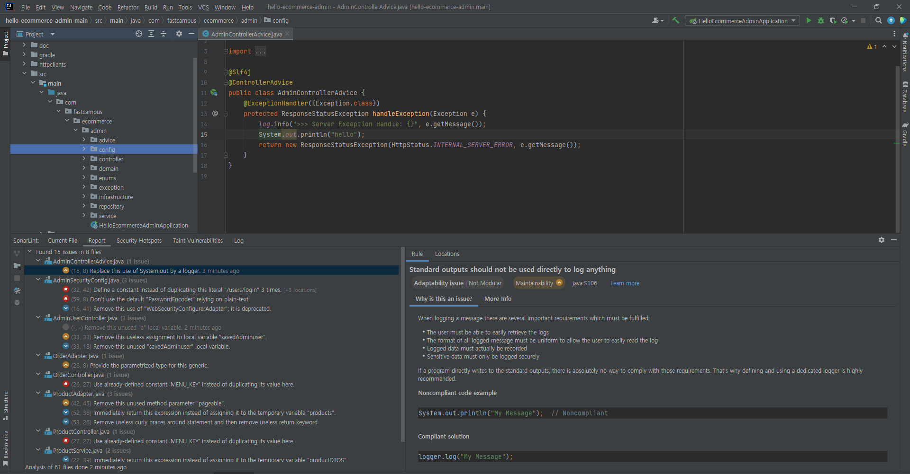
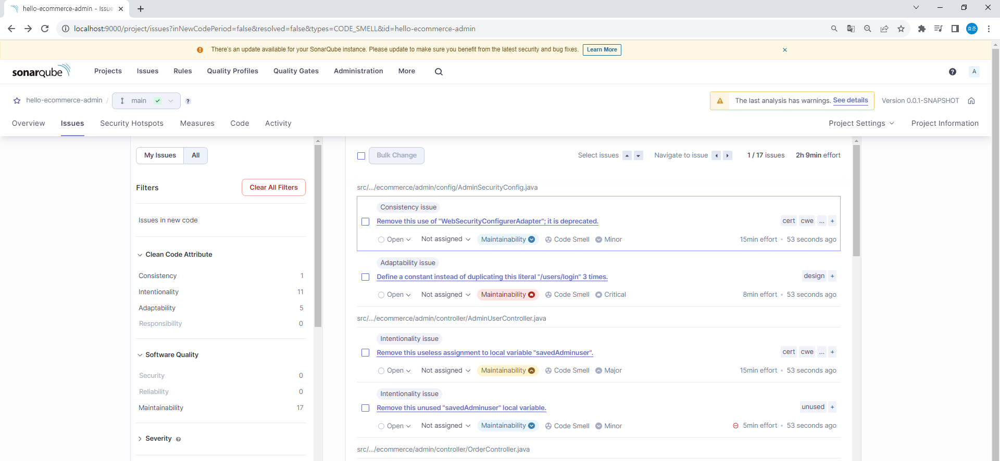

# 개발 코드의 유지보수성 높이기

## 유지보수성이란?

유지보수성(Maintainability)은 소프트웨어 또는 시스템의 설계, 코드, 문서 및 기타 관련 자원이 변경, 수정 및 보수되는 데 얼마나 용이하고 효율적으로 작업할 수 있는지를 나타내는 소프트웨어 엔지니어링 및 시스템 디자인 개념입니다.  

```
코드 가독성: 코드가 쉽게 이해되고 수정될 수 있어야 합니다. 적절한 주석, 의미 있는 변수 및 함수명, 일관된 들여쓰기 등이 코드 가독성을 향상시키는 데 도움이 됩니다.

모듈화와 분리: 시스템이 모듈화되어 있고 각 모듈이 서로 독립적으로 작동하며 변경 사항이 다른 부분에 영향을 미치지 않도록 설계되어야 합니다.

문서화: 시스템에 대한 충분한 문서화가 필요합니다. 이는 시스템의 구조, 설계, 코드, 기능 및 인터페이스에 대한 정보를 포함할 수 있습니다.

테스트 가능성: 유지보수성을 향상시키기 위해 적절한 테스트 케이스 및 테스트 슈트를 개발해야 합니다. 변경 사항이 시스템의 기능에 영향을 미치지 않았음을 확인하기 위한 테스트가 중요합니다.

버전 관리: 변경 사항을 추적하고 관리하기 위한 버전 관리 시스템을 사용해야 합니다.

모듈 간의 결합도 제어: 모듈 간의 결합도를 최소화하여 변경이 한 모듈에서 다른 모듈로 파급 효과를 최소화합니다.

일관성 유지: 코드 작성 규칙과 디자인 패턴을 준수하여 시스템의 일관성을 유지해야 합니다.

효율적인 리팩터링: 필요한 경우 코드를 리팩터링하여 유지보수성을 향상시킵니다.
```

<br/>

### 간단하게 적용 가능한 유지보수성

 - 유지보수성 관련 원칙
    - 깨진 창문 이론: 나쁜 코드는 나쁜 코드를 유발한다.
    - 보이스카우트 규칙: 코드를 체크아웃할 때마다 코드를 더 꺠끗하게 해야한다.
    - DRY(Don't repeat yourself): 중복 코드를 작성하지 마라
    - YAGNI(You aren't gonna need it): 필요하기 전까지 사용하지 않는 기능을 추가하지 않는다.
    - KISS(Kepp it small and short and simple): 작게 만들고, 짧게 만들고, 단순하게 만들어라
 - 유지보수성을 높이는 방법
    - 공통 부분
        - 개발 컨벤션을 따른다: 하나의 스타일, 한 사람이 작성한 코드처럼 보이도록 한다.
        - 사용하지 않는 죽은 코드를 제거한다.
    - 코드 부분
        - 의미가 불분명한 매직 넘버를 상수로 선언한다.
    - 패키지 또는 모듈
        - 관심사를 모듈로 분리한다. (도메인 단위)
        - 코드 베이스를 작게 유지한다.
    - 주석 부분
        - 코드와 내용이 다른 나쁜 주석을 남기지 않는다.
    - 변수 부분
        - 변수명 관례를 따른다.
        - 의미없는 약자나 단어 대신 의미를 담는다.
        - 한 단어에는 하나의 목적만 담는다.
    - 함수 또는 메서드 부분
        - 함수명 또는 메서드명 관례를 따른다.
        - 이름과 내용이 동일해야 한다.
        - 읽기, 쓰기 둘 중 하나만
        - 함수나 메서드의 크기를 작게 유지한다.
        - 코드 내부의 분기점을 단순하게 작성한다.
        - 메서드나 함수의 파라미터의 개수를 줄인다.
    - 클래스 부분
        - 하나의 클래스에 모든 기능을 다 넣지 않는다.
        - 단일 책임을 갖고, 하나의 역할만 하도록 작게 만든다.
    - 테스트 부분
        - F.I.R.S.T
            - Fast: 빨라야 한다.
            - Independent: 테스트는 서로 독립적이여야 한다.
            - Repeatable: 여러번 반복적으로 테스트하더라도 동일한 결과를 가져야 한다.
            - Self-validate: 테스트는 성공 또는 실패여야 한다.
            - Thorough: 해피케이스뿐 만아니라 부정적이고, 엣지 케이스도 테스트해야 한다.
        - 테스트를 자동화한다.
        - 통합 테스트와 유닛 테스트를 분리한다.
        - BDD(Behavior-Driven Development) 스타일을 사용한다. (Given, When, Then)

<br/>

### 정적 분석기

정적 분석기(Static Analyzer)는 소프트웨어 코드를 실행하지 않고도 소스 코드를 검사하고 분석하여 코드 오류, 버그, 보안 취약점 및 프로그래밍 규칙 준수 여부를 식별하는 도구 또는 소프트웨어입니다. 정적 분석기는 소프트웨어 개발 주기 초기에 코드 품질을 향상시키고 문제를 빠르게 발견하며, 보안 취약점을 사전에 탐지하는 데 사용됩니다.  
 - 코드 스타일 및 컨벤션 룰 관리
    - 코드 오류 식별: NULL 포인터 참조, 배열 범위 초과, 메모리 누수 등
    - 보안 취약점 탐지
    - 코딩 표준 준수 감지
 - 기본 룰과 사용자 룰에 따라 분석
 - 상세한 분석 결과 리포트 제공
 - 좀 더 꺠끗한 코드와 안전한 코드를 작성하는데 도움
 - CI 연동

<br/>

#### 정적 분석기 대표 종류

 - FindBugs
    - 발생할 수 있는 버그를 찾아주는 도구
 - PMD
    - 일반적인 프로그래밍 결함을 찾아주는 도구
    - 사용하지 않는 변수, 빈 Catch 블럭, 불필요한 객체 생성 등
 - Checkstyle
    - 자바 코딩 룰에 따라 코드가 작성되었는지 확인
    - 네이밍 컨벤션, 메소드 파라미터 개수, 공백 등
 - JaCoCo
    - 테스트 커버리지
 - __IntelliJ 플러그인__
    - FindBugs, PMD, Checkstyle
    - __SonarLint__
 - __SonarQube__
    - 오픈 소스 설치형
    - 자신의 시스템과 CI 통합
    - 코드 품질 분석
    - 보안 취약점 분석

<br/>

### 정적 분석기 실습

 - SonarLint
    - 모든 개발자들이 효과적이고 안전한 코드를 작성할 수 있도록 도와주는 도구
    - IntelliJ의 플러그인으로 제공된다.
    - 설치 경로: IntelliJ > File > Settings > Plugins > Matketplace > SonarLint
```
★ SonarLint 플러그인 사용법
1. 단일 파일 분석
 - 하나의 파일을 열고, 하단에 SonarLint를 클릭한다.
 - 단축키: Ctrl + Shift + S

2. 다중 파일 분석(패키지)
 - 패키지 우클릭 > SonarLint > Analyze with SonarLint
```

<div align="center">
    
</div>
<div align="center">
    System.out을 logger를 사용하도록 룰 검증
</div>

<br/>

 - SonarQube
    - 클린 코드를 도와주는 코드 리뷰 도구
    - CI/CD Pipelines 연동 제공
    - SonarQube의 구조: 스캐너, SonarQube 웹서버, Database
        - 스캐너: 스캐너는 Source Files을 분석한다. 이후 해당 레포트를 SonarQube 웹서버로 전송한다.
        - SonarQube 웹서버: 받은 레포트를 데이터베이스에 적재하고, 해당 내용을 어드민 화면으로 확인 가능하다.
```Bash
# SonarQube 설치
$ docker run -d -p 9000:9000 sonarqube
$ docker run -d -p 9000:9000 sonarqube:community
```
 - SonarQube 웹서버 설정
```
1. 브라우저 접속: http://localhost:9000
 - 초기 계정: admin/admin

2. SonarQube 프로젝트 등록
 - Project > Create project manually
    - Project display name:  hello-admin-server
    - Project Key: hello-admin-server
    - Locally
        - Generate a project token
```
 - 프로젝트에 SonarQube 플러그인 지정 후 명령어 실행
    - gradle: "org.sonarqube"
```Bash
# CMD는 캐럿(^)으로 줄바꿈을 사용한다.
# Power Shell은 백틱(')으로 줄바꿈을 사용한다.
$ ./gradlew sonarqube `
    -D "sonar.projectKey=hello-ecommerce-admin" `
    -D "sonar.host.url=http://localhost:9000" `
    -D "sonar.login=sqp_29272b69f4e4dee9959d30cccd14c90e9598d395"

# Linux 환경
./gradlew sonar \
  -Dsonar.projectKey=hello-ecommerce-admin \
  -Dsonar.projectName='Hello-Sonar' \
  -Dsonar.host.url=http://localhost:9000 \
  -Dsonar.token=sqp_29272b69f4e4dee9959d30cccd14c90e9598d395
```
<div align="center">
    
</div>
