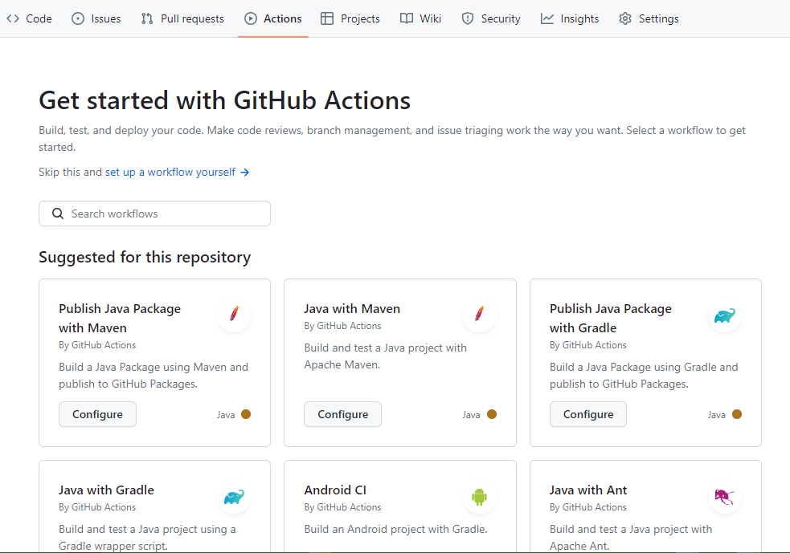

# Github Action

GitHub Actions는 GitHub에서 호스팅되는 CI/CD(Continuous Integration/Continuous Deployment) 서비스입니다. 개발자와 소프트웨어 팀이 GitHub 저장소에서 작업한 코드를 자동으로 빌드, 테스트, 배포할 수 있도록 지원합니다. GitHub Actions는 코드 변경 사항이 저장소에 푸시될 때 또는 특정 이벤트가 발생할 때 실행되는 작업(flows)을 정의할 수 있습니다.  

 - 지속적인 통합(CI): 코드를 저장소에 푸시하면 GitHub Actions를 사용하여 자동으로 빌드 및 테스트 작업을 실행할 수 있습니다. 이를 통해 코드 변경 사항의 품질을 신속하게 확인할 수 있습니다.
 - 작업의 자동화: GitHub Actions를 사용하여 다양한 작업(flows)을 정의하고 실행할 수 있습니다. 예를 들어, 빌드, 테스트, 린팅, 문서 생성, 배포 등 다양한 작업을 자동화할 수 있습니다.
 - 다양한 이벤트 트리거: GitHub Actions는 다양한 이벤트 트리거를 지원합니다. 예를 들어, 코드 푸시, 이슈 생성, 레이블 변경, 풀 리퀘스트 생성 등의 이벤트를 트리거로 사용할 수 있습니다.
 - 다중 환경 지원: 다양한 운영 체제 및 환경에서 작업을 실행할 수 있습니다. 이는 다양한 플랫폼 및 런타임에서 애플리케이션을 테스트하고 배포하는 데 유용합니다.
 - 사용자 정의 워크플로우: GitHub Actions는 YAML 파일을 사용하여 워크플로우를 정의하며, 개발자가 자신의 요구에 맞게 워크플로우를 구성할 수 있습니다.

<br/>

## Github Action 구성 요소

 - 워크플로우(Workflows), 이벤트(Events, Trigger), 잡(Jobs), 스텝(Steps), 액션(Actions), 러너(Runner)

```
1. Workflow (워크플로우)
워크플로우는 GitHub Actions에서 실행할 작업의 집합입니다.
워크플로우는 YAML 파일로 정의되며, 저장소의 .github/workflows 디렉토리에 저장됩니다. 각 워크플로우는 특정 이벤트(예: 코드 푸시, 풀 리퀘스트 생성)에 대한 트리거로 실행됩니다.

2. Job (작업)
워크플로우 내에서 하나 이상의 작업을 정의할 수 있습니다.
각 작업은 하나 이상의 단계로 구성되며, 동일한 에이전트(환경)에서 실행됩니다.
예를 들어, 빌드 작업과 테스트 작업을 별도의 작업으로 정의할 수 있습니다.

3. Step (단계)
작업은 하나 이상의 단계로 나뉩니다.
각 단계는 커맨드 라인 명령이나 스크립트를 실행하는 것을 포함합니다.
단계는 순차적으로 실행되며, 이전 단계가 성공적으로 완료되어야 다음 단계가 실행됩니다.

4. Runner (러너)
러너는 워크플로우의 작업을 실행하는 환경을 제공하는 물리적 또는 가상의 컴퓨터입니다.
GitHub에서 호스팅되는 공용 런너를 사용할 수 있으며, 필요한 경우 자체 런너를 구성하여 사용할 수도 있습니다.

5. 액션 (Action)
액션은 재사용 가능한 작업 단위입니다.
액션은 워크플로우에서 다른 저장소로 가져올 수 있으며, 다양한 작업을 수행하는 미리 정의된 스크립트, 도구 또는 커스텀 코드를 포함할 수 있습니다.
액션을 사용하여 작업을 추상화하고 코드 재사용성을 높일 수 있습니다.

6. 시크릿(Secret)
시크릿은 워크플로우에서 보안 정보를 저장하는 데 사용됩니다.
예를 들어, API 키, 액세스 토큰 등의 민감한 정보를 안전하게 저장하고 사용할 수 있습니다.

7. 이벤트 및 트리거 (Trigger)
워크플로우를 실행할 조건을 정의합니다.
코드 푸시, 풀 리퀘스트 생성, 이슈 생성 등과 같은 이벤트가 워크플로우를 트리거할 수 있습니다.

8. 조건 (Condition)
워크플로우 내에서 특정 작업 또는 단계를 실행하기 전에 조건을 정의할 수 있습니다.
이를 통해 특정 조건이 충족될 때만 작업을 실행할 수 있습니다.
```

<br/>

## Github Action 사용 방법

### 워크플로우 작성 흐름
```
1. 워크플로우 디렉토리 만들기
 - 저장소 폴더 내에 '.github/workflows' 디렉토리를 생성한다.

2. 워크플로우 파일(YML) 만들기
 - '.github/workflows' 폴더 내에 YML 파일을 만든다.

3. 워크플로우 정의하기
 - YML 파일 내에서 Github Actions DSL 문법으로 이벤트, 작업, 단계 등을 정의한다.
```

<br/>

### Github Actions DSL 문법

 - 워크플로우 정보
```YML
name: 이름
run-name: 이름
```

<br/>

 - 이벤트 정보
    - 단일 이벤트
        - on:push
    - 여러 이벤트
        - on: [push, fork]
    - 자주 사용하는 이벤트
        - pull_request, push, schedule, workflow_dispatch 등
```YML
on: [push]
```

<br/>

 - 표현식
    - 워크플로우 파일 안에서 식 사용이 가능하다.
    - 환경 변수 활용, 프로그래밍 방식으로 설정, 컨텍스트 접근, 연산자 사용 등 제공
```
${{ 환경변수명 }}
```

 - 작업(Job) 정보
```YML
name: hello-github-actions
run-name: ${{ github.actor }}의 헬로 깃허브

on: [push] # 이벤트 트리거

jobs: # 잡 목록
  hello-job: # 잡을 정의
    runs-on: ubuntu-latest # 잡을 실행하는 서버 플랫폼
    steps: # 잡에 포함되는 스텝들
      - uses: actions/checkout@v3 # 미리 정의된 액션 - 재사용 가능
      - uses: actions/setup-java@v3
        with:
          java-version: '11'
          distribution: 'temurin'
      - run: chmod +x gradlew # 각각의 개별 스텝 - 스크립트 또는 액션
      - run: ./gradlew clean build test
```

<br/>

 - 깃허브 액션 템플릿
    - 워크플로우를 직접 YML 파일을 하나하나 문법에 맞게 작성할 수 있다.
    - 하지만, 깃허브 사이트에서는 미리 준비된 템플릿을 제공한다.
    - '깃허브 > 레포지토리 > Actions > 템플릿 클릭' 경로에서 템플릿을 확인할 수 있다.
```YML
# 기본 Java CI 템플릿
name: Java CI with Maven

on:
  push:
    branches: [ "main" ] # main 브랜치로 push된 경우
  pull_request:
    branches: [ "main" ] # main 브랜치로 PR된 경우

jobs:
  build:

    runs-on: ubuntu-latest # ubuntu 가상 환경에서 빌드한다.

    steps:
    - uses: actions/checkout@v3 # 1. 소스 코드를 Checkout 받는다.
    - name: Set up JDK 17
      uses: actions/setup-java@v3 # 2. JDK 17 버전을 설치한다.
      with:
        java-version: '17'
        distribution: 'temurin'
        cache: maven
    - name: Build with Maven # 3. Maven을 이용하여 소스 코드를 빌드한다.
      run: mvn -B package --file pom.xml

    # Optional: Uploads the full dependency graph to GitHub to improve the quality of Dependabot alerts this repository can receive
    - name: Update dependency graph
      uses: advanced-security/maven-dependency-submission-action@571e99aab1055c2e71a1e2309b9691de18d6b7d6
```

<div align="center">
    
</div>

<br/>

 - 깃허브 액션 스케줄
    - 워크플로우 실행을 스케줄링을 통해 등록할 수도 있다. (시간을 지정하고, 예약된 시간에 이벤트가 발생)
    - POSIX cron 문법을 따른다.
        - 분, 시, 일, 월, 주 순서로 설정한다.
        - minute: (0 - 59)
        - hour: (0 - 23)
        - day of the month: (1 - 31)
        - month: (1 - 12 or JAN - DEC)
        - day of the week: (0 - 6 or SUN - SAT)
```YML
name: hello-github-action-schedule
run-name: Execution a workflow by schedule

on:
  schedule:
    - cron: '*/5 * * * *' # 5분마다 반복

jobs:
  cron:
    runs-on: ubuntu-latest
    steps:
      - name: Every 5 minute
        run: echo "Hello Github Action Schedule"
```

<br/>

 - Secrets 컨텍스트
    - Github Actions에서 워크플로우에 비밀번호, API 토큰 등 민감 정보를 사용해서 빌드 혹은 배포를 진행할 수 있다.
    - 워크플로우 파일은 깃허브 저장소에 노출되므로, 이러한 민감 정보를 하드 코딩으로 사용할 수 없다.
    - 대신에, Secrets 이라는 민감 정보를 등록하고, Github Actions 워크플로우 내에서 변수 처럼 사용할 수 있도록 제공한다.
    - '깃허브 저장소 > Settings > Security > Secrets and variables > Actions' 경로에서 등록이 가능하다.
```YML
name: Pull request labeler
on: [ pull_request_target ]

permissions:
  contents: read
  pull-requests: write

jobs:
  triage:
    runs-on: ubuntu-latest
    steps:
      - uses: actions/labeler@v4
        with:
          repo-token: ${{ secrets.GITHUB_TOKEN }}
```
