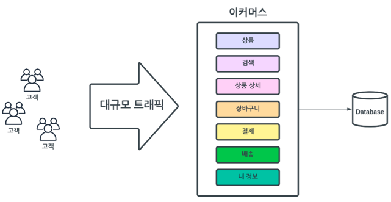
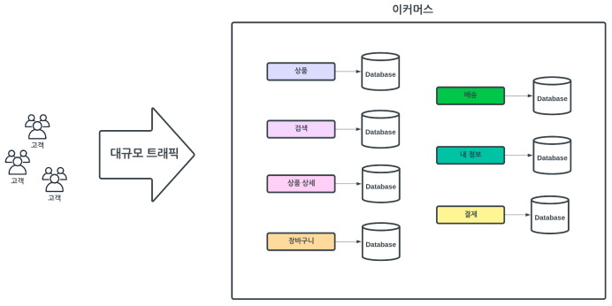

# 데이터베이스 확장성 높이기

## 테이블 확장성 높이기

### 배경

초기 서비스를 실행할 때 작은 규모의 서비스로 단일 데이터베이스로 운영을 하게 된다.  
시간이 지남에 따라 서비스가 커지고, 고객 트래픽이 늘어나게 된다.  
서비스가 커져감에 따라 신규 기능 추가와 기존 기능 수정 등의 다양한 요구 사항이 발생하게 된다.  
여기서 고민을 하게 되는데, 기존에 테이블에 컬럼을 넣을지 신규 테이블을 만들지 등 데이터 저장 관점으로 디자인을 하게 된다.  

<br/>

### 문제점

요구 사항을 분석하고 설계를 할 때 보통 데이터 저장 관점으로 문제를 바라보고 문제를 해결하게 된다.  
하지만, 이러한 데이터 저장 관점에서 문제를 해결하다 보면 객체 지향이나 도메인 관점과는 멀어지게 된다.  
이는 결국 관리가 어려워 지게 되고, 결국에는 모든 문제를 기존 테이블에 컬럼을 추가하는 방식으로 대응하게 된다. (테이블 컬럼 수 증가, 기존 엔티티 속성 증가)  
이는 결국에 성능 저하와 확장성 저하, 유연성 저하 문제로 발생하게 된다.  

<br/>

### 목표

사업이나 서비스가 커져가면서 유연하고 확장성있게 대응하는 것이다.  
 - 도메인 관점에서 디자인을 시작하여 데이터 저장소에 반영한다.
 - 테이블끼리의 관계를 느슨하게 유지한다.
 - 단일 데이터베이스가 아니라 분산 데이터베이스로의 확장성을 높인다.

<br/>

### 솔루션

테이블의 관계를 FK로 묶지 않는다. 단지, 서로의 관계를 ID 소유를 기반으로 한다.  
또, 요구 사항을 분석하고 처리할 때 데이터 저장 관점이 아닌, 도메인 관점 또는 데이터 모델링에서 나오는 추상화 모델을 먼저 사용한다. 그리고 나서 점차 물리적 저장 관점에 반영한다.  
 - 추상화 모델 > 논리 모델 > 물리 모델

<br/>

### 기대 효과

엔티티 간의 관계가 ID 소유로 관계가 느슨하다.  
테이블 간의 관계가 ID 소유로 관계가 느슨하다.  
관계가 느슨해지면서 유연성, 확장성이 향상된다.  
엔티티와 테이블의 유지보수성이 증가한다.  
느슨한 관계로 분산이 상대적으로 쉬워진다.  

<br/>

### DB 디자인 예시

 - 도메인별 데이터베이스를 분리한다.

<div align="center">
    
</div>
<div align="center">
    
</div>

<br/>

 - 엔티티
    - @OneToOne, @OneToMany 등을 사용하지 않고, ID 소유로 표현한다.
```Java
@Entity
@Table(name = "order_items", schema = "ecommerce")
public class OrderItem {
    @Id
    @GeneratedValue(strategy = GenerationType.IDENTITY)
    @Column(name = "id")
    private Long orderItemId;

    @Column(name = "product_id")
    private Long productId;
}
```

<br/>

## 데이터 분석을 위한 테이블 구조

### 배경 및 문제점

서비스가 커져감에 따라 각각의 도메인 별로 시스템이 분리되게 된다.  
도메인 별로 시스템과 저장소가 분산하게 되면 데이터를 한꺼번에 묶어서 사용할 수가 없다.  
때문에, 각각의 분산된 도메인 시스템들의 DB 데이터들을 한 곳으로 관리할 필요가 있다.  

<br/>

### 목표

분산된 데이터들을 데이터 웨어하우스라고 불리는 통합 중앙 저장소로 모와야 한다.  
또한, 각각의 분산된 데이터베이스 저장소에 최신 데이터를 데이터 웨어하우스에 반영해야 한다.  

<br/>

### 솔루션

각각의 도메인 저장소들의 테이블들을 통째로 저장하고, 그 이후부터는 변경된 내용을 가져오도록 한다.  
 - 전체 복제: 분산된 도메인 데이터를 주기적으로 데이터 웨어하우스에 적재
 - 트랜잭션 로그 이벤트: 분산된 도메인 데이터의 변경을 이벤트로 발행 및 수신 데이터 웨어하우스에 적재
 - 증분 복제: 분산된 도메인 데이터의 변경분을 주기적으로 데이터 웨어하우스에 적재

<br/>

### 기대 효과

분산된 도메인 데이터를 모아 데이터 분석에 활용이 가능하다.  
분산된 도메인 데이터의 최신 변경분을 주기적으로 모을 수 있다.  
전사 데이터 분석 시스템 구축 가능하다.  

<br/>

### 각각의 도메인 팀에서 해야 할 일

각각의 도메인 팀의 데이터를 모으기 위해서는 데이터 웨어하우스에 주기적으로 적재할 수 있도록 테이블 설계가 되어야 한다.  
 - 데이터베이스 테이블을 증분 복제가 가능하도록 테이블 설계가 되어야 한다.
 - 기본적으로 생성과 수정과 관련한 컬럼이 있어야 한다.
 - 물리 삭제를 하면 안된다. (동기화가 꺠짐)
```
is_deleted(boolean): 삭제 여부
created_at(Timestamp or Datetime(6)): 생성한 날짜
created_by(Varchar or Long): 생성한 주체
updated_at(Timestamp or Datetime(6)): 수정한 날짜
updated_by(Varchar or Long): 수정한 주체
```
