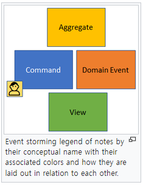

# 도메인 분석

## 도메인(Domain)

프로그래밍 분야에서 "도메인(Domain)"은 주어진 소프트웨어 시스템이나 애플리케이션이 다루는 주제나 영역을 나타냅니다. 도메인은 해당 애플리케이션에 대한 지식 영역을 말하며, 일반적으로 비즈니스 또는 문제 해결 분야와 관련이 있습니다.  

예를 들어, 은행 소프트웨어 애플리케이션의 도메인은 금융 및 금융 거래와 관련된 모든 지식과 프로세스를 포함합니다. 이러한 도메인을 이해하면 애플리케이션을 개발하는 데 필요한 기능과 데이터 모델을 설계하는 데 도움이 됩니다.  

<br/>

### 도메인 용어

도메인 용어는 소프트웨어로 해결해야할 문제 영역에서 사용되는 용어를 말합니다.  
 - 이해 관계자가 함꼐 사용하는 어휘
 - 도메인 용어는 코드에 반영되어야 한다. (유지보수성)
 - 구현에 도메인 용어 사용으로 해석 과정 비용을 줄인다.
 - 현장의 잘못된 도메인 용어는 새로운 용어로 재정의한다.
    - ex) 1차 폼 -> 수거 요청 폼

<br/>

## 이벤트 스토밍

이벤트 스토밍(Event Storming)은 소프트웨어 시스템을 개발하고 설계하기 위한 협업 및 분석 기술입니다. 이벤트 스토밍은 복잡한 비즈니스 프로세스를 모델링하고 이해하기 위한 강력한 도구로 사용됩니다. 이 기술은 도메인 주도 설계(Domain-Driven Design, DDD)과 더불어 사용되며, 비즈니스 도메인을 중심으로 소프트웨어를 개발하는 데 도움이 됩니다.  

<br/>

### 이벤트 스토밍 방법

 - A. 도메인 이벤트 식별
    - 관련한 규칙, 정책, 로직
    - ex) 검색되었음, 주문되었음, 결제되었음 등
 - B. 도메인 이벤트를 발생시킨 도메인 명령 식별
    - 도메인 이벤트를 유발한 명령을 식별한다.
    - ex) 상품 검색 되었음 -> 상품 검색
    - ex) 주문 요청 되었음 -> 주문 요청
 - C. 도메인 명령을 내린 액터 식별
    - 명령을 내린 주체를 식별한다. (사람 또는 시스템)
    - ex) 운영자, 고객, 판매자, 깃허브, 젠킨스 등
 - D. 관련한 것들의 모음을 식별(어그리거드, 엔티티)
    - 찾아낸 이벤트, 액터 등을 연관된 것끼리 그룹 또는 집합으로 모은다.
    - ex) 주문, 감정, 배송 등
 - E. 사용자 뷰, 외부 시스템 식별
    - 액터들이 활동을 하기 위한 뷰 식별
    - 외부 시스템
    - ex) 판매등록 화면, 회원가입 폼, 상품검색 뷰 등

<div align="center">
    
</div>
<div align="center">
    
</div>
<div align="center">
    이미지 출처 - https://en.wikipedia.org/wiki/Event_storming
</div>

<br/>

### 이벤트 스토밍 실습

 - 요구사항 예시
```
1. 고객은 사용하던 명품을 판매하고 싶다.
2. 회사는 감정 합격한 고객의 명품을 매입한다.
3. 고객은 매입 금액을 정산받는다.
4. 회사는 매입한 명품을 재판매한다.
```

 - A. 도메인 이벤트 식별
    - 요구사항으로부터 식별
    - 시간 순서대로 도메인 이벤트 식별하기
    - 과거형 동사
```
1. 판매할 물건 등록됨
2. 온라인 검수 완료됨
3. 매입 견적 완료됨
4. 매입 계약서 작성됨
5. 판매 물건 발송됨
6. 판매 물건 입하됨
7. 판매 물건 정보 확인됨
8. 판매 물건 감정사에 전달됨
9. 판매 물건 감정됨
..
```

 - B. 명령 식별
    - 이벤트를 발생시킨 트리거, 명령
    - 도메인 이벤트로부터 식별
```
1. 판매 물건 등록 -> 판매할 물건 등록됨
2. 온라인 검수 -> 온라인 검수 완료됨
3. 매입 견적 알림 -> 매입 견적 알림 전송됨
4. 매입 계약 작성 -> 매입 계약서 작성됨
5. 판매 물건 발송 -> 판매 물건 발송됨
6. 판매 물건 입하 -> 판매 물건 입하됨
7. 판매 물건 정보 확인 -> 판매 물건 정보 확인됨
8. 판매 물건 감정사 전달 -> 판매 물건 감정사에 전달됨
9. 판매 물건 감정 -> 판매 물건 감정됨
..
```

 - C. 액터 식별
    - 명령을 내린 사람, 시스템
```
1. (고객) 판매 물건 등록 -> 판매할 물건 등록됨
2. (감정사) 온라인 검수 -> 온라인 검수 완료됨
3. (감정사, 카카오 알림톡 서비스) 매입 견적 알림 -> 매입 견적 알림 전송됨
4. (고객, 모두 사인 서비스) 매입 계약 작성 -> 매입 계약서 작성됨
5. (고객) 판매 물건 발송 -> 판매 물건 발송됨
6. (배송업체) 판매 물건 입하 -> 판매 물건 입하됨
7. (물류팀) 판매 물건 정보 확인 -> 판매 물건 정보 확인됨
..
```

 - D. 애그리거트 식별
    - 관련있는 것들끼리의 종합, 모음
    - 대표적인 명사
```
1. 리세일 -> (고객) 판매 물건 등록 -> 판매할 물건 등록됨
2. 감정 -> (감정사) 온라인 검수 -> 온라인 검수 완료됨
3. 감정 -> (감정사, 카카오 알림톡 서비스) 매입 견적 알림 -> 매입 견적 알림 전송됨
..
```

