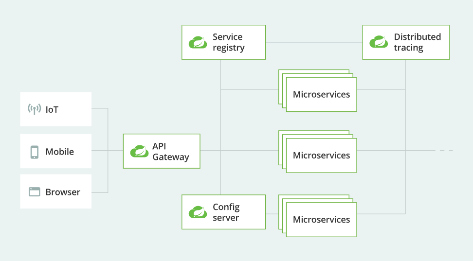
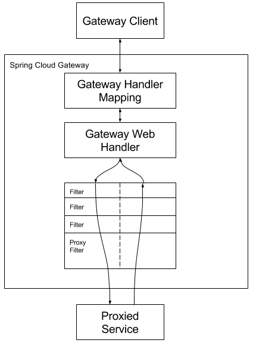

# API Gateway

## API Gateway 패턴

API Gateway 패턴은 마이크로서비스 아키텍처와 분산 시스템에서 사용되는 디자인 패턴 중 하나입니다. 이 패턴은 여러 개의 독립적인 마이크로서비스로 구성된 애플리케이션에서 클라이언트와 서비스 사이의 통신을 중앙 집중화하고 관리하기 위한 패턴입니다. API Gateway는 클라이언트 요청을 받아 서비스로 라우팅하고, 보안, 인증, 로드 밸런싱, 캐싱 등 다양한 관심사를 처리합니다.  

API Gateway 패턴은 마이크로서비스 아키텍처에서 클라이언트와 서비스 사이의 복잡한 통신 문제를 해결하기 위한 중요한 구성 요소 중 하나이며, 서비스 간의 결합도를 줄이고 관리성을 개선하는 데 도움이 됩니다.  
 - 클라이언트 간의 단일 진입점: API Gateway는 클라이언트들에게 단일 진입점을 제공하여 여러 마이크로서비스로부터 데이터를 요청하고 응답하는 중앙화된 역할을 수행합니다. 클라이언트는 여러 서비스 엔드포인트를 직접 호출하지 않고 API Gateway 하나만 호출하면 됩니다.
 - 로드 밸런싱: API Gateway는 여러 백엔드 서비스 인스턴스로 요청을 분산하여 부하 분산을 지원합니다. 이로써 서비스의 가용성을 높이고 성능을 최적화할 수 있습니다.
 - 인증 및 권한 부여: API Gateway는 클라이언트의 인증을 처리하고 권한 부여 규칙을 적용합니다. 사용자 인증, OAuth 토큰 검증, API 키 확인 등 다양한 인증 메커니즘을 지원합니다.
 - 보안 및 방화벽: API Gateway는 보안 정책을 적용하고 웹 애플리케이션 방화벽을 구현하여 악성 요청과 보안 위협으로부터 API를 보호합니다.
 - 캐싱: API Gateway는 요청 및 응답 데이터를 캐시하여 동일한 요청에 대한 응답 시간을 개선하고 서버 부하를 줄일 수 있습니다.
 - 로그 및 분석: API Gateway는 클라이언트 및 서비스 측 로그를 수집하고 분석하여 성능 모니터링, 오류 추적 및 보안 이벤트 감지에 도움을 줍니다.
 - API 관리 및 문서화: API Gateway는 API 버전 관리, 문서화, 메타데이터 관리를 지원하여 개발자가 API를 사용할 때 필요한 정보를 제공합니다.

<br/>

### API Gateway 단점

API Gateway는 여러 가지 이점을 제공하지만, 몇 가지 단점과 주의할 점도 고려해야 합니다.  
 - 단일 장애 지점: API Gateway는 클라이언트와 백엔드 서비스 사이에서 중요한 역할을 수행하기 때문에 만약 API Gateway 자체에 장애가 발생하면 모든 서비스에 영향을 미칠 수 있습니다. 따라서 고가용성 및 장애 복구 전략을 구현해야 합니다.
 - 성능 병목: API Gateway는 클라이언트 요청을 중개하고 다양한 작업을 처리하므로 과도한 부하가 발생할 경우 성능 병목이 될 수 있습니다. 이를 해결하기 위해 스케일링 및 로드 밸런싱을 고려해야 합니다.
 - 복잡성 증가: API Gateway를 사용하면 아키텍처가 복잡해질 수 있습니다. API Gateway에서 다양한 기능을 구현하고 관리해야 하므로 구성 및 관리에 추가적인 노력이 필요합니다.

<br/>

### Spring Cloud Gateway

Spring Cloud Gateway는 Spring 프레임워크 기반의 마이크로서비스 아키텍처에서 사용되는 API 게이트웨이 서비스를 구축하고 관리하기 위한 도구입니다. Spring Cloud 프로젝트의 일부로서, 클라우드 환경에서 API 라우팅, 보안, 로드 밸런싱 등을 효과적으로 처리할 수 있는 기능을 제공합니다.  

Spring Cloud Gateway는 스프링 부트 기반의 마이크로서비스 애플리케이션과 함께 사용되며, 서비스 간 통신 및 관리를 효율적으로 처리하는 데 사용됩니다. 클라우드 환경에서의 무중단 및 안전한 API 게이트웨이를 구축하려는 경우에 매우 유용한 도구 중 하나입니다.  
 - 라우팅(Routing): Spring Cloud Gateway는 클라이언트의 요청을 백엔드 마이크로서비스로 라우팅하는 기능을 제공합니다. 요청 경로, 메서드, 헤더 등을 기반으로 요청을 적절한 서비스로 전달합니다.
 - 로드 밸런싱: 여러 인스턴스로 구성된 백엔드 서비스에 대한 로드 밸런싱을 지원합니다. 서비스 인스턴스 간에 요청을 분산하여 서비스의 가용성을 향상시킵니다.
 - 필터(Filter): Spring Cloud Gateway는 요청 및 응답에 대한 필터를 정의하여 다양한 작업을 수행할 수 있습니다. 예를 들어, 보안 필터, 로깅 필터, 캐싱 필터 등을 사용하여 요청 및 응답을 가공하거나 검사할 수 있습니다.
 - 서킷 브레이커(Circuit Breaker): 서비스 간의 통신에서 발생할 수 있는 장애를 관리하기 위해 서킷 브레이커 패턴을 지원합니다. Hystrix와 같은 서킷 브레이커 라이브러리와 통합할 수 있습니다.
 - 보안과 인증: Spring Cloud Gateway는 인증과 권한 부여를 위한 필터를 제공하며, OAuth 2.0 및 JWT 토큰 기반의 보안을 쉽게 구현할 수 있습니다.
 - 동적 라우팅: 동적 라우팅을 통해 런타임 시에 라우팅 규칙을 변경할 수 있습니다. 이를 통해 무중단 배포 및 동적 확장을 지원합니다.
 - 스프링 클라우드 통합: Spring Cloud Gateway는 스프링 클라우드 프로젝트의 일부로서, 다른 스프링 클라우드 컴포넌트와 통합하기 쉽습니다. 서비스 디스커버리, 분산 구성, 분산 추적 등을 쉽게 구현할 수 있습니다.

<div align="center">
    
</div>

<br/>

### Spring Cloud Gateway 동작 방식

 - Gateway Handler: 요청과 경로에 대한 매칭 처리
 - Gateway Web Handler: Before 필터, After 필터
 - Route: 고유한 ID, 목적지 URI, Predicate, Filter로 구성되는 요소, 조건에 만족하면 설정된 경로로 라우팅
 - Predicate: 요청이 조건에 충족하는지 테스트
 - Filter: 하위 마이크로 서비스로 요청과 응답을 보낼 때 변경하는 기능
 - 클라이언트 > Gateway Handler Mapping > Gateway Web Handler > Filter > Proxied Service
```
1. 요청 수신 및 라우팅
클라이언트로부터 들어오는 HTTP 요청은 Spring Cloud Gateway로 전달됩니다.
Gateway는 요청의 경로, 메서드, 헤더 등을 기반으로 어떤 백엔드 서비스로 라우팅할지 결정합니다.
이 라우팅 규칙은 Spring Cloud Gateway의 라우팅 정의(Route Definition)에 정의되어 있습니다.

2. 필터 체인
Gateway는 요청과 응답에 대한 다양한 작업을 수행하기 위한 필터 체인을 실행합니다.
각 필터는 특정한 작업을 수행하고 요청 또는 응답을 가공할 수 있습니다.
예를 들어, 인증 필터, 로깅 필터, 캐싱 필터 등이 있습니다.
필터는 Spring WebFlux의 WebFilter 인터페이스를 구현하여 정의됩니다.

3. 로드 밸런싱
라우팅된 요청은 여러 백엔드 서비스 인스턴스 중 하나로 전달됩니다.
Spring Cloud Gateway는 이를 로드 밸런싱하여 서비스 인스턴스 간에 요청을 분산시킵니다.
이로써 서비스의 가용성과 확장성이 향상됩니다.

4. 백엔드 서비스 호출
Gateway는 선택된 백엔드 서비스로 HTTP 요청을 전달합니다.
이 백엔드 서비스는 실제 비즈니스 로직을 처리하고 응답을 생성합니다.

5. 응답 수신 및 필터 적용
백엔드 서비스가 생성한 응답은 다시 Gateway로 반환됩니다.
Gateway는 응답에 대한 필터 체인을 실행하여 응답을 가공하거나 헤더를 추가할 수 있습니다.

6. 클라이언트 응답
최종적으로 가공된 응답은 클라이언트로 전송됩니다.
```

<div align="center">
    
</div>
<div align="center">
    이미지 출처 - https://docs.spring.io/spring-cloud-gateway/docs/current/reference/html/
</div>

<br/>

### Backend For Frontend 패턴(BFF)

Backend For Frontend (BFF) 패턴은 클라이언트 애플리케이션과 백엔드 서비스 사이에서 중간 계층 역할을 수행하는 패턴입니다. 이 패턴은 다양한 클라이언트 플랫폼(웹, 모바일, IoT 디바이스 등)에서 동작하는 애플리케이션을 개발하고 유지 관리할 때 사용됩니다.  

BFF 패턴은 모노리틱 아키텍처나 마이크로서비스 아키텍처와 함께 사용할 수 있으며, 클라이언트와 백엔드 간의 중간 계층을 제공하여 클라이언트와 백엔드 간의 결합도를 낮추고 유연성을 높입니다. 이는 다양한 클라이언트 플랫폼을 지원하고 애플리케이션의 유지 및 보수를 간소화하는 데 도움이 됩니다.  
 - 클라이언트 특화된 API 제공: 각 클라이언트 플랫폼은 고유한 요구 사항과 UI 디자인을 가지고 있습니다. BFF는 각 클라이언트 플랫폼에 특화된 API를 제공하여 클라이언트 개발을 단순화하고 최적화합니다. 이렇게 하면 클라이언트가 필요로 하는 데이터를 효율적으로 가져올 수 있습니다.
 - 클라이언트의 성능과 보안 향상: BFF는 백엔드 서비스로부터 필요한 데이터를 수집하고 가공하여 클라이언트에게 최적화된 형태로 전달합니다. 이로써 클라이언트의 성능을 향상시키고 보안을 강화할 수 있습니다.
 - 백엔드 마이크로서비스 분리: BFF 패턴을 사용하면 각 클라이언트 플랫폼에 대한 백엔드 로직을 분리할 수 있습니다. 이로써 백엔드 마이크로서비스는 단순화되고 더 작은 단위로 관리될 수 있습니다.

<br/>

## API Gateway 실습

 - build.gradle
    - Gateway, Resillience4J 의존성을 추가한다.
```gradle
dependencies {
	implementation 'org.springframework.cloud:spring-cloud-starter-gateway'
	implementation 'org.springframework.cloud:spring-cloud-starter-circuitbreaker-resilience4j'

	compileOnly 'org.projectlombok:lombok'
	developmentOnly 'org.springframework.boot:spring-boot-devtools'
	annotationProcessor 'org.springframework.boot:spring-boot-configuration-processor'
	annotationProcessor 'org.projectlombok:lombok'

	testImplementation 'org.springframework.boot:spring-boot-starter-test'
	testImplementation 'org.springframework.cloud:spring-cloud-starter-contract-stub-runner'
}
```

<br/>

### 라우트 만들기

 - Java DSL 방식
    - rewritePath("요청 URL", "변환 URL"): 요청온 URL을 전달할 때는 변경할 수 있다.
    - addRequestHeader("키", "값"): 원본 요청에 헤더값을 추가해서 목적지로 전달한다.
```Java
@Configuration
public class RouteConfiguration {

    public static final String MICROSERVICE_HOST_8080 = "http://localhost:8080";
    public static final String ECHO_HTTP_BIN = "http://httpbin.org:80";

    @Bean
    public RouteLocator helloRouteLocator(RouteLocatorBuilder builder) {
        return builder.routes()
                .route("hello_route",
                        r -> r.path("/hello")
                        .uri(MICROSERVICE_HOST_8080))
                .route("rewrite_route",
                        r -> r.path("/gateway-hello")
                        .filters(f ->
                                f.rewritePath("/gateway-hello", "/microservice-hello")
                        )
                        .uri(MICROSERVICE_HOST_8080)
                )
                .route("add-header-route",
                        r -> r.path("/get")
                        .filters(f -> f.addRequestHeader("role", "hello-api"))
                        .uri(ECHO_HTTP_BIN)
                )
                .build();
    }
}
```

 - Application YML 방식
```YML
spring:
  cloud:
    gateway:
      routes:
        - id: hello_route
          uri: http://localhost:8080
          predicates:
            - Path=/hello
        - id: rewrite_route
          uri: http://localhost:8080
          predicates:
            - Path=/gateway-hello
          filters:
            - RewritePath=/gateway-hello, microservice-hello
        - id: add-header-route
          uri: http://httpbin.org:80
          predicates:
            - Path=/get
          filters:
            - AddRequestHeader=role, hello-api
```

<br/>

### 타임아웃 설정

 - 글로벌 타임아웃
    - connect-timeout: 밀리초 단위
    - response-timeout: java.time.Duration
```YML
spring:
  cloud:
    gateway:
      httpclient:
        connect-timeout: 1000
        response-timeout: 5s
```

 - 라우트별 타임아웃
    - connect-timeout: 밀리초 단위
    - response-timeout: 밀리초 단위
```YML
spring:
  cloud:
    gateway:
      routes:
        - id: per_route_timeouts
          uri: http://httpbin.org
          predicates:
            - name: Path
            args:
              pattern: /delay/{timeout}
          metadata:
            response-timeout: 200
            connect-timeout: 200
```

<br/>

### API Gateway 테스트 하기

 - build.gradle
    - spring-cloud-starter-contract-stub-runner(Contract Stub Runner) 의존성을 추가한다.
```gradle
dependencies {
	..
	testImplementation 'org.springframework.boot:spring-boot-starter-test'
	testImplementation 'org.springframework.cloud:spring-cloud-starter-contract-stub-runner'
}
```

 - Mock을 이용한 테스트 코드 작성
    - Stub: 미리 정해진 답변을 제공하는 객체
```Java
import org.junit.jupiter.api.Test;
import org.springframework.beans.factory.annotation.Autowired;
import org.springframework.boot.test.context.SpringBootTest;
import org.springframework.cloud.contract.wiremock.AutoConfigureWireMock;
import org.springframework.test.web.reactive.server.WebTestClient;

import static com.github.tomakehurst.wiremock.client.WireMock.*;

@SpringBootTest(webEnvironment = SpringBootTest.WebEnvironment.RANDOM_PORT)
@AutoConfigureWireMock(port = 0)
class RouteConfigurationTest {

    @Autowired
    private WebTestClient webClient;

    @Test
    public void addedHeaderRouteTest() throws Exception {
        // API Stubs
        stubFor(get(urlEqualTo("/get"))
                .willReturn(aResponse()
                        .withBody("{\"headers\":{\"Role\":\"hello-api\"}}")
                        .withHeader("Content-Type", "application/json")));

        // 라우트 검증
        webClient
            .get().uri("/get")
            .exchange()
            .expectStatus().isOk()
            .expectBody()
            .jsonPath("$.headers.Role").isEqualTo("hello-api");
    }
}
```
