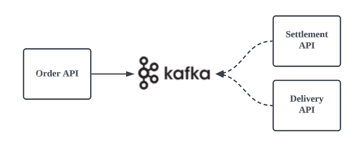

# 서비스에 메시징 도입하기

## 배경

 - 주문이 발생한 경우 추가적인 또는 연관된 비즈니스 업무 처리가 필요하다.
 - 기존에 이를 처리하기 위해 API나 데이터베이스를 활용한다.
 - 주문 완료에 대한 부가적인 작업 실패로 인한 전체 작업에 영향이 발생한다.
 - 고객이 늘어나면서 서비스에서 주문의 양이 지속적으로 늘어난다.

<br/>

## 문제점

 - 주문 트랜잭션 외의 부가적인 비즈니스 처리 의존성
    - 배송 시스템
    - 추천 시스템
 - 많은 주문 처리를 위한 수평적 확장성 필요
    - 하위 도메인 시스템과 동기 통신
 - 하위 도메인 시스템 실패 또는 장애의 전파

<br/>

## 목표와 해결책

 - 목표
    - 주문 도메인 시스템은 주문 처리의 단일 책임
    - 동기 처리를 비동기 처리로 처리량 향상
    - 하위 시스템의 주문 도메인 시스템 오류 및 장애 전파 방지
 - 해결책
    - 기존 API 동기 통신을 이벤트 기반의 비동기 시스템으로 변경
    - 공용 데이터베이스 직접 의존성을 분리
    - 하위 시스템과의 통신을 메시징 플랫폼으로 전환
 - 기대 효과
    - 느슨한 결합
    - 확장성
    - 처리량 향상 및 버퍼링
    - 안정성
    - 유지 보수성 증가
 - 어려운 점
    - 시스템의 복잡도 증가
    - 이벤트 메시지의 유지 보수
    - 단일 장애점(SPoF)
    - 메시징 브로커의 성능 병목 가능성
    - 별도 유지보수 필요한 시스템 관리(브로커)

<br/>

## 프로세스 비교

 - Before
    - 고객이 주문하면 연관된 도메인 연동
```
고객 > 이커머스 > 주문 > 배송, 알림, 정산 (동기)
```

 - After
    - 주문 도메인에서 주문 트랜잭션 처리시 메시지만 발행
    - 하위 도메인에서 주문 완료 이벤트를 받아서 각자 처리
```
고객 > 이커머스 > 주문 > 메시지 브로커 > 배송, 알림, 정산 (비동기)
```

<div align="center">
    
</div>

<br/>

## 도입 방법

 - 카프카에서 도메인 이벤트 관련 토픽 추가
 - 주문 시스템에서 주문 도메인 이벤트 발행
 - 배송 시스템에서 주문 이벤트 수신 및 처리
 - 정산 시스템에서 주문 이벤트 수신 및 처리

<br/>

### 카프카에서 도메인 이벤트 관련 토픽 추가

 - 카프카 토픽: order-completed-topic
```Bash
$ docker exec broker \
    kafka-topics --bootstrap-server broker:9092 \
    --create \
    --topic order-completed-topic
```

<br/>

### 주문 시스템에서 주문 도메인 이벤트 발행

 - application.yml
```YML
spring:
    kafka:
        bootstrap-servers: localhost:9092
```

 - KafkaPublisherConfig
```Java
@Configuration
public class KafkaPublisherConfig {

    @Value("${spring.kafka.bootstrap-servers}")
    private String bootstrapAddress;

    @Bean
    public ProducerFactory<String, OrderCompletedMessage> orderMessageProducerFactory() {
        Map<String, Object> configProps = new HashMap<>();
        configProps.put(ConsumerConfig.BOOTSTRAP_SERVERS_CONFIG, bootstrapAddress);
        configProps.put(
                ProducerConfig.KEY_SERIALIZER_CLASS_CONFIG,
                org.apache.kafka.common.serialization.StringSerializer.class);
        configProps.put(
                ProducerConfig.VALUE_SERIALIZER_CLASS_CONFIG,
                org.springframework.kafka.support.serializer.JsonSerializer.class);
        return new DefaultKafkaProducerFactory<>(configProps);
    }

    @Bean
    public KafkaTemplate<String, OrderCompletedMessage> orderMessageKafkaTemplate() {
        return new KafkaTemplate<>(orderMessageProducerFactory());
    }
}
```

 - OrderEventAdapter
```Java
@Slf4j
@Component
@RequiredArgsConstructor
public class OrderEventAdapter {

    private final KafkaTemplate orderMessageKafkaTemplate;

    private String TOPIC = "order-completed-message-v1";
    private String ORDER_MESSAGE_KEY = "order-message-key";

    public void send(OrderCompletedMessage orderCompletedMessage) {
        ListenableFuture<SendResult<String, OrderCompletedMessage>> future = orderMessageKafkaTemplate.send(TOPIC, ORDER_MESSAGE_KEY, orderCompletedMessage);
        future.addCallback(new ListenableFutureCallback<>() {
            @Override
            public void onSuccess(SendResult<String, OrderCompletedMessage> result) {
                log.info(String.format(">>> 주문 완료 메시지 발행(%s): key = %-10s value = %s", TOPIC, ORDER_MESSAGE_KEY, orderCompletedMessage));
            }

            @Override
            public void onFailure(Throwable ex) {
                log.error(String.format(">>> Message sending is Failed, {}", ex.getMessage()));
            }
        });
    }
}
```

 - OrderController
```Java
@Slf4j
@RestController
@RequiredArgsConstructor
public class OrderController {
    private final OrderQueryService orderQueryService;
    private final OrderEventAdapter orderEventAdapter;

    ..

    @PostMapping({"/orders/{orderId}"})
    public Order saveOrder(@PathVariable Long orderId) {

        Optional<Order> order = orderQueryService.getOrder(orderId);

        // 샘플 주문 완료 메세지
        OrderCompletedMessage orderCompletedMessage = OrderCompletedMessage.builder()
                .txId(UUID.randomUUID().toString())
                .version("1.0")
                .completedAt(OffsetDateTime.now().toString())
                .orderId(orderId.toString())
                .customerId("100")
                .build();

        orderEventAdapter.send(orderCompletedMessage);
        log.info(">>> 주문 완료 이벤트 발행, {}", orderId);

        return order.orElse(null);
    }
}
```

<br/>

## 배송 시스템에서 주문 이벤트 수신 및 처리

 - application.yml
```YML
spring:
  kafka:
    bootstrap-servers: localhost:9092
    consumer:
      group-id: delivery-group-id
      auto-offset-reset: earliest

server:
  port: 18091
```

 - KafkaConsumerConfig
```Java
@Configuration
public class KafkaConsumerConfig {

    @Value("${spring.kafka.bootstrap-servers}")
    private String bootstrapAddress;
    @Value("${spring.kafka.consumer.group-id}")
    private String groupId;

    public ConsumerFactory<String, OrderCompletedMessage> orderMessageConsumerFactory() {

        JsonDeserializer<OrderCompletedMessage> orderCompletedMessageJsonDeserializer = new JsonDeserializer<>(OrderCompletedMessage.class);
        orderCompletedMessageJsonDeserializer.setRemoveTypeHeaders(false);
        orderCompletedMessageJsonDeserializer.addTrustedPackages("*");
        orderCompletedMessageJsonDeserializer.setUseTypeMapperForKey(true);

        Map<String, Object> props = new HashMap<>();
        props.put(ConsumerConfig.BOOTSTRAP_SERVERS_CONFIG, bootstrapAddress);
        props.put(ConsumerConfig.GROUP_ID_CONFIG, groupId);
        return new DefaultKafkaConsumerFactory<>(props, new StringDeserializer(), orderCompletedMessageJsonDeserializer);
    }

    @Bean
    public ConcurrentKafkaListenerContainerFactory<String, OrderCompletedMessage> orderMessageKafkaListenerContainerFactory() {
        ConcurrentKafkaListenerContainerFactory<String, OrderCompletedMessage> factory = new ConcurrentKafkaListenerContainerFactory<>();
        factory.setConsumerFactory(orderMessageConsumerFactory());
        return factory;
    }
}
```

 - OrderCompletedEventConsumer
```Java
@Slf4j
@Component
public class OrderCompletedEventConsumer {

    @KafkaListener(
            topics="order-completed-message-v1",
            groupId = "${spring.kafka.consumer.group-id}",
            containerFactory = "orderMessageKafkaListenerContainerFactory"
    )
    public void listen(@Payload OrderCompletedMessage orderCompletedMessage) {
        log.info("*************************** 배송 도메인 컨슈머 ****************************");
        log.info("<<< 주문 완료 메세지 수신, {}", orderCompletedMessage);
        log.info("************************************************************************");
    }
}
```

<br/>

## 정산 시스템에서 주문 이벤트 수신 및 처리

 - application.yml
```YML
spring:
  kafka:
    bootstrap-servers: localhost:9092
    consumer:
      group-id: settlement-group-id
      auto-offset-reset: earliest
server:
  port: 18090
```

 - KafkaConsumerConfig
```Java
@EnableKafka
@Configuration
public class KafkaConsumerConfig {

    @Value("${spring.kafka.bootstrap-servers}")
    private String bootstrapAddress;
    @Value("${spring.kafka.consumer.group-id}")
    private String groupId;

    public ConsumerFactory<String, OrderCompletedMessage> orderMessageConsumerFactory() {

        JsonDeserializer<OrderCompletedMessage> orderCompletedMessageJsonDeserializer = new JsonDeserializer<>(OrderCompletedMessage.class);
        orderCompletedMessageJsonDeserializer.setRemoveTypeHeaders(false);
        orderCompletedMessageJsonDeserializer.addTrustedPackages("*");
        orderCompletedMessageJsonDeserializer.setUseTypeMapperForKey(true);

        Map<String, Object> props = new HashMap<>();
        props.put(ConsumerConfig.BOOTSTRAP_SERVERS_CONFIG, bootstrapAddress);
        props.put(ConsumerConfig.GROUP_ID_CONFIG, groupId);
        props.put(ConsumerConfig.KEY_DESERIALIZER_CLASS_CONFIG, StringDeserializer.class);
        props.put(ConsumerConfig.VALUE_DESERIALIZER_CLASS_CONFIG, JsonDeserializer.class);
        return new DefaultKafkaConsumerFactory<>(props, new StringDeserializer(), orderCompletedMessageJsonDeserializer);
    }

    @Bean
    public ConcurrentKafkaListenerContainerFactory<String, OrderCompletedMessage> orderMessageKafkaListenerContainerFactory() {
        ConcurrentKafkaListenerContainerFactory<String, OrderCompletedMessage> factory = new ConcurrentKafkaListenerContainerFactory<>();
        factory.setConsumerFactory(orderMessageConsumerFactory());
        return factory;
    }
}
```

 - OrderCompletedEventConsumer
```Java
@Slf4j
@Component
public class OrderCompletedEventConsumer {

    @KafkaListener(
            topics="order-completed-message-v1",
            groupId = "${spring.kafka.consumer.group-id}",
            containerFactory = "orderMessageKafkaListenerContainerFactory"
    )
    public void listen(@Payload OrderCompletedMessage orderCompletedMessage) {
        log.info("*************************** 정산 도메인 컨슈머 ****************************");
        log.info("<<< 주문 완료 메세지 수신, {}", orderCompletedMessage);
        log.info("************************************************************************");
    }
}
```
