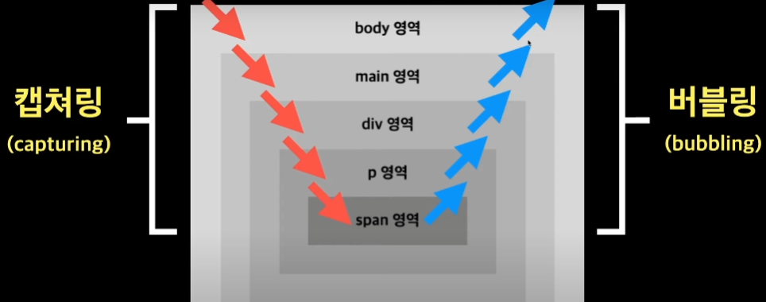

# 이벤트 전파, 버블링&캡처링

## 이벤트 전파

브라우저에서 이벤트 전파(Event Propagation)는 웹 페이지 내에서 이벤트가 발생했을 때, 해당 이벤트가 어떻게 처리되는지를 설명하는 개념입니다.  

 - __캡처링 단계(Capturing Phase)__
    - 이벤트가 최상위 요소(document)에서부터 시작하여 이벤트를 발생시킨 요소까지 전파됩니다.
    - 이벤트 캡처링 단계에서는 부모 요소로 이벤트가 전파되며, 이 단계에서 이벤트를 가로챌 수 있습니다.
    - 일반적으로 캡처링 단계에서는 거의 이용되지 않습니다.
 - __타깃 단계(Target Phase)__
    - 이벤트가 발생한 요소에 이벤트가 전달됩니다.
    - 이벤트를 발생시킨 요소에 대한 이벤트 핸들러가 실행됩니다.
 - __버블링 단계(Bubbling Phase)__
    - 이벤트가 발생한 요소에서 시작하여 최상위 요소(document)까지 전파됩니다.
    - 이벤트 버블링 단계에서는 부모 요소로 이벤트가 전파되며, 이 단계에서도 이벤트를 가로챌 수 있습니다.
    - 버블링 단계에서 이벤트를 가로채거나 처리할 수 있습니다.

<div align="center">
    
</div>
<br/>

### 버블링 예시

 - `index.html`
    - addEventListener는 기본적으로 버블링으로 동작한다.
    - 캡처링 및 버블링될 때 이벤트 전파를 막기 위해서는 event 객체의 stopPropagation() 메서드를 사용한다.
    - event 객체의 preventDefault() 메서드는 해당 HTML 요소에 대한 기본동작을 실행하지 않도록 지정한다. 예를 들어, 앵커 태그(a)의 href 속성으로 이동하는 동작을 막기 위해서 preventDefault() 메서드를 이용할 수 있다.
```html
<html>
    <head>
    </head>
    <body>
        body 영역
        <main>
            main 영역
            <div>
                div 영역
                <p>
                    p 영역
                    <span>span 영역</span>
                </p>
            </div>
        </main>

        <script>
            const $body = document.querySelector('body');
            const $main = document.querySelector('main');
            const $div = document.querySelector('div');
            const $p = document.querySelector('p');
            const $span = document.querySelector('span');

            // 버블링
            $span.addEventListener('click', function(event) {
                // eventPhase: 2
                console.log('[' + event.eventPhase + ']bubbling sapn 태그');
            });
            $p.addEventListener('click', function() {
                // eventPhase: 1
                console.log('[' + event.eventPhase + ']bubbling p 태그');
            });
            $div.addEventListener('click', function() {
                // eventPhase: 1
                console.log('[' + event.eventPhase + ']bubbling div 태그');
            });
            $main.addEventListener('click', function() {
                // eventPhase: 1
                console.log('[' + event.eventPhase + ']bubbling main 태그');
            });
            $body.addEventListener('click', function() {
                // eventPhase: 1
                console.log('[' + event.eventPhase + ']bubbling body 태그');
            });

            // 캡처링
            $span.addEventListener('click', function() {
                // eventPhase: 2
                console.log('[' + event.eventPhase + ']capturing sapn 태그');
            }, true);
            $p.addEventListener('click', function() {
                // eventPhase: 3
                console.log('[' + event.eventPhase + ']capturing p 태그');
            }, true);
            $div.addEventListener('click', function() {
                // eventPhase: 3
                console.log('[' + event.eventPhase + ']capturing div 태그');
            }, true);
            $main.addEventListener('click', function() {
                // eventPhase: 3
                console.log('[' + event.eventPhase + ']capturing main 태그');
            }, true);
            $body.addEventListener('click', function() {
                // eventPhase: 3
                console.log('[' + event.eventPhase + ']capturing body 태그');
            }, true);
        </script>
    </body>
</html>
```

