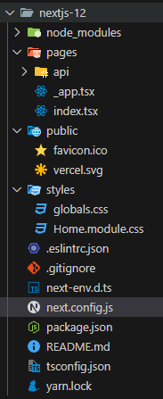

 - 예제 코드 깃허브: https://github.com/vercel/next-learn/blob/main/basics/typescript-final/lib/posts.ts

# Next.js로 블로그 만들기

Next.js는 React 기반의 풀스택 프레임워크로, 서버 사이드 렌더링(SSR), 정적 사이트 생성(SSG), 클라이언트 사이드 렌더링(CSR) 등을 유연하게 지원하는 것이 특징입니다. Next.js는 웹 애플리케이션 개발을 더 효율적으로 만들기 위해 많은 기능들을 제공하며, 복잡한 설정 없이도 빠르게 웹 프로젝트를 시작할 수 있게 해줍니다.  

 - __서버 사이드 렌더링 (SSR)__: Next.js는 서버에서 HTML을 렌더링하여 클라이언트에게 전달하는 SSR을 지원합니다. SSR을 사용하면 초기 페이지 로딩 속도가 빨라지고, SEO(검색 엔진 최적화)에도 유리합니다. getServerSideProps 함수를 통해 데이터를 서버에서 미리 가져와서 렌더링할 수 있습니다.
 - __정적 사이트 생성 (SSG)__: 빌드 타임에 페이지를 미리 생성하여 성능을 최적화하는 방식입니다. 고정된 콘텐츠를 가진 페이지는 서버 요청 없이도 빠르게 로딩되며, Next.js에서는 getStaticProps와 getStaticPaths를 사용해 SSG를 구현할 수 있습니다.
 - __클라이언트 사이드 렌더링 (CSR)__: React처럼 브라우저에서 JavaScript로 페이지를 렌더링합니다. Next.js는 페이지별로 SSR, SSG, CSR을 유연하게 선택할 수 있습니다. 이로 인해, 필요한 부분에 따라 성능을 극대화할 수 있습니다.
 - __API Routes__: Next.js에서는 서버 코드도 작성할 수 있는데, pages/api/ 디렉터리에 API 라우트를 정의하여 간단한 백엔드 API를 구현할 수 있습니다. 이를 통해 클라이언트와 서버를 통합된 환경에서 개발할 수 있습니다.
 - __이미지 최적화__: Next.js는 기본적으로 이미지 최적화를 지원하는 next/image 컴포넌트를 제공합니다. 이 컴포넌트를 사용하면 이미지 크기를 자동으로 최적화하고, lazy loading 등을 쉽게 적용할 수 있습니다.
 - __자동 코드 분할__: 페이지별로 필요한 코드만 로드하는 방식으로, 페이지 로딩 속도를 개선합니다. 이를 통해 사용자는 페이지 전환 시 필요한 리소스만 다운로드하게 되어 성능이 크게 향상됩니다.
 - __TypeScript 및 CSS-in-JS 지원__: Next.js는 TypeScript와 완벽하게 통합되어 있으며, 별도의 설정 없이 TypeScript 프로젝트로 시작할 수 있습니다. 또한 다양한 CSS-in-JS 라이브러리(Tailwind CSS, styled-components 등)와도 쉽게 연동할 수 있습니다.

## Next.js

 - 설치 방법
```bash
# 최신 버전 프로젝트 만들기
npx create-next-app@latest {프로젝트명}

# 특정 버전 프로젝트 만들기
npx create-next-app@12 {프로젝트명}

# 현재 경로에 프로젝트 만들기
npx create-next-app .
```

### Next.js 폴더 구조

 - Next 12 버전
    - pages
        - 해당 폴더 안에 페이지들을 생성한다.
        - index.tsx가 처음 "/" 페이지가 된다.
        - _app.tsx는 공통되는 레이아웃을 작성한다. 모든 페이지에 공통 항목을 여기에 넣어준다.
    - public
        - 이미지 같은 정적(static) 에셋들을 보관한다.
    - styles
        - 스타일링을 처리해주는 폴더이다.
        - 모듈 css는 컴포넌트 종송적으로 스타일링하기 위한 것이며, 확장자 앞에 module을 붙여주어야 한다.
    - next.config.js
        - Nextjs는 웹팩을 기본 번들러로 사용한다.
        - 해당 파일에서 웹팩에 대한 설정을 한다.
<div align="center">
    
</div>
<br/>

### Data Fetching

Next.js에서 데이터를 가져오는 방법은 여러 가지가 있다. 보통 리액트에서는 데이터를 가져올 떄 useEffect안에서 가져오지만, Next.js에서는 다른 방법을 사용해서 가져올 수 있다.  

 - getStaticProps
    - Static Generation으로 빌드할 때 데이터를 불러온다.
    - getStaticProps 함수를 async로 export 하면, getStaticProps에서 리턴되는 props를 가지고 페이지를 pre-render 한다. 빌드 시에 페이지를 렌더링한다.
    - 사용해야 하는 경우
        - 페이지를 렌더링하는 데 필요한 데이터를 사용자의 요청보다 먼저 빌드 시간에 가져올 수 있을 때
        - 데이터를 headless CMS에서 가져올 때
        - 모든 사용자에게 같은 데이터를 보여줄 때
        - 페이지는 미리 렌더링되어야 하고 매우 빨라야 할 대
```javascript
return Blog({ posts }) {
    return (
        <ul>
            {posts.map((post) => (
                <li>{post.title}</li>
            ))}
        </ul>
    )
}

export async function getStaticProps() {
    const res = await fetch('URL');
    const posts = await res.json();

    return {
        props: {
            posts,
        },
    };
}

export default Blog
```

 - getStaticPaths
    - Static Generation으로 데이터에 기반하여 pre-render시 특정한 동적 라우팅 구현
    - 동적 라우팅이 필요할 때 getStaticPaths로 경로 리스트를 정의하고, HTML에 빌드 시간에 렌더 된다.
    - paths: 어떠한 경로가 pre-render 될지 결정, 해당 경로가 빌드하는 동안 생성된다.
    - fallback: false라면 getStaticPaths로 리턴되지 않는 것은 모두 404 페이지가 뜬다. true 라면 getStaticPaths로 리턴되지 않는 것은 fallback 페이지가 뜨게 된다.
```javascript
// 문법
export async function getStaticPaths() {
    return {
        paths: [
            { params: { ... } }
        ],
        fallback: true
    }
}

// 예시
function Post({ post }) {
    // .. render post
}

export async function getStaticPaths() {
    const res = await fetch('URL');
    const posts = await res.json();

    const paths = posts.map((post) => ({
        params: { id: post.id },
    }))

    return { paths, fallback: false}
}

export async function getStaticProps() {
    const res = await fetch('URL');
    const posts = await res.json();

    return {
        props: {
            posts,
        },
    };
}

export default Post
```


 - getServerSideProps
    - Server Side Rendering으로 요청이 있을 때 데이터를 불러온다.
    - 사용해야 할 때
        - 요청할 떄 데이터를 가져와야 하는 페이지를 미리 렌더해야 할 때 사용한다.
        - 서버가 모든 요청에 대한 결과를 계산하고, 추가 구성 없이 CDN에 의해 결과를 캐시할 수 없기 때문에 첫 번째 바이트까지의 시간은 getStaticProps보다 느리다.
```javascript
// 문법
export async function getServerSideProps(context) {
    return {
        props: {},
    }
}

// 예시
function Page({ data }){
    // render data
}

export async function getServerSideProps() {
    const res = await fetch('URL');
    const data = await res.json()

    return { props: { data } }
}

export default Page
```

## 블로그 만들기 구현

 - 빌드 타임에 포스트 가져오기
```typescript
export const getStaticProps: GetStaticProps = async () => {
    const allPostsData = getSortedPostsData()
    return {
        props: {
            allPostsData
        }
    }
}
```

 - 리스트 나열하기
```typescript
<ul className={homeStyles.list}>
  {allPostsData.map(({ id, date, title }) => {
    <li className={homeStyles.listItem} key={id}>
      <Link href={`/posts/${id}`}>
        <a>{title}</a>
      </Link>
      <br />
      <small className={homeStyles.lightText}>
        {date}
      </small>
    </li>
  })}
</ul>
```
