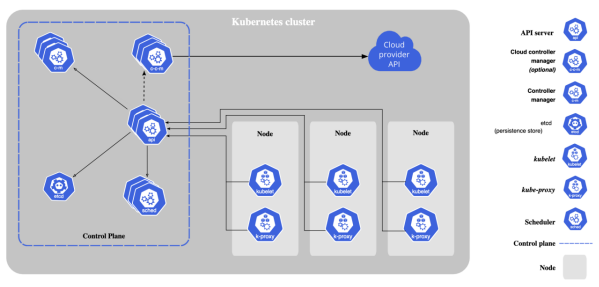
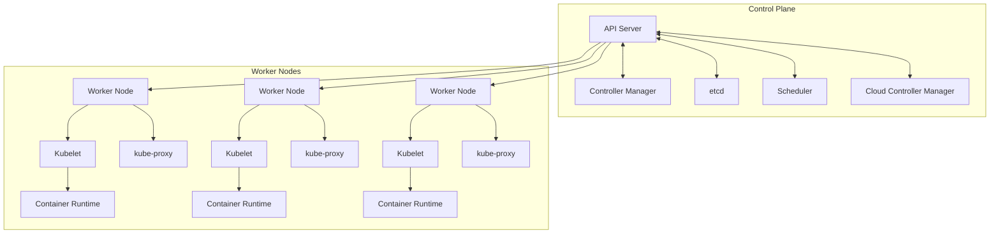

# Orchestrator

## Orchestrator 이론

다수의 Container를 조정하고 관리하는 시스템. 컨테이너의 배포, 스케일링 및 네트워킹을 자동화  
높은 가용성, 확장성 및 신뢰성을 가진 시스템을 구축하기 위해, Container화된 애플리케이션의 복잡한 작업을 간소화  

 - __특징__
    - 복잡성 관리: Orchestrator는 복잡한 서비스의 생명 주기를 관리하고, 여러 Container 간의 의존성을 조정
    - 자동화: 자동화를 통해 수동 intervention 없이도 시스템을 안정적으로 운영 가능
    - 확장성: 사용량 증가에 따라 자동으로 리소스를 조정하고, 필요에 따라 서비스를 확장하거나 축소할 수 있음
    - 고가용성: 서비스의 지속적인 가용성을 보장하며, 장애 발생 시 자동으로 복구해줌
 - __주요 기능__
    - 자동 배포 및 관리
        - Orchestrator는 사용자가 정의한 설정에 따라 Container를 자동으로 배포하고, 실행
        - 사용자는 Container Image, 환경 변수, 실행할 명령어 등을 저으이
        - Orchestrator는 이러한 정의에 따라 Container를 생성하고, 네트워크 설정과 볼륨 마운트 등을 처리
    - 스케일링 및 로드 밸런싱
        - 트래픽의 증가나 감소에 따라 자동으로 컨테이너 수를 조절
        - 사용량이 많은 시간에는 컨테이너 수를 늘려 부하를 분산시키고, 사용량이 적은 시간에는 줄여 리소스를 효율적으로 사용
        - 들어오는 요청을 여러 컨테이너에 균등하게 분배하여 전체 시스템의 균형을 유지
    - 자동 복구 및 장애 대응
        -  오류가 발생한 컨테이너를 자동으로 감지하고, 필요한 경우 복구 조치를 취함
        - Container가 실패하거나 비정상적인 상태로 동작할 경우, Orchestrator는 해당 Container를 자동으로 재시작하거나 새 instance로 교체
        - 시스템의 안정성과 가용성을 유지하기 위한 조치를 자동으로 실행
    - 서비스 발견 및 네트워킹
        - Orchestrator는 컨테이너 간의 통신 및 서비스 발견을 관리
        - 내부 DNS 또는 다른 서비스 발견 메커니즘을 통해 Container 간의 통신을 용이하게 함
        - 네트워크 정책을 통해 컨테이너 간의 통신을 제어하고 보안을 강화
    - 업데이트 및 롤백 관리
        - 애플리케이션 업데이트를 안전하게 관리하고, 필요한 경우 이전 버전으로 롤백
        - 업데이트 중 발생할 수 있는 다운타임을 최소화하기 위해 롤링 업데이트와 같은 전략을 사용
        - 업데이트가 실패하거나 문제가 발생할 경우, 자동으로 이전 버전으로 롤백하여 시스템 안정성을 보장

<br/>

## 쿠버네티스

쿠버네티스(Kubernetes)는 컨테이너화된 애플리케이션의 배포, 확장 및 관리를 자동화하는 오픈소스 시스템입니다. 구글에서 개발하여 2014년에 오픈소스로 공개되었으며, 현재는 CNCF(Cloud Native Computing Foundation)에서 관리하고 있습니다.  
 - 자동화된 롤아웃 및 롤백: 애플리케이션 업데이트 시 롤아웃을 자동으로 관리하고, 문제 발생 시 이전 버전으로 롤백
 - 서비스 발견 및 로드 밸런싱: 서비스를 사용하여 클러스터 내의 애플리케이션에 쉽게 접근하고, 트래픽을 자동으로 분산
 - 스케일링: 애플리케이션의 리소스 사용에 따라 자동 또는 수동으로 스케일링
 - 자체 치유: 실패한 컨테이너를 재시작하고, 건강하지 않은 컨테이너를 교체하며, 준비되지 않은 노드로부터 애플리케이션을 이전

<br/>

### 쿠버네티스 아키텍처

쿠버네티스(Kubernetes)의 아키텍처는 컨테이너화된 애플리케이션의 배포, 확장 및 관리를 자동화하는 데 필요한 다양한 구성 요소로 이루어져 있습니다. 쿠버네티스 클러스터는 크게 컨트롤 플레인(Control Plane)과 워커 노드(Worker Node)로 구분되며, 각 구성 요소는 특정한 역할을 수행합니다.  

<div align="center">
    
</div>

 - __컨트롤 플레인과 워커 노드 간의 관계__
    - Control Plane 섹션에는 주요 컨트롤 플레인 구성 요소가 포함
    - Worker Nodes 섹션에는 각각의 워커 노드와 그 구성 요소들이 포함
    - 각 워커 노드는 API Server와 통신하여 클러스터의 상태를 유지


<br/>

#### 컨트롤 플레인(Control Plane)

컨트롤 플레인은 클러스터를 전반적으로 관리하고 클러스터의 상태를 유지하는 역할을 합니다.  
 - __API 서버 (kube-apiserver)__
    - 쿠버네티스 API를 제공하는 컴포넌트로, 클러스터의 상태에 대한 모든 요청을 처리합니다.
    - RESTful 인터페이스를 제공하며, 외부 도구와의 통신을 담당합니다.
 - __스케줄러 (kube-scheduler)__
    - 새로 생성된 포드를 적절한 워커 노드에 할당하는 역할을 합니다.
    - 리소스 요구 사항, 하드웨어/소프트웨어 정책, 워크로드 간의 균형 등을 고려하여 결정합니다.
 - __컨트롤러 매니저 (kube-controller-manager)__
    - 클러스터 상태를 유지하기 위한 컨트롤러들의 집합입니다.
    - 예를 들어, 레플리케이션 컨트롤러는 올바른 수의 포드가 실행 중인지 확인하고, 노드 컨트롤러는 노드의 상태를 모니터링합니다.
 - __etcd__
    - 분산 키-값 데이터베이스로, 클러스터의 모든 상태 정보를 저장합니다.
    - 고가용성을 위해 여러 노드에 복제될 수 있습니다.
 - __클라우드 컨트롤러 매니저 (cloud-controller-manager)__
    - 클라우드 서비스와의 통합을 담당합니다.
    - 노드 컨트롤러, 라우트 컨트롤러, 서비스 컨트롤러 등의 클라우드 관련 기능을 수행합니다.

<br/>

#### 워커 노드 (Worker Node)

워커 노드는 실제 애플리케이션 컨테이너가 실행되는 곳입니다.  
 - __쿠버네티스 노드 에이전트 (kubelet)__
    - 각 워커 노드에서 실행되며, API 서버와 통신하여 명령을 받고, 컨테이너의 상태를 모니터링합니다.
    - 포드 스펙을 받고, 해당 포드를 실행하고 유지하는 역할을 합니다.
 - __쿠버네티스 네트워크 프록시 (kube-proxy)__
    - 각 노드에서 실행되며, 네트워크 규칙을 유지하고, 서비스 개념을 구현하여 포드 간 통신을 지원합니다.
    - 로드 밸런싱과 네트워크 트래픽 전달을 담당합니다.
 - __컨테이너 런타임__
    - 컨테이너를 실제로 실행하는 소프트웨어입니다.
    - Docker, containerd, CRI-O 등이 사용될 수 있습니다.

<br/>

#### 작동 방식

 - 클러스터 구성: 먼저 쿠버네티스 클러스터를 구성합니다. 이 클러스터는 여러 노드(물리적 또는 가상 머신)와 이들을 관리하는 마스터 노드로 구성
 - API 서버와의 통신: 사용자는 kubectl 명령줄 인터페이스나 API를 통해 API 서버와 통신. 이를 통해 파드 생성, 업데이트, 삭제 등의 작업을 요청
 - 스케줄링과 실행: 스케줄러는 새로운 파드에 대해 가장 적합한 노드를 선택합니다. kubelet은 해당 노드에서 파드의 컨테이너가 올바르게 실행되도록 관리
 - 서비스 관리: kube-proxy는 서비스를 통한 네트워크 트래픽을 관리합니다. 서비스는 파드 그룹에 안정적인 접근점을 제공
 - 자동화된 롤아웃 및 롤백: 데플로이먼트를 통해 애플리케이션의 업데이트, 롤아웃 및 롤백을 자동으로 관리
 - 스케일링과 자체 치유: 클러스터는 애플리케이션의 수요에 따라 자동으로 스케일링하고, 실패한 파드를 재시작하는 등의 자체 치유 기능을 제공

<br/>

### 쿠버네티스 주요 구성 요소

 - __파드(Pod)__
    - 쿠버네티스에서 배포할 수 있는 가장 작은 작업 단위
    - 하나 이상의 컨테이너를 포함할 수 있으며, 이들은 스토리지와 네트워크를 공유
    - 주요 특징
        - 컨테이너 그룹핑: 파드는 하나 이상의 밀접하게 관련된 컨테이너를 그룹화하며, 이 컨테이너들은 같은 컴퓨팅 리소스를 공유
        - 공유 리소스: 파드 내의 컨테이너는 같은 IP 주소와 포트 공간을 공유하고, 서로 localhost를 통해 통신
        - 일시적인 성격: 파드는 일시적입니다. 즉, 파드가 삭제되면 그 안의 컨테이너도 함께 삭제. 이는 파드가 불변적이지 않고 변경 가능한 리소스로 간주됨을 의미
        - 생명주기: 파드는 생성되고, 실행되며, 종료될 때까지의 생명주기를 가집니다. 파드가 종료되면, 쿠버네티스 클러스터에서 제거
    - 사용 예
        - 단일 컨테이너 파드: 대부분의 파드는 하나의 컨테이너만을 실행
        - 멀티 컨테이너 파드: 로깅, 데이터 백업, 데이터 처리와 같은 보조 기능을 수행하는 사이드카(Sidecar) 컨테이너를 포함
 - __서비스(Service)__
    - 서비스는 파드의 집합에 대한 안정적인 네트워크 주소를 제공
    - 서비스를 통해 파드 집합에 대한 접근을 관리하고, 로드 밸런싱 및 서비스 발견을 가능
    - 주요 특징
        - 안정적인 주소 제공: 서비스는 파드 집합에 지속적으로 접근할 수 있는 안정적인 IP 주소와 포트를 제공
        - 로드 밸런싱: 서비스는 요청을 여러 파드에 분산시켜 로드 밸런싱을 수행
        - 서비스 발견: DNS 또는 환경 변수를 통해 클러스터 내의 다른 파드가 서비스를 쉽게 찾을 수 있음
        - 서비스 타입: 다양한 서비스 타입(ClusterIP, NodePort, LoadBalancer, ExternalName)을 통해 다양한 네트워크 요구 사항을 충족
    - 사용 예
        - ClusterIP: 클러스터 내부에서만 접근 가능한 서비스를 만들 때 사용
        - LoadBalancer: 클라우드 제공 업체의 로드 밸런서를 사용하여 서비스에 대한 외부 접근을 관리
 - __디플로이먼트(Deployment)__
    - 데플로이먼트는 쿠버네티스에서 파드와 레플리카셋의 상태를 선언적으로 관리하는 API 오브젝트
    - 애플리케이션의 배포, 업데이트, 스케일링 등을 자동화하고 관리
    - 주요 특징
        - 자동화된 롤아웃과 롤백: 데플로이먼트는 애플리케이션의 새 버전을 롤아웃하고, 필요한 경우 이전 버전으로 롤백하는 프로세스를 자동화
        - 상태 관리: 원하는 상태(Desired State)를 정의하고, 쿠버네티스가 실제 상태(Current State)를 그 상태로 유지
        - 선언적 업데이트: YAML 파일이나 JSON 형식을 사용하여 애플리케이션을 업데이트하는 방식을 선언
        - 스케일링: 파드의 수를 수동 또는 자동으로 조절하여 애플리케이션을 스케일링
    - 사용 예
        - 새 버전 배포: 데플로이먼트를 사용하여 애플리케이션의 새 버전을 롤아웃
        - 스케일링: kubectl scale deployment 명령어를 사용하여 데플로이먼트를 확장하거나 축소
 - __레플리카셋(ReplicaSet)__
    - 레플리카셋은 파드의 복제본을 유지 관리하는 쿠버네티스 오브젝트
    - 파드의 원하는 복제본 수를 지정하고, 지정된 수의 파드 복제본이 항상 실행되고 있도록 보장
    - 주요 특징
        - 복제본 수 관리: 지정된 수의 파드 복제본을 유지
        - 자체 치유: 실패한 파드를 자동으로 대체하여 복제본 수를 유지
        - 유연한 파드 선택: 레이블 선택기(Label Selector)를 사용하여 관리할 파드를 결정
    - 사용 예
        - 애플리케이션 가용성 보장: 레플리카셋은 애플리케이션의 가용성을 높이기 위해 여러 파드의 복제본을 실행
        - 부하 분산: 여러 파드 복제본을 통해 트래픽이 분산되어, 애플리케이션에 대한 부하가 각 복제본에 균등하게 분배

<br/>

### 쿠버네티스 실습

 - __Pod 실습__
```bash
kubectl run fastcampusserver --image=nginx:latest --port 80
kubectl get pods
kubectl describe pod

curl {IP-Address}:80
```
<br/>

 - __Deployment 실습__
```bash
kubectl create deployment fastcampusdeployment --image=nginx --replicas=2
kubectl get deployments.apps
kubectl get pods
kubectl describe pod [pod name]
kubectl edit deployments.apps fastcampusdeployment
kubectl get pods
```