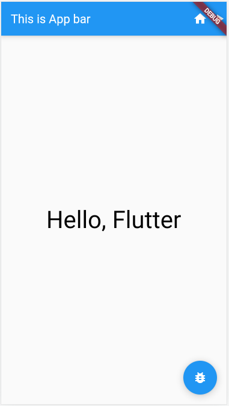
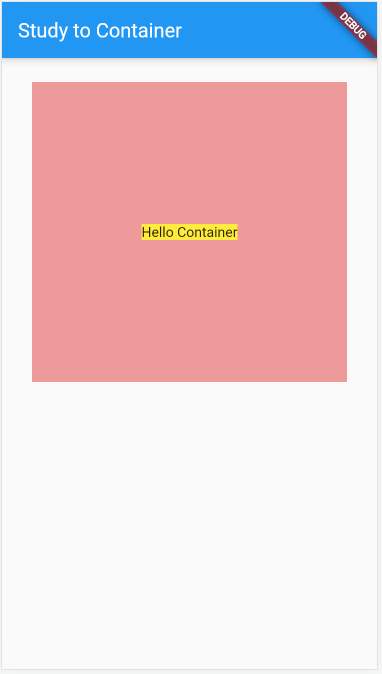

# Flutter Widget

## What is Widget

Flutter는 UI 개발을 위한 고급 프레임워크로서, 다양한 위젯(widget)을 사용하여 UI를 만들고 제어할 수 있습니다.  
Flutter 기본 SDK에는 상당히 많은 Widget을 제공하고, pub.dev를 통해 제공되는 오픈 소스를 더한다면 더 많은 수의 Widget을 활용할 수 있습니다.  

 - 위젯 기반 구성: Flutter에서 UI는 다양한 위젯의 조합으로 이루어집니다. 위젯은 화면의 모든 구성 요소를 표현하며, 텍스트, 버튼, 이미지, 입력 필드, 레이아웃 및 기타 모든 UI 요소를 포함합니다. 위젯은 상태 변화나 이벤트 처리 등의 작업을 수행할 수 있습니다.
 - 재사용 가능한 구성 요소: Flutter 위젯은 재사용 가능한 구성 요소로 설계되어 있습니다. 이것은 동일한 위젯을 여러 번 사용하거나 여러 위젯을 조합하여 복잡한 UI를 만들 수 있음을 의미합니다. 이를 통해 코드를 단순화하고 유지 관리성을 높일 수 있습니다.
 - 반응형 및 화면 크기 대응: Flutter는 다양한 화면 크기와 해상도에 대응하는 반응형 UI를 지원합니다. 이는 다양한 디바이스에서 일관된 사용자 경험을 제공할 수 있도록 도와줍니다.
 - 직접적인 제어: Flutter는 UI를 직접적으로 제어할 수 있는 방법을 제공합니다. 애니메이션, 제스처 처리, 터치 이벤트 등을 효과적으로 다룰 수 있어 사용자와의 상호 작용을 개발자가 원하는 대로 제어할 수 있습니다.
 - 다양한 스타일링 옵션: Flutter는 다양한 스타일링 옵션을 제공하여 UI 요소를 사용자 정의하고 디자인할 수 있습니다. 색상, 글꼴, 그림자, 애니메이션 효과 등을 쉽게 적용할 수 있습니다.
 - 풍부한 커뮤니티 및 패키지: Flutter는 커뮤니티에서 다양한 위젯 패키지와 UI 컴포넌트를 사용할 수 있도록 지원하며, 이로써 빠르고 효율적인 UI 개발을 가능하게 합니다.

<br/>

### Stateless Widget과 Stateful Widget 

Flutter에서는 두 가지 주요 위젯 유형인 "Stateless Widget"과 "Stateful Widget"을 사용하여 사용자 인터페이스(UI)를 작성합니다. 이 두 유형은 애플리케이션의 상태 변화에 따라 다르게 동작합니다.  
Stateless Widget과 Stateful Widget은 Flutter 애플리케이션의 다양한 UI 요구 사항을 처리하는 데 사용됩니다. 간단한 정적 컨텐츠 표시에는 Stateless Widget을 사용하고, 동적인 상태 및 사용자 상호 작용을 다룰 때는 Stateful Widget을 사용합니다.  

 - Stateless Widget
    - Stateless Widget은 상태(데이터)를 가지지 않는 위젯입니다. 즉, 한 번 그려진 후에는 내부 상태가 변경되지 않으며, 변경 가능한 상태를 갖지 않습니다. 주로 정적인 컨텐츠를 표시하기 위해 사용됩니다
    - 불변(Immutable): Stateless Widget은 한 번 생성되면 내부 상태가 변경되지 않습니다. 따라서 화면에 표시된 내용이나 모양은 변경되지 않습니다.
    - 간단하고 경량: Stateless Widget은 내부 상태가 없으므로 생성 및 관리가 간단하며 성능이 우수합니다.
    - 재빌드 가능: Stateless Widget은 부모 위젯의 상태에 의존하지 않으므로 부모 위젯이 다시 빌드될 때 항상 동일한 방식으로 렌더링됩니다.
    - 데이터 전달: 데이터나 인자를 받아서 UI를 렌더링하는 데 주로 사용됩니다. 예를 들어, 텍스트 또는 이미지를 표시하는 데 유용합니다.
 - Stateful Widget
    - Stateful Widget은 내부 상태(데이터)를 가지고 있으며, 상태 변화에 따라 다시 그려질 수 있습니다. 이러한 위젯은 사용자 입력, 데이터 로딩, 애니메이션 및 동적 UI 업데이트와 같이 상태를 관리해야 하는 경우에 주로 사용됩니다.
    - 가변(Mutable): Stateful Widget은 내부 상태를 가질 수 있으며, 상태를 변경할 수 있습니다. 이로 인해 UI가 다양한 상황에 따라 동적으로 변할 수 있습니다.
    - 동적 UI 업데이트: 상태가 변경될 때마다 setState() 메서드를 호출하여 UI를 다시 그리고 업데이트할 수 있습니다.
    - 사용자 상호 작용: 사용자 입력에 따라 상태를 업데이트하고 사용자와 상호 작용하는 데 유용합니다. 예를 들어, 버튼 클릭, 입력 필드 변경 등에 대응할 수 있습니다.
    - 캡슐화된 상태: Stateful Widget은 상태를 관리하기 위한 State 객체를 가집니다. 이 상태 객체는 해당 위젯과 관련된 상태 정보를 캡슐화하고 보존합니다.

<br/>

### Hello World 출력하기

 - HelloWorld 출력하기
```Dart
import 'package:flutter/material.dart';

void main() {
  runApp(MaterialApp(
    home: Scaffold(
      body: SafeArea(
        child: Text(
          'Hello, Flutter',
          style: TextStyle(
            fontSize: 40,
            color: Colors.black,
          ),
        ),
      ),
    ),
  ));
}
```

 - HelloWorld 위젯 분리하기
    - 해당 클래스를 위젯으로 사용하기 위해 StatelessWidget을 상속받아서 구현한다.
```Dart
import 'package:flutter/material.dart';

void main() {
  runApp(MaterialApp(
    home: Scaffold(body: TestWidget()),
  ));
}

class TestWidget extends StatelessWidget {
  const TestWidget({super.key});

  @override
  Widget build(BuildContext context) {
    return SafeArea(
      child: Center(
        child: Text(
          'Hello, Flutter',
          style: TextStyle(
            fontSize: 40,
            color: Colors.black,
          ),
        ),
      ),
    );
  }
}
```

<br/>

## Hot restart와 Hot reload

Dart는 JIT 컴파일러와 AOT 컴파일러가 사용된다.  
Flutter에서는 이 언어적 특성을 사용하여 빠른 개발을 위한 Hot restart / Hot Reload 기능을 제공한다.  
이 기능을 사용하면 JIT 컴파일러를 활용하여, 앱을 시간이 오래 걸리는 컴파일 과정을 거치지 않고서도 코드의 변경 사항을 즉시 반영할 수 있다.  

 - Hot restart
    - Hot restart는 말 그대로 앱을 재시작하는 형태로 앱의 모든 상태가 초기화되고, 앱의 코드 변경 사항을 반영할 수 있다.
 - Hot reload
    - Hot reload는 앱을 재실행하지는 않지만, 코드의 변경 사항을 반영하는 기능이다.
    - 해당 기능을 활용시 앱의 상태를 유지한 채로, 코드의 수정사항을 확인하여 더욱 빠른 개발을 할 수 있게 한다.
 - 주의사항
    - Hot Restart / Hot Reload 모두 앱을 재 컴파일 후 빌드하는 것이 아니다.
    - 떄문에, 앱의 기초가 되는 네이티브 코드의 수정이나 라이브러리, Assert의 추가 등의 상황에는 정상적으로 동작하지 않을 수 있다.
    - 또한, 지나치게 많은 코드의 변경 사항이 있을 경우 Reload / Restart 순으로 실행 중인 프로세스가 상위 재시동을 요청할 수 있으며, 추후 상태를 관리하는 개발 단계에 도달하면 해당 기능을 사용할 대 주의를 요하게 된다.

<br/>

## 디자인 가이드

Flutter 내에서는 대표적인 2개의 디자인 가이드를 활용하여 개발을 진행할 수 있다.  
2개의 디자인 가이드 외에도 커스텀 디자인 가이드를 적용할 수도 있지만, Google과 Apple의 노하우가 담긴 디자인 가이드로 가급적 해당 가이드를 활용하여도 충분히 좋은 앱을 만들 수 있다.  
 - Material Design
    - 홈페이지 :https://m3.material.io/
    - Google에서 제시하는 디자인 가이드라인으로 최근 Material 3을 발표하면서 개인화된 앱을 구현하는데 중점이 맞춰져있다.
    - Flutter의 경우 Google에서 주도적으로 개발하고 있는 프레임워크로 Cupertino Widget 보다는 Material Widget이 더 많은 갯수와 지원이 된다.
 - Flutter Widget Catalog
    - 홈페이지: https://docs.flutter.dev/ui/widgets

<br/>

## MaterialApp, Scaffold Widget

### MaterialApp

MaterialApp은 Material Design 스타일의 애플리케이션을 생성하고 구성하는 데 사용되는 최상위 위젯입니다. Material Design은 Google에서 개발한 디자인 가이드라인으로, 모바일 및 웹 애플리케이션의 일관된 시각적 디자인과 사용자 경험을 제공하는 데 사용됩니다.  

MaterialApp을 사용하여 앱의 기본 설정을 정의하고, 여러 화면과 위젯을 포함하는 Flutter 애플리케이션의 뼈대를 구축할 수 있습니다.  

 - 애플리케이션 테마 설정: MaterialApp은 애플리케이션의 기본 테마, 색상 스킴, 폰트 설정 등을 구성할 수 있는 기능을 제공합니다. 이로써 앱 전체의 디자인 스타일을 일관되게 설정할 수 있습니다.
 - 루트 위젯 지정: 앱의 루트 위젯을 정의합니다. 이 위젯은 앱이 시작되면 가장 먼저 화면에 표시되는 것으로, 애플리케이션의 구조를 결정합니다.
 - 로케일 및 언어 설정: 다국어 지원과 관련하여 애플리케이션의 언어와 로케일 설정을 지원합니다.
 - 내비게이션 및 라우팅 설정: 내비게이션 및 라우팅을 관리하는 데 도움을 줍니다. 예를 들어, 화면 간 이동 및 라우팅을 설정하고 관리합니다.
 - 디버깅 및 개발 툴 설정: 개발 중에 필요한 디버깅 및 개발 도구를 활성화하고 설정할 수 있습니다.

<br/>

### Scaffold

Scaffold는 앱의 화면 구조를 정의하고 Material Design의 레이아웃 구성 요소를 제공하는 데 사용되는 위젯입니다. Scaffold 위젯은 앱 화면의 레이아웃을 구성하는 데 도움을 줍니다.  

Scaffold를 사용하면 앱의 기본 레이아웃을 쉽게 구성할 수 있으며, Material Design의 가이드라인을 따르는 앱을 만들 수 있습니다. 이를 통해 일관된 디자인과 사용자 경험을 제공할 수 있습니다.  

 - 앱 바 (App Bar): Scaffold에 포함된 AppBar는 상단에 표시되며, 앱 제목, 액션 버튼, 메뉴 아이콘 등을 포함하는 표준화된 앱 상단 바를 생성합니다.
 - 본문 (Body): Scaffold의 본문 부분은 앱의 주요 컨텐츠를 표시하는 곳입니다. 일반적으로 Container, ListView, Column, Row 등의 다른 위젯으로 구성됩니다.
 - 플로팅 액션 버튼 (Floating Action Button): Scaffold에 포함된 FloatingActionButton은 주로 주요 작업을 수행하는 데 사용되는 원형의 액션 버튼을 생성합니다.
 - 드로어 (Drawer): Scaffold는 왼쪽 또는 오른쪽에 드로어(네비게이션 메뉴)를 포함할 수 있으며, 사용자에게 추가 메뉴 옵션을 제공합니다.
 - 바텀 네비게이션 바 (Bottom Navigation Bar): Scaffold는 화면 하단에 탐색을 위한 바텀 네비게이션 바를 제공할 수 있으며, 여러 화면 사이를 전환할 때 사용됩니다.
 - 페인트 위젯 (FloatingAppBar): 스크롤 가능한 화면에서 사용되며, 화면을 스크롤할 때 AppBar의 일부 또는 전체를 보이거나 숨길 수 있습니다.

```Dart
import 'package:flutter/material.dart';

void main() {
  runApp(MaterialApp(
    home: Scaffold(
      appBar: AppBar(actions: [
        IconButton(
          icon: Icon(Icons.home),
          onPressed: () {
            print('Tab!');
          },
        ),
        Icon(Icons.play_arrow)
      ], centerTitle: false, title: Text('This is App bar')),
      body: TestWidget(),
      floatingActionButton: FloatingActionButton(
        child: Icon(Icons.bug_report),
        onPressed: () {
          print('Tab! FAB!');
        },
      ),
    ),
  ));
}

class TestWidget extends StatelessWidget {
  const TestWidget({super.key});

  @override
  Widget build(BuildContext context) {
    return SafeArea(
      child: Center(
        child: Text(
          'Hello, Flutter',
          style: TextStyle(
            fontSize: 40,
            color: Colors.black,
          ),
        ),
      ),
    );
  }
}
```

<div align="center">
    
</div>

<br/>

## Container, Center Widget

### Container

Container 위젯은 다양한 레이아웃 속성 및 스타일을 가진 사각형 컨테이너를 생성하는 데 사용됩니다.  

 - 크기와 위치 제어: Container는 너비와 높이를 설정하여 크기를 제어하고, margin 및 padding 속성을 사용하여 위치를 조절할 수 있습니다.
 - 색상과 그라데이션: 배경 색상을 설정하거나 그라데이션을 적용하여 컨테이너를 스타일링할 수 있습니다.
 - 테두리와 그림자: border 속성을 사용하여 테두리를 추가하고, boxShadow 속성을 사용하여 그림자 효과를 적용할 수 있습니다.
 - 애니메이션: 애니메이션을 적용하기 위한 animation 속성을 제공합니다.
 - 자식 위젯: Container는 자식 위젯을 포함할 수 있으며, 자식 위젯은 컨테이너 내부에 배치됩니다.

```Dart
import 'package:flutter/material.dart';

void main() {
  runApp(MaterialApp(
    home: Scaffold(
      appBar: AppBar(title: Text('Study to Container')),
      body: CustomContainer(),
    ),
  ));
}

class CustomContainer extends StatelessWidget {
  const CustomContainer({super.key});

  @override
  Widget build(BuildContext context) {
    return Container(
      width: double.infinity,
      height: 300,
      color: Colors.red.shade200,
      // color: Color(0xFF85D07B),
      padding: EdgeInsets.fromLTRB(10, 12, 10, 12),
      margin: EdgeInsets.symmetric(vertical: 24, horizontal: 30),
      child: Center(
          child: Container(
              color: Colors.yellow,
              child: Text('Hello Container')
          )
      ),
    );
  }
}
```

<div align="center">
    
</div>

