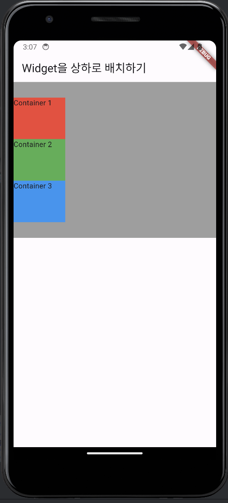
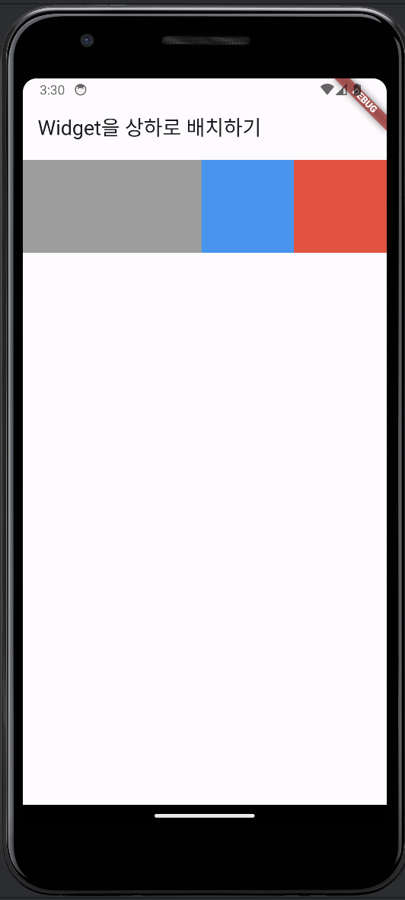
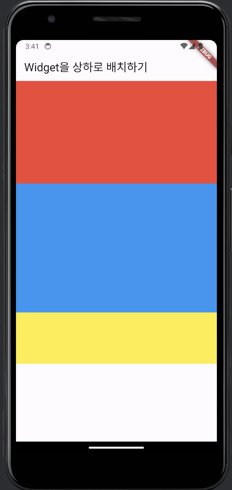

# 테스트 샘플

```dart
import 'package:flutter/material.dart';

void main() {
  runApp(MaterialApp(
    home: Scaffold(
      appBar: AppBar(
        title: Text('Widget을 상하로 배치하기'),
      ),
      body: Body(),
    ),
  ));
}

class Body extends StatelessWidget {
  const Body({super.key});

  @override
  Widget build(BuildContext context) {
    return Container(
      height: 300,
      width: double.infinity,
      color: Colors.grey,
      child: Column(
        mainAxisAlignment: MainAxisAlignment.center,
        crossAxisAlignment: CrossAxisAlignment.start,
        children: [
          Container(
            width: 100,
            height: 80,
            color: Colors.red,
            child: Text('Container 1'),
          ),
          Container(
            width: 100,
            height: 80,
            color: Colors.green,
            child: Text('Container 2'),
          ),
          Container(
            width: 100,
            height: 80,
            color: Colors.blue,
            child: Text('Container 3'),
          ),
        ],
      ),
    );
  }
}
```

<div align="center">
    
</div>
<br/>

```dart
import 'package:flutter/material.dart';

void main() {
  runApp(MaterialApp(
    home: Scaffold(
      appBar: AppBar(
        title: Text('Widget을 상하좌우로 배치하기'),
      ),
      body: Body(),
    ),
  ));
}

class Body extends StatelessWidget {
  const Body({super.key});

  @override
  Widget build(BuildContext context) {
    return Container(
      child: Container(
        width: double.infinity,
        child: Column(
          mainAxisAlignment: MainAxisAlignment.center,
          crossAxisAlignment: CrossAxisAlignment.start,
          children: [
            Row(
              mainAxisSize: MainAxisSize.max,
              mainAxisAlignment: MainAxisAlignment.end,
              //crossAxisAlignment: CrossAxisAlignment.start,
              children: [
                Container(
                  width: 100,
                  height: 80,
                  color: Colors.red,
                  child: Text('Container 1'),
                ),
                Container(
                  width: 100,
                  height: 80,
                  color: Colors.green,
                  child: Text('Container 2'),
                ),
                Container(
                  width: 100,
                  height: 80,
                  color: Colors.blue,
                  child: Text('Container 3'),
                ),
              ],
            ),
            Container(
              width: 300,
              height: 120,
              color: Colors.grey,
              child: Text('Container 4'),
            )
          ],
        ),
      ),
    );
  }
}
```
<div align="center">
    
</div>
<br/>

```dart
import 'package:flutter/material.dart';

void main() {
  runApp(MaterialApp(
    home: Scaffold(
      appBar: AppBar(
        title: Text('Widget을 상하좌우로 배치하기'),
      ),
      body: Body(),
    ),
  ));
}

class Body extends StatelessWidget {
  const Body({super.key});

  @override
  Widget build(BuildContext context) {
    return SingleChildScrollView(
      scrollDirection: Axis.horizontal,
      child: Row(
          mainAxisAlignment: MainAxisAlignment.center,
          crossAxisAlignment: CrossAxisAlignment.start,
          children: [
            Container(
              color: Colors.grey,
              width: 100,
              height: 100,
              margin: EdgeInsets.symmetric(vertical: 8),
            ),
            Container(
              color: Colors.grey,
              width: 100,
              height: 100,
              margin: EdgeInsets.symmetric(vertical: 8),
            ),
            Container(
              color: Colors.grey,
              width: 100,
              height: 100,
              margin: EdgeInsets.symmetric(vertical: 8),
            ),
            Container(
              color: Colors.grey,
              width: 100,
              height: 100,
              margin: EdgeInsets.symmetric(vertical: 8),
            ),
            Container(
              color: Colors.grey,
              width: 100,
              height: 100,
              margin: EdgeInsets.symmetric(vertical: 8),
            ),
            Container(
              color: Colors.grey,
              width: 100,
              height: 100,
              margin: EdgeInsets.symmetric(vertical: 8),
            ),
            Container(
              color: Colors.blue,
              width: 100,
              height: 100,
              margin: EdgeInsets.symmetric(vertical: 8),
            ),
            Container(
              color: Colors.red,
              width: 100,
              height: 100,
              margin: EdgeInsets.symmetric(vertical: 8),
            ),
          ],
        ),
    );
  }
}
```
<div align="center">
    
</div>
<br/>

```dart
import 'package:flutter/cupertino.dart';
import 'package:flutter/material.dart';
import 'package:flutter/widgets.dart';

void main() {
  runApp(MaterialApp(
    home: Scaffold(
      appBar: AppBar(
        title: Text('Widget을 상하좌우로 배치하기'),
      ),
      body: Body(),
    ),
  ));
}

class Body extends StatelessWidget {
  const Body({super.key});

  @override
  Widget build(BuildContext context) {
    return Column(
      children: [
        Container(
          width: double.infinity,
          height: 200,
          color: Colors.red,
        ),
        Expanded(child: Container(color: Colors.blue, height: 100,)),
        Flexible(child: Container(color: Colors.yellow, height: 100,)),
        /*
        Flexible(
          flex: 1,
          child: Container(
            color: Colors.red,
          ),
        ),
        Flexible(
          flex: 2,
          child: Container(
            color: Colors.blue,
          ),
        ),
        Flexible(
          flex: 3,
          child: Container(
            color: Colors.green,
          ),
        ),
        Flexible(
          flex: 4,
          child: Container(
            color: Colors.yellow,
          ),
        ),

         */
      ],
    );
  }
}

```
<div align="center">
    
</div>
<br/>
