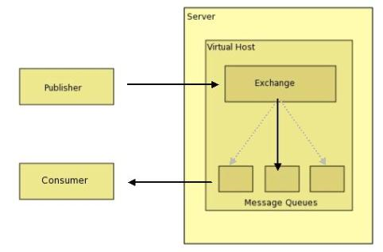
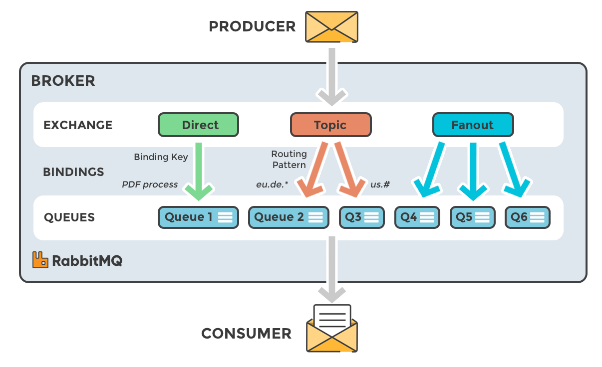
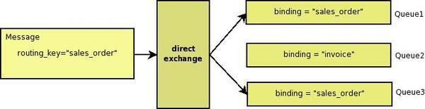
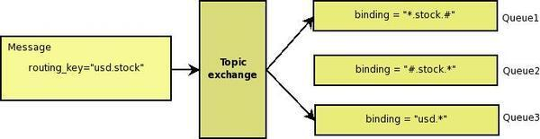
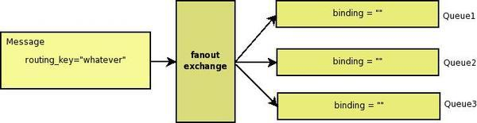
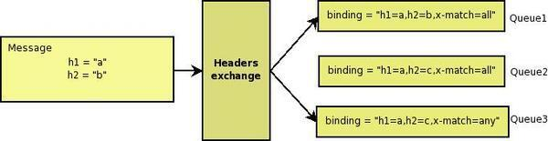

# RabbitMQ

RabbitMQ는 메시지 시스템을 구성할 수 있는 AMQP 기반의 오픈소스 메시지 브로커로 메시지 큐들을 관리하며, 서로 다른 시스템 혹은 컴포넌트 간에 효율적으로 메시지를 교환할 수 있는 다양한 기능을 제공한다.  
 - 공식 사이트: https://www.rabbitmq.com/
 - 무료 및 오픈 소스 라이선스: Apache License 2.0과 Mozilla Public License 2
 - 오픈 소스 메시지 브로커 소프트웨어로 AMQP를 구현
 - 추가적으로 STOMP, MQTT 등 프로토콜 지원을 위해 플러그인 구조와 함께 확장

 

## RabbitMQ 도메인 지식

### AMQP(Advanced Message Queuing Protocol)

과거부터 Message Queue를 위한 제품들이 존재하였지만, 플랫폼에 종속적이였으며 서로 다른 이기종간에 메시지를 교환하기 위해서 메시지 포맷 컨버전을 위한 메시지 브리지를 이용하거나 시스템 자체를 통일시켜야 하는 불편함이 있었다. 이러한 문제를 해결하기 위해 AMQP라는 표준 프로토콜이 등장하게 되었다.  

AMQP(Advanced Message Queuing Protocol)는 메시지 지향 미들웨어를 위한 표준 프로토콜로 다양한 애플리케이션 및 시스템 간에 메시지를 안전하고 효율적으로 교환하기 위해 설계되었다.  
 - AMQP는 메시지 지향 프로토콜이며, 메시지는 데이터 단위로 간주된다. 이는 애플리케이션 간에 데이터를 비동기적으로 전송하는 데 사용된다.
 - AMQP는 큐를 사용하여 메시지를 저장하고 전달하는 메시징 시스템을 구축할 수 있다. 이를 통해 메시지 송수신 간의 시간 차이를 관리하고, 메시지 처리의 격리 및 병목 현상을 방지할 수 있다.
 - AMQP는 Exchange를 통해 메시지를 라우팅하고 전달한다. Exchange는 메시지를 받아들이고 해당 메시지를 큐로 라우팅하는 역할을 한다.
 - AMQP는 메시지 전달의 신뢰성을 보장하기 위해 다양한 기능을 제공한다. 이중화, 트랜잭션, 재전송 등의 메커니즘을 통해 안정적인 메시지 전송을 보장한다.

 

쉽게, AMQP 표준 프로토콜의 등장으로 인해 모든 Broker, Client 들이 같은 방식으로 동작하며, 네트워크상으로 전송되는 명령어들이 표준화가 되고, 특정 밴더사에 종속적인 문제가 해결되었다.  
 - Message Queue 프로토콜 통신 규약 스팩을 구현하여 제공되는 플랫폼으로 Rabbit MQ, Apache QPID, ActiveMQ 등이 있다.

 

### AMQP 구성 요소

AMQP의 구성요소로는 크게 Publisher, Consumer, Exchange, Queue, Binding 등이 있다. 각 구성 요소는 메시지를 생성, 전송, 라우팅 및 처리하는 데 필요한 역할을 수행한다.  

    

 

 - __Producer(생산자) 혹은 Publisher(발행자)__
    - 메시지를 생성하고 AMQP 브로커로 보내는 역할을 한다.
    - 일반적으로 Producer는 메시지를 생성하고 Exchange로 메시지를 전송한다.
 - __Consumer(소비자) 혹은 Subscribe(구독자)__
    - 큐에서 메시지를 소비하고 처리하는 역할을 한다.
    - Consumer는 큐에 연결되어 있는 동안에만 메시지를 수신하고 처리할 수 있다.
 - __Exchange(교환소)__
    - 메시지를 받아들이고 해당 메시지를 하나 이상의 큐로 라우팅하는 역할을 한다.
    - Exchange는 메시지를 큐에 직접 보내지 않고, 라우팅 키(Routing Key) 또는 패턴을 사용하여 메시지를 적절한 큐로 전달한다.
    - 다양한 Exchange 유형이 있으며, 메시지를 라우팅하는 방식에 따라 다르게 동작한다.(직접 교환, 팬아웃 교환, 토픽 교환 등)
    - 쉽게, Producer에서 전송한 메시지는 Exchange로 전달되고, Biding 정보(Exchange Type, Routing Key 등)를 통해 메시지가 Queue로 전송된다. Queue에 전송된 메시지는 Consumer가 수신하여 처리한다.
 - __Queue(큐)__
    - 메시지가 일시적으로 저장되는 공간
    - 하나의 큐에는 하나 이상의 Consumer가 연결될 수 있다. (1:N)
    - Consumer가 메시지를 처리할 준비가 되면, 해당 큐에서 메시지를 가져와 처리한다.
 - __Binding(바인딩)__
    - Exchange(교환소)와 Queue(큐) 간의 연결을 정의한다. (라우팅 테이블 역할)
    - Exchange는 Binding 규칙을 통해 어떤 Queue로 메시지를 보낼지 결정한다.
    - Binding은 Exchange의 라우팅 알고리즘을 결정하는 데 사용된다.
    - 동일한 Queue가 여러 개의 Exchange에 Binding 될 수 있고, 단일 Exchange에 여러 개의 큐가 Binding 될 수도 있다. (1:N, N:1)

 

### 표준 Exchange Type

Exchange Type은 메시지를 어떤 원칙으로 라우팅 할지를 결정하는 일종의 알고리즘이다.  
AMQP에서는 표준 Exchange Type으로 라우팅 키에 기반한 3개의 라우팅 알고리즘과 Key-Value 헤더에 기반한 1개의 Exchange Type들을 반드시 정의하도록 되어있다.  
 - Direct: 라우팅 키가 정확히 일치하는 Queue에 메시지 전송
 - Topic: 라우팅 키 패턴이 일치하는 Queue에 메시지 전송
 - Headers: key:value로 이루어진 header값을 기준으로 일치하는 Queue에 메시지 전송
 - Fanout: 해당 Exchange에 등록된 모든 Queue에 메시지 전송

    

 

 - __Direct Exchange__
    - 라우팅 키가 정확히 일치하는 큐에 매칭시키는 방법
    - 아래 예시는 메시지의 라우팅 키가 "sales_order"로 전송된다. Exchange는 Binding 정보를 확인하여 단일 Exchange에 "sales_order"로 바인딩되어 있는 Queue1과 Queue3인 2개의 큐로 메시지가 전달된다.

    

 

 - __Topic Exchange__
    - 와일드 카드를 이용해서 메시지를 큐에 매칭시키는 방법
    - 라우팅 키는 "."으로 구분된 0개 이상 단어의 집합으로 간주되고, 와일드 카드 문자들을 이용하여 특정 큐에 바인딩한다.
        - "*": 하나의 단어
        - "#": 0개 이상의 단어
    - 아래 예시는 메시지의 라우팅 키가 "usd.stock"으로 전송된다. Exchange는 Binding 정보를 확인하여 단일 Exchange에 바인딩되어 있는 Queue1과 Queue3 큐로 메시지가 전달된다.
        - "*.stock.#": xxx.stock과 xxx.stock.xxx가 포함된다.
        - "#.stock.*": stock.xxx과 xxx.stock.xxx가 포함된다.
        - "usd.*": usd.xxx가 포함된다.

    

 

 - __Fanout Exchange__
    - 모든 메시지를 모든 큐로 라우팅한다.

    

 

 - __Headers Exchange__
    - Key-Value로 정의된 헤더에 의해 라우팅을 결정한다.
    - Topic과 유사한 방법이지만 라우팅을 위해 Header를 사용한다는 점에서 차이가 있다.
    - Producer에서 정의된 Header의 Key-Value 쌍과 Consumer에서 정의된 Argument의 Key-Value 쌍이 일치하면 바인딩된다.
    - Binding Key 만을 사용하는 것보다 더 다양한 속성을 사용할 수 있다.
    - x-match라는 특별한 Argument로 헤더를 어떤 식으로 해석하고 바인딩할지 결정한다.
        - x-match=all: Header의 모든 Key-Value 쌍 값과 Argument의 모든 Key-Value 쌍 값이 일치할 때 바인딩
        - x-match=any: Header의 Key-Value 쌍 값이 Argument의 Key-Value 쌍 값과 하나라도 일치하면 바인딩

    

 

## RabbitMQ 특징

### Dispatching

만약 하나의 큐에 여러 소비자(Consumer)가 바인딩되어 있는 경우 RabbitMQ는 기본적으로 Round-Robing 방식으로 메시지를 균등하게 분배한다. 즉, 중복 처리 방지를 위해 첫 번째 메시지는 소비자 1에게 전달하고, 두 번째 메시지는 소비자 2에게 전달한다.  
소비자 뿐만 아니라 여러 생산자도 하나의 Queue에 메시지를 전달할 수 있다. 이러한 특성으로 메시지를 받아 처리하는 프로그램의 수평 확장이 가능하다.  

 

### Fair Dispatching

만약 하나의 큐에 여러 소비자(Consumer)가 바인딩되어 있다. 이때, 홀수 번째로 들어오는 메시지는 크기가 큰 메시지가 들어오고, 짝수 번째로 들어오는 메시지는 크기가 작은 메시지가 연속적으로 들어온다고 가정한다. 이러한 경우 홀수 번쨰 메시지는 처리 시간이 짧고, 짝수 번째 메시지는 처리 시간이 길게 처리되어 하나의 Consumer에만 과도하게 CPU와 메모리를 사용하게 될 수 있다.  
이를 해결하기 위해 지연이 발생한 소비자에게 메시지를 전달하지 않도록 Prefetch count라는 개념이 사용된다. Prefetch count가 1로 설정되어 있는 경우 소비자로부터 Act를 받지 못한 메시지가 1개라도 있으면 해당 소비자에 메시지를 전달하지 않는다.  
 - Prefetch count는 소비자에게 동시에 전달되는 메시지의 양이 될 수 있다.
 - 메시지가 처리되기 전에는 새로운 메시지를 받지 않게 된다. (작업 분산)

 

### 소비자 서버가 죽은 경우

Queue는 소비자에게 메시지를 전달한 후 ACK을 받았을 때, 해당 메시지를 dequeue한다.  
소비자가 ACK을 Queue에 전달하지 못하는 경우는 받은 메시지가 너무 커 아직 처리 중이거나 소비자 서버가 죽었을 경우로 RabbitMQ에서는 ACK을 받지 못한 메시지의 경우, 대기를 하고 있다가 전달한 소비자 서버의 상태를 확인한 후, Disconnected와 같은 신호를 받았을 경우 해당 소비자를 제외하고 다른 소비자에게 동일한 메시지를 전달한다.  

 

### Message Durability
만약 메시지를 Queue에 넣은 다음 소비자에게 전달하기 전에 RabbitMQ 서버가 죽는다면 Queue는 메모리에 데이터를 쓰는 형식이므로 모든 데이터가 소멸하게 된다.  
이러한 문제를 해결하기 위해 영속성이란 개념을 가지고 있는데, message durability는 메시지가 Queue에 저장될 때, disk의 파일에도 동시에 저장하는 방법이다. 해당 방법을 사용하면 서버가 죽었을 때, Queue의 데이터가 어느 정도 복구가 되지만 메시지가 disk의 파일에 쓰는 도중에 서버가 죽는 경우도 있어 일부 데이터의 소실이 발생할 수 있다.  

 

## Message Queue 사용 이유

프로세스나 프로그램 간의 데이터 교환을 위해 HTTP를 이용할 수 있다. HTTP는 기본적으로 동기적인 통신 방식으로 사용된다. 즉, 클라이언트는 요청을 보내고 서버의 응답을 기다려야 한다. 이는 일부 작업이 오랜 시간이 걸릴 경우 클라이언트응 오랫동안 응답을 기다려야 한다.  

Message Broker라는 미들웨어를 활용하여 비동기식으로 메시지를 전달하여 처리하면 아래와 같은 이점을 얻을 수 있다.  
 - 비동기 통신: Message Queue는 비동기 통신을 지원한다. Producer는 메시지를 생성하여 Queue에 전송하고, Consumer는 메시지를 받아 처리한다. 이러한 비동기 통신 방식은 시스템 간의 느슨한 결합을 가능하게 하고, 서로 독립적으로 작동할 수 있다.
 - 확장성: Message Queue는 Producer와 Consumer 간에 Queue를 통해 통신하기 때문에 확장성이 용이하다. 메시지 큐 시스템은 여러 대의 서버로 확장할 수 있고, 각 서버는 독립적으로 메시지를 처리할 수 있다.

 

### Message Queue 사용 예시

간단한 서버 구조에서는 굳이 Message Queue를 사용할 필요는 없다. 또한, 사용자들이 즉시 응답을 확인해야 하는 경우에는 사용할 수 없다. 대신에 느슨한 결합, 확장성, 신뢰성 등의 요구 사항이 있는 경우에는 Message Queue가 적합할 수 있다.  

예를 들어, 회원 가입 후에 이메일로 회원 가입 완료 메일이 전송된다고 가정한다.  
이러한 경우 회원 가입 완료는 즉각적으로 사용자가 알아야 하지만, 이메일이 정상적으로 완료되었는지는 확인할 필요가 없다.  
즉, 회원 요청시 회원 정보 저장은 동기적으로 처리되어야 하지만, 이메일 전송 처리까지 기다릴 필요는 없다. 따라서, 이메일 전송은 메시지 큐에 저장하여 다른 프로세스나 쓰레드에서 처리될 수 있도록 한다.  
 - 서버 부하가 많은 작업: 이미지 처리, 비디오 인코딩, 대용량 데이터 처리와 같은 작업은 메모리와 CPU를 많이 사용한다.
 - 부하 분산: 여러 대의 서버가 하나의 큐를 바라보도록 구성하면 처리할 데이터가 많아져도 각 서버는 자신의 처리량에 맞게 태스크를 가져와 처리할 수 있다.

